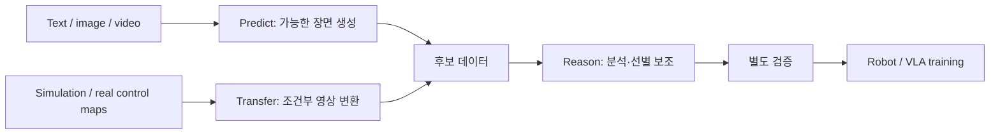

> **한 줄 요약:** NVIDIA Cosmos는 하나의 모델이 아니라, 로봇·자율주행처럼 현실 세계에서 움직이는 **Physical AI를 위한 World Foundation Model(WFM) 패밀리**다. 2.x까지는 **Predict / Transfer / Reason** 계열이 각기 역할을 맡았고, Cosmos 3에서는 추론·생성·행동을 공통 omnimodal 아키텍처로 연결한다.

<div class="notion-gap" style="--gap: 1"></div>


<div class="notion-gap" style="--gap: 1"></div>

NVIDIA의 Cosmos라는 이름은 자주 들었지만, 막상 살펴보면 단일 모델보다 범위가 넓다. 이번 글에서는 개별 아키텍처에 들어가기 전에 Cosmos가 왜 등장했고, 어떤 모델들로 구성되며, Physical AI에서 어떻게 활용되는지 전체 지도를 그려보자.

## Contents

- 1\. Why do we need Cosmos?
- 2\. Cosmos는 하나의 모델이 아니다
- 3\. 세 모델은 따로 노는 것이 아니라 연결된다
- 4\. Cosmos 1 → 2.x → 3
- 5\. Cosmos vs Omniverse
- 6\. 결국 Cosmos가 하려는 것은 무엇인가?
- 다음 글

---

<div class="notion-gap" style="--gap: 3"></div>

## 1. Why do we need Cosmos?

---

LLM은 인터넷에 존재하는 방대한 text를 학습하면서 빠르게 발전했다. 하지만 로봇은 text만 잘 이해한다고 움직일 수 없다.

로봇이 실제 세계에서 행동하려면,

- 지금 눈앞에서 **무슨 일이 일어나고 있는지 이해**해야 하고,
- 내가 어떤 행동을 하면 **다음 순간 세상이 어떻게 변할지 예측**해야 하며,
- 실제로 수집하기 힘든 상황까지 포함해 **충분한 학습 데이터를 확보**해야 한다.

문제는 현실의 robot data가 매우 비싸다는 것이다. 사람이 직접 teleoperation을 하거나 실제 환경에서 로봇을 반복 동작시키며 데이터를 모아야 하고, 사고·실패·희귀 상황 같은 long-tail scenario는 원하는 만큼 수집하기도 어렵다.

<div class="notion-gap" style="--gap: 1"></div>

### 핵심 동기: 부족한 데이터를 보완하고 다양한 상황을 학습하기

> **Physical world를 이해하고, 생성하고, 예측할 수 있는 foundation model을 먼저 학습해 두고 이를 다양한 Physical AI에 재사용하자.**

NVIDIA는 Cosmos를 Physical AI 개발을 위한 **World Foundation Models + data processing / training / evaluation framework**로 정의한다.[\[1\]](https://www.nvidia.com/en-us/ai/cosmos/)

---

<div class="notion-gap" style="--gap: 2"></div>

## 2. Cosmos는 하나의 모델이 아니다

---

**사실 Cosmos = 하나의 거대한 모델 이름**이 아니라, 여러 World Foundation Model을 포함하는 **model family / platform**에 가깝다.


<div class="notion-gap" style="--gap: 1"></div>

2.x까지의 주요 모델 계열은 Predict, Transfer, Reason이다. 각 계열의 주된 역할은 다음과 같다.

| Model Line | 역할 | 쉽게 말하면 | 대표 출력 |
|---|---|---|---|
| **Cosmos Predict** | World generation / future prediction | **미래를 상상한다** | 생성 영상 |
| **Cosmos Transfer** | Controllable synthetic data generation | **시뮬레이션을 현실적으로 바꾼다** | 제어 입력을 반영한 영상 |
| **Cosmos Reason** | Physical-world understanding / reasoning | **장면을 보고 이해하고 추론한다** | 텍스트 기반 분석·답변 |

<div class="notion-gap" style="--gap: 1"></div>

### A. Cosmos Predict — 미래를 상상한다

---

예를 들어 로봇이 테이블 위의 컵을 잡으려는 장면이 있다고 하자.

Predict는 현재 image/video 또는 text condition을 기반으로,

> “이 상태에서 앞으로 어떤 장면이 이어질까?”

를 video 형태로 생성한다.

<div class="notion-gap" style="--gap: 2"></div>


Cosmos Predict 2.5에서는 **Text2World, Image2World, Video2World**가 하나의 모델 안에 통합됐다. [NVIDIA 연구 소개](https://research.nvidia.com/labs/dir/cosmos-predict2.5/)

참고로 **Cosmos Policy**는 Predict 2.5가 아니라 **Predict2-2B-Video2World**를 로봇 시연 데이터로 파인튜닝해 행동·미래 관측·값을 예측한 별도 연구 사례다. [논문](https://arxiv.org/html/2601.16163v1)

즉 단순한 영상 생성기를 넘어, 주어진 조건에서 **가능한 미래 장면을 영상으로 생성하는 world model**로 볼 수 있다. 생성 결과가 실제 미래나 물리 법칙을 항상 정확히 재현한다는 뜻은 아니다.

<div class="notion-gap" style="--gap: 1"></div>

### B. Cosmos Transfer — 시뮬레이션을 현실적으로 바꾼다

---

Isaac Sim이나 Omniverse에서 robot simulation을 돌리면 정확한 depth, segmentation, pose 등의 정보를 얻을 수 있다.

하지만 simulation image는 실제 camera image와 appearance가 다르다.

<div class="notion-gap" style="--gap: 1"></div>

Transfer는 이런 structured input을 조건으로 받아,

**Simulation / Depth / Segmentation / Edge → Photorealistic Video**

처럼 변환한다.


<div class="notion-gap" style="--gap: 1"></div>

즉 시뮬레이션에서 얻은 구조적 신호를 조건으로 사용하면서 외형과 환경을 다양화할 수 있다. 다만 출력이 입력 구조를 정확히 보존하는지는 별도로 확인해야 한다.

Cosmos Transfer 2.5는 blurred RGB, depth, segmentation, edge 등 여러 spatial control을 이용해 controllable video generation을 수행한다.

→ 실제 다양한 Physical AI 데이터들을 제작하는 곳에 사용되는 것이다.

<div class="notion-gap" style="--gap: 1"></div>

### C. Cosmos Reason — 물리 세계를 이해한다

---

Reason은 앞의 두 모델과 성격이 다르다.

Image나 video를 보고,

> “로봇이 왜 실패했는가?”

> “이 물체는 어디에 있는가?”

> “다음에 어떤 행동을 하는 것이 자연스러운가?”

같은 질문에 답하는 **Physical AI용 VLM(Vision-Language Model)**이다.


Reason은 영상을 생성하는 Predict·Transfer와 달리, 장면에 대한 질문에 언어로 답하고 근거를 설명하는 계열이다.

<div class="notion-gap" style="--gap: 1"></div>

---

## 3. 세 모델은 따로 노는 것이 아니라 연결된다

Predict / Transfer / Reason을 따로 보면 왜 굳이 세 모델을 만들었는지 애매할 수 있다.

아래는 세 계열을 조합하는 **가능한 synthetic data workflow의 예시**다. 실제 프로젝트에서 세 모델을 모두 쓰거나 이 순서를 따를 필요는 없다.

<div class="notion-gap" style="--gap: 1"></div>



<div class="notion-gap" style="--gap: 2"></div>

예를 들어 실제 포도 수확 로봇 데이터가 부족하다면, 다음과 같이 활용을 구상할 수 있다.

> 1. **Predict**로 다양한 포도 위치, robot motion, failure scenario를 생성한다.
> 2. **Transfer**로 조명, 날씨, 배경, appearance를 실제 농장처럼 다양화한다.
> 3. **Reason**으로 생성된 video를 분석해 검토 대상을 선별한다. 성공·실패 판정에는 작업별 기준과 추가 검증이 필요하다.
> 4. 최종 데이터를 VLA나 robot policy training에 사용한다.
{: .prompt-info }

<div class="notion-gap" style="--gap: 1"></div>

---

## 4. Cosmos 1 → 2.x → 3

<div class="notion-gap" style="--gap: 1"></div>

초기에는 각 기능이 독립적인 model line으로 발전했다.

```text
NVIDIA Cosmos
│
├── Predict
│   ├── Predict 1
│   ├── Predict 2
│   └── Predict 2.5
│
├── Transfer
│   ├── Transfer 1
│   └── Transfer 2.5
│
└── Reason
    ├── Reason 1
    └── Reason 2
```

> **Reasoning / Generation / Transfer가 각각 specialized model로 존재했다**

는 점이다.

<div class="notion-gap" style="--gap: 1"></div>

### Cosmos 3 — 기능 통합을 향해

---

2026년 공개된 **Cosmos 3**에서 방향이 크게 바뀐다.

<div class="notion-gap" style="--gap: 1"></div>

> Cosmos 3는 text, image, video, ambient sound, action을 함께 처리하고 생성할 수 있는 **omnimodal World Foundation Model**이며, NVIDIA는 이를 Mixture-of-Transformers(MoT) architecture로 구현

<div class="notion-gap" style="--gap: 1"></div>

핵심은 추론·생성·행동을 공통 아키텍처 안에서 연결한다는 점이다. 다만 실제 배포 모델과 체크포인트는 작업에 따라 구분된다. [Cosmos 3 공식 소개](https://research.nvidia.com/labs/cosmos-lab/cosmos3/)

**Physical Reasoning + World Generation + Action Generation**

<div class="notion-gap" style="--gap: 1"></div>

흥미로운 점은 하나의 모델 계열이 입력·출력 설정과 후속 학습에 따라 여러 작업에 적용된다는 것이다.

<div class="notion-gap" style="--gap: 1"></div>

아래는 시각·언어 추론에 활용한 예시다.


<div class="notion-gap" style="--gap: 2"></div>

아래는 행동 조건을 바탕으로 미래 영상을 생성하는 forward dynamics 예시다.


<div class="notion-gap" style="--gap: 2"></div>

Inverse Dynamics에서는 관측 영상과 선택적 작업 설명을 조건으로, 그 장면 변화를 설명할 수 있는 행동 궤적을 추정한다. 출력은 해당 도메인의 action 표현이며, 실제 수행된 행동의 정답이라고 보장되지는 않는다.


> 관측된 장면의 변화(비디오)를 보고,
>
> **"어떤 행동 궤적이 이 변화를 설명할 수 있는가?"를 추정하는 것.**
{: .prompt-info }


<div class="notion-gap" style="--gap: 1"></div>

> 인간의 1인칭 영상이나 손 동작 데이터가 로봇 행동 학습에 유용한 사전학습 신호가 될 수 있다. 하지만 인간 영상만으로 로봇 행동의 ground truth를 자동 생성했다고 해석하면 안 된다. [Cosmos 3 기술 보고서](https://research.nvidia.com/labs/cosmos-lab/cosmos3/technical-report.pdf)
{: .prompt-info }

<div class="notion-gap" style="--gap: 2"></div>

다시 Cosmos를 흐름대로 정리해보면,

| Cosmos 1 ~ 2.x | Cosmos 3 |
|---|---|
| Predict / Transfer / Reason 분리 | 공통 아키텍처에서 추론·생성·행동 연결 |
| Text / Image / Video 중심 | Text / Image / Video / Sound / Action |
| 여러 specialized models | Omnimodal 모델 계열과 작업별 체크포인트 |
| World 이해·생성 중심 | World 이해 → Simulation → Action까지 확장 |

<div class="notion-gap" style="--gap: 1"></div>

이 변화가 흥미로운 이유는 결국 **World Model과 Robot Policy의 경계가 점점 흐려지고 있기 때문**이다.

Cosmos 3 계열은 시각·언어 추론, 세계 생성, 행동 관련 작업을 지원한다. 특정 로봇 정책으로 사용하려면 해당 행동 공간과 데이터에 맞춘 모델·학습 설정을 확인해야 한다.

<div class="notion-gap" style="--gap: 2"></div>

---

## 5. Cosmos vs Omniverse

처음 보면 둘 다 NVIDIA의 simulation/robotics 제품이라 헷갈린다.

둘의 역할은 다르다.

> **Omniverse / Isaac Sim = World를 물리적으로 simulation하는 환경**

> **Cosmos = World를 학습하고 이해·생성하는 AI model**

예를 들어 Isaac Sim에서 로봇 동작을 시뮬레이션하고,

그 결과를 Cosmos Transfer에 넣어 다양한 photorealistic video로 만들 수 있다.

즉 둘은 경쟁 관계가 아니라 **서로 연결되는 stack**이다. NVIDIA도 Omniverse를 realistic 3D simulation environment, Cosmos를 Physical AI용 foundation model로 구분하고 있다.[\[1\]](https://www.nvidia.com/en-us/ai/cosmos/)

---

<div class="notion-gap" style="--gap: 1"></div>

## 6. 결국 Cosmos가 하려는 것은 무엇인가?

내가 이해한 Cosmos의 핵심은 단순히 **"AI로 robot training video를 만든다"**가 아니다.

Physical AI가 현실에서 잘 동작하려면 결국 다음 loop 전체가 필요하다.

```text
Observe the World
        ↓
Understand / Reason
        ↓
Imagine Future Worlds
        ↓
Choose / Generate Action
        ↓
Act
        ↓
Observe Again
```

<div class="notion-gap" style="--gap: 1"></div>

즉 Cosmos의 진화를 한 문장으로 정리하면,

> **World를 생성하는 모델에서, World를 이해하고 미래를 상상하며 Action까지 연결하는 Physical AI foundation model로 발전하고 있다.**

<div class="notion-gap" style="--gap: 1"></div>

또한 데이터 부족을 보완하는 생성·증강 용도도 중요하다. 

개인적으로는 이 활용이 특히 흥미롭다.

<div class="notion-gap" style="--gap: 1"></div>

> Data Generation, Augmentation, and Modification

<div class="notion-gap" style="--gap: 2"></div>

---

## 다음 글

이번 글에서는 Cosmos의 전체 지도만 정리했다.

각 모델의 architecture와 training을 보기 시작하면 내용이 훨씬 많아지기 때문에 다음 글부터 따로 뜯어볼 예정이다.

### References

- [NVIDIA Cosmos — Official Page](https://www.nvidia.com/en-us/ai/cosmos/)
- [NVIDIA Cosmos LLM Info](https://www.nvidia.com/en-us/ai/cosmos/llm-info/)
- [Cosmos 3 Technical Report](https://research.nvidia.com/labs/cosmos-lab/cosmos3/technical-report.pdf)
- [NVIDIA Cosmos 3 Announcement](https://nvidianews.nvidia.com/news/nvidia-launches-cosmos-3-the-open-frontier-foundation-model-for-physical-ai)
- [NVIDIA Technical Blog — Cosmos World Foundation Models](https://developer.nvidia.com/blog/scale-synthetic-data-and-physical-ai-reasoning-with-nvidia-cosmos-world-foundation-models/)
- [Cosmos-Transfer2.5 — Cosmos Lab](https://research.nvidia.com/labs/cosmos-lab/cosmos-transfer2.5/)
- [Cosmos-Predict2.5 — Cosmos Lab](https://research.nvidia.com/labs/dir/cosmos-predict2.5/)
- [Cosmos Policy 논문](https://arxiv.org/html/2601.16163v1)
