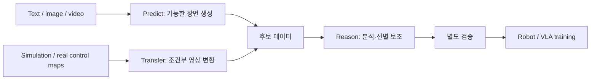

> **한 줄 요약:** NVIDIA Cosmos는 모델 하나의 이름이 아니다. 로봇·자율주행처럼 현실 세계에서 움직이는 **Physical AI를 위한 World Foundation Model(WFM) 패밀리**다. 2.x까지는 **Predict / Transfer / Reason**이 각자 역할을 나눠 맡았고, Cosmos 3에서는 이걸 추론·생성·행동까지 하나의 omnimodal 아키텍처로 묶었다.

<div class="notion-gap" style="--gap: 1"></div>


<div class="notion-gap" style="--gap: 1"></div>

NVIDIA Cosmos.. 이름은 정말 많이 들었는데, 막상 찾아보면 모델 하나가 아니라 생각보다 범위가 훨씬 넓다. 그래서 이번 글에서는 개별 아키텍처로 들어가기 전에, **Cosmos가 왜 나왔고, 어떤 모델들로 구성되어 있고, Physical AI에서 어떻게 쓰이는지** 전체 지도부터 한번 그려보자.

## Contents

- 1\. Why do we need Cosmos?
- 2\. Cosmos는 하나의 모델이 아니다
- 3\. 세 모델은 따로 노는 것이 아니라 연결된다
- 4\. Cosmos 1 → 2.x → 3
- 5\. Cosmos vs Omniverse
- 6\. 결국 Cosmos가 하려는 것은 무엇인가?
- 다음 글

---

<div class="notion-gap" style="--gap: 3"></div>

## 1. Why do we need Cosmos?

---

LLM은 인터넷에 있는 엄청난 양의 text를 학습하면서 빠르게 발전했다. 근데 로봇은 text만 잘 이해한다고 움직일 수 있는 게 아니다.

로봇이 실제 세계에서 행동하려면,

- 지금 눈앞에서 **무슨 일이 일어나고 있는지 이해**해야 하고,
- 내가 이렇게 움직이면 **다음 순간 세상이 어떻게 변할지 예측**할 수 있어야 하고,
- 실제로는 모으기 힘든 상황까지 포함해서 **충분한 학습 데이터를 확보**해야 한다.

문제는 현실의 robot data가 너무 비싸다는 것이다. 사람이 직접 teleoperation을 하거나, 실제 환경에서 로봇을 계속 반복해서 움직이면서 데이터를 모아야 한다. 게다가 사고·실패·희귀 상황 같은 long-tail scenario는 모으고 싶어도 원하는 만큼 모을 수가 없다.

<div class="notion-gap" style="--gap: 1"></div>

### 핵심 동기: 부족한 데이터를 보완하고 다양한 상황을 학습하기

> **Physical world를 이해하고, 생성하고, 예측할 수 있는 foundation model을 먼저 크게 학습해두고, 이걸 여러 Physical AI에 재사용하자.**

그래서 NVIDIA는 Cosmos를 Physical AI 개발을 위한 **World Foundation Models + data processing / training / evaluation framework**라고 정의한다.

---

<div class="notion-gap" style="--gap: 2"></div>

## 2. Cosmos는 하나의 모델이 아니다

---

**사실 Cosmos = 하나의 거대한 모델 이름**이 아니다. 여러 World Foundation Model을 묶어놓은 **model family / platform**이라고 보는 게 맞다.


<div class="notion-gap" style="--gap: 1"></div>

2.x까지의 주요 모델 계열은 Predict, Transfer, Reason 이렇게 세 가지다. 각각 하는 일은 아래와 같다.

| Model Line | 역할 | 쉽게 말하면 | 대표 출력 |
|---|---|---|---|
| **Cosmos Predict** | World generation / future prediction | **미래를 상상한다** | 생성 영상 |
| **Cosmos Transfer** | Controllable synthetic data generation | **시뮬레이션을 현실처럼 바꾼다** | 제어 입력을 반영한 영상 |
| **Cosmos Reason** | Physical-world understanding / reasoning | **장면을 보고 이해하고 추론한다** | 텍스트 기반 분석·답변 |

<div class="notion-gap" style="--gap: 1"></div>

### A. Cosmos Predict — 미래를 상상한다

---

예를 들어 로봇이 테이블 위의 컵을 잡으려는 장면이 있다고 해보자.

Predict는 지금의 image/video나 text condition을 보고,

> “이 상태에서 앞으로 어떤 장면이 이어질까?”

를 video로 만들어낸다.

<div class="notion-gap" style="--gap: 2"></div>


Cosmos Predict 2.5에서는 **Text2World, Image2World, Video2World**가 하나의 모델 안으로 합쳐졌다.

(참고로 **Cosmos Policy**는 Predict 2.5가 아니다. **Predict2-2B-Video2World**를 로봇 시연 데이터로 fine-tuning해서 행동·미래 관측·값을 같이 예측하게 만든 별도 연구다. 헷갈리지 말자.)

즉, 단순한 영상 생성기라기보다는 주어진 조건에서 **일어날 수 있는 미래 장면을 영상으로 그려주는 world model**이라고 보면 된다. 물론 생성된 영상이 실제 미래나 물리 법칙을 항상 정확하게 재현한다는 뜻은 아니다.

<div class="notion-gap" style="--gap: 1"></div>

### B. Cosmos Transfer — 시뮬레이션을 현실처럼 바꾼다

---

Isaac Sim이나 Omniverse에서 robot simulation을 돌리면 depth, segmentation, pose 같은 정보는 정확하게 얻을 수 있다.

근데 문제는, simulation image는 실제 camera로 찍은 image랑 생김새(appearance)가 다르다는 것이다.

<div class="notion-gap" style="--gap: 1"></div>

Transfer는 이런 structured input을 조건으로 받아서,

**Simulation / Depth / Segmentation / Edge → Photorealistic Video**

로 바꿔준다.


<div class="notion-gap" style="--gap: 1"></div>

즉, 시뮬레이션에서 얻은 구조 정보는 그대로 조건으로 쓰면서, 외형과 환경만 다양하게 바꿀 수 있는 것이다. (다만 출력 영상이 입력 구조를 정확하게 지키는지는 따로 확인해야 한다.)

Cosmos Transfer 2.5는 blurred RGB, depth, segmentation, edge 같은 여러 spatial control을 써서 controllable video generation을 한다.

→ 결국 실제로 쓸 수 있는 다양한 Physical AI 데이터를 만들어내는 데 쓰이는 것이다.

<div class="notion-gap" style="--gap: 1"></div>

### C. Cosmos Reason — 물리 세계를 이해한다

---

Reason은 앞의 두 모델이랑 성격이 완전히 다르다.

Image나 video를 보고,

> “로봇이 왜 실패했지?”

> “이 물체는 어디에 있지?”

> “다음에 어떤 행동을 하는 게 자연스럽지?”

같은 질문에 답하는 **Physical AI용 VLM(Vision-Language Model)**이다.


그러니까 Predict·Transfer는 영상을 **만드는** 쪽이고, Reason은 장면을 보고 **말로 답하고 근거를 설명하는** 쪽이다.

<div class="notion-gap" style="--gap: 1"></div>

---

## 3. 세 모델은 따로 노는 것이 아니라 연결된다

Predict / Transfer / Reason을 하나씩 따로 보면, 왜 굳이 모델을 세 개나 만들었는지 좀 애매하게 느껴진다.

그래서 세 개를 엮어서 쓰는 **synthetic data workflow 예시**를 하나 그려봤다. (실제 프로젝트에서 세 개를 다 써야 하거나 꼭 이 순서를 따라야 하는 건 아니다.)

<div class="notion-gap" style="--gap: 1"></div>



<div class="notion-gap" style="--gap: 2"></div>

예를 들어 포도 수확 로봇 데이터가 부족하다고 해보자. 그럼 이런 식으로 써볼 수 있다.

> 1. **Predict**로 다양한 포도 위치, robot motion, failure scenario를 만든다.
> 2. **Transfer**로 조명, 날씨, 배경, appearance를 실제 농장처럼 다양하게 바꾼다.
> 3. **Reason**으로 만들어진 video를 분석해서 검토할 것들을 골라낸다. (성공·실패 판정은 작업별 기준이랑 추가 검증이 따로 필요하다.)
> 4. 최종 데이터를 VLA나 robot policy training에 쓴다.
{: .prompt-info }

<div class="notion-gap" style="--gap: 1"></div>

---

## 4. Cosmos 1 → 2.x → 3

<div class="notion-gap" style="--gap: 1"></div>

처음에는 각 기능이 독립적인 model line으로 따로따로 발전했다.

```text
NVIDIA Cosmos
│
├── Predict
│   ├── Predict 1
│   ├── Predict 2
│   └── Predict 2.5
│
├── Transfer
│   ├── Transfer 1
│   └── Transfer 2.5
│
└── Reason
    ├── Reason 1
    └── Reason 2
```

여기서 기억할 것은,

> **Reasoning / Generation / Transfer가 각각 따로 specialized model로 존재했다**

는 점이다.

<div class="notion-gap" style="--gap: 1"></div>

### Cosmos 3 — 기능 통합을 향해

---

근데 2026년에 나온 **Cosmos 3**에서 방향이 크게 바뀐다.

<div class="notion-gap" style="--gap: 1"></div>

> Cosmos 3는 text, image, video, ambient sound, action을 한꺼번에 처리하고 생성할 수 있는 **omnimodal World Foundation Model**이고, NVIDIA는 이걸 Mixture-of-Transformers(MoT) architecture로 구현했다.

<div class="notion-gap" style="--gap: 1"></div>

핵심은 추론·생성·행동을 하나의 공통 아키텍처 안에서 연결했다는 점이다. (다만 실제로 배포되는 모델과 체크포인트는 작업별로 나뉘어 있다.)

**Physical Reasoning + World Generation + Action Generation**

<div class="notion-gap" style="--gap: 1"></div>

재미있는 건, 같은 모델 계열이 입력·출력을 어떻게 잡고 어떻게 후속 학습을 하느냐에 따라 여러 작업에 쓰인다는 것이다. 하나씩 보자.

<div class="notion-gap" style="--gap: 1"></div>

먼저 시각·언어 추론에 쓴 예시다.


<div class="notion-gap" style="--gap: 2"></div>

다음은 행동(action)을 조건으로 미래 영상을 만드는 forward dynamics 예시다.


<div class="notion-gap" style="--gap: 2"></div>

반대로 Inverse Dynamics는 관측 영상(+ 원하면 작업 설명)을 조건으로 줬을 때, 그 장면 변화를 만들어낼 수 있는 행동 궤적을 추정하는 것이다. 출력은 그 도메인의 action 표현인데, 이게 실제로 수행된 행동의 정답이라는 보장은 없다.


> 관측된 장면의 변화(비디오)를 보고,
>
> **"어떤 행동 궤적이 이 변화를 설명할 수 있을까?"를 거꾸로 추정하는 것.**
{: .prompt-info }


<div class="notion-gap" style="--gap: 1"></div>

> 사람의 1인칭 영상이나 손 동작 데이터는 로봇 행동 학습에 좋은 사전학습 신호가 될 수 있다. 근데 그렇다고 사람 영상만으로 로봇 행동의 ground truth를 자동으로 만들어냈다고 받아들이면 안 된다!!
{: .prompt-info }

<div class="notion-gap" style="--gap: 2"></div>

자 다시 Cosmos 흐름대로 정리해보면,

| Cosmos 1 ~ 2.x | Cosmos 3 |
|---|---|
| Predict / Transfer / Reason 분리 | 공통 아키텍처에서 추론·생성·행동 연결 |
| Text / Image / Video 중심 | Text / Image / Video / Sound / Action |
| 여러 specialized models | Omnimodal 모델 계열과 작업별 체크포인트 |
| World 이해·생성 중심 | World 이해 → Simulation → Action까지 확장 |

<div class="notion-gap" style="--gap: 1"></div>

이 변화가 재미있는 이유는, 결국 **World Model과 Robot Policy의 경계가 점점 흐려지고 있다**는 것이다.

물론 Cosmos 3가 시각·언어 추론, 세계 생성, 행동 관련 작업을 다 지원한다고 해서 바로 로봇 정책으로 쓸 수 있는 건 아니다. 특정 로봇에 쓰려면 그 로봇의 행동 공간과 데이터에 맞는 모델·학습 설정을 따로 확인해야 한다.

<div class="notion-gap" style="--gap: 2"></div>

---

## 5. Cosmos vs Omniverse

처음 보면 둘 다 NVIDIA의 simulation/robotics 제품이라 엄청 헷갈린다. (나도 그랬다..)

근데 둘이 하는 일은 다르다.

> **Omniverse / Isaac Sim = World를 물리적으로 simulation하는 환경**

> **Cosmos = World를 학습해서 이해·생성하는 AI model**

예를 들어 Isaac Sim에서 로봇 동작을 시뮬레이션하고,

그 결과를 Cosmos Transfer에 넣어서 다양한 photorealistic video로 바꿀 수 있다.

즉, 둘은 경쟁 관계가 아니라 **서로 이어지는 stack**이다. NVIDIA도 Omniverse는 realistic 3D simulation environment, Cosmos는 Physical AI용 foundation model로 나눠서 설명한다.

---

<div class="notion-gap" style="--gap: 1"></div>

## 6. 결국 Cosmos가 하려는 것은 무엇인가?

내가 이해한 Cosmos의 핵심은 단순히 **"AI로 robot training video를 만든다"**가 아니다.

Physical AI가 현실에서 제대로 동작하려면 결국 아래 loop 전체가 필요하다.

```text
Observe the World
        ↓
Understand / Reason
        ↓
Imagine Future Worlds
        ↓
Choose / Generate Action
        ↓
Act
        ↓
Observe Again
```

<div class="notion-gap" style="--gap: 1"></div>

그러니까 Cosmos가 발전해온 방향을 한 문장으로 정리하면,

> **World를 생성하는 모델에서 → World를 이해하고, 미래를 상상하고, Action까지 연결하는 Physical AI foundation model로 가고 있다.**

<div class="notion-gap" style="--gap: 1"></div>

그리고 데이터 부족을 메워주는 생성·증강 용도도 정말 중요하다.

개인적으로는 이 활용이 제일 흥미롭다.

<div class="notion-gap" style="--gap: 1"></div>

> Data Generation, Augmentation, and Modification

<div class="notion-gap" style="--gap: 2"></div>

---

## 다음 글

이번 글에서는 Cosmos의 전체 지도만 그려봤다.

각 모델의 architecture랑 training까지 들어가면 내용이 훨씬 많아지기 때문에, 다음 글부터 하나씩 따로 뜯어볼 예정이다.

### References

- [NVIDIA Cosmos — Official Page](https://www.nvidia.com/en-us/ai/cosmos/)
- [NVIDIA Cosmos LLM Info](https://www.nvidia.com/en-us/ai/cosmos/llm-info/)
- [Cosmos 3 Technical Report](https://research.nvidia.com/labs/cosmos-lab/cosmos3/technical-report.pdf)
- [NVIDIA Cosmos 3 Announcement](https://nvidianews.nvidia.com/news/nvidia-launches-cosmos-3-the-open-frontier-foundation-model-for-physical-ai)
- [NVIDIA Technical Blog — Cosmos World Foundation Models](https://developer.nvidia.com/blog/scale-synthetic-data-and-physical-ai-reasoning-with-nvidia-cosmos-world-foundation-models/)
- [Cosmos-Transfer2.5 — Cosmos Lab](https://research.nvidia.com/labs/cosmos-lab/cosmos-transfer2.5/)
- [Cosmos-Predict2.5 — Cosmos Lab](https://research.nvidia.com/labs/dir/cosmos-predict2.5/)
- [Cosmos Policy 논문](https://arxiv.org/html/2601.16163v1)
