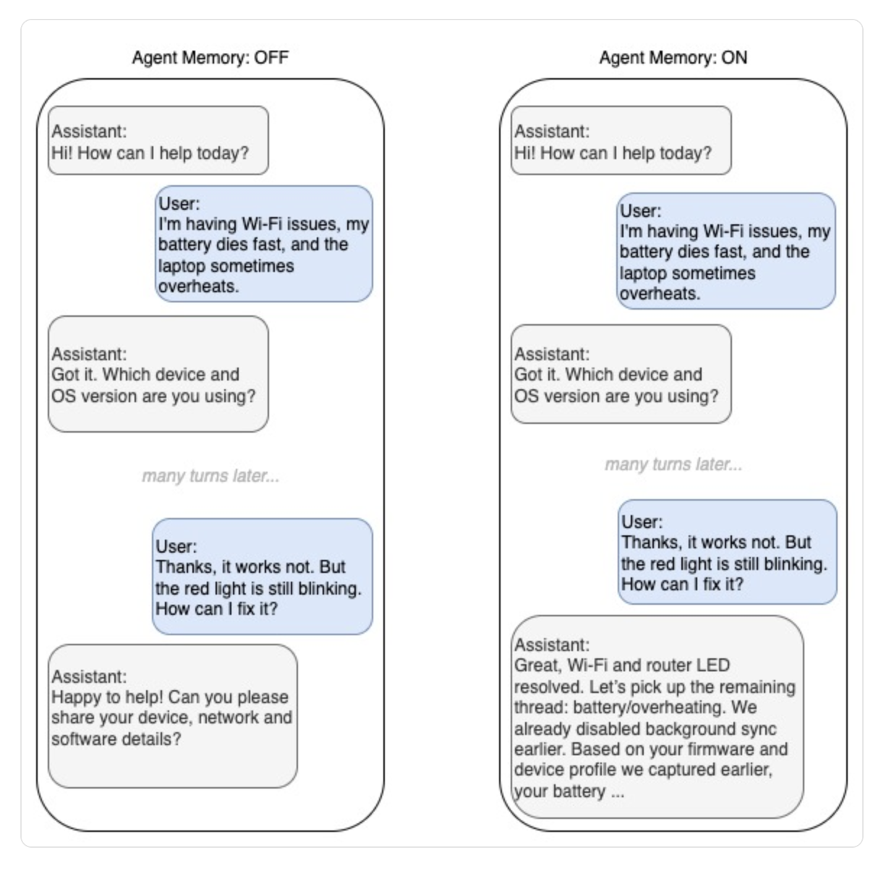
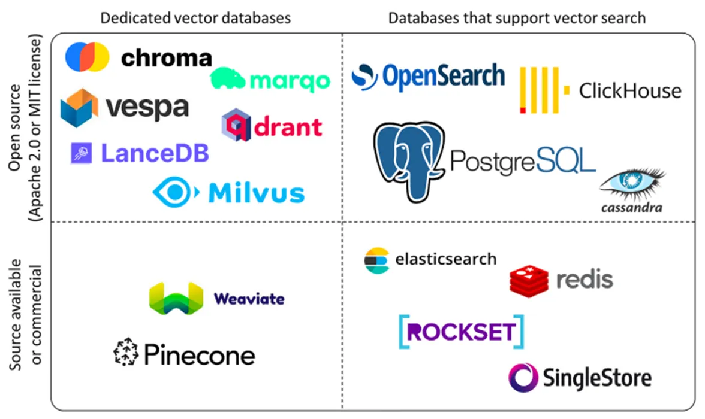
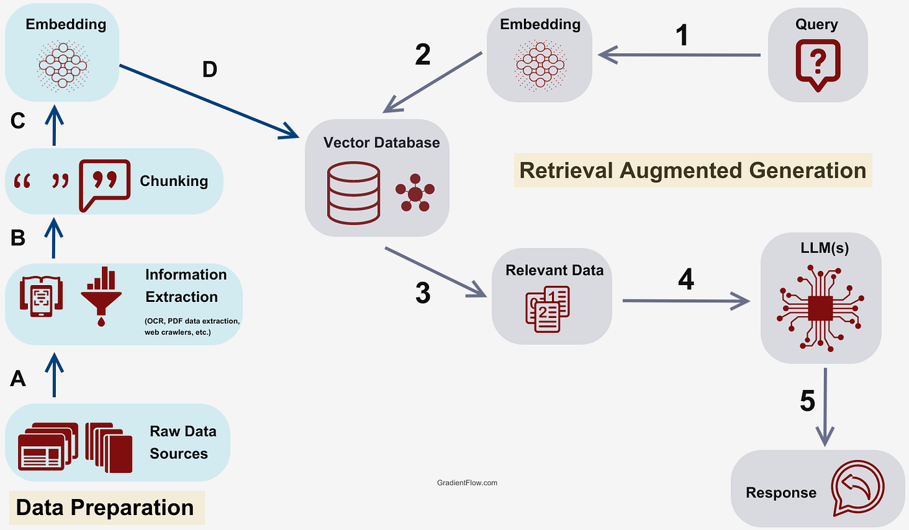

Source: [https://www.notion.so/3102a46dc68c8018a4cfc41d9819372f](https://www.notion.so/3102a46dc68c8018a4cfc41d9819372f)

목차
- Frontend framework: 사용자가 대화/작업을 요청하는 UI (part1)
- Agent development framework: 에이전트 로직(루프, 상태, 도구 연결)을 만드는 프레임워크  (part1)
- **Agent memory: 대화/세션 상태와 장기 기억 저장 (part1)**
- Agent tools: 검색, DB, 사내 API 등 “행동”을 수행하는 도구 묶음 (part1)
- Agent design patterns: 싱글 에이전트 vs 멀티 에이전트 등 구조 패턴 (part3)
- Agent runtim: 에이전트 애플리케이션이 실제로 돌아가는 실행 환경 (part3)
- AI models: 추론/의사결정 엔진(part 3)
- Model runtime: 모델을 서빙하는 인프라(관리형 API/컨테이너/GKE 등) (part 3)

Agentic AI를 한 문장으로 정리하면, **사용자 의도를 이해하고 → 여러 단계 계획을 세우고 → 도구를 호출해 실행까지 끝내는** 자율 시스템이다. 단순히 “답변을 생성하는 모델”이 아니라, **계획(Planning)** 과 **도구(Tools)** 를 통해 실제 업무를 완료하도록 설계된 아키텍처인 것이다.
이 작업을 진행하기 위해서는, 이전에 어떤 비슷한 작업을 했는지, 사용자의 특성은 무엇인지를 agent가 미리 인지하고 작업을 하는것이 효율적이고 이를 위해 Memory기능은 필수적이다.

(agent memory 기능이 없다면 위 예시처럼, action, operation과정이 계속해서 늘어나고, 진행이 느려지는 상황이 발생한다)

# 단기기억
---
Agent memory는 사람의 기억과도 같다. 우리가 어떤 사람과 대화를 진행할때, 그 사람과의 대화 흐름과 내용을 기억을 하지만, 장기적으로는 모든 대화내용을 기억할 수는 없다. 
(사람들의 뇌에 저장공간의 한계가 있기 때문이다). 

우리가 CHATGPT를 사용하면, 경험에 의해서 아마 모든 분들이 아실 것이다. 새로운 대화창을 열게 되면, 기존에 대화했던 것들과 별개의 내용에 대해서 이야기 할 수 있다. 즉, 대화 기억이 reset되는 것이다. 

여기서 중요한 개념 두개를 짚고 넘어가자. 
1. Session: 사용자와 에이전트가 주고받는 “대화창”
	- 한 세션 안에서는 이전 메세지들이 이어진 맥락으로 (단기기억으로) 기억됨.
	- 한 세션은 다른 세션 내용과 섞이지 않음, 다른말로 다른 세션을 기억하지 않음.
2. State: 한 session에서 대화를 통해 정리된 “현재 작업의 핵심 정보” 
	- state type: 목표 제약, 이미 결정된 사항, 진행단계, 다음 행동 같은 구조화된 요약.

위 Chatpgt history에서 session은
- Opencalw Voice call 설정
- Twill Definition and Uses
- Openclaw 전화설정
- etc.
state는
- 사용자의 목표: “푸꾸옥 공항 짐 보관 위치/가격 조사”
- 제약조건: “한국어로 요약, 가격 비교 포함”
- 이미 결정된 선택: “후보는 피크타임 우선”
- 현재 진행 단계: “1) 후보 리스트업 완료 → 2) 가격/위치 검증 단계”
- 해야 할 다음 행동: “구글맵 위치 확인 / 최신 후기 3개 요약”
- 도구 사용 결과 요약: “검색 결과 핵심만 5줄로 정리”

여기서 굉장히 중요한 점은 두가지이다:
- **“단기기억은 ‘Session에서’ 맥락을 유지하기 위해 시스템이 관리하는 대화/상태(state)이다.”**
- **“LLM 자체가 기억하는 것이 아니라, 대화 기록/상태를 컨텍스트로 재주입해서 기억하는 것처럼 동작한다.”**
- **대화내용을 ‘문자’로 전부 기억하는 것은 비효율 적이므로, 핵심적인 state를 중심으로 기억한다.**
위 사진의 예시에서, **`‘openclaw voice call 설정’ session`**내부에서 대화내용을 계속해서 기억하는 능력이 바로 단기기억능력인 것이다.  

재미 있는 사실은 LLM이 기억을 하는게 아니라 openai, antropic, google 모든 회사들이 아래의 구조로 설계를 해서 그렇다.

들어가기전에 context window라는 개념을 빠르게 짚고 넘어가자. 컨텍스트 윈도우(Context Window)는 **“대형 언어 모델(LLM)이 한 번의 대화나 작업에서 이해하고 기억할 수 있는 최대 입력 및 출력 텍스트의 양” 이다.**
아래의 LLM에 넣어주는 prompt를 보면 words, imsage, videos가 있다. 하지만 LLM 이 현재 감당할 수 있는 최대 양이 존재를 한다. 

아래 2026.02자료에 따르면 Claude, gpt-codex의 context window는 1M, 400K token이라고 적혀 있다. 여기서 토큰은, 우리가 prompt에 입력하는 데이터의 종류는 (글, 이미지, 비디오)로 다양하지만 이를 LLM이 흡수할때는 하나의 데이터이다. 따라서, 공통된  단위를 사용하고 그 단위가 token이다. 다시 말해서, LLM이 흡수하는 데이터의 단위이다.
(쉽게 말해 글을 많이 쓰고, 이미지를 많이 쓰고, 비디오의 용량이 크다면, 사용되는 토큰이 많다 라고 이해하시면 좋다.)

\[Nivida blog\]
“LLM (Large Language Model) token is **the fundamental unit of text or code that a model processes, analyzes, and generates**. Think of tokens as the "Lego bricks" of language—they are the basic pieces used to break down input text into manageable units before converting them into numerical representations (vectors)”

---
다시 chatgpt가 어떻게 대화창의 이전 내용들을 기억하는가? 라는 질문으로 돌아가 보면, context window 즉 입력해주는 prompt 내부에 이전 대화내용들을 짚어 넣는 것이다.아래의 사진을 보면 turn2,3에서는 turn1,2 즉 이전 대화의 내용들을 같이 짚어 넣는다.(사용자의 질문과 답변까지 짚어 넣는다).

하지만, 이야기 했다 싶이. context window의 제한 위 사진에서는 200k token이 존재한다. 따라서, 모든 대화를 넣을 수 없다. 그래서 openai docs에 따르면 두가지 방식 을 사용한다.
[Context Engineering - Short-Term Memory Management with Sessions from OpenAI Agents SDK](<https://developers.openai.com/cookbook/examples/agents_sdk/session_memory/?utm_source=chatgpt.com>)

### Trimming
---
Trimming은 아주 단순하게 time sequence에 따라 대화내용을 정렬한후, context window한계치까지만 담는 것이다. (이전 내용은 다 지우는 것)

### Compaction
---
Compact (summarizing)은 대화내용들을 전부 요약한다음에 하나의 compaction block으로 create한 후에, Context window에 짚어 넣어 이후 대화를 진행하는 것이다.
[Compaction](<https://platform.claude.com/docs/en/build-with-claude/compaction>)

# 장기기억
---
단기기억이 “한 세션 안에서 유지되는 대화/상태(state)”라면, 장기기억은 세션이 바뀌어도 계속 남아있는 ‘지속 저장(persistent storage)’이다. 즉, 에이전트가 매번 처음부터 다시 묻고 배우지 않도록, **사용자 선호·프로젝트 지식·과거 결정사항·자주 쓰는 문서** 등을 저장해두고 필요할 때 꺼내 쓰는 구조다.

### wHY?
---
위에서 설명했다 싶이, 컨텍스트 윈도우는 결국 제한이 있기 때문에, 대화가 길어지면 길어질수록 (요약, trim)으로 **“모든 것을 대화 히스토리로 들고 가는 방식”은 오래 못 간다.** 그래서 장기기억이 필요해진다.
- **개인화:** 사용자의 말투/선호/목표를 기억해서 매번 설명을 반복하지 않게 한다.
- **지식 유지:** 프로젝트의 배경지식, 내부 문서, 과거 결정사항을 축적해 “업무 연속성”을 만든다.
- **정확성/근거:** 모델이 학습 때 보지 못한 최신 정보나 사내 정보를, 저장소에서 찾아와 답변을 “grounding(근거화)”한다.
- **비용/속도:** 긴 대화 전체를 넣는 대신, 필요한 것만 검색해 넣으면 토큰 비용과 지연이 줄어든다. (RAG의 대표 장점)

### Method
---
장기기억은 “외부 저장소 + 검색/회수(retrieval)”로 구현되는 경우가 많다. 크게 3갈래가 실무에서 많이 쓰인다.
### (A) 파일 기반 메모리 (가장 단순·직관)
아래 context engineering의 예시를 보면, 사실 우리가 agent에게 “오늘 날씨가 어때” 라고 질문을 한다면, 단순히 그 질문만 LLM(뇌)에 들어 가는게 아니라, 현재 가지고 있는 도구들그리고 기억도 같이 prompt에 들어간다. 따라서, 우리는 `memory.md`파일에 장기기억해야할 내용들을 자연어로 작성하고, prompt에 넣어준다.( Application단계에서 설명드리겠지만, `memory.md`의 내용을 자동으로 읽게 할 수도 있고, 수동으로 파일의 위치를 질문할때 알려 줄수도 있다.)
-  장점: 자연어로 적기만 하면 되니, 구현이 쉽고, 사람이 직접 열어보고 수정할 수 있어 디버깅이 편하다.
- 한계: 규모가 커지면 “필요한 부분만 빠르게 찾기”가 어려워진다. (결국에 또다른 context이므로, 많이 쓸수가 없다)

### Claude memory
실제 Claude code docx ([Manage Claude's memory - Claude Code Docs](<https://code.claude.com/docs/en/memory#how-it-works>))를 살펴보면, session의 맨 처음에 200줄의 `memory.md`내용이 자동 기입된다고 말한다. 즉 모든 대화에서 memory.md를 넣으면 비효율적이니 session의 처음에 기입한다.

### (B) 벡터 DB(Vector Database) / 임베딩 검색
([Exploring Vector Databases: Pinecone, Chroma, Weaviate, Qdrant, Milvus, PgVector, and Redis](<https://mehmetozkaya.medium.com/exploring-vector-databases-pinecone-chroma-weaviate-qdrant-milvus-pgvector-and-redis-f0618fe9e92d>))

자 두번째로, 외부 저장공간을 이용하는 memory 장기기억 방식이다. 위사진을 보게 되면, 다양한 **제품/오픈소스 프로젝트**가 존재한다. y축은 상업/open source 로 구분이 되어 있으며, 위쪽은 **Dedicated = 벡터 검색이 주업(전용 엔진)**, **Support = 본업은 따로 있고 벡터 검색은 옵션(추가 기능) 로 이해하면 된다.**

“RAG는 ‘외부 지식을 검색해(주로 벡터 검색) LLM 입력에 붙인 뒤 생성하는’ 패턴이다. 벡터 DB는 RAG에서 가장 널리 쓰이는 retrieval 저장소 중 하나다.”

### Retrieval Augmented Generation (RAG) Process
---

[An introduction to RAG and simple/ complex RAG](<https://medium.com/enterprise-rag/an-introduction-to-rag-and-simple-complex-rag-9c3aa9bd017b>)

사용자에게 질문을 받기 전에, 먼저 Vector Database를 구축해야한다. 이해를 위해서, 병원에서 사용하는 RAG라고 가정하자.
- A: Raw Data Source
	- e.g) 환자의 데이터와 치료 방식들이 담긴 문서들을 준비한다.
- B: Information Extraction
	- (방대한 데이터) → 검색 가능한 텍스트/meta data를 뽑아냄 (pdf → text, image → text)
	- 환자의 진단 결과 데이터 medical image → text, pdf → text로 전부 전환한다.
- C: Chunking
	- pdf, 문서 → 문단, 섹션/소제목 단위
	- 전환된 정보를 의미있는 더 작은 덩어이로 쪼갠다. (너무 크면 context window에 들어가지 못함) 
- Embedding
	- chunk → embedding vector (벡터화진행)
	- e.g) 환자 정보, 진단 정보 덩어리들을 벡터화(숫자로 나타냄) 그리고 database에 짚어 넣는다.

### Example (RAG + LLM)
사용자가 질문을 하면, 시스템은 **질문 전체를 임베딩(벡터화)** 하고 벡터 DB에서 **의미적으로 가장 가까운 chunk(top-k)** 를 검색한다. 그리고 검색된 chunk의 원문(및 메타데이터)을 **컨텍스트 윈도우에 첨부**한 뒤, LLM이 그 근거를 바탕으로 답변을 생성하도록 한다.
1. 사용자가 질문을 함. 
	e.g.) “이 환자 케이스에서 **참고해야 할 프로토콜/주의사항을 근거와 함께 정리해줘**”
2. 환자 요약(진단명/검사결과/금기/과거력)을 구조화해서 쿼리로 만든다
3. 병원 내부 지식베이스(치료 프로토콜, 가이드라인, 약물 금기 목록, 유사 케이스 요약)에서 top-k 문서를 검색 후, 검색된 근거 문서의 핵심 문단을 컨텍스트에 붙인다
4. LLM이 “근거 문서 기반으로 가능한 옵션/주의사항/추가로 확인할 정보”를 정리한다
5. 사용자에게 답변을 진행.

- 장점: 문서를 “의미 기반”으로 찾을 수 있어, 키워드가 정확히 일치하지 않아도 관련 내용을 잘 끌어온다. RAG에서 가장 흔한 저장소 타입이다.

# Conclusion
[Effective context engineering for AI agents](<https://www.anthropic.com/engineering/effective-context-engineering-for-ai-agents?utm_source=chatgpt.com>)

마무리로, antropic (claude)의 context window를 살펴보고 마무리하자. 결국 기억을 하려면 prompt에 입력을 해주어야 한다. 따라서 prompt engineering이라는 좌측의 용어도 존재한다. “프롬트를 어떻게 쓰고, 조작하는지”

하지만 agentic ai시대에서 사용해야할 tool, 기억해야할 memory는 많아지고 context window는 한정적이므로, 어떠한 조합으로 tool, memory들을 최소한으로 넣어서 최대한의 효율적인 action을 할 수 있을까? 라는 context engineering을 antropic은 새롭게 정의한다.

### 재미있는 사실: 너무 많이 짚어 넣어도 분산된다.
---
글은 컨텍스트를 **“무한히 넣으면 좋다”가 아니라, 넣을수록 집중력이 떨어질 수 있는 자원**으로 봅니다.
- 토큰이 늘수록 모델이 중요한 정보를 잘 못 집어내는 **context rot(문맥 부패)** 같은 현상이 관찰된다고 언급합니다.
- 근본 이유는 트랜스포머가 토큰들 사이의 관계를 모두 보려다 보니(상호 attention), 길어질수록 “주의(Attention) 예산”이 얇아진다는 설명을 합니다.
그래서 목표는 “가장 작은 토큰으로 가장 높은 신호(signal)를 만들기”입니다

이번시간에는 저 context window에서 memory 부분은 어디서 가져와서 채워넣는지. DOC1,2는 유저의 database에서 어떻게 가져오는지에 대해서 알아보았다.

→ 다음 시간은 tool에 대해서 살펴보자.
