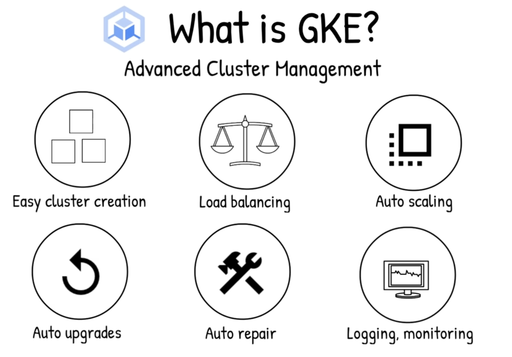
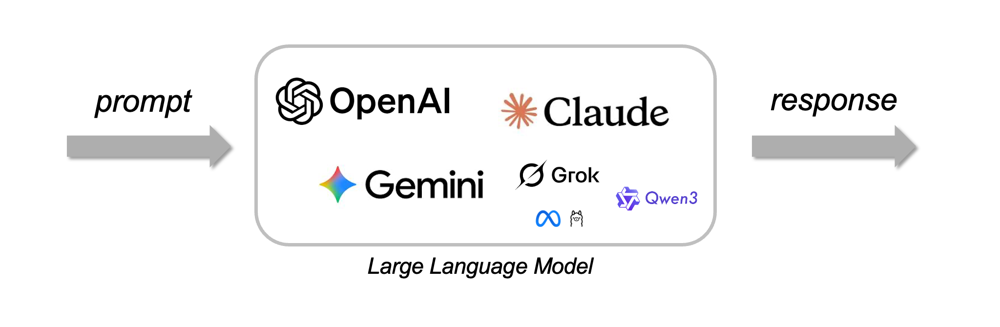
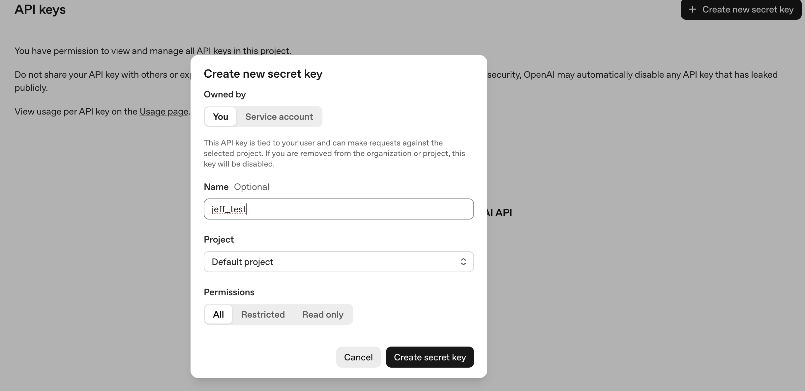
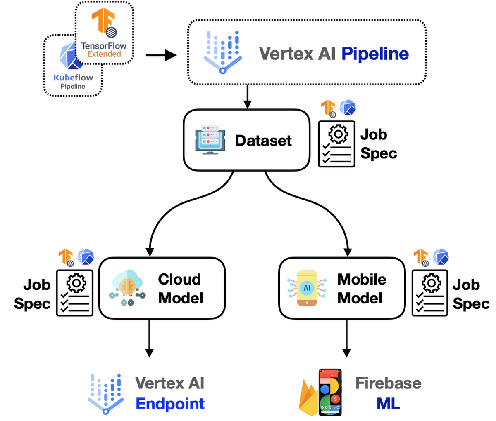

Source: [https://www.notion.so/3112a46dc68c804e9049e57b459c088b](https://www.notion.so/3112a46dc68c804e9049e57b459c088b)


# Contents
- Frontend framework: 사용자가 대화/작업을 요청하는 UI (part1)
- Agent development framework: 에이전트 로직(루프, 상태, 도구 연결)을 만드는 프레임워크  (part1)
- Agent memory: 대화/세션 상태와 장기 기억 저장 (part1)
- Agent tools: 검색, DB, 사내 API 등 “행동”을 수행하는 도구 묶음 (part1)
- Agent design patterns: 싱글 에이전트 vs 멀티 에이전트 등 구조 패턴 (part3)
- <span color="red">**Agent runtime: 에이전트 애플리케이션이 실제로 돌아가는 실행 환경 (part3)**</span>
- <span color="red">**AI models: 추론/의사결정 엔진(part 3)**</span>
- <span color="red">**Model runtime: 모델을 서빙하는 인프라(관리형 API/컨테이너/GKE 등) (part 3)**</span>

# Introduction

Agentic AI를 한 문장으로 정리하면, **사용자 의도를 이해하고 → 여러 단계 계획을 세우고 → 도구를 호출해 실행까지 끝내는** 자율 시스템이다. 단순히 “답변을 생성하는 모델”이 아니라, **계획(Planning)** 과 **도구(Tools)** 를 통해 실제 업무를 완료하도록 설계된 아키텍처인 것이다.


Agent AI structure 마지막 시간이다. 지금까지는 agent의 팔다리에 대해서 이야기를 하였다. 결국 이 모든 것들이 컴퓨팅(메모리, CPU, network …) 시스템에서 작동하는 것을 잊으면 안된다. 
즉, 심장과 이 에이전트(몸체)를 어떻게 연결하는지 그 환경/공간인 runtime을 이해해야한다.


(google cloud에서 보여주는 run time, agent architecture)


# What is runtime?
---
> runtime : “코드가 실제로 실행된는 환경/공간”

우리가 작성한 python 코드, agent 루프 로직, 모델 추론 요청, 도구 호출, 외부 메모리 연결 등등 지금까지 배웠던 것들이 컴퓨팅이 필요한 작업이다.
따라서,<span color="red">** Computing(메모리 + CPU + Network + OS)**</span> 위에서 실제로 돌아가는 공간이 바로 runtime. 

runtime이 중요한 이유는 우리가 하는 다음 작업들을 효율적으로 만들어준다.
- 메모리 실행 환경 관리, 메모리 관리, 네트워크 통신, 스케일링
- 보안, 로깅, 모티너링
>
	*즉, 설계도는 코드이고,*
	*runtime은 그 설계도가 실제로 작동하는 “현실 세계”다.*

(이러한 runtime을 제공하는 platform은 대표적으로, Docker, AWS ECS, Cloud Run … 이 있다)


# Agent runtime
---
agent runtime은 그렇다면 단순히, 우리가 설계해놓은 agent system, framework가 구현되는 환경/공간이다. 아래의 google cloud에서 예시로 가져온 `multi agent system`을 살펴보면, Cloud run/Agent engine/GKE 플랫폼이 agent 의 작업공간을 제공한다.


Agent runtime은 에이전트 애플리케이션이 실행되는 인프라 환경이다. Google Cloud에서는 대표적으로 Cloud Run과 GKE가 이를 담당한다.
- Cloud Run은 서버리스 컨테이너 실행 플랫폼으로, 인프라 관리 없이 Agent를 빠르게 배포할 수 있다. **→ 간편 배포.**
- GKE는 Kubernetes 기반의 클러스터 환경으로, 대규모 트래픽과 복잡한 서비스 구성이 필요한 경우 적합하다 **→ 대규모 정밀 제어.**


## Google Kuernetes Engine
---
조금 더 깊게 들어가보록 하자. 일단 GKE를 더 깊게 이해하기 위해서 container 의 개념을 잠깐 짚고 넘어가자.

container은 우리가 실행 코드 + 관련 패키지(dependencies)들을 하나로 묶어서 저장하는 공간이다. 즉, 우리는 이렇게 묶어서 image(템플렛)형태로 저장을 하고, docker 를 이용하여 image를 어느 컴퓨터에서나 호출하면 저렇게 container가 생기는 것이다.(굉장히 portable, sharable함) 


앞에서 우리는 다음을 이해했다.
- Agent는 `코드 + 모델 호출 + 도구 실행`으로 구성된다.
- 이 코드는 <span color="red">**container**</span>로 묶을 수 있다.
- <span color="red">Docker</span>를 사용하면 어디서든 동일하게 실행할 수 있다.

그런데 문제가 생긴다.
> 컨테이너가 하나가 아니라, 수십 개, 수백 개라면?


예를 들어,
- Agent A (Planning), Agent B (Tool execution), Agent C (Memory service)
- Agent D (Model wrapper), Vector DB, Logging service, Monitoring service
이 모든 것이 각각 컨테이너라면?, 이걸 누가 관리할까?


→ 죽으면 다시 살려야 하고, 트래픽 많으면 자동으로 늘려야 하고, 서버 여러 대에 나눠서 배치해야 하고, 네트워크 연결도 관리해야 하고


### Kurbernetes
이때 등장하는 것이 **Kubernetes**다.
> “컨테이너를 자동으로 배치하고, 관리하고, 확장해주는 시스템”
- 여러 대의 컴퓨터를 하나의 **Cluster**로 묶고, 그 위에서 컨테이너를 자동으로 배포하고
- 트래픽에 따라 자동으로 확장하고, 장애가 나면 자동 복구하는 컨테이너 오케스트레이션 플랫폼이다.

**“google에서 제공하고 관리해주는 kubernetes 이 단순히 Google Kubernets Engine(GKE)”**



Kubernetes구조에 대해서 자세하게 살펴보자.


- **Node** → 실제 컴퓨터
- **Pod** → 컨테이너 실행 단위
- **Cluster** → 여러 노드의 집합
- **Control Plane** → 전체를 관리하는 관리자


멀티 에이전트 시스템이라면:
- Coordinator Agent
- Worker Agent
- Tool Service
- Memory DB
- Model Adapter
- API Gateway

이 모든 것이 각각 컨테이너로 구성될 수 있다.
GKE는 이걸:
- 서로 다른 노드에 배치하고
- 트래픽에 따라 자동 확장하고
- 장애 발생 시 자동 재시작하고
- 로깅과 모니터링을 통합한다.

<table header-row="true">
<tr>
<td>항목</td>
<td>Cloud Run</td>
<td>GKE</td>
</tr>
<tr>
<td>난이도</td>
<td>매우 쉬움</td>
<td>비교적 복잡</td>
</tr>
<tr>
<td>서버 관리</td>
<td>없음 (완전 서버리스)</td>
<td>클러스터 관리 필요</td>
</tr>
<tr>
<td>스케일링</td>
<td>자동</td>
<td>세밀한 제어 가능</td>
</tr>
<tr>
<td>사용 경우</td>
<td>단일 Agent / 간단한 API</td>
<td>멀티 에이전트 / 대규모 시스템</td>
</tr>
<tr>
<td>제어권</td>
<td>낮음</td>
<td>높음</td>
</tr>
</table>


# Model
---

수많은 LLM 모델들이 현재 존재하는 상황이다. agent 설계에서 LLM을 사용하는 방법은 단순히 python code로 다음 예시(opanAI)를 호출할 수 있다. 여기서 중요한점은 해당 회사에서 발급을 받은 API key가 있어야 한다.
```python
from openai import OpenAI
client = OpenAI(api_key="...")
```


### #OpenAI API key 발급 방법.
1.  [API Platform]({{https://openai.com/api/}}) 에 접속

2. 우측 상단의 API platform 클릭
3. 좌측 Side bar → API keys


1. 우측 상단 Create new secret key → Name 작성 , project 선택 → Create secret key.



1. 발급된 API key copy → paste to the python code


```python
from openai import OpenAI
client = OpenAI(api_key="sk-proj-eivw_9cNtm5Gh7flhiQszio8ppdT4UrVcD------")
```

이후 agent model이 장착 된 것이고, 사용모델이 openai 회사의 모델들을 사용할 수 있다.
(아래의 pricing 을 살펴보면 Token당 달러로 가격이 측정된다)
[Pricing]({{https://openai.com/api/pricing/}})

# Model runtime
---
> Model runtime은 “AI 모델이 실제로 추론(inference)을 수행하는 실행 환경”이다

여기서 모델은 단순한 python code가 아니라, 수십\~수백 GB의 파라미터를 가진 거대한 신경망이다. 따라서, 
- 고성능 GPU 필요
- 병렬 처리
- 메모리 관리
- 모델 로딩 최적화
- 트래픽 스케일링
이 모든 것을 처리하는 인프라가 필요하다.

여기서 모델계발을 메인으로 하는 회사인 openai, antropic 같은 회사들은 모델 서비스를 제공만하고, 자체적으로 model runtime을 자신들만의 server에서 진행한다.
<table header-row="true">
<tr>
<td>항목</td>
<td>OpenAI</td>
<td>Anthropic</td>
<td>Vertex AI</td>
</tr>
<tr>
<td>모델 제공</td>
<td>O</td>
<td>O</td>
<td>O</td>
</tr>
<tr>
<td>자체 모델 배포</td>
<td>X</td>
<td>X</td>
<td>O</td>
</tr>
<tr>
<td>커스텀 서빙</td>
<td>X</td>
<td>X</td>
<td>O</td>
</tr>
<tr>
<td>인프라 제어</td>
<td>낮음</td>
<td>낮음</td>
<td>높음</td>
</tr>
<tr>
<td>기업 통합</td>
<td>제한적</td>
<td>제한적</td>
<td>매우 강함</td>
</tr>
</table>

이와 반대로 Vertex AI는 Google Cloud가 제공하는 단순히 모델을 “사용”하는 서비스가 아니라,
> 모델을 학습하고, 배포하고, 운영하고, 모니터링하는
	전체 AI lifecycle을 관리하는 플랫폼



Model runtime은 다음을 담당한다:
- 모델 weight 로딩, GPU 메모리 관리, 병렬 추론 처리
- 요청 큐 관리, 트래픽 스케일링장애 복구

Vertex AI는 이것을:
- Managed endpoint 형태로 제공한다.
- <span color="red">**사용자는 endpoint URL만 호출하면 된다.(url접속하면, model 관리 콘솔창이 뜬다)**</span>
- 내부 GPU, TPU, 스케일링은 Google이 관리한다.

실제 google cloud → vertex AI console에 접속해보면,(url console창)
[Google Cloud console]({{https://console.cloud.google.com/vertex-ai/studio/prompt-gallery/47d889d2-b22d-46ed-b986-ca3bcbeb5a47?hl=en&project=lofty-cabinet-478609-f4}})


직접 model setting을 UI를 통해 할 수 있고, input, output도 관리가 가능하다.

# Conclusion
이번 시간에는 agent 시스템이 실제로 동작하기 위한 핵심 요소인 computing 환경 runtime(심장)과 model(뇌)에 대해 살펴보았다. 지금까지 agent의 구조와 팔다리를 이해했다면, 이제 그것이 실제로 작동하는 실행 환경까지 연결된 것이다.
특히 인상 깊었던 점은, Google이 agent 생태계를 매우 빠르게 인프라 수준까지 정리해두었다는 점이다. 보안과 통합 문제로 인해 각 기업은 자신들만의 agent를 직접 설계할 가능성이 높다. 그리고 그 설계를 가능하게 하는 팔레트와 실행 환경을 Google은 이미 준비해두고 있다.
앞으로는 기업뿐 아니라 개인 단위에서도 agent를 구축하는 시대가 올 것이다. 그렇다면 핵심 질문은 이것이다:
> 누가 더 안전하고, 효율적이며, 지능적인 agent 시스템을 설계할 수 있는가?
Anthropic, OpenAI, Google은 이미 빠르게 agent를 구축하고 있으며, 단순한 코드 작성 단계는 넘어선 상태에서 다양한 산업 분야로 확장되고 있다.

나는 여기서 한 가지 질문을 던지고 싶다.
> 나의 전문 분야인 Computational Mechanics + agent는 어떻게 연결될 수 있을까?
단순히Agent를 사용하는 것이 아니라,
Agent 구조를 이해하고 → 직접 설계하고 → 수치해석 및 시뮬레이션과 결합하는 방향으로 확장해보고자 한다.

이제 Theory 파트는 마무리하고, 실전으로 넘어가자.
실전은 두 가지 트랙으로 진행된다.
1. Claude, Codex, Gemini, OpenClaw와 같은 이미 구축된 agent system을 직접 사용해보며 기능을 분석한다.
2. LangChain과 Google ADK를 활용해 나만의 agent를 직접 설계해본다.
이제 설계자의 관점으로 넘어갈 시간이다.

지금까지 Agent theory 부분을 마무리하고, 이제 실전으로 넘어가자. 실전은 두가지 분류로 진행된다.
1. Claude, Codex, Gemini, Openclaw → 이렇게 미리 만들어진 agent system을 직접 사용해보며 어떤 기능들이 있고, 어떤 작업들이 가능한지를 살펴보자.
2. Langchain, Google ADK 를 활용하여 나만의 agent를 직접 설계해보자.
