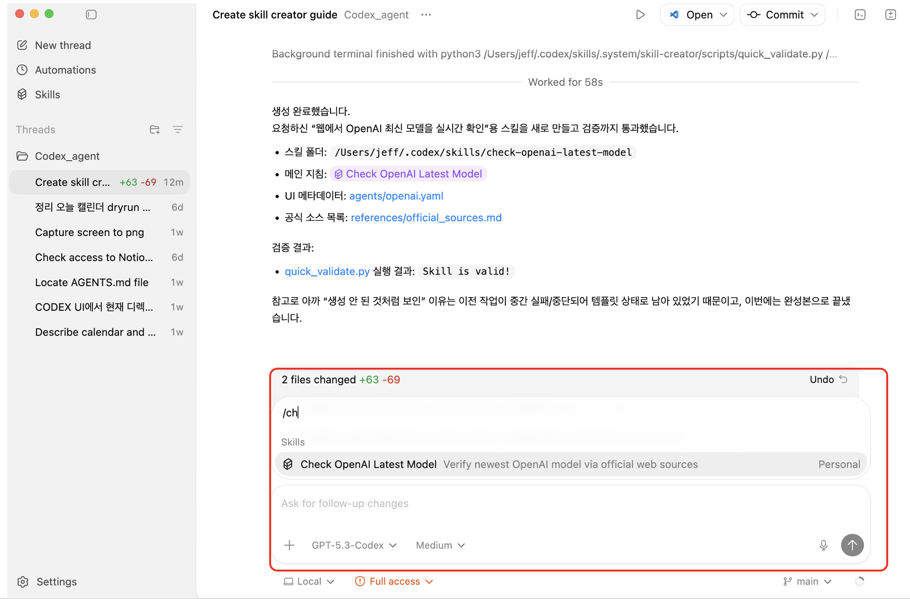
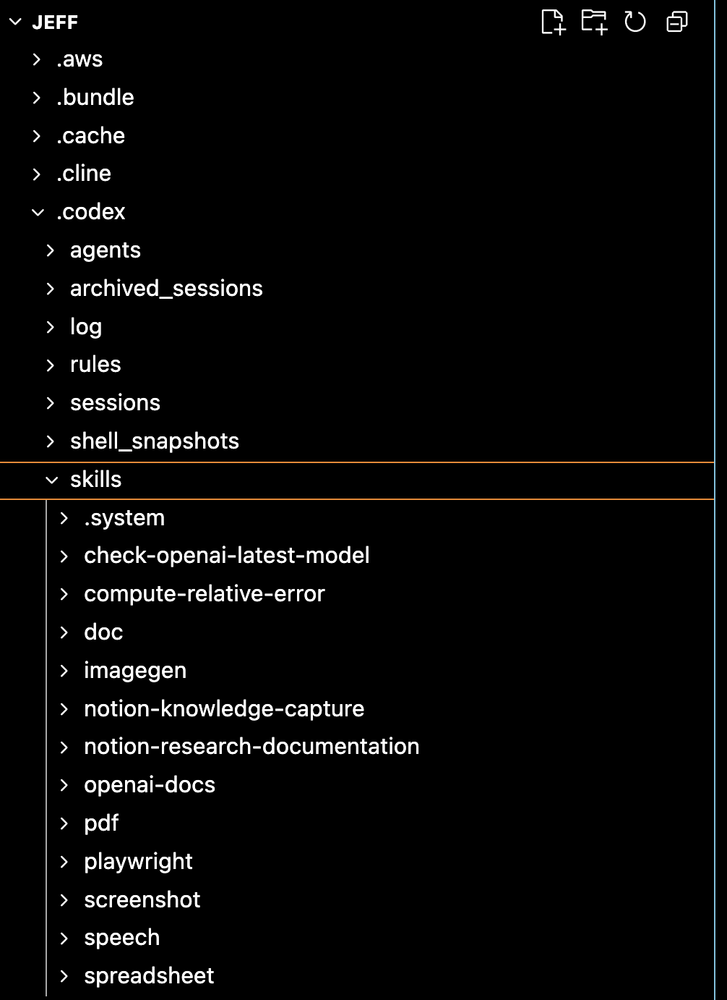
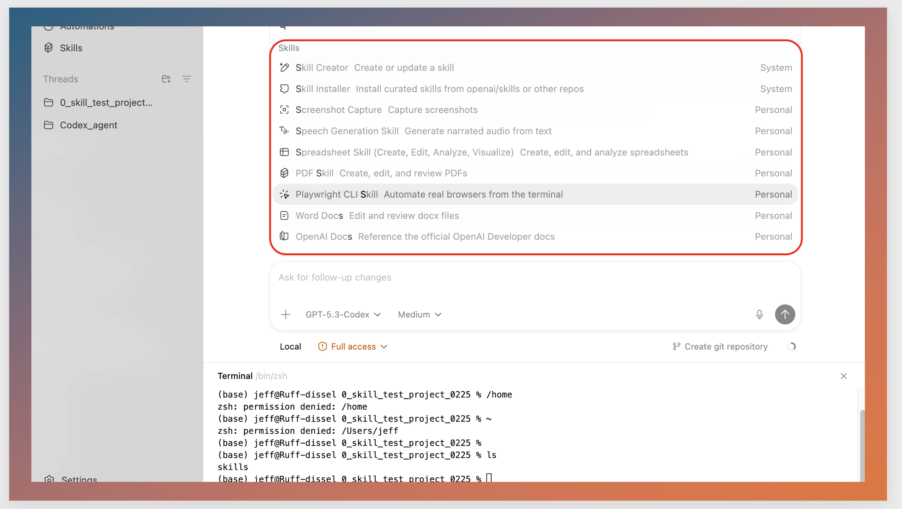
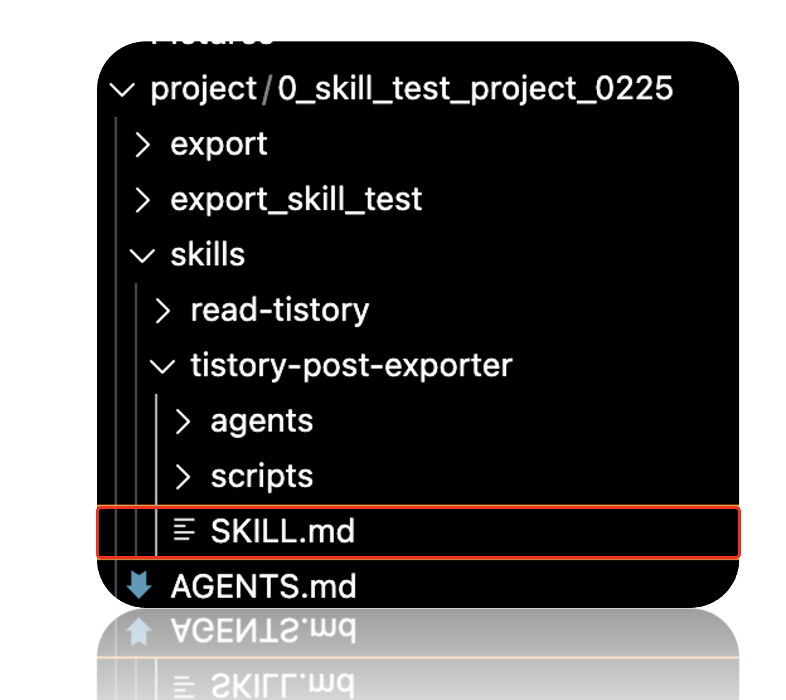

Source: [https://www.notion.so/3102a46dc68c80e3bf8bccc034d9804f](https://www.notion.so/3102a46dc68c80e3bf8bccc034d9804f)


Agent의 기본구조에서 한단계 더 나아가 advanced topic에 대해서 다루어 보자.
# Contents
- <span color="red">**Agent - skills**</span>
- Agent - Plugin
- Agent - Planning
- Agent - Reflection
- Agent - Reason and act.
- Agent - subagents system.


# Skills
---
skills는 우리가 설계하는 agent에게 어떠한 기술을 부여하는 것이다. 그게 도구의 사용일 수도 있고, 코드 실행일 수도 있으며 그냥 컴퓨터로 인간이 작업할 수 있는 모든 것들이 포함된다. 처음에는 감이 (저도) 안왔기 때문에 바로 실전으로 들어가보자.


e.g.) openai 최신 모델을 질문하는 예시.
1. user query to agent without skills : 
>
	“OpenAI의 최신 모델이 무엇이야?”

이 경우, agent가 저 질문을 답하기 위해서 현재 도구, memory를 전부 고려해서 어떻게 해결해야할지 판단해야한다.


1. user query to agent <span underline="true">**with skills**</span>:
> `/check_latest_openai_model` 를 사용해서, 지금 최신 모델을 알려줄래?
(`check_latest_openai_model` 은 유저가 미리 적어놓은 skill)

	→ Agent read ` skill dir `(or file)
	→ Do action (use tools or run code ….)
	→ response to the user.

이렇게 되면, agent가 어떻게 해결해야할지 방향성을 사용자가 잡아주는 것.
> 아주 단순하다. 그냥 기술을 어디다가 적어놓고, 저거 읽고 사용해\~
라고 명령하는 방식이다. 


### Openai Codex agent skills
---
만약에 agent를 직접 설계하는 입장이라면, skill dir을 직접 알려주는 식으로 명령을 해야하지만, OPNEAI, ANTROPIC에서 제공하는 완성된 agent는 skill 이름만 말해주면 자동으로 그 스킬을 사용한다.

가장 대표적인, OPENAI의 Agent AI Application platform인, 알트만 형의 CODEX를 살펴보자.
[Agent Skills](<https://developers.openai.com/codex/skills/>)
공식문서를 살펴보면, skill dir이 이런식으로 구성이 되어 있다. 
skill을 위한 데이터와 설명 파일 (.md)가 들어있다.


`SKILL.md`파일이 가장 중요하다. 이 <span color="red" underline="true">**스킬의 이름, 용도, process**</span>를 자연어로 정확히 적어주어야 실수하지 않고 LLM이 사용할 수 있다.
```python
---
name: check-openai-latest-model
description: Verify the latest OpenAI model names using live web checks on official OpenAI pages. Use when users ask for "latest/newest/current OpenAI model", model release recency, or model list verification that may have changed recently.
---

# Check OpenAI Latest Model

Use this skill to confirm current OpenAI model information from official web sources.
Prioritize browser-based verification because model availability can change frequently.

## Source Policy

- Use only official OpenAI sources:
  - `https://openai.com`
  - `https://platform.openai.com`
  - `https://help.openai.com`
- Do not rely on third-party summaries for "latest model" claims.
- Prefer pages with explicit publish/update dates or changelog context.
- If sources disagree, report the conflict and include both links.

See [references/official_sources.md](references/official_sources.md).

## Workflow

1. Clarify scope in one line.
   - Ask whether user wants API models, ChatGPT models, or both.
   - If unspecified, check both and label them separately.
2. Browse official sources live.
   - Open model overview/docs pages and release/update pages.
   - Capture exact model identifiers as shown on official pages. ...
```

중요한 점은 5가지가 명확하게 기입되어어야 한다. (굉장히 중요)
- **name** → 모델이 호출할 스킬 이름
- **description** → 언제 발동해야 하는지 명확히 정의
- **When to Use / Do NOT trigger** → 트리거 조건 명확화
- **Execution Steps** → LLM이 따를 프로세스
- **Failure Handling** → 실전 안정성


이후에 openai.yaml파일은 이제 skill을 사용할때 이름만 부르면 되기 때문에 그 이름을 무엇으로 할 것인지 그리고 console창에서 뜨는 설명을 기입하는 곳이다.
```python
interface:
  display_name: "Check OpenAI Latest Model"
  short_description: "Verify newest OpenAI model via official web sources"
  default_prompt: "Use web browser steps to verify the latest OpenAI model from official OpenAI pages and report with source links and dates."
```


실제 CODEX 코드 내부를 살펴보면,
Dir: `skills` → `check-openai-latest-model` 이 존재하고, 내부에 `SKILL.md`가 존재한다.


---
(DEMO작업으로는 CODEX UI를 사용하도록 하겠습니다. 이후에 CLI, UI, IDE(cursor) …. 등등 다양한 플랫폼 설명예정, 일단은 skill이 어떤 것인지 간단하게 보여주는 용도로만)

Codex UI에 들어가서 (2026.02기준 mac os만 지원) `/ch` 을 기입하면 이렇게 생성된 skill이 뜨게 된다.



이제 실행을 해보자.


[SKILL.md](<http://SKILL.md>) 파일에 적힌대로, OPENAI 공식문서만 참고해서 정보를 전달하는 것을 알 수 있다.


### Skills Recognition
---
여기서 위의 예시는 사용자가 skill 을 직접 prompt 에서 호출하였다. 


하지만, 만약에 skills이 저장은 되어 있는데 <span color="red">**호출은 하지 않고**</span> 그냥
>
	User query: “OpenAI 최신 모델 찾아줘”라고 했다면?”
1. agent가 skill을 알고 사용할까?
2. agent가 skill을 모를까?


그 설정도 <span color="blue">**CODEX**</span>, <span color="orange">**CLAUDE**</span> 모두 따로 옵션으로 유저가 설정 할 수 있다.

`openai.yaml` 파일에서, `allow_implicit_invocation` 을 on/off로 설정할 수 가 있다.


### Context window
---
이제 모든 토큰 (돈)과 연결되는 context window 관점에서 살펴보자.
좌측의 경우 skilll.md파일 내용 자체가들어가고, 우측은 현재 가지고 있는 접근가능한 skill들의 이름과 간단한 사용목적만 들어간다.

(우측의 경우 LLM이 판단해서 스킬을 사용하면, 문제를 해결할 수 있을 경우만 사용, 대부분 계발자들은 직접 스킬을 알려주는게 가장 효율적이라고 함)


최종적으로 skills의 구조를 정리된 구조로 나타낸 figure이다.


### Priorities of the skills
---
여기서 [skills.md](<http://skills.md>) 파일이 작업을 하다보면 굉장히 다양한 곳에 여러개가 존재할 것이다.
일단 codex, claude, gemini, cursor 어떤 agent application이던지. skills 작업공간은 이것만 기억하자.
- *Application 설치 장소*
- *Project 공간*


### 1. Application 설치 장소 (e.g) ./jeff/.codex



codex를 저는 user directory에 설치를 하였고, 그 내부에 skills라는 폴더가 있다.
안에 보게 되면 굉장히 다양한 Skills들이 이미 만들어져 있는 상황이다. UI로 같은 codex system을 확인하면, 해당 skill들이 사용할 수 있도록 리스트화 되어 있는 것을 확인 할 수 있다.


(이 codex의 skills는 어떻게 보면 공공장소 라고 생각하면 된다. 여기에 skills를 만들어 놓으면, 누구나 어디에 있던지 간에 skill을 폴더에서 꺼내서 쓸 수 있다)


### 2. Project dir
내가 진행하고 있는 프로젝트에 따라서 여러 project 폴더가 존재한다. 그리고 그 프로젝트에서 codex를 열게 되면, 해당 프로젝트를 기준으로 항상 작업을 하게 된다.
> IDE or CLI 에서 open한 project위치를 기준으로 SKILL.md, [AGENTS.md](<http://AGENTS.md>)(추후에 설명) 들을 main으로 prompt(context window)에 추가한다는 것.


tistory의 블로그 내용을 github -pages로 전부 옮기는 프로젝트를 진행하고자. proejct내부에 스킬들을 생성한 것을 확인 할 수 있다.
(즉 현재 프로젝트에서는 global skill + current dir skill 둘다 사용가능하다는 것)

어떤 방에서 작업을 진행중이라고 하자. 거실에 있는 skill뿐만아니라 방에 있는 skill도 사용 가능하다.


## Conclusion
---
결국 **skills는 agent의 생산성을 결정하는 핵심 요소**라고 생각한다. 사람도 “할 수 있는 기술”이 많을수록 생산적인 것처럼, agent 역시 마찬가지다.
즉, **스킬이 다양하고, 예리하고, 정확할수록** agent는 더 빠르고 안정적으로 일을 끝낸다. 그리고 그 스킬을 설계하고 쥐어 주는 주체는 결국 우리(사용자/개발자)다.
흥미로운 점은, 최근 agent들은 단순히 스킬을 “사용”하는 수준을 넘어, **주어진 목표를 달성하기 위해 필요한 프로세스를 스스로 구성하고**, 경우에 따라서는 **새로운 스킬(자동화 절차)을 만들어내는 방향**으로 발전하고 있다는 것이다. 이 흐름이 의미하는 바는 명확하다. 앞으로 인간의 역할은 “코드를 직접 작성하는 사람”이라기보다, **무엇을 시켜야 하는지(업무를 어떤 단계로 쪼개고 어떤 기준으로 검증할지)를 설계하는 사람**에 더 가까워진다.
더하여, 주어진 문제를 해결하기 위해서 process를 논리적 단계로 분해(Decomposition)하는 능력이 미래의 핵심 스킬이 될 것이다.
그래서 앞으로는 더더욱, 다양한 분야의 흐름과 도메인 지식을 **넓게 관찰하고 학습하는 습관**이 중요해진다고 느낀다. 예를 들어 주식 자동화 agent를 만든다고 해도, 결국 “무엇을 확인하고 어떤 순서로 판단해야 하는지”라는 **프로세스 설계**가 먼저 있어야 한다.
정리하면, **skill은 agent의 성능을 올리는 ‘레버’이고, 프로세스 설계는 그 레버를 어디에 어떻게 걸지 결정하는 일**이다.

#keywords.
- 사용자 스킬 = agent 스킬
- Orchestration
- Decomposition
