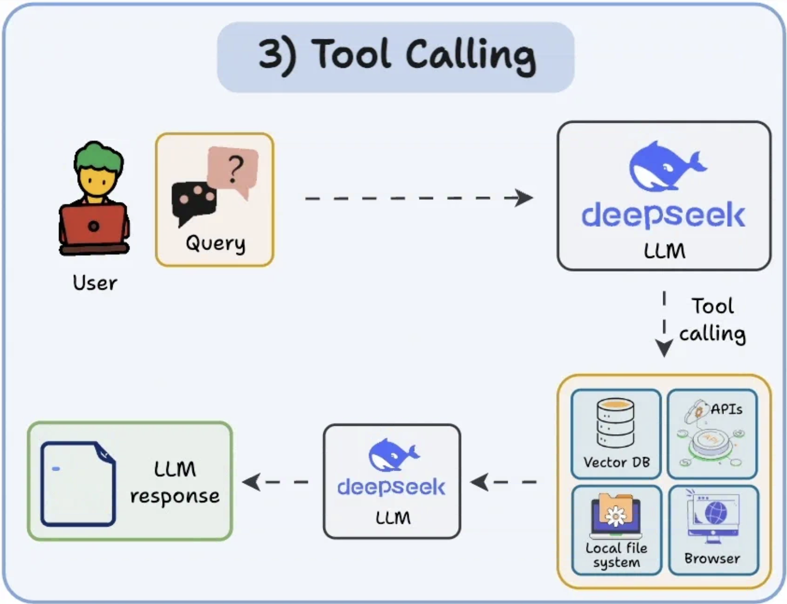
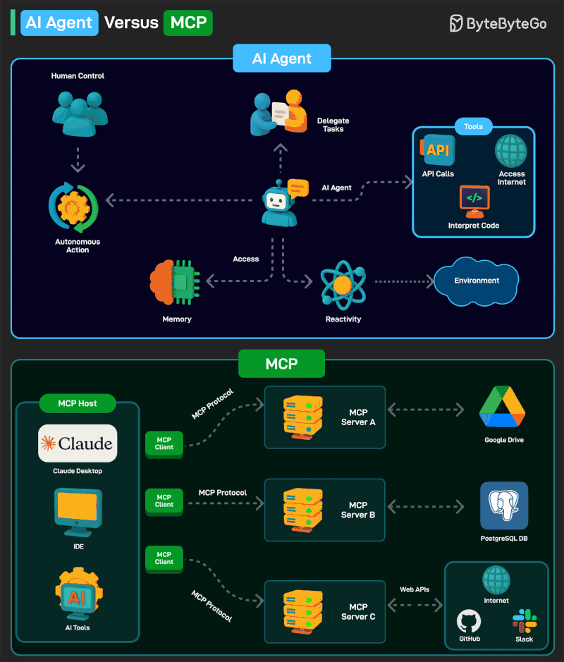
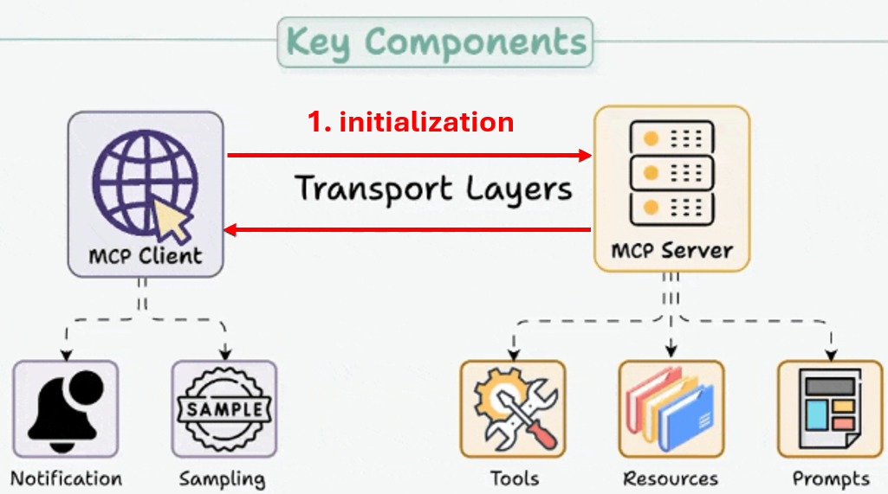
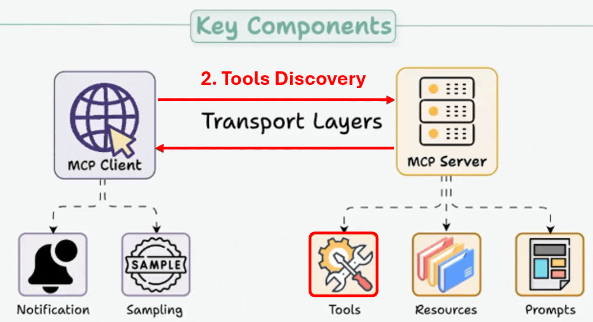
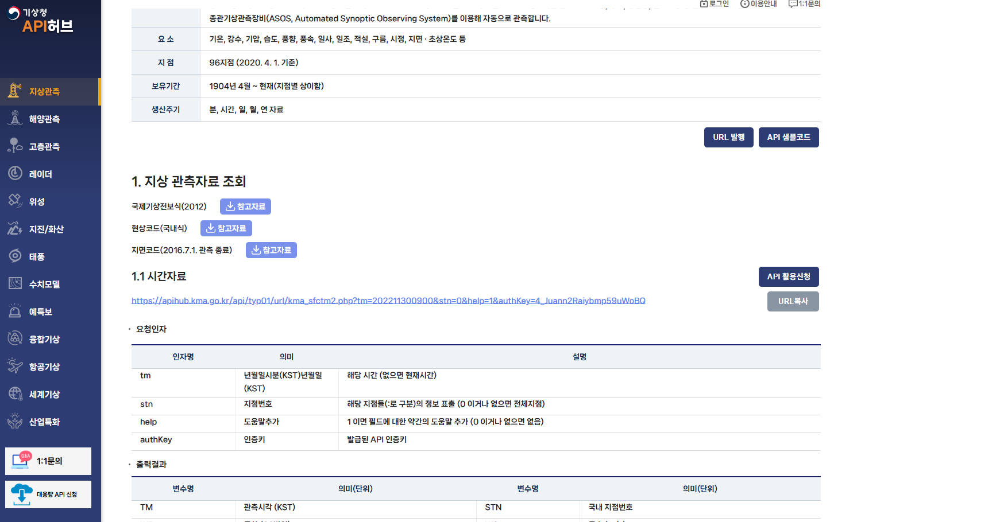

Source: [https://www.notion.so/3112a46dc68c8039bf21ed03f0b6f62d](https://www.notion.so/3112a46dc68c8039bf21ed03f0b6f62d)

목차
- Frontend framework: 사용자가 대화/작업을 요청하는 UI (part1)
- Agent development framework: 에이전트 로직(루프, 상태, 도구 연결)을 만드는 프레임워크  (part1)
- Agent memory: 대화/세션 상태와 장기 기억 저장 (part1)
- <span color="red">**Agent tools: 검색, DB, 사내 API 등 “행동”을 수행하는 도구 묶음 (part1)**</span>
- Agent design patterns: 싱글 에이전트 vs 멀티 에이전트 등 구조 패턴 (part3)
- Agent runtim: 에이전트 애플리케이션이 실제로 돌아가는 실행 환경 (part3)
- AI models: 추론/의사결정 엔진(part 3)
- Model runtime: 모델을 서빙하는 인프라(관리형 API/컨테이너/GKE 등) (part 3)


Agentic AI를 한 문장으로 정리하면, **사용자 의도를 이해하고 → 여러 단계 계획을 세우고 → 도구를 호출해 실행까지 끝내는** 자율 시스템이다. 단순히 “답변을 생성하는 모델”이 아니라, **계획(Planning)** 과 **도구(Tools)** 를 통해 실제 업무를 완료하도록 설계된 아키텍처인 것이다.

이번시간에는 가장 중요한 도구를 
1. <span color="red">**어떻게 agent가 tool을 사용하는지. **</span>
2. <span color="red">**사용자는 어떻게 도구를 세팅해야하는지.**</span>
이 두가지를 중심으로 살펴보자.


**`Claude doc`**을 중심으로 agentic Ai는 도구를 3가지 방식으로 분류하여 사용한다.
1. *Built in client tools*
2. *Built in server tools*
3. *MCP - server tools.*

사용하는 도구들이 존재하는 저장공간이 다른 것이지 사실 전체적인 processs는 공통적이다.
1. 먼저 LLM이 available tools + prompt(주어진 문제)를 고려해서  지금 상황에 필요한 tool을 (평가)하여 pick한다.
2. 이후에 그 tool을 가지고 perform을 한 후, 결과를 도출하여 response 하는 과정이다.


출처: [Tool use with Claude](<https://platform.claude.com/docs/en/agents-and-tools/tool-use/overview>)

### 1. Built-in client tools.
---
이 도구는 결국에 사용자가 미리 만들어 놓은 tool이다. 즉, 미리 만들어 놓은 코드이거나, 혹은 AI가 미리 짠 코드. 등등 그저 agent가 함수를 호출하기만 하면 되는 가장 간단한 도구이다.
### Agent가 어떻게 쓰나
- Claude(LLM)이 `tool_use` 형태로 \*\*“이 함수 이름 + 인자(JSON)”\*\*를 출력한다.
- 내 애플리케이션이 그 호출을 받아 **실제 코드 실행** 후, 결과를 `tool_result`로 다시 Claude에게 넣어준다. (즉, 실행 책임은 나에게 있음)
### 사용자는 어떻게 세팅하나
- `tools`에 \*\*툴 스키마(이름/설명/입력 JSON schema)\*\*를 등록한다.
- “툴 설명은 최소 3–4문장 이상”으로: 언제 쓰는지, 반환 형식, 제약/주의사항까지 적어야 툴 선택 정확도가 오른다. (코드 경로를 알려주면 됨).


### 2. Built-in server tools
---
Server tools follow a different workflow where Anthropic's servers handle tool execution in a loop:
### Agent가 어떻게 쓰나
- 툴 실행 루프를 **Anthropic/openai 서버가 관리**한다. 사용자는 “웹 검색/웹 fetch 등”을 쓰고 싶다고만 주면, 모델이 호출하고 결과가 다시 모델로 들어온다.
### 사용자는 어떻게 세팅하나
- API에서 해당 server tool을 “사용 가능”하게 포함시키고(문서의 요구 파라미터/헤더 포함), 프롬프트에 “검색해줘/이 URL 분석해줘” 같은 요청을 넣는다


자 여기까지 tools이 내 local server에 존재하고, 실행도 내 local에서 되는지, 혹은 model 제공하는 antropic/openai/google server에서 실행되는지에 따라서, 두가지로 나뉘었다.
이번에는 전혀 다른 server에서 tool을 가져와 쓰는 MCP server에 대해서 알아보도록 하자.




### 3. MCP server tools.
---
MCP를 안쓰는 agent AI는 없을 정도로 굉장히 중요하므로, 조금 깊게 들어가 보자. 지금 우리는 도구 조작을 agent가 어떻게 하는지를 살펴보고 있고, 지금까지 인간이 역사적으로 지금까지 만들어 놓은 도구들 google cloud, notion, excel, powerpoint and so on. 등을 조작을 하려면 API 함수를 읽고, 그거에 맞게 코드를 작성해야 (before MCP사진) 우리가 원하는 정보를 주고 받을 수 있었다. 
[Architecture overview - Model Context Protocol](<https://modelcontextprotocol.io/docs/learn/architecture>)


하지만, 이제는 MCP라는 약속된 프롤토콜을 사용함으로 써, 편리해졌다.
뿐만안라 Agent가 사용하는 framework가 CLI, IDE … 다양한데, 그거와 상관없이 모든 framework에서 공통된 MCP로 제어가 가능하다.


그렇다면, 이제 MCP의 정확히 어떻게 구성되고 작동하는 지를 살펴보자.


### MCP - architecture
---
먼저 `3가지 구성 요소`를 기억하자.
1. MCP hosts - Agent AI 가 작동하고, 여러 MCP client를 manage하는 주체.
2. MCP client - 외부 MCP server와 MCP host를 연결하기 위해서, MCP hosts 내부에 서버하나당 매핑되는 객체를 만들고, 그 객체가 바로 MCP client이다.
3. MCP server - MCP client와 소통하는 정보를 주고 받는 외부 program.


여기서 핵심은 `MCP client ↔ MCP server`와의 정보를 주고 받는 방식, 그리고 어떤 정보를 주고 받는지 이다.
그 사이에는 data, transport layer이렇게 두가지로 구분할 수 있다. (MCP host는 사용하는 framework에 따라서 openai - codex, visual studio code ID, cursor IDE, claude code… 등 다양하다)


정보를 주고 받기 위한, 구조 두가지는 다음과 같다:
- transport layer
- data layer

### Transport layer
---

- stdio : Local 내부 통신을 사용한다. 네트워크가 따로 필요없고, 가장 빠르며 인증이 불필요하다. 
- HTTP : 원격 서버와 통신을 할때 사용한다. 네크워크를 기반으로 API key, OAuth를 지원하는 특징.

### DAta layer
---

서로 client, server 측에서 양측에 제공해야하는 것들이 무엇일까?
- server는 tool, resource, prompt(LLM에게 제공할) 을 보내야하고,
- client는 Notification, sampling은 (LLM completeion여부, LLM 자체의 reponse)를 보내주어야 한다.

이러한 data들을 `primitive`라고 정의하고, 각각 primitivie마다 JSON-RPC 형식을 따른다.
```coffeescript
RPC : 다른 컴퓨터에 있는 함수를 마치 내 코드안에 있는 함수처럼 호출하는 방식. 
JSON-RPC : RPC중에서 주고 받는 파일이 json형식 파일.
```


그리고 다음 procedure이 이루어진다.


### 1. Initialization
단순하게 서로 정보를 주고 받아서, 통신이 원활한지 확인을 하는 가장 기본적인 과정이다.



### 2. Tool Discovery (at the MCP-server)
사실 built in tools와 동일하다. 현재 MCP server가 가지고 있는 tools이 뭐가 있는지 check하는 과정.


### 3. Tool exectution
이제 LLM에서 prompt와 available tools를 가지고, 현재 상황에서 어떤 tool을 써야할지를 정했을 것이고, 그거를 바탕으로 실행하는 단계이다.


e.g.) Request: 날씨가 어떤지 확인하기 위해 client → server 요청  (JSON-RPC 2.0 형식)
```coffeescript
{
  "jsonrpc": "2.0",
  "id": 3,
  "method": "tools/call",
  "params": {
    "name": "weather_current",
    "arguments": {
      "location": "San Francisco",
      "units": "imperial"
    }
  }
}
```

Response: 날씨를 MCP-server tool로 확인하고 답변 server → client (JSON-RPC 2.0 형식)
```coffeescript
{
  "jsonrpc": "2.0",
  "id": 3,
  "result": {
    "content": [
      {
        "type": "text",
        "text": "Current weather in San Francisco: 68°F, partly cloudy with light winds from the west at 8 mph. Humidity: 65%"
      }
    ]
  }
}
```


### 4. Real - time Updates (Notificiation)
단순하게 서로 변경사항, (예를들어서 tool이 더 생겼거나, 제거됬다던지, resousrces가 바뀌었다던지) 이런 것들을 서로 주고 받는 단계이다.


여기까지가 MCP tool사용하는 프로세스이고, tools execution에서 생략된 API호출에 대해서 살펴보자.
(가장 중요함)
# \[API request\]
마법처럼 오늘 날씨를 MCP server → client로  알려주었지만, 사실 세부적으로는 API호출의 과정이 생략 되었다. 

<span underline="true">**#API 란 application Programming Intefrace **</span>
→ 프로그램과 프로그램이 대화하기 위한 공식적인 인터페이스.


여기서, 이제 MCP server가 API인증키를 가지고 있고, 아래의 호출을 하게 되면, MCP server가 얻는 답변은 다음과 같다.


여기서 호출 방식 (문법은) 각 application API문서에 게시 되어 있고 (아래는 기상청 API)



API 문서는 각 Application마다 전부 다양하다.


**여기서, 중요한 점은 MCP server가 이 API문서를 읽지 않는 다는 것이다.**
(마법처럼 MCP server가 이거를 읽고, 어떤 함수로 호출을 하고, 얻는 답변은 무엇인지를 스스로 판단하지 않는다.)

따라서, Application사용을 도구처럼 이용하기 위해서는 우리가 API 문서를 읽고 함수의 형태로 MCP server에 저장해놓아야 API호출을 적절히 하여, 원하는 답을 얻을 수 있다.
```shell
def weather_current(location):
    response = requests.get(
        "https://weather.go.kr/api/current",
        params={"city": location},
        headers={"Authorization": "Bearer SECRET"}
    )
    data = response.json()
    return format_to_mcp(data)
```

(그렇다면, 우리를 위해서 누군가가 API를 읽고, client ↔ server 통신이 가능한 json-rpc형식으로 변환함수를 만들어 놓았고, 그것들이 여러 github or market에 존재하는 것)
[최고의 MCP 서버 찾기 \| MCP 마켓](<https://mcpmarket.com/ko>)


최종적으로, weather API ↔ server ↔ client 호출은 다음과 같이 진행된다.


1. tool discovery 단계에서 LLM은 현재 상황에서 tool을 선택했고, 어떻게 output해야할지를 인지하고, MCP host에게 전달.
2. MPC host는 해당 도구가 연결된 MCP client를 pick한다음에, json - rpc 2.0형식에 맞게 정보를 전달한다.
3. 정보를 받은 MCP server는 tool + 전달받은 정보 → API 호출 함수를 command
4. 최종적으로 얻고자하는 정보를 API로부터 받는다. (e.g.) temp : 26
5. 이제 얻은 정보를 다시 MCP client에게 전달.(json rpc 2.0형태로 반환)


# Concolusion
---
이번시간에는 AGenti가 도구를 어떻게 사용하는지를 알아보았고, 기본적으로는 동일한 process로 진행되는 것을 확인하였다.
1. 도구 탐색후 선택
2. 도구 실행
3. 결과 관찰 및 유저 output

그리고 사용할 수 있는 도구는 크게 3가지
1. Built-in client tools
2. Built-in server tools
3. MCP server tools

가 존재하는 것을 확인하였다.

개인적인 생각으로는 핵심은 두가지다. 인간이 만들어 놓은 도구들을 agent가 쓸수 있도록 만든 protocol인 MCP가 계속해서 확장되어 다양한 tool들에 agent가 접근 가능 할 것.

(사용가능한 applications)
그리고 이렇게 많은 tool들 중에서 무엇을 어느 타이밍에 쓸지를 agent가 판단을 할 수 는 있지만, tool이 많아 질수록 LLM context window증가로 더 어려워질 수 도 있다. 따라서 이용자가 그것을 대신 잘 판단한다면, 더 productive한 사용을 할 수 있다는 생각이 든다.
