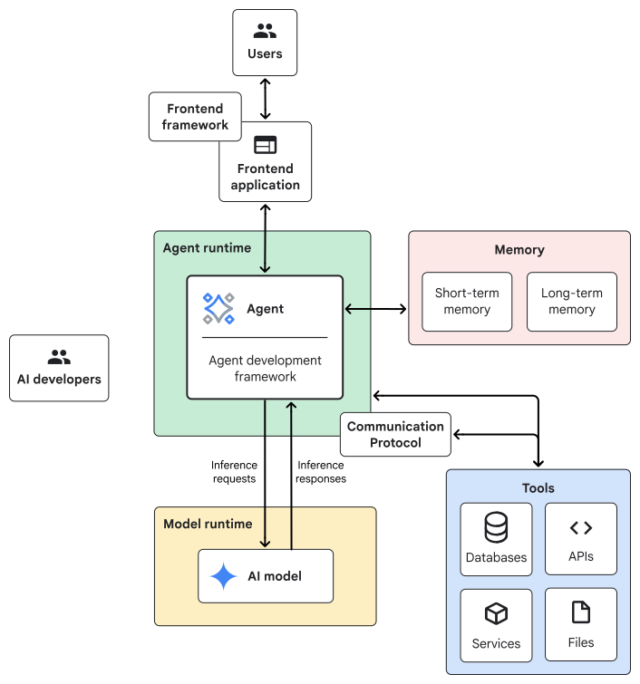
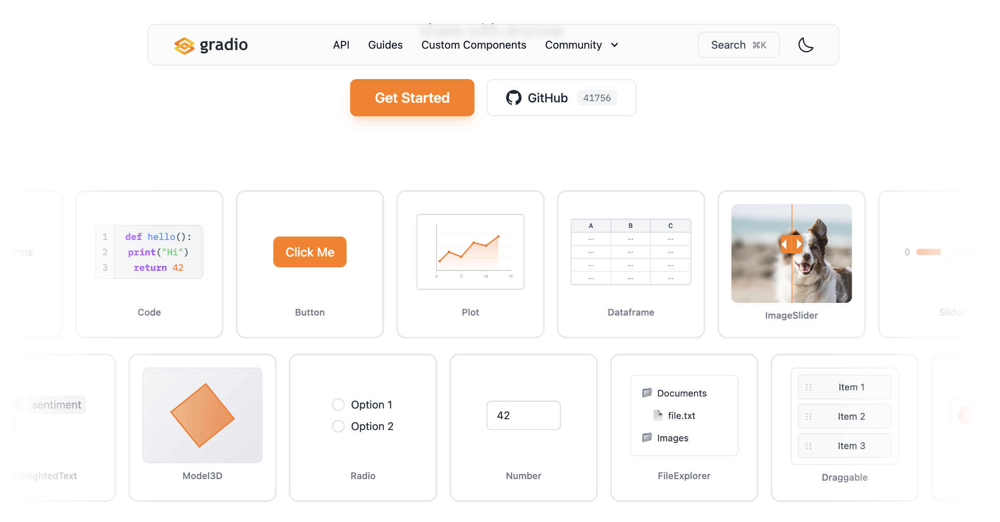
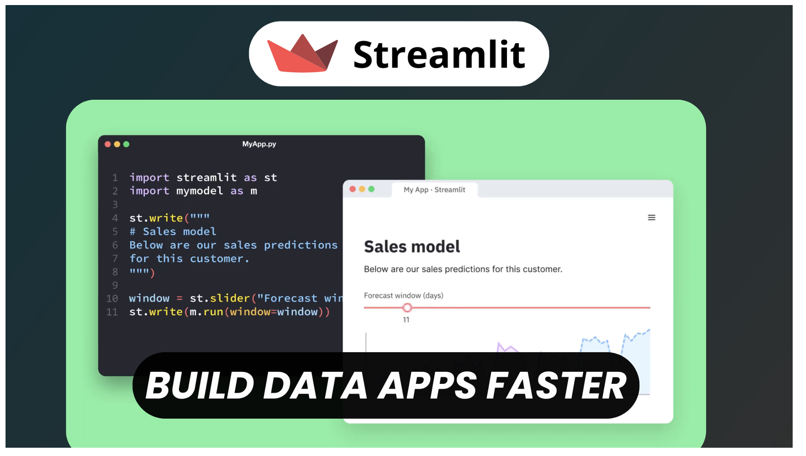
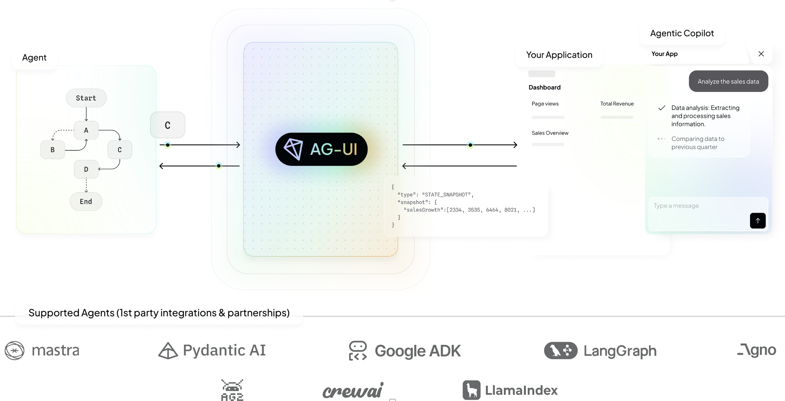
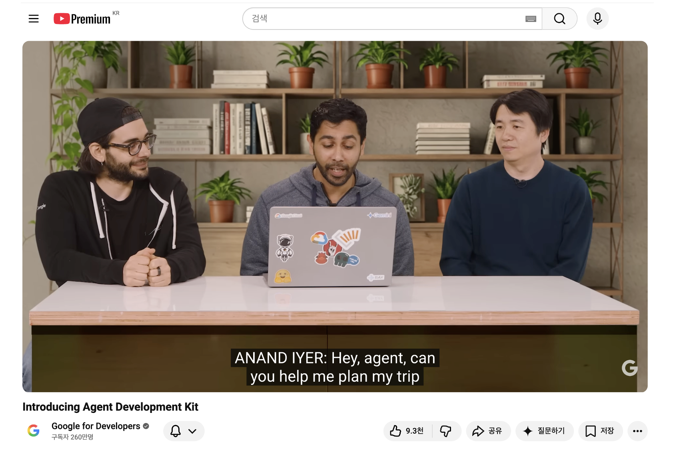
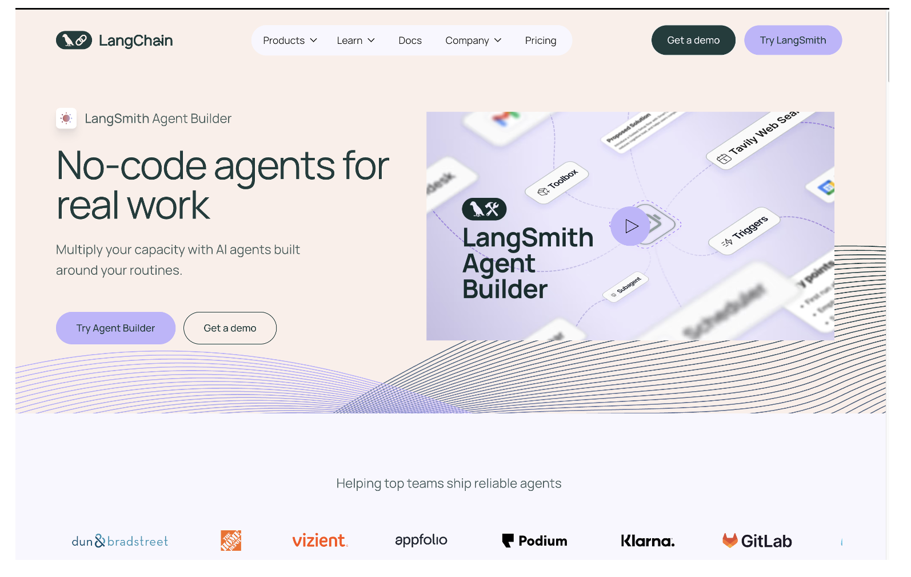

Agentic AI를 한 문장으로 정리하면, **사용자 의도를 이해하고 → 여러 단계 계획을 세우고 → 도구를 호출해 실행까지 끝내는** 자율 시스템이다.
단순히 “답변을 생성하는 모델”이 아니라, **계획(Planning)** 과 **도구(Tools)** 를 통해 실제 업무를 완료하도록 설계된 아키텍처인 것.

---

## 0. Agentic AI 아키텍처를 구성하는 큰 블록들

Google Cloud 문서에서 정의한, 에이전트 시스템 요소들은 다음과 같다.

- **Frontend framework**: 사용자가 대화/작업을 요청하는 UI
- **Agent development framework**: 에이전트 로직(루프, 상태, 도구 연결)을 만드는 프레임워크
- Agent tools: 검색, DB, 사내 API 등 “행동”을 수행하는 도구 묶음
- Agent memory: 대화/세션 상태와 장기 기억 저장
- Agent design patterns: 싱글 에이전트 vs 멀티 에이전트 등 구조 패턴
- Agent runtime: 에이전트 애플리케이션이 실제로 돌아가는 실행 환경
- AI models: 추론/의사결정 엔진(LLM 등)
- Model runtime: 모델을 서빙하는 인프라(관리형 API/컨테이너/GKE 등)

여기서 오늘의 주제는 이 중에서도 frameworks에 대해서 이야기 해보자.

## 1) Frontend framework: 사용자가 에이전트를 ‘쓸 수 있게 만드는 층’

Google Cloud 문서에서 정의한 **Frontend framework**는 “에이전트 앱의 UI를 만들기 위한 컴포넌트/라이브러리/도구 모음”이다.  
즉, 에이전트가 아무리 똑똑해도 **사용자가 입력하고 결과를 확인하는 인터페이스가 없으면 제품이 되기 힘듬.**
이게 왜 중요하냐면, Agentic AI는 “한 번 답하고 끝”이 아니라, **대화 중간에 계획을 바꾸고, 도구를 호출하고, 
중간 결과를 보여주고, 사용자 확인(HITL)을 받고, 다시 진행**하는 흐름이 많기 때문이다.

---
그렇다면, 사용되는 UI tool은 무엇인가.?

agent와의 대화와 실행되는 action의 결과를 사용자가 실시간으로 빠르게 확인할 수 있어야 한다.
따라서, 프로토타입/내부 데모용 UI는 보통 **Gradio, Mesop**처럼 “빨리 만들고 빨리 실험”하는 프레임워크를 쓴다. 
구현 속도가 빠르고, 백엔드도 단순하게 붙일 수 있어서 request–response 구조만으로도 충분한 경우가 많다. 
PoC, 연구 데모, 툴 연동 테스트에 특히 잘 맞는다.

반대로 외부 사용자에게 제공하는 **프로덕션 UI**는 **Streamlit, React, Flutter AI Toolkit**처럼 제품 수준의 프레임워크가 더 적합하다. 
이 경우 UI는 단순 입력/출력 창을 넘어서, **스트리밍 응답(토큰 단위 출력)**, 진행 상태 표시, 커스텀 컴포넌트, stateless API 설계, 세션/메모리의 외부화 같은 요구사항이 자연스럽게 따라온다. 
즉, “UI 선택”이 곧 “백엔드 아키텍처 요구사항”을 결정한다.
---

## 2) AG-UI: Frontend와 Agent를 “실시간으로 연결”하는 통신 레이어

여기서 등장하는 개념이 바로 **AG-UI(Agent–User Interaction protocol)**.
Google Cloud 문서에 따르면, AG-UI를 통해 Frontend 프레임워크와 AI 에이전트 간 실시간 통신을 관리할 수 있다고 설명한다.
AG-UI를 쉽게 풀면, 이런 기능을 위한 “약속(프로토콜)”이다. (이후에 설명되는 MCP와 비슷한 개념)
- 에이전트의 응답을 **언제 렌더링할지**
- 앱의 **상태(state)를 언제 업데이트할지**
- 필요한 경우 **클라이언트 측 액션을 언제 트리거할지**
를 약속하는 것이다.

## 3) Agent development framework: 에이전트 로직을 만드는 ‘뼈대’

그렇다면, 우리는 도대체 어디서 agent ai를 설계해야할까? LLM(뇌)와 사용자를 연결하는 AG-UI에 대해서 알아보았고,
이후에 다룰 팔 다리인 tools, skills and so on을 연결하고 해체하고 편집하는 공간이 있어야한다.
그 공간 이자 작업자의 팔레트가 바로 **Agent Development Framework**이다.

에이전트는 “무슨 일을 시키느냐”에 따라 구조가 달라진다.
어떤 에이전트는 도구가 2~3개면 충분하지만, 어떤 에이전트는 검색·DB·브라우저·코드 실행까지 여러 도구가 필요하다.  
메모리도 마찬가지다. 단기 세션만으로 되는 경우도 있고, 사용자별 장기 기억이 꼭 필요한 경우도 있다.
(즉, 사용자의 목적에 맞는 agent를 build할 수 있게 된다.)

이미 수많은 회사들이 자신이 build한 프레임 워크를 공개하고 있고, 그중 Google이 오픈소스로 제공하는 선택지가 **ADK(Agent Development Kit)** 다.
[Google ADK GitHub](https://google.github.io/adk-docs/)
(위 링크에 접속하시면 더 자세하게 제작 방법을 확인 할 수 있습니다.)

[Google Multi agent youtube](https://www.youtube.com/watch?v=pX0_iIfRilU)
위와 같이 google cloud 공식 youtube채널을 통해서, 기본적인 개념과 사용방식을 알 수 도 있다.

또 다른 선택지로는 **Langchain**이 있다.

Langchain은 LLM, 메모리, 도구를 연결하는 **체인(chains)**과 복잡한 작업을 자동화하는 **에이전트(agent)** 추상화를 제공하며,
특정 목적에 맞춰 프롬프트 템플릿과 도구를 조합하는 워크플로우를 빠르게 구축할 수 있다.
또한 벡터 검색, 데이터베이스, 브라우저, 코드 실행기 등 외부 서비스를 연결할 수 있는 **커넥터**와,
대화 세션을 관리하는 **메모리 저장소**(예: `ConversationChain`, `ConversationBufferMemory`)를 쉽게 추가할 수 있어,
에이전트에게 과거 대화를 기억시키거나 사용자별 상태를 유지시키는 것도 간단하다.
(이후에 langchain 을 따로 post할 예정.)

LANGCHAIN 을 이용하여 agent ai framework를 구현하기 위한 DOC는 아래에 접속하시면 있습니다!
[Langchian DOC](https://docs.langchain.com/langsmith/agent-builder)