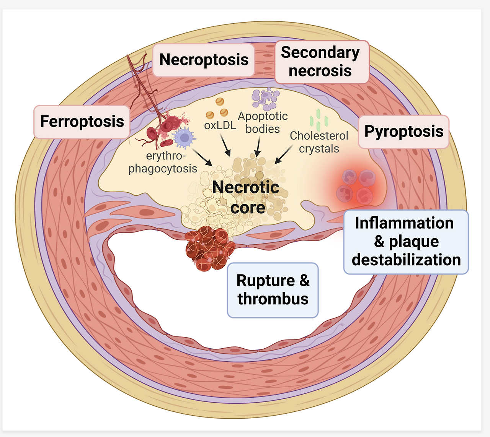

Source: [https://jeffdissel.tistory.com/165](https://jeffdissel.tistory.com/165)

[관상동맥 plaque]의 구성요소 1st part
석회화
에 대해서 먼저 알아보자.
[이번에 해결할 나만의 질문]
1. 칼슘 생성원리
2. 칼슘 생성 위치
3. 칼슘 모양, 종류
4.Plaque rupture에 영향을 주는 Ca 특징?
5. Medical Imaging tech to capture Ca
6. Mechanical Proerties of CA
e.g) Young's modulus, density, poisson's ratio.
first 간단하게 플라크(Plaque)란:

염증반응으로 인해서 혈관이 위와 같이 막히는 현상을
Artheroscierosis (동맥경화증)
라고 부르고,
막힌 혈관과 저 노란 물질 전체를 Stenosis,
그리고, 노랗게 쌓인 물질을
Plaque라고 부른다.
Plaque를 구성하는 요소는
Calcification, Lipid core, Fibrous cap
이렇게 크게 3가지로 나뉜다.
이번 포스터에서는 Calcification에 대해서 파혜처 보자.
(다음포스터에서 lipid core, cap)
1. progression

A
poptotic SMC(dead smc) + Osteoblast like(석회화 소포, called Matrix Vesicle)
-> Generate Micro Calcification
Apoptotic Foam cells
-> Generate Micro Calcification
Collection of Micro Calcification
-> Sheet Calcification
[머리속에 드는 질문]
lipid core안에서 지금 미세석회화가 생기고,
거기서 뭉친다고 한다.
그렇다면, Fibrous cap에 존재하는 석회화는
Lipid core에서 위로 이동한 건가? 아니면 거기서 생성된건가?
Specifically, 석회화는
Inside of the Matrix Vesicle (소낭)
Ca과 phosphoric Acid
Condensation
-> Hydroxyapatite 형성
(뼈 치아 구성 즉 칼슘 구성요소)
> Micro calcification
여기서 중요한점은
세포가 사멸하면 Matrix Vesicle 이 생긴다는 점이다.
즉, fibrous cap을 구성하는 SMC(평활근 세포), collagen, Elastin들 중
염증반응으로 인해서
SMC가 사멸
하게 되면,
Fibrous cap안에서도 미세석회화가 생길 수 있다.
#Fibrous cap Calcification이 중요한 이유.
바로 그 부분이 혈액에서의 압력과 가까운 부분이기 때문에,
응력이 집중되는 곳이므로 파열 위험도가 굉장히 크다.
2. 칼슘생성 위치.

일단 크게 두 종류로 나눌수 있다.
A. Intima (내막) 석회화
B Adventia, Media (중막,외막) 석회화
우리가 분석하고 있는 염증작용으로 인해 발생하는
플라크는 전부 내막에서 생긴다.
따라서, Plaque rupture와 관련이 있는 칼슘은 A임을 알 수 있다.
B의 경우 (Aging, Diabetic, Smoking etc..으로 생기는 석회화로)
Plaque rupture보다는 Vessel stiffness에 관여하는 석회화이다.
결론적으로 A의 경우가 cirtical하다(우리의 관심사)
-Neotic core Calcification - on B
-Collagenous Calcifcation(large Ca) on B
- Fibrous Cap Spotty Calcifation(Micro Ca) on A
3. Calcifcatino Morphology

Micro or Fragment Calcification (0.5 - 15um)
Fragment Calcification (1 - 5mm)
Sheet Calcification (ring shape, - stable plaque)
Nodualr Calcification (Sheet Ca가 기계적 파괴로 발생), 가장 위험
4. most critical calcifiaction on plauqe rupture
Fibrous Cap Calcificaiton
Nodular Calcifcation
즉 혈관 내벽과 가까이에 있는
석회화 파편(뭉쳐있지x) 들이 가장 위험하다.
(응력을 모으기 때문에)
5. Medical imaging
CT(computed tomography)를 이용한 칼슘 점수 매기는 방법을 실제 의사들은 사용.
아가스톤 점수 즉, HU 로 점수 파악(CT에서 밝기(빛 투과도)로 밀도를 정량화)

(위 CT사진에서 흰색이 칼슘)
IVUS (IntraVAscular Ultrasound)로 촬영한 Calcifcation lumen, 혈관내에 초음파 기기를 삽입하는 측정방식.

E같은 경우 섬유모자가 파괴되어 Thrombosis가 생긴 경우이다.
Exact medical image of the different types of Calcifciation
a) micro calcifcation(Only can be captured by OCT)

b) Spotty calcifcation(Only can be captured by OCT)

B case is the Spotty Calcifcation
c) sheet calcifcation(Only can be captured by OCT)

6. Mechanical Properties
Chemical Structure: (Hydroxyapatite, Ca₁₀(PO₄)₆(OH)₂)
[Reference medical image capabilities]

Sakamoto, A., Cornelissen, A., Sato, Y., Mori, M., Kawakami, R., Kawai, K., Ghosh, S. K. B., Xu, W., Abebe, B. G., Dikongue, A., Kolodgie, F. D., Virmani, R., & Finn, A. V. (2022). Vulnerable Plaque in Patients with Acute Coronary Syndrome: Identification, Importance, and Management.
Radcliffe Cardiology
.
https://www.uscjournal.com/articles/vulnerable-plaque-patients-acute-coronary-syndrome-identification-importance-and?language_content_entity=en
