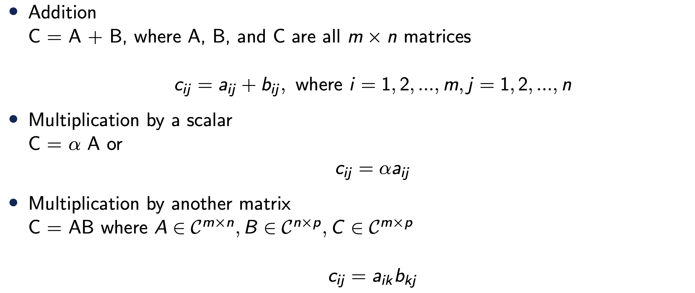
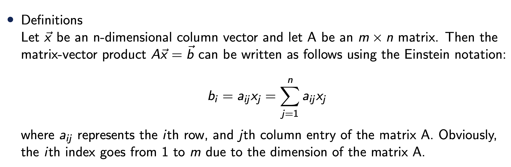

Source: [https://jeffdissel.tistory.com/m/219](https://jeffdissel.tistory.com/m/219)

1. Intro - Numerical Linear Algebra
Numerical Linear Algebra에서
우리가 하고자 하는 것은.
물리법칙으로 세운 다음과 같은 지배 방정식의 해 x를 구하는 것.

굉장히 간단해 보이지만,
상황에 따라서 푸는 방식이 달라야 하며,
유일한 해가 존재한는지 수많은 해가 존재하는지도 확인해야한다.
간단한 용어들부터 정리하고 넘어가자.
A is a m x n matrix.
m = n 인 경우 -> square system
m > n -> Overdetermined system
m < n -> underdetermined system
이라고 부른다.
rank of A
-> determine uniquness of the solution.
지금부터 우리는 위 matrix equation을 어떻게
컴퓨터를 이용하여 해를 구할지 여러 방법론에 대해서 다룰 예정이다.
깊게 들어가기 앞서서
학부시간에 배웠던 Linear algebra에서 필요한 개념들을 다시한번 훑고 넘어가자.
========================================================
기본적인 addition, multiplcation of scalar and matrix는 다음과 같다.

대학원 수업을 들어야 이해가 됬던 부분은 바로 이 부분이다.
vector = 2nd order tensor * vector

'텐서는 어떠한 벡터를 다른 벡터로 mapping하는 도구
'라고 생각하면,
모든게 쉬워진다.
즉 위의 식에서 Matrix A는 벡터 x를 b로 mapping하는 연산자이다.
여기서, 또다른 중요한 개념은
range of Matrix

즉 A 행렬의 column vector들의 선형결합으로 만들 수 있는 모든 모든 벡터들의 집합이 바로
range(A)
위 개념을 이용해서 우리가 풀고자하는 Ax = b Matrix equation을 다른 각도로 접근해보면,
A의 column vector (a1 ... an )의 선형결합을 적절히 해서 b를 찾는게
Ax = b에서 해를 구하는 과정이라고 할 수 있다.

즉 A의 열벡터를 어떻게 선형결합을 하면 b를 얻을 수 있을까??
의 답을 하는 과정이 x를 구하는 과정이라는 것.
반대로 null(A)는 열벡터의
선형조합으로 0 벡터
를 만드는 모든 x의 집합을 null(A)라고 한다.

더하여, A (m x n Matrix) 에서 A가 full rank라면 n개의 독립적인 column 이 있어야 한다.

자 위에서 배운 개념들을 토대로, 이제 우리가 풀고자하는 Ax = b
Matrix Equation을 살펴보자.
A의 역행렬이 존재하면
Non singular
, otherwise
singular

우리는 A와 b를 가지고 uniquness of solution을 결정할 수 있다
그리고 아주아주 중요하게
n x n Square Matrix A 가 Full rank라는 말은 다음과 동치이다.
(frequently 등장)
- A is nonsingular (has inverse Matrix)
- rank(A) = n
- null(A) = 0
- range(A) = Cn
- det(A) is not zero
- 0 is not an eigenvalue of A
이후에 굉장히 굉장히 많이 등장하는 Norm of Vector

- Norm of Matrix
(여러 정의들이 존재한다. 그 중에서 자주 쓰이는 두가지 정의를 마지막으로 살펴보자)

