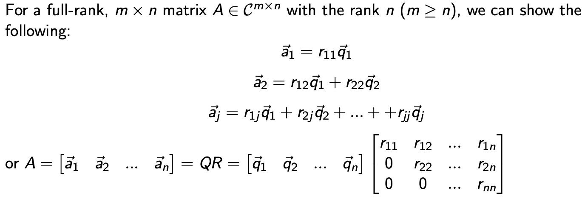
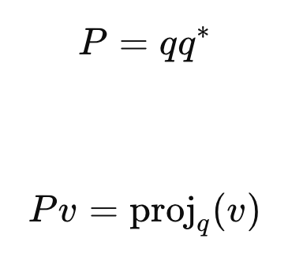
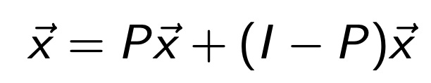
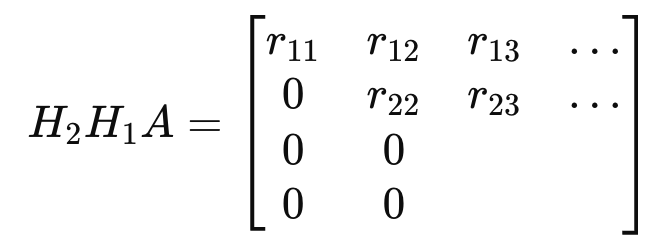
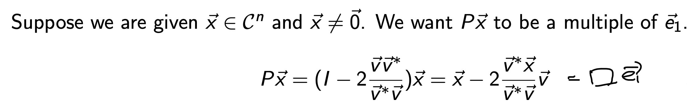
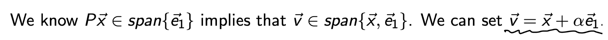
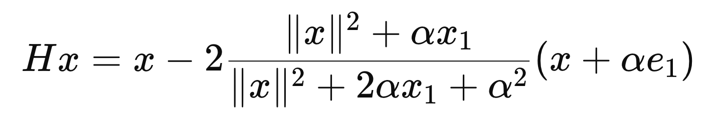
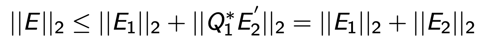

Source: [https://jeffdissel.tistory.com/m/221](https://jeffdissel.tistory.com/m/221)

2. QR factorization - part2 (Householder)
지난시간에 QR 분해의 기본적인 원리에 대해서 살펴보았다.
(정확히 본질을 이해하면, QR분해가 아무것도 아니라는 것을 알게 된다)
그러니까, 어떤 A라는 matrix의 column vector들을,
range(A) Basis vector{q1,q2....qn}
들로 바꾸어 표현하는 것이 QR 분해이다.

실제로 컴퓨를 활용해서, QR분해 를 하는 과정도 지난포스터(Part1)에서 살펴보았고,
Gram schemdit Algorithm을 사용하였다.
기본적인 원리는
a1 -> q1을 먼저 설정하고,
a2에서 q1의 성분을 제거하고, q2를 정의
a3에서는 q1,q2성분을 제거 q3를 정의
하는식으로 구성하여, 전체적으로 모든 기저벡터들이 서로 orthogonal 하도록 제작.
위 순차적인 과정을 하나하나 Matrix Equation으로 표현한다면,
첫번째 과정은 다음과 같이 a1을 q1으로 구성하고,
a2 ... an에서 q1성분을 전부 제거하는 matrix eqaution으로 표현가능하다.

즉 위는 q1을 전부 제거해주었다면,
이제 q2 ... qn을 연속적으로 전부 제거해주면
우리가 원하는 Q가 나오게 된다.

이제 오늘 포스터의 메인인
Gram schemdit 다음으로 더 효율적인
Computational Algorithm인 HouseHolder를
살펴보자.
#Householder
그 전에,
우리가 지난 시간에 스쳐지나가면서 배웠던,
Projector (P) Matrix와 Reflector에 대해서 복습을 하고 넘어가자.
# Projector (P)
계속해서 말하지만, tensor는 mapping이다.
v1 = tensor * v2
는 v2를 v1으로 mapping 전환하는 것.
먼저, 고등학교때 배웠던 Projection의 개념
Proj q (v) 는 v에서 q벡터 방향 성분을 추출하는 것.
따라서, 내적한 스칼라값 * q = Proj q (v)

스칼라 값이므로, 우리는 q를 옮겨서 tensor로 만들어 주자.
(전환이 이해가 안간다면, 간단한 예시로 확인해보자)

이제 우리가 계속해서 보던 mapping formulation으로 전환되었다.
(vecotr = tensor * vector)
우리는 q q* 를 Projector Matrix라고 부르고, 기존 벡터를
q벡터 방향으로 Mapping해주는 역할을 한다.

여기서 어떤 임의의 x벡터를 우리는 P를 이용하여 다음과 같이 q방향성분, q와 수직인 성분으로
쪼갤 수 있다.

# Reflector(Q)

여기서 reflector라는 개념이 등장한다.
바로 x벡터를 P와 수직인 space를 기준으로 reflection해주는 것.
추상적인 개념이지만, python code로 plot해보면 쉽게 이해가 간다.

P와 수직인 성분 (null(P) space) 를 기준으로 Mirror , reflect the x vector.
왜 이런 거울을 만든 것일까...
는 Householder algorithm을 자세하게 살펴보면 알 수 있다.
#House holder Algorithm
과정은 다음과 같다. 먼저 Householder reflector를 정의한다.

(방금전에 다루었던, reflector에서 qq* = vv* / ||v|| 으로 바꿔서 표현만 한것)

여기서 refelctor에서 v를 우리는 적절히 설정하여,
여기서 A에다가 곱해주면, 첫번째 column vector가 r11 e1.
즉 e2,e3.... en 은 전부 존재하지 않도록 만들어준다.

이제 또다른 새로운 reflector를 만든다.
(또 적절히 v를 설정해주는게 핵심)

적절히 만들어서, 위의 H1A에 곱해줬을때,
두번째 column vector의 3,... n성분들이 전부 0 이 되도록 만들어준다.

위 방식을 n번 반복하게 되면 우리는
다음과 같이 H1 = Q1 , .. Hn = Qn으로 바꾸어서 표기하면,
우리가 원하는 QR factorization을 달성.

자 그렇다면, 당연히 마음속에서 드는 질문은
적절한 v설정이란 어떻게 하는 걸까??? 라는 것이다.
그 부분에서 지금부터 다루어보자.
첫번째 H1을 제작할때 우리는 e1성분만 남기고 싶은게 목표였다.
(P = H1, 여기서 householder reflector 입니다!)

즉 v는 x, e1의 선형결합으로 이루어졌다는 사실.
이를 Px식에 대입해주면,

(이제, 우리의 관심사는 alpha값이 얼마일까? 라는 것)
유도해보자.

(v = x + alpha e1을 위 Householder Matrix에 대입을 해주자)

우리는 Householder Matrix를 곱하고 e1성분만 남게 만들고 싶다.
따라서, x 성분의 계수 = 0 이 되도록하는 alpha를 구하면 됨.

(위 식 = 0, 전개)

최종적으로 alpha는 x의 norm임을 알 수가 있다.

(보통 부호는 x의 부호를 따라가는게 수치적안정성을 유도한다고함)
바로 예시로 다시한번 확인해보자. ||x|| = 6이기 떄문에, v를 구할 수 있고,
이를 가지고 Householder Matrix를 구하면 다음과 같다.

(자 그렇다면 이런 질문이 당연히 떠오를 것이다.
방금 위의 과정은 e1성분만 남기는 과정이고,
H2,H3 .. Hn을 연이어서 제작하려면, e2,.. en성분을 남겨야 하는데??)

우리가 분해할 행렬 A (m x n)
첫번째 H1을 구하기 위해서, 사용한 x는 다음과 첫번째 열 벡터였다.

두번째에서는 두번째 열벡터중에서도, 두번재 row부터 column vector x로 설정한다.
(여기서 핵심이 바로 이것 a22부터 첫번째 요소로 설정하면,
현재 설정한 column vector의 e1 -> Global e2)

따라서 householder 연산을 할때는 local basis를 기준으로,
연산을 진행하고, 마지막에 global basis기준으로 전환을 해준다.
(global 전환은 마지막 stage에서 설명)
위 설정규칙을 수학적 기호로 표현하면 as follows:

전부 같은 원리로 v = x + alpha e1이며, alpha = ||x||2

(e1을 그대로 사용해도 괜찮다는 것이 핵심)
kth HouseHolder Matrix는 다음과 같이 표기가 된다는 것.

즉 k에 따라서 H의 dimension이 다르게 된다!!!!
마지막에 이제 우리는 QR factorization을 위해서 원래 global Basis로 전환해주면 다음과 같이,
I를 이용하여 Qk를 형성할 수 있다.

예를들어서 전체 4*4 행렬에서 Q3은 다음과 같이 전환.

Pseudo code로 작성한 Householder 알고리즘은 다음과 같고,

전체 연산 count는

loop를 n번 반복하므로, 전체 연산은 m,n에 대한 함수로 다음과 같이 나타낼 수 있다.

여기서 생각을 해보면, Householder Algorithm으로 우리는
A -> H1... HnA -> R
최종적으로 R을 도출하였다.
따라서, Q는 R을 통해서 계산을 해주어야함.
(두가지 알고리즘이 존재)

여기서 Householder Algorithm의 핵심은 오차 증폭이 일어나지 않는다는 점이다.
지난시간에 Gram - Schemdit Algorithm에서
floating 수치적 오차로 인해서, 정확히 Q가 완벽한 Orthogonal vector로 구성되지는 않는다는 점을 확인했다.
같은 원리로, Householder algorithm에서도 곱셉연산시 에러가 발생하며,
밑의 예시는 2번 곱할때 2개의 에러가 발생하는 상황.

이때 우리가 E2 = Q1 * E2'으로 분해하면, Q2Q1으로 묶어서 하나의 에러 E로 치환가능하다.

여기서 핵심은 하나의 에러로 치환한 E의 norm을 보면,
각 에러의 합보다 항상 작거나 같다.

따라서, Gram schemdit algorithm에서 처럼,
곱셉으로 인하여 에러가 증폭되는 일은 발생하지 않는다.
