Source: [https://jeffdissel.tistory.com/m/226](https://jeffdissel.tistory.com/m/226)

4. Eigen Value Problems - Part1
선형대수학에서 무조건 나오는 내용이고,
처음에 이해하기 어려운 내용이 바로
"고유값,고유벡터,고유값 분해"
개념이다.
다시한번, 빠르게
리뷰
를 해보도록 하자.
Square Matrix A
가 존재한다고 하자.

밑의 행렬 방정식의 해
x
를 우리는 고유벡터,
그때의
λ
(scalar)를 고유값이라고 한다.

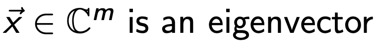

(저게 왜 쓸모 있을까? 에. 대한 답변을 하기 위해)
기하학적으로 무슨 의미인지를 이해해보자.
위 식의을 다시 살펴보면,
(2nd order tensor) * vector1 = vector2
계속해서 언급하지만, tensor의 역할은 mapping이다.
즉, vector1 -> vector2로 mapping해주는 역할이다.

다시 위 식을 보면, A는 mapping역할로 x를 전환해주었지만,
크기만 다르고 같은 방향의 벡터로 mapping이 되었다.
(so what?)
즉 어떤 기저벡터가 2차원 평면에 있다고 했을때,
기저벡터들을 이런식으로 scale만 바꿔주는 역할을 한다는 것.

수학적 정의에 대해서 정확히 기억하고 뒤에 이야기를 들어 가야한다.
eigenspace, eigenvector,
spectrum of A (eigen value 집합)

자 이제, 우리의 목표의 다음목표는
A의 eigen value를 구하는 것.
Ax = λx 를 만족하는 lambda : z라고 미지수로 설정하면,
우리는 다음의 characteristic polynomial Eq 을 세울 수 있다.

Polymoial Equation
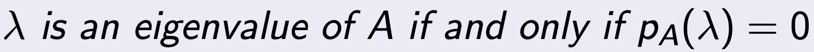

여기서 드는 질문은,
왜 우리가 eigenValue를 구해야하는가????
우리의 원래 목적은 Ax = b를 푸는 것인데??
(라는 질문이 pop up 할 것이다.)
바로 eigenvalue를 활용한, eigenvalue decomposition으로
A를 분해 할 수 있기 때문이다.
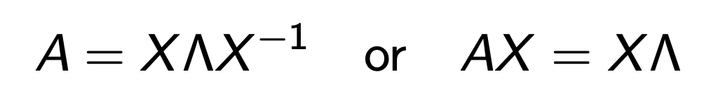
X: matirx composed with Eignen vectors
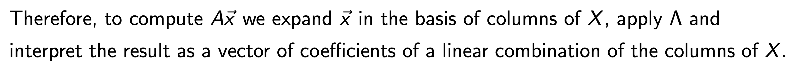
따라서, 우리가 풀고자하는 문제를 다음과 같이 재 표현할 수 있다.
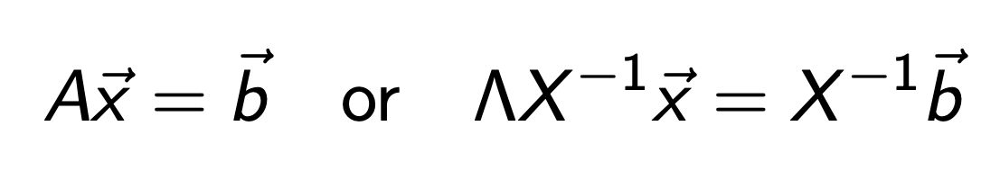
여기서 우리가 새로운 y 백터를 다음과 같이 정의해주자.

이후에 대입해주면, y를 쉽게 구할 수 있게 된다.
(다시 x를 쉽게 구할 수 있음 위 식으로)

=================================
but Here's a Problem.

우리가 중학교때 배웠던 근의 공식으로, 2차,3차 polynomial Eq의 해는 구할 수 있지만,
4차부터는 일반적인 해의 form이 존재하지 않는다.
(In other word, direct method to solve above Eq은 존재하지 않고,
iterative Method를 사용해야한다는 것)
따라서, 오늘은 Iterative Method로 어떻게 Eigenvalue를 구할 수 있는지,
알고리즘들을 살펴보자.
Let
A
∈
C
m
×
m
.
For simplicity, let’s assume A has a set of
m
linearly independent eigenvectors
⃗
v
1
, ⃗
v
2
, ..., ⃗
v
m
which must then form a basis for
C
m.
그리고 eigen value들을 오름차순으로 정렬하여 index를 붙혀주자.
|
λ
1
| ≥ |
λ
2
| ≥
...
≥ |
λ
m
|
여기서 새로운 정의가 나온다.
If
|
λ
1
|
>
|
λ
2
|
,
λ1
is called the dominant eigenvalue and
v
1
is called a dominant eigenvector of A.
갑자기 왜 가장큰 eigenvalue에 집중을 했는지를
머리속에 넣고 밑의 글을 읽어보자.
어떤 임의의 x벡터를 eigenvector들의 선형결합으로 표현하자.

위식의 양변에 Matrix A를 곱해주고, Eigenvector의 성질을 이용해서 eigenvalue 식으로 치환해주자.

여기서 계속해서 A를 곱하는 이유는, λ1 이 가장 크다는 사실을 이용해,
곱하면 곱할수록,
괄호안의 eigenvector들의 선형결합속에서 v1의 영향력이 더 커지게 된다
( λk / λ 1 <0 when k >2, 나머지는 계수들이 점점 작아지므로)
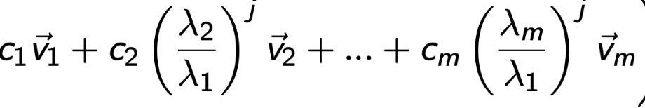
다시 돌아가서 j번째 A를 곱했을때의 식 양변을
λ
1 j 로 나누어 주자.

그리고 c1v1을 옆으로 넘겨주면, 좌항이 의미하는 것은 k번째 곱해진 벡터에서 v1성분을 제거한것.
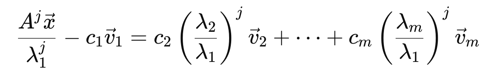
위 식을 부등식으로 다음과 같이 표현가능하다.

좌항이 정확히 어떤 의미를 함축하는 지를 정확히 이해해야한다.

(j를 곱하면 곱할수록 v1성분만 남게 되므로, 위 식은 0에 가까워지게 된다)
따라서, 잔차 residual이라고 할 수 있다.
그리고 그 잔차는 비율에 비례한다.

위 식을 다시 수학적으로 표현해보면, 가장큰 eigenvalue에 대응하는 eigenvector v1에 대해서

정규화된 q1을 정의하면, k번 곱해진 vector vk는 결국 q1에 수렴할 것이고, 그 에러는 다음과 같이 표현된다.
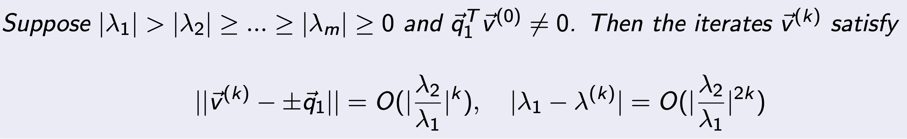
우리는 이 알고리즘을 Power method라고 부르며, Pseudo code는 다음과 같다.
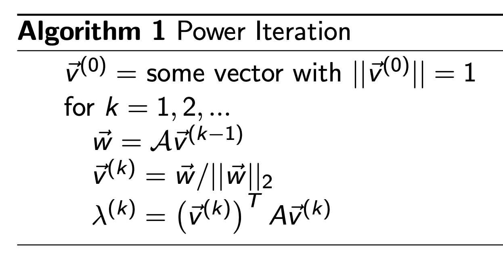
Residual 이 특정이하로 떨어질때까지, 계속해서 반복하여, A를 곱해준다.
예시로 정확히 이해해보자.
Power Method로 A matrix의 dominant eigen value 구하기.

x0 = [1, 1] T 부터 시작.
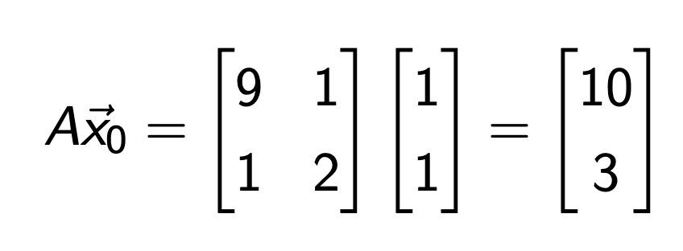
즉,
λ1
1st iteration = 10 이므로,
10으로 다시 나누어 주자.
그리고 다시 A를 곱해주자.

이제
λ1
2nd iteration = 9.3이므로,
9.3으로 나누어 주고 다시 A를 곱해주자.
쭉 진행해주면, Dominator(
λ1
) 과 x가 수렴함을 알 수 있다.
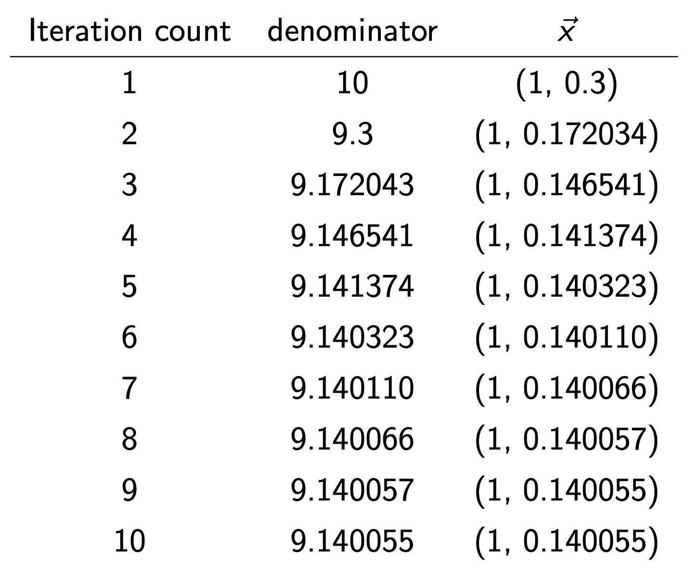
=============================================
위의 power method에서 한발짝만 더 나아가 보자.
Power Method
는 잘 생각해보면, Dominant Eigen Value (가장 큰 절댓값)과 그에 대응하는 고유벡터를 찾는 데 유용하다.
하지만 실제로는 가장 큰 고유값 이 아니라, 어떤 특정한 값 μ 근처의 고유값과 고유벡터를 알고 싶은 상황이 존재.
위의 경우 해결책:
Inverse Iteration (Shifted Inverse Iteration)
단순히 기존 characteristic Eq에서 양변을 u v로 빼주면,
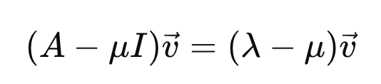
따라서, A가 역행렬이 존재하는 nonsingular square matrix라면, 다음 성질을 만족한다.

위 성질을 그대로 power method에 이용하면, 우리는 가장 큰
λ1
을 이용한 powermethod에서
우리가 원하는 특정한 값 mu 와. 가까운
λ
를 기준으로 powermethod의 변형을 적용가능.

Pseudo Code는 다음과 같고, 정확히 Power method 에서
A ->
(A - μI)

=============================================
정말 마지막으로
Similiarity
의 개념을 살펴보자.
우리는 밑의 관계식을 만족한는 Matrix X가 존재하다면,
"two matrices A and B are similar"
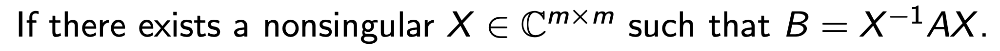
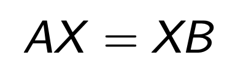

근데 simliar 하다는게 왜 특별할까?
"Similarity does not change the eigenvalues"
—so we can replace a “hard” matrix by a
simpler similar matrix
(triangular, Hessenberg, tridiagonal, diagonal) and keep the spectrum.
For instance, A와 X가 다음과 같다면,

같은 Eigen value를 가지는 B를 만들 수 있고, Diagonal Matrix이므로, 이후 연산이 쉬워진다.

한편, A와 B가 같은 Eigenvalue를 가지는 것은 다음과 같이 쉽게 증명할 수 있다.

그렇다면, eigen vector도 같은가??
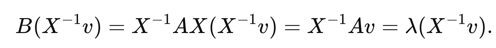
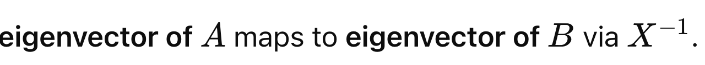

(X의 역행렬의 곱한 벡터로 mapping되는 것을 알 수 있다)
=============================================
자 이제 Similiar 조건을 다양하게 적용해보자.
Definition: "two matrices A and B are similar"

1. Diagonalizable A
만약 A가 m개의 독립적인 eigenvector(v1...vm) 를 가지고,
그에 상응하는 eigenvalue로 diagonal Matrix를 만들면,

우리는 다음과 같이 A,D가 Similiar Matrix라는 것을 알 수 있다.
(B = D , X = V 인 상황)

2. Unitary Simlilar (X = U)
Similiar Matrix에서 X is unitary 라면, (U*U = I)

더해서, column Vector들이 서로 수직이라면 Q: Orthogonal Matrix

Similiar Matrix에서 X is Orthogonal Matrix Q 라면,

위 의경우, A와 B의 norm이 같기 때문에 수치적안정석으로 추후에 실제로 굉장히 많이 쓰임,
(추후에 등장)
3. Spectral Theorm (Hermitian case)

고유값분해와 동일한 원리이지만, Hermitan 인 경우는 U* = U-1이므로,

(columns of
U
are orthonormal eigenvectors, entries of
D
are real eigenvalues)
첫장에서 배웠지만, A* 는 Conjugate matrix로 complex number를 포함한 A의 대칭행렬이다.
실수 영역에 대해서 우리는 symmetric이라고 부르며, 위의 Spectral decomposition을 다음과 같이 표현가능.

이 분해방법들을 다룬 이유는
추후에 나올 Ax = b를 iterative method로 푸는 과정에서,
연산을 쉽게해주는 방법론으로 사용되기 때문이다!!.
