Source: [https://jeffdissel.tistory.com/235](https://jeffdissel.tistory.com/235)

우리가 지금까지 무엇을 하고 있는지 간단히 정리해보자.
1. 우리의 목표는 선형 방정식 Ax=b 푸는 것
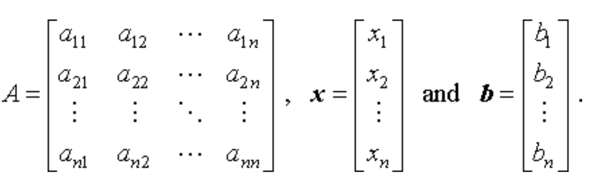
2. 가장 단순한 방법은 x=A−1 b , 이 방식은 A 가 nonsingular 한 경우에만 가능하다.
게다가 역행렬 A−1 을 직접 구하는 것은 계산량이 크고 수치적으로 불안정하다.
3. 따라서, 우리는 직접 역행렬을 구하지 않고, 아래의 분해 방법을 통해 문제를 푼다.
(지금까지 배운내용)

4. 실제 계산은 모두 컴퓨터 위에서 이루어지기 때문에,
이론적으로는 Ax=b이지만, 실제로는 A(x+e)=b 와 같은 오차가 항상 존재한다.
5. 즉, 우리는 계산 효율을 높이면서도 오차 e 를 최소화할 수 있는 알고리즘 을 선택해야 한다.
여기까지가 지금까지의 여정이고,
오늘은 본격적으로
연산의 안정성
에 대해 살펴볼 것이다.
안정성은 크게 두가지 관점으로 바라볼 수 있다.
1. Conditioning
: perturbation behavior of a mathematical problem
(핵심은 수학적 모델로 부터 파생된 오차의 perturbation)
(A+e)x' = b 의 해 x'
Ax = b의 해 x
즉, ||
x'- x||
가 e의 증가에 따라 얼마나 큰지를 나타낸다.
2. Stability
:
Stability pertains to the perturbation behavior of an algorithm
used to solve the problem on a computer
(여기서 핵심은 우리의 알고리즘으로 부터 파생된 오차의 perturbation)
우리가 사용하는 모든 알고리즘은 certian float까지만 저장할 수 있다.
따라서, 무조건 오차가 존재한다.
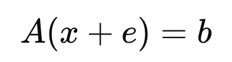
위 해가 Ax = b와 얼마나 다른지이다.
둘다 똑같아 보이지만, 정리하면 (오차의 근본이 다른 것)
Conditioning - 수학적 문제 자체에서 오차에 민감정도,
Stability - 알고리즘 자체에서 floating 오차에 민감정도
=== === === === === === === === === ===
이제 수학적으로 분석해보자.
Normal vector 집합 X, Y가 있고
Mapping해주는 연속적인 함수 f가 있다고 하자.

여기서, 하나의 데이터 x를 추출해보자.

우리의 관심은 간단하다, x를 살짝 바꿨을때, f가 얼마나 바뀌는지를 보는 것.

f가 많이 바뀌면 ill conditioned problem.
수학기호로 표현하면,
δx는 perturbation of x
그때 δf는 corresponding perturbation of f

우리는 그 비율이 궁금하다 x가 변할때 f가 많이 변하면, ill conditioned Problem이라고 정의했으니,
판단 기준으로 그 비율을 정의하는 것은 자명하다.
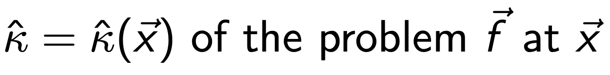
Condition Number kappa (function of vector x)
#Definition of Absolute Condition Number
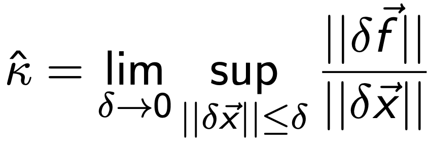
sup을 보고. 당황할 필요가 없다.
x, f둘다 벡터이기 때문에
df/dx = Jacobian Matrix.
따라서,
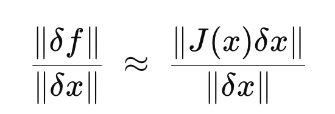
따라서, Absolute Condition Number는 다음과 같이 표현된다.

위 표현은 사실
Operator Norm of Matrix
의 정의이다.
====================================================
#Operator Norm of a Matrix

Definition of Operator Norm of A
어렵지 않다. 어떤 임의의 벡터 x가 있다고 가정하자.
그랬을때,
Matrix A의 역할은 Mapping
이다.
즉
x -> Ax
로 전환을 하는데
그 전환된 norm과 원래 norm의 비율의 최대값을 ||A||라 정의한다.
Norm 에도 종류가 많지만, Eculidean norm의 경우,
||x||2 = 1이라고 가정하면,
||Ax||2는 변환된 벡터의 길이를 의미한다.
즉, 얼마나 길어졌는가 그 정도를 ||A||2
norm of A로 정의하는 것.
====================================================
다시 돌아와서,

위 값이 의미하는 것을 정확히 예시로, 이해해보자.
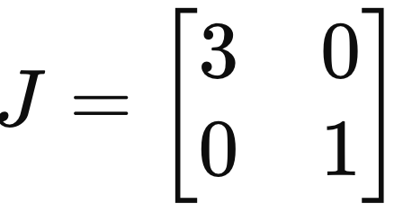
Jacobian Matrix
여기서 우리는 perturbation of x를 다음과 같이 정의해보자.
(즉, 방향 θ 에 따라서 perturbation이 다르다는 것!)

Condition Number를 정의대로 구하기 위해 구해보면, 다음과 같이
θ
에 관한 함수로 나온다.

즉 sup는 supreme의 약자로, 가능한 방향중에서 가장 큰값을 의미한다.

따라서, 가장 큰 값은
θ
= 0 일때 이므로, Absolute Condition Number = 3임을 알 수 있다.

재미있는 사실은 이는 2nd norm of J 와 동일하다는 것을 알 수 있다.

============================================
즉 tensor Mapping개념을 또 사용해보면,
x -> Jx 의 벡터 변환은 Elongation and Rotation of vector x이다.
여기서 아래 식이 의미하는 것은 그 중에서 stretching 정도를 의미한다.

============================================
결론적으로 우리는
Absolute Codition Number : Norm of Jacobian Matrix
임을 증명하였다.

여기서, 실제로는 Relative Condition Number를 다음과 같이 더 많이 사용한다.
(f(x), x로 normalize 진행)

예를들어, 다음 이차함수의 형태일 때,
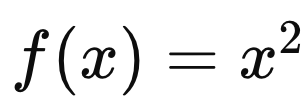
Absolute condition number = 2x이다.

즉, x가 커지면 무조건 k(x) 증가하는 선형관계이다.
However!!
컴퓨터로 연산을 할때 우리는 대부분, scaling을 진행한다.
다음과 같이 두 문제가 있다고 가정하자.

컴퓨터 입장에서는 동일한 문제이다.
하지만, Absolute Condition Number는 앞도적으로 좌측이 클 수밖에 없다.
따라서, relative Conditon Number로 출력값과 입력값으로 Normalize를 진행해준다.

실제로 relative Condition Number를 사용함.
=======================================
자 지금까지 Condition Nubmer의 정의에 대해서 다루었고,
이제 우리가 풀고자 하는 문제에 적용해보자.
Ax = b = f(x)
f(x) = Ax라고 설정하고 Relative Condition Number를 정의대로 구하면,
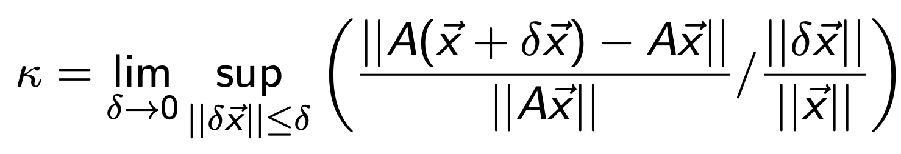

이므로, supreme은 등호가 성립할때 이다.

Relative Condition Number when f(x) = Ax
재미있는 사실은 A is square and Non singualr Matrix의 경우 역행렬이 존재하므로,
A-1을 기준으로 operator norm을 정의가 가능하다.
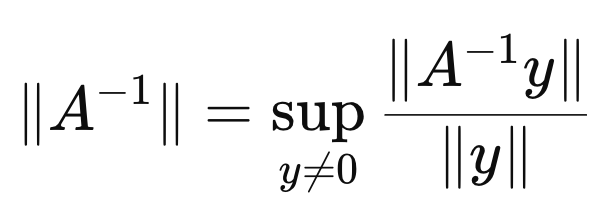
Definition of operator Norm
supremer기호이므로, 아래 부등식이 성립한다는 것.

따라서, Relative Condition Number는 다음처럼 표현가능하다.

=======================================
여기서 이번에는 perturbation of vector b를 중심으로 연산해보자.
즉, x의 perturbation과 b의 perturbation의 관계식을 도출해보자.
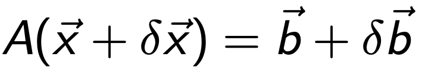
Equation 1.
why?
f(x) = b라고 설정하면, 안정적인 시스템은 다음과 같기 때문이다.

단 A is Non singular이라는 가정으로 시작하자. (역행렬 존재)
위 식에서 Ax = b를 빼면 다음 식 도출.
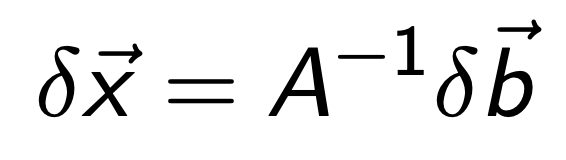
Equation 2.
norm의 정의를 활용하면, 다음. 부등식 도출가능.

Equation 2b.
여기에 우리가 풀고자 하는 식 Ax = b를 같은 원리로 부등식으로 바꾸어 주자.
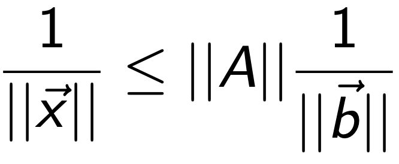
Equation 3
Eq 3 과 2b를 곱해주자.

perturbation of x 와 b의 비율사이에 새로운 Condition Number를 다음과 같이 정의하자.

Condition Number of Matrix A
즉, k(A)가 크다면, perturbation of b가 작더라도,
perturbation of x가 클 수 있다.(ill conditioned)
Vice versa, well conditioned.
여기서 k(A)의 성질에 대해서 하나씩 살펴보자.
1. Best condition of A is when k(A) = 1
||A|| ||A-1|| >= ||A A-1|| = ||I|| = 1
이므로,
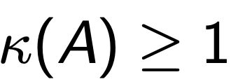
k(A) = 1 is the best conditioned.
2. When A is singular

우리는 non singular가정으로 위. k(A)를 진행하였다.
따라서, singular인 경우는 k(A) 를 무한으로 정의해주자.
3. Max Singular Value of A
A가 어떤 Matrix이던지 Singular value Decomposition이 가능함을 우리는 배웠다.
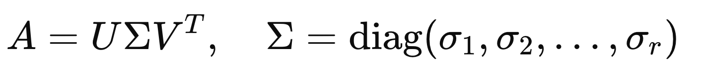
U,V are orthogonal MAtrix and sigma is diagonal fill with singular values of A
Operator Norm의 정의는 다음과 같았고,

Definition of Operator Norm of A
그 중 Eculidean Norm은 다음과 같이 정의가능하다.

Euclidean Norm of Matrix A
즉 A는 단위벡터를 elongate하는데 가장 크게 elongate할 수 있는 비율이 얼마인지를 나타낸다.
여기서 SVD시간에 배웠다 싶이, A에서 elongation을 나타내는 부분이 바로 Singular Value of A
||A||2의 정의 자체가 가장 최대로 elongation할 수 있는 값이므로,
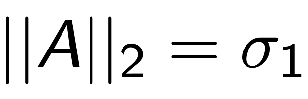
maximum singaulr value of A
역함수의 경우 singular value또한 inverse이므로, 가장 큰값은 sigma가 가장 작을때 일 것이다.
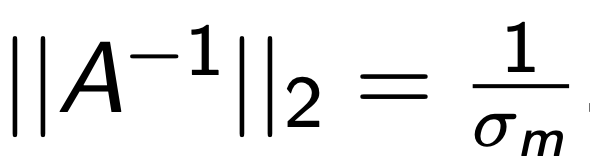
σm : smallest singualr Value of

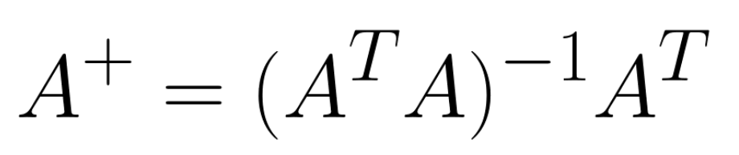

