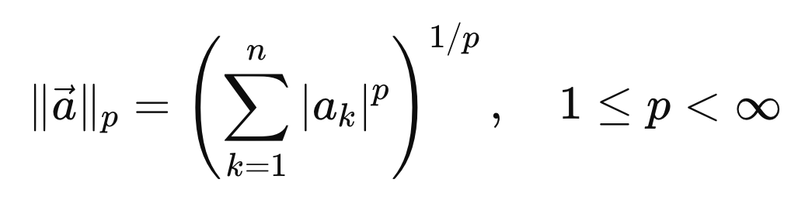
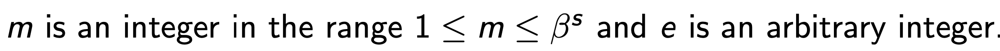
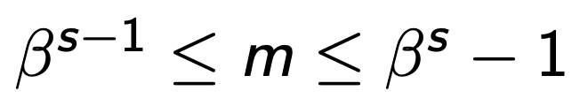
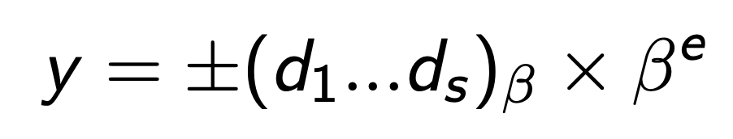
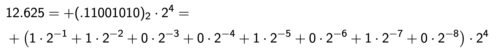
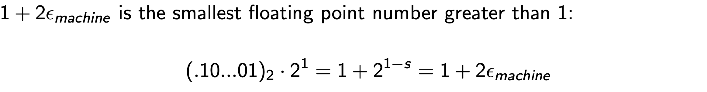
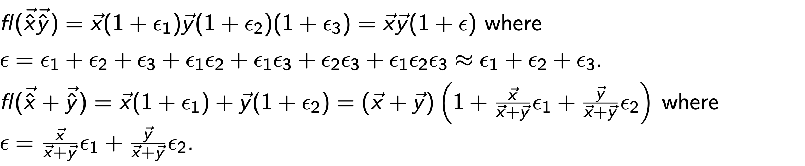
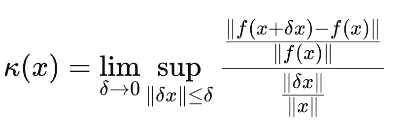
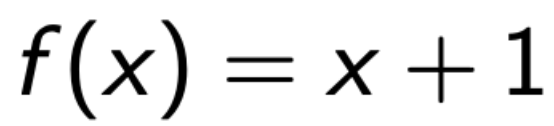

Source: [https://jeffdissel.tistory.com/m/236](https://jeffdissel.tistory.com/m/236)

Ch6. Conditioning and Stability - part2
지난시간에 Condition Number의 formula에 대해서 자세하게 다루었다.
핵심을 요약하자면,
Non singular Matrix A
에 대해서
다음과 같이 정의하였다.

지난시간에 다루지는 않았지만, p norm을 활용하여, condition Number를 정의할 수 도 있다.

Definition of p_norm
(Eculidean norm 은 p = 2인 경우)
p norm을 활용하여, 우리가 column vectors들의 p norm의 차이로 condition Number를 다음과 같이 정의할 수 있다.

즉, 쉽게 생각해서
column vector들의 norm의 차이가 크다면 -> k(A) 증가 -> ill conditioned
여기서 한가지 재미있는 사실을 예제를 통해 살펴보자.
다음의 A가 있고 아래 Ax = b를 푼다고 가정하자.

Ax = b to be solved.
singular Value of A = 1, e이므로, condition Number는 다음과 같다.

즉, e -> 0 으로 갈수록 ill conditioned 된다는 것이다.
여기서, A와 b 앞에 D를 곱해주자
D = diag ( 1 , 1/ ε)

저렇게 문제를 scaling한다면, k(A) = 1로
well conditioned problem으로 전환되는 것을 알 수 있다.
즉, 적절한 Matrix D를 곱해주면,
Condition Number 조절이 가능하다는 것.
그렇다면 적절한 D는 무엇일까?
-> 이후 블로그 내용으로 살펴보자.
================================================================
지금부터는, 컴퓨터에 정보 저장관점에서
에러가 얼마나 생기고 왜 생기는 지를 살펴보자.
컴퓨터는 비트(0,1)로 데이터를 저장하기 때문에, data type에 따라서 저장 max, min값이 한정적이다.

따라서, 저장할 수 있는 소숫점의 자리수(유효숫자,s)는 한정적이므로 반올림을 밑의 규칙으로 진행해준다.

5일때는 알고리즘에 따라 올림할 수 도 있고, 유지할 수도 있다.
더 자세하게 표현할 수 있는 모든 숫자는 아래의 form으로 구성된다.

general form( s: is a precision, 유효숫자)

x에 대해서, 유일한 (m,s,e,beta)를 만들기 위해서,
m의 범위를 다음과 같이 규칙을 세워주어야 한다.

복잡해 보이지만,( beta진수) 로. 표현한 것이다.
(조금더 친근한 form으로 전환하면 다음과 같다.)

beat = 16진수 일때, 예시
example) 12.625를 나타낸다고 했을때, s =8, beta = 2, e = 4 로 다음과 같이 표현된다.

우리가 흔히 말하는 32비트라는 것은, 여기서
부호: 1bits
지수항: 8bits (e_max = 128, e_min = -125)
소수항: 23bits (s_max = 24)

64bits는 다음과 같이 더많은 숫자를 저장할 수 있게 된다.

자 지금까지 컴퓨터에서 숫자를 어떻게 저장하는 지를 알아보았고,
이제 우리의 진짜 관심사인
Error
에 집중해보자.

general form of number
우리는 연속적인 모든 숫자를 저장할 수 없다.
discrete number들만 저장할 수 있고,
여기서,
최소한의 숫자사이의 간격 : delx
를
우리는 다음과 같이 표현할 수 있다.

위 표현을 가지고 우리는
machine의 error
를 다음과 같이 정의하자.
error = (1과 바로 다음으로 큰 숫자사이의 거리)/2

ε machine = 2 − 24 ≈ 5 . 96 × 10 − 8 for IEEE single precision
ε machine = 2 − 53 ≈ 1 . 11 × 10 − 16 for IEEE double precision.
2진법을 사용하기 때문에, 1다음으로 큰 숫자는 1+2
ε_machine 임을 알 수 있다.

다시말해,
컴퓨터의 저장공간상 ,
x = 1 다음 저장가능 숫자는
x = 1+2ε_machine
따라서, 그 사이의 숫자는 반올림되어야 한다.

Therefore, 다음의 반올림규칙으로 컴퓨터에 저장한다.

fl(x)는 저장된 숫자.
뿐만아니라, Arthimetic연산을 할때도 다음과 같은 규칙으로 에러가 생성된다. (원인, 불연속적인 저장방식)

예를들어서, 곱셈과 덧셈을 할때 똑같이 컴퓨터에 (1+e)를 곱한 크기로 저장이 된다.

(재밌는 사실은, 여기서 마지막 덧셈에서 x = -y 에 굉장히 가깝다면,
에러가 굉장히 크게 나올 수 있다는 점!, aka catastrophic cancellation)
자 이번 chapter에서 배운 내용들을 마지막으로 정리해보자.
방금 전에 배운 내용은, 컴퓨터의 저장방식으로 인해서
저장하는 값의 오차가 발생함을 다루었다.
1. Accuracy (how accurate the function value is)

함수의 오차가 e_machine과 같은 order인가? -> 정확도
즉, 우리가 구하고 싶은 함수값의 오차가 e_machine과 같은 magnitude order인지를 확인해야한다.
(다시말해 Accuracy를 확인해야함)
지난 블로그에서 다룬 내용은 Ax = b에서 작은 perturbation에 우리가 구하고자하는,
식이 얼마나 바뀌는지를 알아보았다.
2. Stability (how algorithm handle the perturbed x)

오차가 섞인 x~ (perturbed x)의 함수값의 오차 -> stability
즉, perturbed x -> x~ 가 얼마나 바뀌는 지를 Stability라고 위와같이 정의한다.
뿐만아니라 perturbed x로 인해 함수값이 얼마나 바뀌는 지도 확인하자.
3. Backward Stability

여기서, stability를 역으로 구하는 방법도 존재한다.
1. 함수오차와 같은 오차를 만드는
perturbed x
를 찾는다.
2. 그리고 그 perturbed x의 peturbation이 order of e_machine인지 확인한다.
실제로 대부분 가장 안정적인 Backward Stability를 사용한다.
그리고 Definition of Condition Number를 활용하여, 다음과 같이 Order연산가능.

Definition of Condition Number
예시로 살펴보자. 다음 함수를 정의하자.

Floating Error로 인해서 실제 저장된 값은 다음과 같으므로,

floating error of the function is as follows:

따라서,
Accuracy
of the function is as follows:

