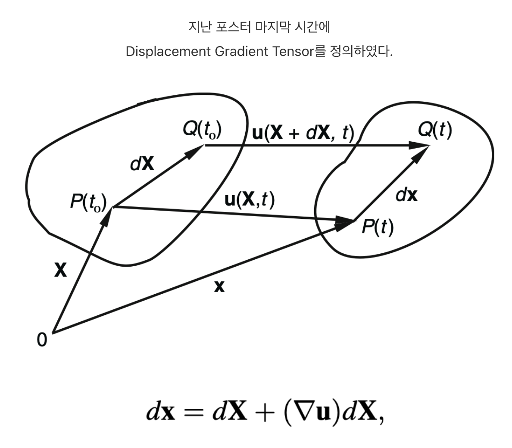
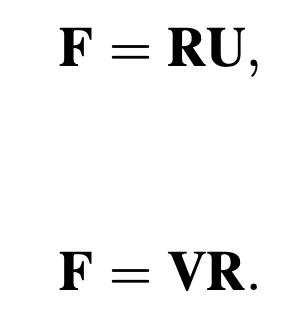
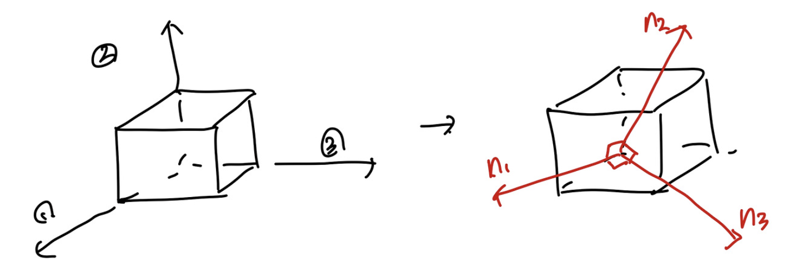
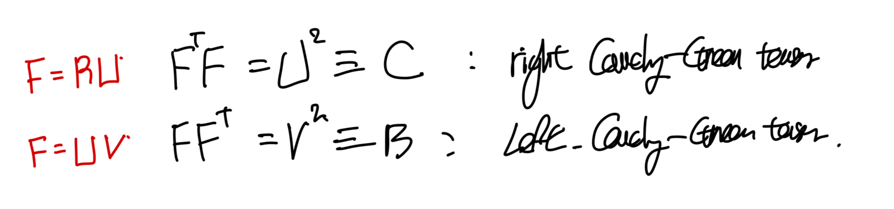
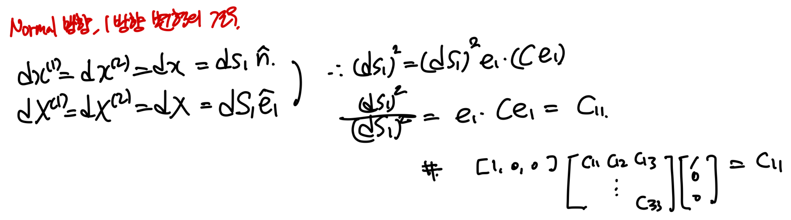
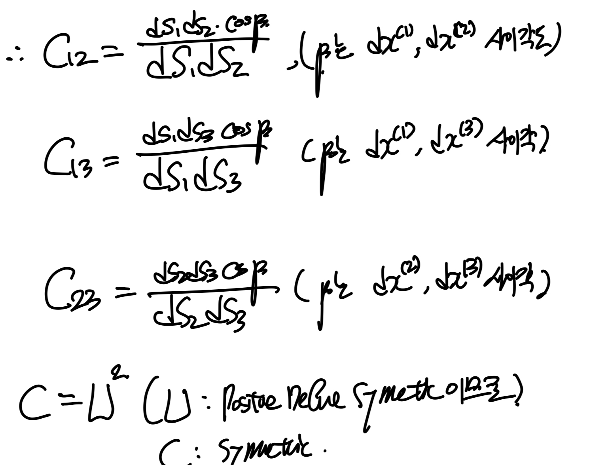

Source: [https://jeffdissel.tistory.com/m/156](https://jeffdissel.tistory.com/m/156)

Ch1 Kinematics-part2 (F,C)

위 식의 우항을 dX로 묶으면 다음과 같이 표현 가능하다.

여기서 연속체역학에서
가장 기본적이고 중요한 tensor
가 등장한다.
바로 dX(t = 0 길이벡터, 변형전 길이벡터) 를
dx(t= ta 길이벡터, 변형후 길이벡터)로
변형시키는 2nd order Tensor, F 이다.
(다시말하지만, 변형전 길이벡터를 변형후로 만드는 텐서
즉
변형시키는 텐서
라고 이해하면 좋다.)
여기서 F를 다음과 같이 두가지 방식으로 분해할 수 있다.

U: right stretch tensor
V: left stretch tensor
R: orthogonal tensor.
(U and V are positive definite symmetric tensors)
여기서 독자는 질문2가지가 pop up할 것이다.
왜 변형텐서를
위 두가지 텐서로 쪼개었고,
각각의 물리적 의미는 무엇일까?
두 질문을 한번에 해결하기 위해
(U,V)와 R의 각각의 텐서를 살펴보자.
_________
1. U and V, right and left stretch Tensors
U,V의 경우 Positive Definite Symmetric Tensor이므로,
Symmetric tensor
의 특징에 따라서,
U or V를 밑의 사진처럼,
각각의 eigen vector의 방향으로 바꾸어 표현하면(고유값분해)
Diagonalized Matrix로 전환 시킬 수 있다.

즉, U,V행렬은
고유벡터 방향
으로 고유값만큼 deformation했다는
정보를 담고 있는 텐서라는 것.
2. R: rotation tensor
Simply,
F에서 stretch 정보들을 모두 U와 L이 담고 있으니,
남은 정보인 회전변형의 정보는 R이 담고 있게 된다.
ex) F = RU decomposition case.
t = 0 에서 원형의 material이,
시간이 흐른후 타원으로 바뀐 경우를 살펴보자.

위의 경우 eigen vector(PB, PA)임을 한번에 알 수 있다.
why?
변형후에도 변형전과 방향이 일치 하기 때문.
(PB // P'b, PA // P'a)
여기서, 회전이 없는 경우,
R = I 인 경우를 살펴보자(F = U)
즉,
eigenvector방향
으로 각각 늘어나고 수축하였고,
이
두 기저벡터들로 이루어진, PQ벡터
(dX)를 살펴보면,
P'q(UdX)로 stretching하였음을 알 수 있다.
따라서, 우리는 U가 stretching정보를 담고있는 텐서임을 확인하였다.
여기서 만약에 R이 존재한다면, 밑 그림처럼.

P'q가 P'Q'으로 회전함을 알 수 있다.
중요한 것은 R은 Orthogoanl matrix이므로
길이 변화에 대한 정보는 담고 있지 않다.

벡터의 크기는 변환후에도 기존벡터와 일정함.
F = RU로 분해시켜주면,
여기서 우리는 F^T F 연산을 통해서 U를 쉽게 유도할 수 있다.

지금까지는, dx = F dX
즉, 변형 전후 벡터가 어떻게 변화하는지 살펴보았고,

우리는 FT F = C 로 새롭게 정의해준다.
F = RU or LV 두가지 방식으로
분해할 수 있음을 우리는 학습하였고,
이를 통해서 각각 Right, left cauchy-green tensor(C,B)를 정의할 수 있다.

이제 다음단계로 C와 B가 물리적으로
어떤 의미인지 살펴보자.

F의 정의 그대로 사용한후, 두 벡터를 내적해주자.

C = FT F
여기서, normal 방향으로 변형 길이를 살펴보기 위해
dx와 dX 1,2방향이 같다고 가정하자.

즉, 우리는 C의 대각성분이 각 방향으로의
변형후 길이/ 변형전 길이 = stretch ratio
를 의미함을 확인할 수 있다
(이는 C = U^2 인 것과 이어지는 것도 알 수 있다)

이제 off diagonal term of C를 분석하기 위해 (1),(2)방향이
변형전에 수직
이었다고 가정하자.

내적을 통해서 길이 변화를 살펴보기 위해서
dX,dx를 각각벡터의 단위벡터와 길이로 분해한다.

이를 다른 방향들에도 적용시키면 다음과 같이,
각 변형후의 사이각과 변형길이 비율에 따라서 결정됨을 확인하였다.

