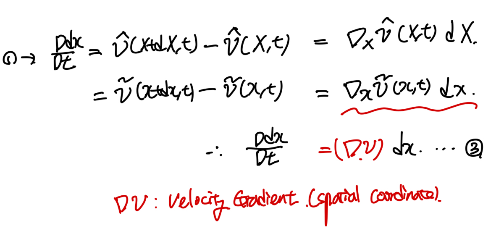
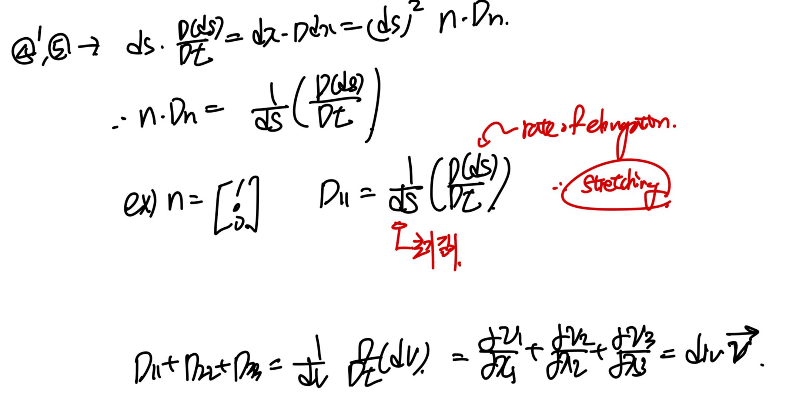

Source: [https://jeffdissel.tistory.com/155](https://jeffdissel.tistory.com/155)

part1,2,3 에서는 변형전과 후를 비교하기 위해서,
material coordinate(before deformation)
spatial coordiante(after deformation)
을 정의하였다.
지금까지는 공간변화에 대해서 tensor들을 정의하였고,
이번에는 시간의 변화에 따른
deformation을
위 개념들을 가지고 정의해보자.
먼저 변형 전후, 아주 작은 길이 dX,dx를 밑 그림과 같이. 정의하자.

그랬을때 우리는 두개의 속도 벡터를 각각의 coordinate에서
정의할 수 있다.
즉 둘다 같은 물체의 속도를 의미하지만, 분석하는 coordinate가
다른 경우이다.
1번 식에 위 두가지 정의한 속도벡터를 대입해주자.
이중에서 우리는 지금부터 Spatial Coordinate 속도 벡터를 사용 할 것이다.
(우리가 측정한 속도값은 대부분 spatial coordinate이기 때문)

이 속도 gradient의 물리적 의미를 자세하게 분석하기 위해서,
Symmetric Antisymmetric part로 쪼개 주자.
(Antisymmetric matrix : WT = -W)

Configuration of 3*3 tensor, D and W.
속도라는 개념은 시간당 변위이다.
따라서 변위의 값을 얻기 위해 dx를
단위벡터와 그 벡터의 크기 ds로 정의해주자.
그리고 ds에 관한 식을 얻기위해 dx를 내적해준다.
이후 밑의 식에서 D/Dt(material derivative)를 통해서
미분을 진행해주면,

위의 식을 보면 Antisymmetric property로 인해서,
D항만 남음을 알 수 있다.
다시 dx = ds n 을 대입하여 주면,

D의 물리적 의미는,
초기 미소 길이에 대하여 rate of elongation을
의미함 을알 수 있다.
우리는 이것을
Stretching
이라고 칭한다.
그리고 D matrix의 diagonal term의 합을 통해서
div (v) 즉 Velocity gradient tensor도 유도가능하다.
L = div v, Velocity Gradient Tensor
로 정의한 후, 우리가 part2에서 정의한
Deformation Gradient Tensor(F)로
밑의 과정을 따라 정의해보자.

생각보다 간단하다.

이 Relationship은 추후에 쓰이므로,
이런게 있구나 로만 기억해두자.
