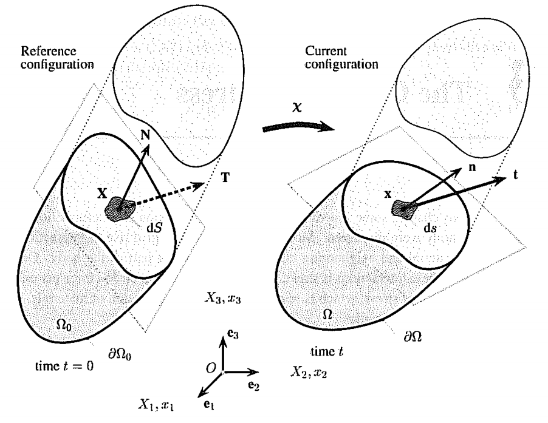
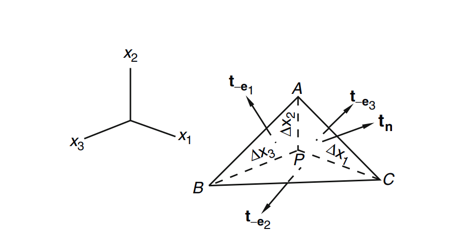
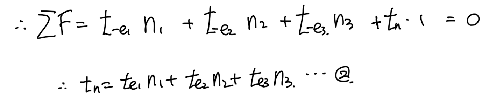
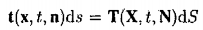
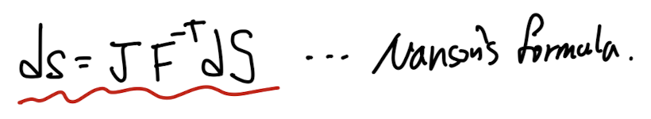
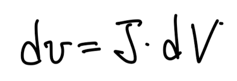

Source: [https://jeffdissel.tistory.com/158](https://jeffdissel.tistory.com/158)

So far, in Chapter 1.
Kinematics
연속체의
motion, deformation
에 대해서만 분석하였다.
사실 그 motion과 deformation을 유도하는 것은,
연속체에 가해지는
'힘'
인 사실.
지금 부터는 연속체에 가해지는 힘의 두 종류(body,surface force)중에서
surface force를 분석하도록 하겠다.
Surface force(표면력)을 정의하기에는
Surface의 면적의 곡률이 존재하기 때문에
면적 정의, 측정에 어려움이 있다.
따라서, 우리는 다음과 같이 Stress를 정의한다.

연속체에 Surface force가 가해지는 상황.
Δ F: Resultant force
Δ S: Surface Area

Cauchy traction vector정의.
여기서 핵심은, Force자체가 벡터이기 때문에,
Stress도 벡터임을 명심하자.
그리고, 힘은 어떤 면적에 작용하지만,
stress는 그 면적을
0으로 수렴시켰으므로,
어떤 임의의 점 P에서 작용한다.
저렇게 간단하게 stress를 정의하였지만,
우리는 Ch1에서부터,
변형전과 변형후로 나누어서 생각해야함을 알고 있다.
(면적, 법선벡터... 들이 모두 바뀌기 때문에)

왼쪽: 변형전, 오른쪽: 변형후
변형전, 후 작용한힘은 같을 것이고,
그때 면적이 달리지기 때문에 traction vector도
다르게 정의된다.

t: Cauchy Traction Vector
(변형후, Spatial coordinate)
T: 1st Piola-Kirchhoff traction vector
(변형전, Reference coordinate)
여기서 정말정말 중요한 개념이 등장한다.
Linearity of Traction vector.

위 figure에서, 법선벡터의 방향이 반대로 바뀌면
그대로 stress vector도 반대로 바뀜을 알 수 있다.
(뉴턴 3법칙의 작용반작용)
따라서, 우리는 stress vector와
법선벡터가 linear한 관계에 있음을 알 수 있다.
t(x,t, n) = -t(x,t,-n)이므로
아직 감이 안오신 분들을 위해서,
더 자세하게 증명해보겠다.

tetrahedrone material.
위와 같이, 사면체의 미소물체가 있다고 가정하자.
알자힘 = ma 뉴턴2법칙을 사용하면,

여서 우리는 단위길이 delta x 를 0으로 수렴시켜 굉장히
작은 상황을 가정할 것이다.

재밌는 사실은 부피가,
면적보다 더빨리 0으로 수렴한다는 것이다.

따라서, 우리는 1식의 우항을 0으로 설정할 수 있다.
면적비율을 단위벡터 성분으로 표기할 수 있으므로,

1번식에서 2번식으로 정리 할 수 있다.

여기서 우리가 traction vector와 n(법선벡터)가 linear 한 관계다라고
가저을 한후, 2번식에 대입해주면, 성립함을 확인할 수 있다.

따라서, 우리는
각 stress vector와 normal vector는 linear 관계에 있다 라고 가정하고,
각각 tensor와 normal vector(법선벡터)와의 식으로 다음과 같이 나타낸다.

σ : Cauchy stress tensor
(변형후, Spatial coordinate)
P: 1st Piola-Kirchhoff stress tensor
(변형전, Reference coordinate)
중요한것은, 새롭게 정의한 것은 tensor라는 것이다.

새롭게 정의한 tensor들을
처음의 force와 stress관계식에 대입해주자.

여기서 우리는 nds 와 NdS의 관계식을 통해서
두 stress tensor의 관계를 유도할 것이다.
#먼저 nds, NdS 관계식을 유도해보자.

Nanson's Formula

변형전, 후 미소 면적과 법선벡터.
변형전후, 부피변화(part4에서 다룸)

두 변형전후, 부피변화를 연립해주면,

Relationship between Cauchy stress and 1st Piola-Kirchoof Stress tensor
이번 포스터에서 다룬 내용은 정말정말 제일 중요한 내용이므로,
요약을 하고 다음 포스터로 넘아보도록 하자.
#Summary
물체에 가해지는 힘(df)은 변형 전, 후 동일하다.
하지만, 변형전, 후 힘이 작용하는
미소면적은 변화
하므로,
어떤 면적을 기준으로 하느냐 에 따라서, stress vector는 달라지게 된다.
stress vector = Force / Area ( Area -> 0) 이므로
( Cauchy stress definition)

dS: 변형 전 미소면적, ds: 변형 후 미소면적
즉, T는 변형전, t는 변형 후 Traction vector이다.
(여기까지는 벡터이다)
하지만 여기서 우리는 Traction vector가
'면적의 법선벡터와 linear하다' 라는 관계식을 이용해서
Traction vector = Stress tensor * Normal Vector
핵심은 왼쪽의 Cauchy stress tensor는 변형 후를 기준
오른쪽의 first piola kirchhoff tensor는 변형 전을 기준
임을 잊지 말자.
가장 흔히 쓰이는 Cauchy stress tensor는 3*3형태이고,
다음과 같다.

