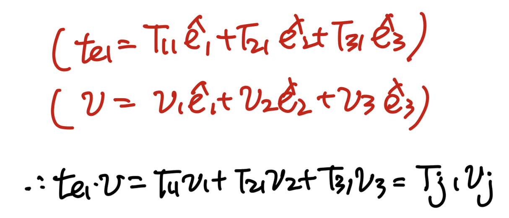
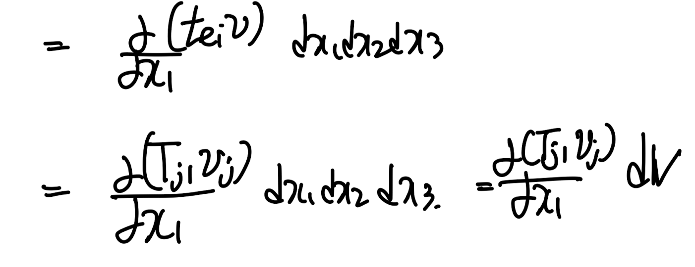
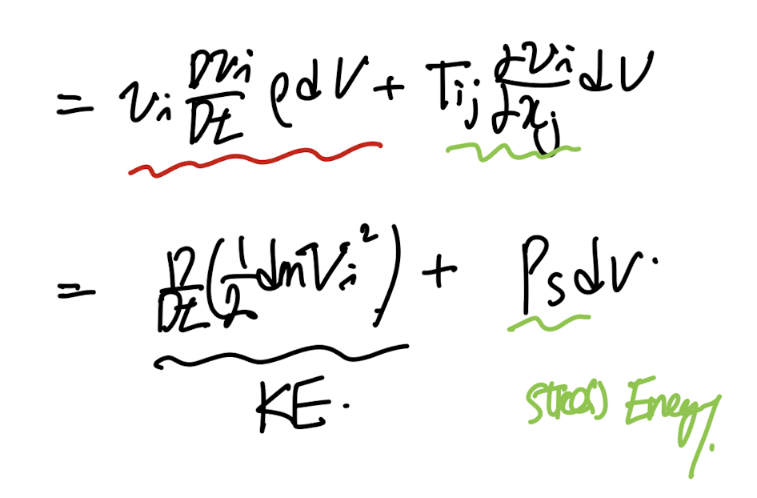
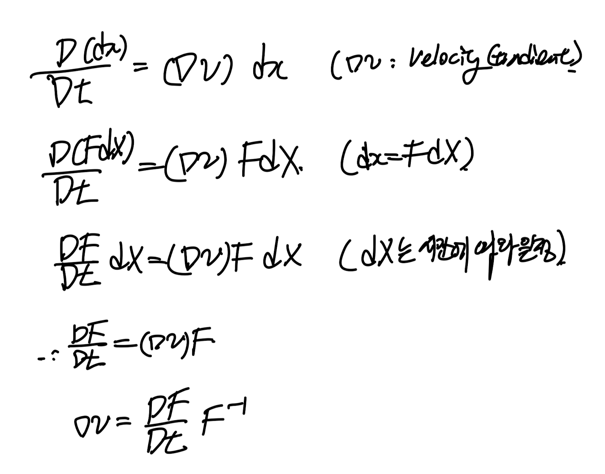
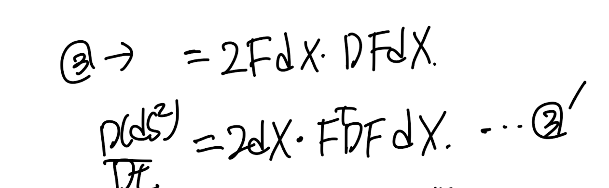
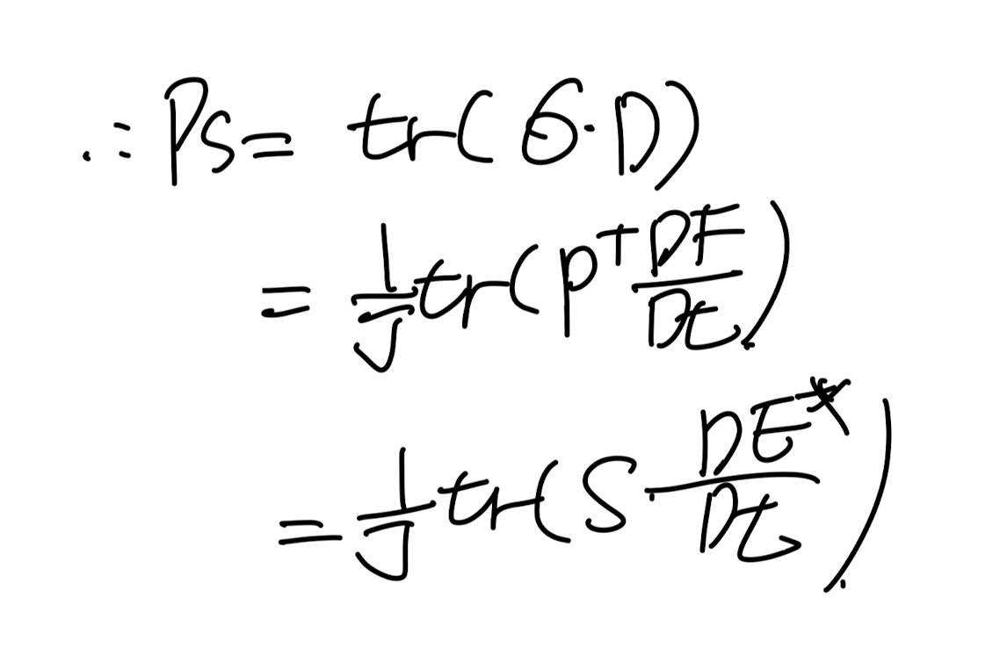

Source: [https://jeffdissel.tistory.com/m/164](https://jeffdissel.tistory.com/m/164)

ch2 Stress - part4 (Stress power)
이번시간에는 stress로 인해서 물체에 하는 일을
수학식으로 계산해보자.
밑의 미소부피의 물체에 traction vector들을 표시해주자.

간단하게 x1방향먼저 분석해주자.
(x2,x3방향도 같은 형태이므로)

(t = σn = Tn) 즉 여기서
Cauchy stress tensor,
σ = T라고 표시하였습니다.

part1에서 배운 traction vector와
stress tensor의 관계를 이용하자.

따라서, x1방향으로 stress가 한 일은,
(dV = dx1 dx2 dx3)

이제 총 한일들을 표기해보자.

여기서 미분을 전개해주면,
part3 에서 다룬, Equation of motion식을 통해서
가속도 항으로 치환할 수 있다.

즉, 전개를 하면 좌측은 운동에너지항
우측은 Stress로 인한 에너지항임을 알 수 있다.

여기서 tensor notation을 통해서 우리는
P
s:
the rate at which work is done to change the volume and shape of a particle of unit volume.
(called as 'stress power')
을 유도할 .수 있다.

Tij - Cauchy stree tensor, Dij - 시간에 따른 deformation 블로그에서 다룸.
자 이렇게 stress power을 Cauchy stress tensor로 표현하였고,
이제 1st 2nd PK stress tensor로도 표현해보자.
#Stress power by 1st Pk stress tensor.

다시 Sigma 기호로 바꾸겠습니다... 저도. 헷갈려서;
먼저 Velocity Gradient를 다음과 같이,
DF/dt * F^-1로 바꾸어 주자.

아주 간단하다,
지난 포스터에서 구한,
cauchy stress와 1st PK stress 관계식을 대입하면 끝.

#Stress power by 2nd Pk stress tensor.

지난시간에 유도한, stress tensor들의 관계를 대입해주면,
위와 같은 식이 도출된다.
여기서, 밑의 식을 증명하고 위에 stress 식에 대입해주어.
간결하게 표현해보자.

Kinetmatics에서 다루었던, Larangian Strain tensor(E*)을 떠올려보자.

이후, 1,2방향이 같다고 설정한후 1식에 대입해주고,
2식을 시간에 따라 Material Derivative해주자.

https://jeffdissel.tistory.com/155
Ch1 Kinematics part5 - Time rate of change of a material element.
part1,2,3 에서는 변형전과 후를 비교하기 위해서,material coordinate(before deformation)spatial coordiante(after deformation)을 정의하였다. 지금까지는 공간변화에 대해서 tensor들을 정의하였고,이번에는 시간의
jeffdissel.tistory.com
part5블로그에서 time rate 을 다룰때,
다음식을 유도하였다.

3번식에 dx = FdX를 대입해주면, 3'식을 유도가능하다.

이제 2' = 3' 식임을 사용하면,

(증명완료)
따라서, 최종적으로 Stress power은 다음과 같다.

정리해보면, Stress power을 다음과 같이 3가지
stress tensor들로 표기할 수 있음을 확인하였다.

