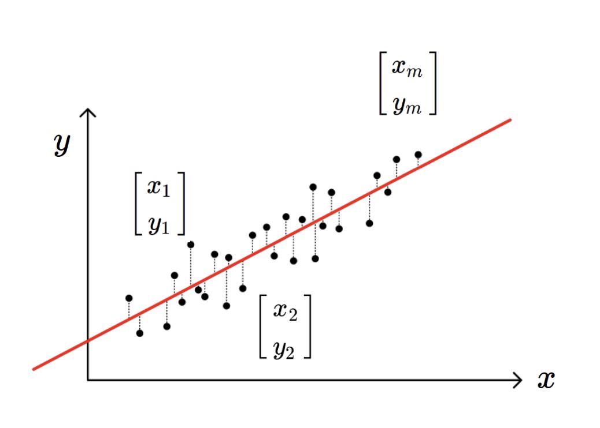
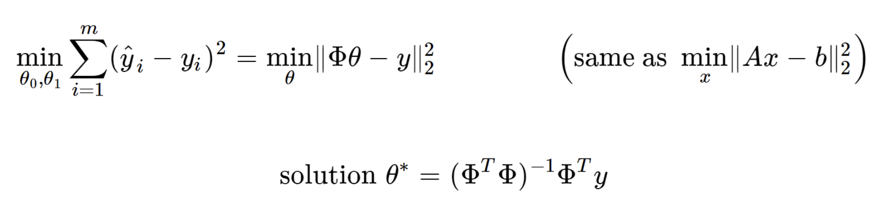

Source: [https://jeffdissel.tistory.com/96](https://jeffdissel.tistory.com/96)

지난 시간에는,
딥러닝의 장점
Optimizaiton
에 대해서 알아 보았다.
두번째로, Deep learning의 장점
Regression
에 대해서 알아보자.
regression이란,
입력 변수와 출력 변수 사이의 관계
를 모델링하여
연속적인 값을 예측하는 문제이다.
쉽게, 예를 들어보자.
다양한 요소 (주택 면적, 방의 수, 위치, 건축 연도 등)에 의해
특정 지역의 주택가격을 예측하는 문제의 경우
지금 현재 모든 집들의
주택면적, 방수, 위치 건축연도 - 주택가격
이 데이터들이 밑의 그래프 처럼 존재 할 것이다.
(x1,y1)...(xm,ym)

그랬을때,
(내가 구매하고 싶은) 집의
주택면적, 방수, 위치, 건축연도 의 정보:input
를 가지고
주택가격을 output할
모델을 만드는 것이
(위 사진의 빨간선)
Regression문제이다.
그렇다면, 어떻게 모델을 만드는 것일까?????
바로,
model parameter를 정의하는 것이다.

결국, 기존의 데이터들과 가장 fit한
Red line을 (model parameter)
를 define 하는 것이 관건이다.

그렇다면, 가장 알맞는 직선을 수학적으로 표현하면,
우리가 만든 모델 의 예측값 (y^i)
데이터의 실제 값 (yi)
의 오차가 가장 작을 때
->

정말 재밌는 것은,
Deep learing이 regression을 잘하는 이유가,
결국 Optimizaiton을 수행하는 일이기 때문이다.
min f(x) 즉, 최솟값을 구하는게 바로
딥러닝이 잘하는 최적화라고 언급했기 때문에 (이전 포스터)
연산의 편의를 위해서, model parameter를
다음가 같이 백터의 형태로 변환해주자.

'
그리고, 위에서 feature vector로 연산의 편의상 정의해주면,
최종적으로, y^ = pi * theta
이렇게 간단한 백터의 형태로 바꿀 수 있다.

최적의 직선의 수학적 정의에 대입해주면,

Linear Algebra 문제로 바뀌게되고,
이미 나와있는 해를 통해 최종적으로,
Model parameter를 정의 할 수 있다.

밑의 행렬 미분 연산을 참고하면,
간단하게 증명가능하다.

사실상, 아주 친절하게
sklearn library
를 다운만 받으면,
위의 자세한 과정 생략하고 우리가 원하는
Model parameter(theta)
를 도출 할 수 있다.

