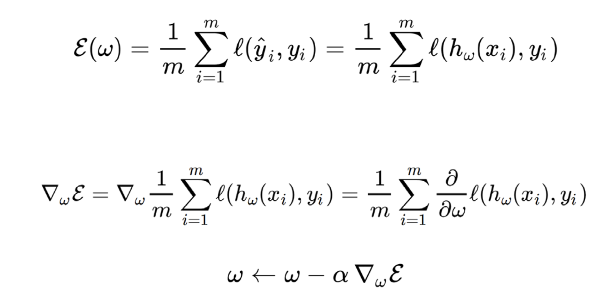
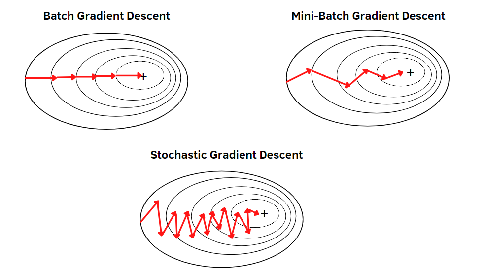
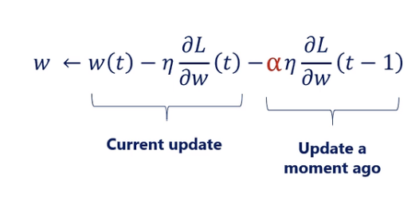

Source: [https://jeffdissel.tistory.com/99](https://jeffdissel.tistory.com/99)

오늘은, 그레디언트 디센트 알고리즘,
즉 연산 Itereation마다
w값을 수정할 텐데
어떤 방식으로 수정하는지를 살펴보자.
먼저,
Batch Gradient Descent

이전 포스터에서 구한, loss funcition
(log logistic likelihood function)
의 w에 대한 gradient를 모든 y값들에 대해서 더하고,
y값의 갯수로 나누어주어,
평균값을 gradient 로 정의한다.
그리고, step size = alpha를 곱해주어
얼마나 w를 변화시킬 지를 계산한다.

위와 같은 방법으로, 점점 최소한의 cost
로 도달하는 w로 변화한다.
Stochastic Gradient Descent
batch gradient decent 는 straightforward하지만,
밑의 사진의 왼쪽 하늘색 공처럼
local minimum에 갇힐 확률이 굉장히 높다.
이를 위해서, Stochastic Gradient decent는
매순간, 랜덤한 데이터들을 고르고,
그에 대한 w, cost gradient를 계산한다.
때로는, gatch gradient decent보다 연산량이 많을 수 있지만,
적어도 Local minimum에 빠지는 일은 적다.

마지막으로는, 연산시간을 굉장히 줄이는 방법중 하나인
Mini-batch Gradient decent 이다.
train data 전부를 가지고, w를 수정하는 것이 아니라,
랜덤하게 하나의 batch (Group)을 데이터에서 추출한다.
랜덤하기 때문에, 골고루 펴져있는 데이터들일 것임,
따라서, 이들을 가지고 w를 계속해서 업데이트 한다면
밑의 사진처럼 minium에 빠르게 도달 할 수 있게된다.

추가로, Gradient decent method들의
단점에 대해서 언급하고,
마무리 하도록 하겠습니다.
경사하강법의 가장 큰 단점은
Learning rate 설정입니다.

적절한 Learning rate: alpha를 설정해야지,
최적의 연산속도로 최적의 해답을 찾을 수 있습니다.

따라서, 최적의 learning rate는
어떻게 정의할까?
매순간 스텝사이즈를 다르게 정의해주는데,
밑의 두가지를 고려하여 정의해줍니다.
1. 기울기 크기에 따라 학습률을 조정 :
기울기가 크면 더 작은 스텝을, 기울기가 작으면 더 큰 스텝
2.이전 반복에서의 성과에 따라 학습률 조정 :
이전 스텝이 잘 작동했으면 학습률을 늘리고, 잘 작동하지 않았으면 줄임
위 두가지 사항을 전부 식에 고려해준 방법이 바로.
Adam (Adaptive Moment Estimation)

위 식을 보면,
가운데 항이
1. Loss function의 Gradient를 고려
마지막 항이
2. 이전 iteration의 기울기를 고려하여
이전 iteartion 기울기가 크다면, 지금 굉장히 w가 많이 변화 했을 것이다.
이 momentum을 그대로 이어가, w를 수정하면
굉장히 빠른 시간에 수정할 수 있다.
(α
는 모멘텀 계수로 = 0.9로 보통 설정)
