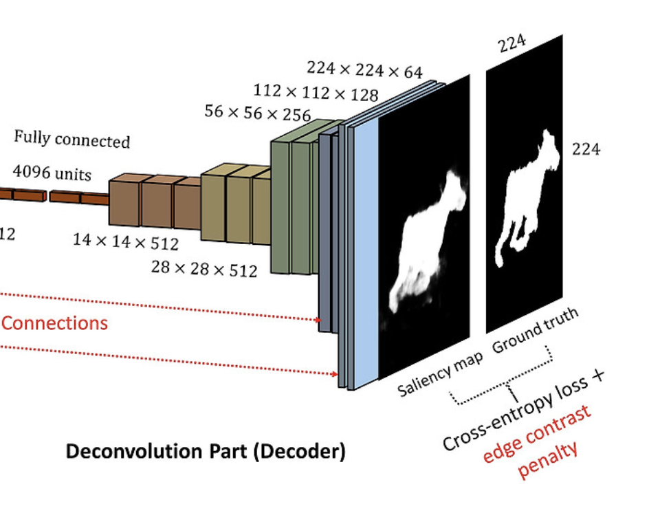
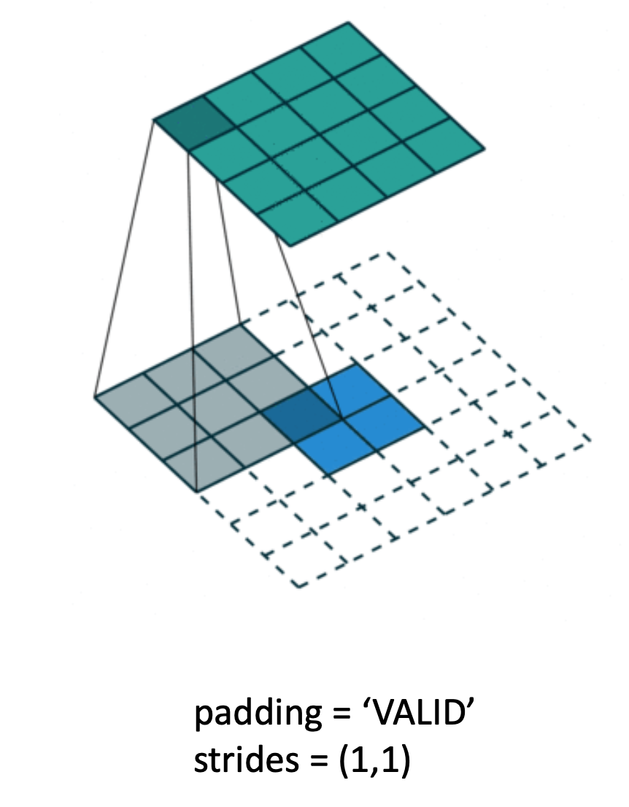

Source: [https://jeffdissel.tistory.com/m/139](https://jeffdissel.tistory.com/m/139)

Convolutional AutoEncoder(CAE)
AutoEncoder에 대해서는 이미 다들 익숙 하실 것이다.
기본적으로 Input data의 특징을 추출하기 위해서
Encoder에서
latent space로 dimension을 축소시킨후,
Decoder에서
다시 원래 inputdata와 최대한 비슷하게
복구시키는 작업도 진행해준다.

Scheme of Autoencoder
이렇게 되면 장점이 뭐냐하면,
Decoder
를 활용하여,
우리는 latentspace에서의 조작을 통해서
방대한 data를 생성할 수 있다.
위 autoencoder는
ANN구조
의 layer을 가진 모델이고
이번에는
Convolutional Neural Network
를 가진
Autoencoder를 분석해보자.

Autoencoder와 구조는 똑같고,
목적도 똑같다.
encoder에서 특징을 추출한후,
decoder에서 원래 데이터로 복원시키는
구조이다.
여기서 Encoder의
Convolutional layer Process(사진축소 과정)은
CNN에서와 동일한 규칙으로 적용된다.

Kernel size = 3*3이고, strides = 1*1
인 공통적인 상황에서
(padding = valid
이라면,
feature map이 좌측과 같이 축소되며)
(padding = same
이라면,
input size = output size가 되도록
padding이 한곂 추가)
됨을 알 수 있다.
위 규칙들은 사실상 CNN과 동일한 문법이므로,
넘어가도록 하겠다.
여기서 기존,
CNN에는 없는 과정이 바로,
Decoder부분이다.

decoding part
이 부분에서, latent space의 작은 사이즈에서
오히려 크기를 키워주어야 한다.
아주 친절하게 tensorflow에 해당 함수가 존재하고,

library
사용하는 방법도 기존 encoder와 동일하다.
다음 그림처럼
(2*2) -> (4*4)
로
크기를 키우는 상황에서.

반대로 [4*4] -> [2*2] 로 전환시키는 encoder에서의
문법을 그대로 사용하면 된다.
즉, [4*4] 를 2*2로 축소시키기 위해서는
with 3*3 kernel size.
Padding - 'Valid'
(=No padding)
when, strides = 1*1
이어야 한다.
이해를 했는지 문제를 통해서 확인해보자.
Q
(3*3) 커널 사이즈, (2*2) stride, padding = 'same'
인 상황에서 (3*3) -> ? 어떤 사이즈로 변화할 까?

역으로 생각해보자.
Encoder에서
stride (2*2), padding = 'same', kernelsize (3*3)으로
(3*3) output이 나오려면,
(5*5)
이어야 한다.
padding = 'same' -> 1 layer 추가 (7*7)됨
거기서, stride = 2*2 이므로

이런 식으로 tensfor flow를 활용하여 모델을 구조화 하고,
l
oss function은 최종적으로 reconstructed 된 이미지와
기존의 input이미지의 차이를 가지고 계산한다.

reconstructed image from CAE
