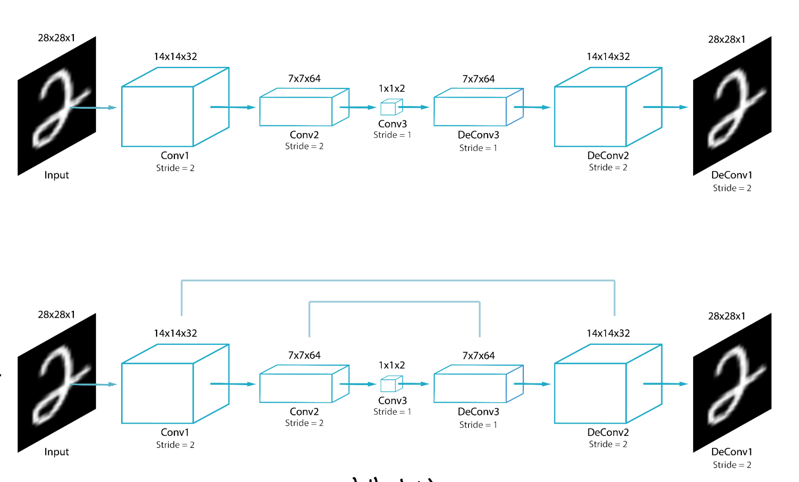

Source: [https://jeffdissel.tistory.com/m/140](https://jeffdissel.tistory.com/m/140)

Image Segmentation, Object detection.
지금까지는
분류 작업, 확률, 예측,
이미지 Reconstruct 등을
output으로 계산해 왔다.
[Image Segmentation]
이번에는 영역 구분을 하는
image segmentation에 대해서 알아보자.
아주 간단하다,
우리가 관심이 있는 영역과
관심이 없는 영역을 분류하는 것이다.

image segmentation
위 사진의
관심영역:사람
관심이 있는 영역에 한개의 사진에 여러개 존재할 수 도 있다.
관심영역: 사람, 자동차, 도로, 도로 주변 물건

이를 위해,
우리는
Transposed Conv을 활용하여
reconstructed image를 제작해야하고,
더하여!!! 각 픽셀별로 어떠한 종류인지 분류작업도 해주어야 한다.

즉, CNN에서의
image reconstruction을 진행
+ pixel classification 도 진행
해야한다.

위(CAE) , 밑(FCN)
위 모델 구조를 살펴보면, 전부 동일하지만
FCN의 경우 skip connection즉
이전 block에서의 정보가 추후 block에 input으로
들어간다.
이는 우리가
Residual Network 에서 배운 것과 동일하다.

a residual network block
이전 정보를 가져와서 output과 연결시키는 작업이다.
FCN에서는 이렇게 함으로 써 feature의 갯수가 줄어들면
spatial 정보도 줄어드는데
이를 이전 x를 가지고 옴 으로 써 해결한다.

[Object Detection]
이번에는 같은 목적이지만,
더 간단하게 모든 픽셀을 다 계산하지 않고,
bounding box를 활용하여,
물체의 위치 + 분류
2가지 작업을 진행하는
Object detection
에 대해서 알아보자.

위 사진을 보면, 바로 이해 하실 것이다.
위 물체 탐지를 달성하기 위해서
우리의 모델은 두가지 작업을 해야한다.
1. 물체의 위치(bounding box위치)
2. 물체 분류(자동차인지 사람인지 자전거인지)
이는 이전 image segmentation보다
훨씬 간편함을 알 수 있다.
(모든 픽셀을 다 분류하지 않아도 되기 때문)
모델 구조는 간단하다,
특징을 CNN(Convolutional Nerual Network)로 추출해주고,
상자의 위치, 물체 분류 이 두가지 작업을 위해
각각 Dense layer로 Flatten작업을 해준다.

최종적으로 우리가 얻는 것은
(위 output) : 상자의 좌표와 크기
(아래 output) : 어떤 물체인지 분류.
