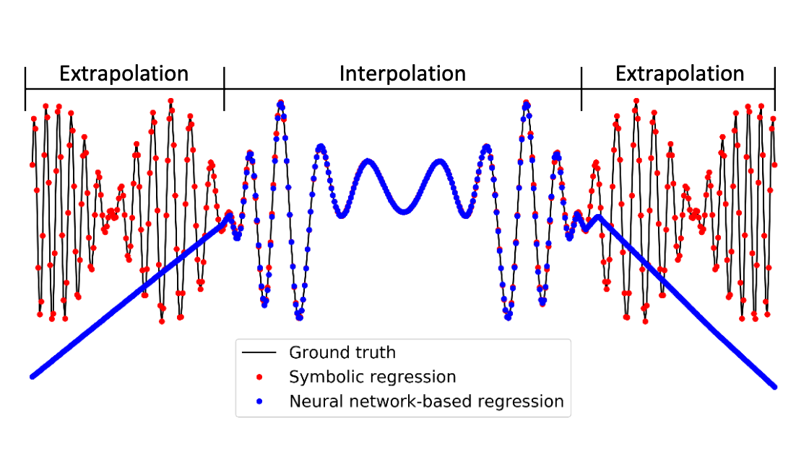
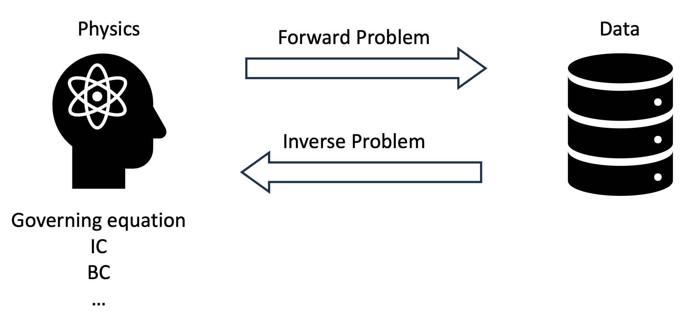
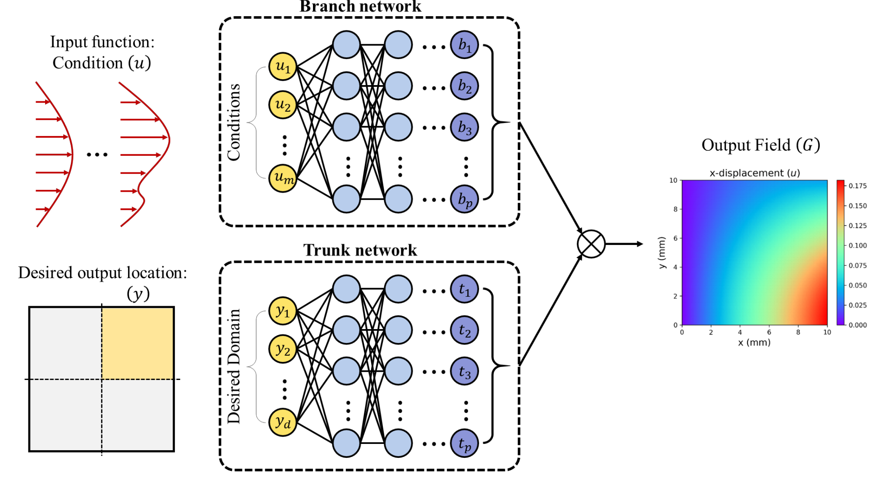
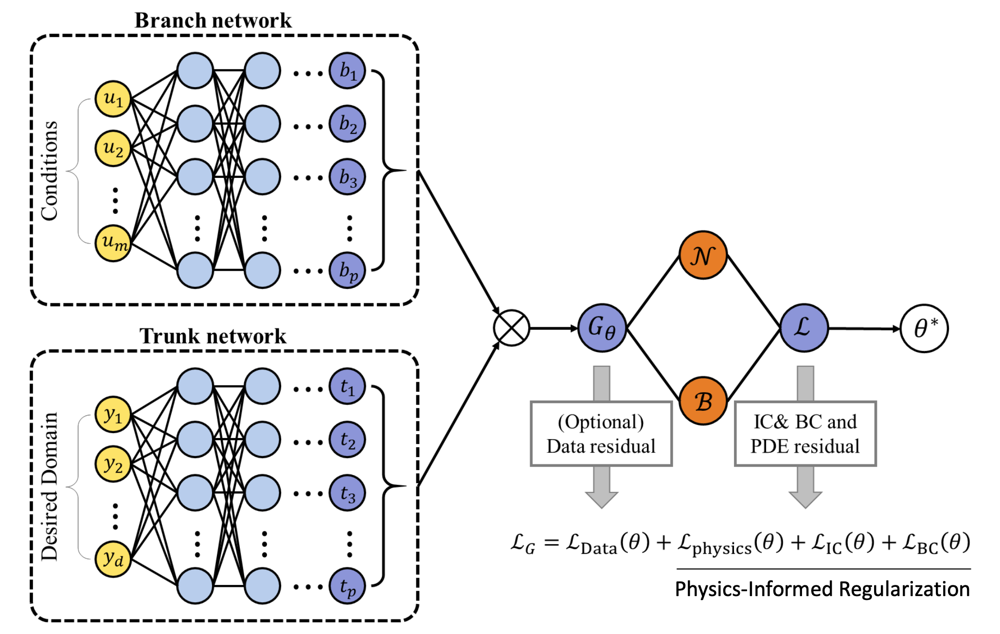

Source: [https://jeffdissel.tistory.com/m/145](https://jeffdissel.tistory.com/m/145)

Physical Informed Neural Network (PINN) & Operator Learning
지금 까지 배웠던 모델들의 학습방식과
완전 다른 새로운 Neural Network에 대해서 배워보자.
So far, Data-driven approach로 학습을 진행하였다.
즉, data를 많이 가지고 있을수록, 모델의 정확성은 올라간다.

ANN구조
Data-driven approach에는 치명적인 두가지 단점이 존재한다.
1. Black box.

아무리 좋은 모델이라고 할지라도,
우리는 정작 input-output의 관계를 설명할 수 없다.
즉, 모델의 메커니즘을 해석할수 없다는 것이다.
y= f(x) 에서 y:output, x: input이라고 한다면,
함수 f를 정의할 수 없다.
2. Out of the boundary.
가지고 있는 데이터의 boundary
밖의 정보에 대해서 불확실성이 크다.

위 그림을 보면, interpolation부분을 데이터를 가지고 학습했다고 가정하자.
이외의 실제 데이터가 빨간색과 같을지라도, Neural network는 regression을 통해
가지고 있는 데이터를 통한 최적의 파란색 답을 도출할 것이다.
이에, 가지고 있는 데이터와 더해서,
만족해야하는 physical equation이 존재하다면,
그것도 만족하도록 구성한 모델이 바로,
Physical Informed Neural Network(PINN)이다.

위에서 보이는 것처럼,
x,t로 부터
u를 먼저 도출
하고,
u에 differential operation을 진행 해준후,
PDE, BC, IC 을 만족하는지 Loss값을 계산하여
손실함수가 적어지더록 가중치들을 수정하는
작업을 진행한다.
여기서 크기 손실함수는 가지고 있는 정보에 따라서,
DATA,
Governing Equations,
Boundary condition,
Inital condition
이렇게 구분지을 수 있다.
지금까지 다루었던 부분들은,
x,t를 가지고 정확한 u를 예측하는
Forward Problem
이었고,
반대로 x,t,u를 가지고 있을때,
governing Eq, IC, BC를 예측하는
Inverse problem을 푸는 모델도 계발할 수 있다.

ex)
만약에 PDE의 계수를 모르는 다음과 같은 경우에
내가 x,t,u 데이터를 가지고 있는 상황이라면,
PINN모델을 활용하여
parameter estimation
을 진행할 수 있다.

뿐만아니라, 다음과 같이 BC을 모르는 상황에서도,
같은 방식으로 가지고 있는 데이터를 활용하여
Estimation을 진행할 수 있다.

[PINN의 한계]
1. Automamtic differentiation.(chain rule 사용)
:불연속점, 미분불가능 점에서 convergence issue가 발생한다.
해결책: weak form PDE
적분형태로, 미분차수를 낮추어 준다.

2. 다양한 loss가 존재.

거듭 이야기 했다 싶이, 가지고 있는 정보에 따라서,
loss function의 종류도 다양하다.
하지만 여기서 문제가 존재한다.
각각의 loss값마다 gradient가 전부 다를 것이기 때문이다.
-> adaptive loss weighting
loss값들 중에서 작은 값은 그대로 두고,
나머지 Weight들만 조절.
[Operator Learning]
PINN에서 가지고 있는 방정식, boundary condition, inital conditoin
데이터를 가지고
모델을 학습 시켰다.
만약에 BC만 바꾸고 바뀐 결과를 보고싶다면?
처음부터 모델을 다시 학습해야한다.
이는 굉장히 공학자로써 귀찮은 작업이다.
보통 physical equation들은 BC, IC를 바꿔가며
방정식을 계산하기 때문이다.
이를 해결하는 Model 이 바로,
Operator Learning model
이다.
DeepOnet 이라 불리는 model은 다음과 같다.
(상황을 잘 이해해야 한다)
y: 위치정보 [y1,y2,...yd] 벡터형태.
u: 각 위치에 inital or boundary condition
t = t(y), y에관한 함수.

즉, y,u를 쪼갠후,
각자의 network에 짚어 넣는다.
Branch network, Trunk network 결국 둘다
p개의 어떠한 계수를 Output한다.
이후에, 합성곱을 통해서 G라는 최종함수가 도출된다.
여기서 핵심은 t = t(y), G = G(y)라는 점이다
즉, 최종 Output한 함수는
위 그림처럼 각 위치에 따른, 사용자가 원하는 정보를 output해준다.
정리해보면,
어떠한 boundary condition(특정 한정된 위치에서의 함수값, u(x))
->
전체 domain에서의 함수값(G(y))를 예측하는 게 바로
DEEP ONET 이었다.
이게, 연산자랑 무슨 상관이지 라는 의문이 들었는데.....
함수 -> 함수 mapping 하는 과정이므로
Operator Learning
이라는 명칭이 붙는 것이었다.
________________________
여기에 한 숟가락 더 떠서,
G(y) -> Data residual 까지는
Deep ONet
에서 완료하였고,
뒤에 , PDE, BC, IC각각 loss를 추가해주면
PINN- Deep Onet
이 탄생한다.

이렇게 하면, 당연히 더 적은 data로도 모델을 학습가능하다.
__________________
지금까지 배운 세개의 모델을 비교하면서,
총정리해보자.
1. PINN

input: geometry(x,y)
output: physical quantites(u,v,p...)
Neural NetworkL: Single
2.DEEP Onet

Input: PDE condition(u(x)), geometry(y)
output: Basis function(t), Basis coefficient(b) -> G(u)(y)
Neural NetworkL: two(Branch, Trunk net)
3.PI_DEEP Onet

Input: PDE condition(u(x)), geometry(y)
output: Basis function(t), Basis coefficient(b) -> G(u)(y)
Neural NetworkL: two(Branch, Trunk net)
