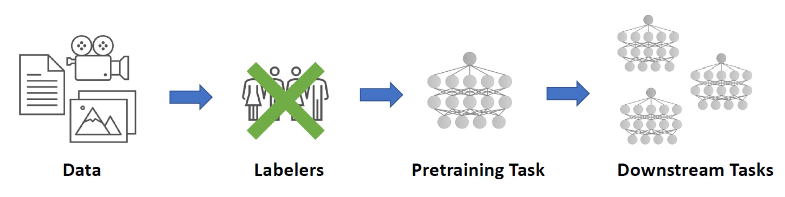
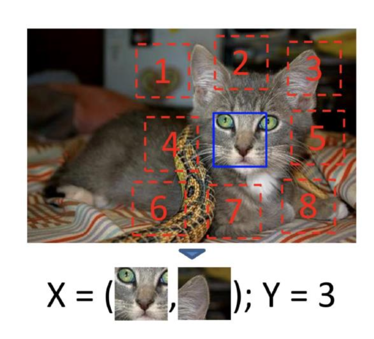
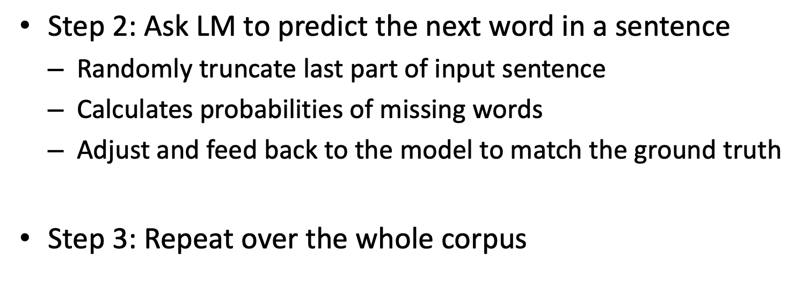

Source: [https://jeffdissel.tistory.com/143](https://jeffdissel.tistory.com/143)

지금까지, generator 개념을 제외하고는 전부,
supervised Learning
에 대해서 다루었다
즉, 어떤 모델을 가지고 있는 input output pair data
를 가지고 학습시키는 방식이다.
하지만,
실제 deep learning으로 내가 원하는 모델을
구축할때 무조건 직면하는 문제가 발생한다.
바로. 원하는 organized data가 존재하지 않는다는 것이다.
1. 학습할 데이터의 양이 부족하거나.
2. 데이터가 존재해도 output paired label이 안 붙어 있다는 점이다.
정확성이 높은 모델을 만들기 위한,
data를 정돈하는 회사가 따로 있을 정도이다.
(e.g. Scale AI)
위 문제를 해결하기 위해.
model 이 직접, labeling을 진행하는
self-supervised Learning
에 대해서 알아보자.

Process of Self-supervised Learning
self-supervised Learning에서는 두가지 Task 과정이 순서대로 진행된다.
1. Pretext task.
-labeling 스스로 하는 방법 학습.
2. Downstream task.
-label을 붙힌 후,
원하는 작업을 위한 모델 학습.
먼저 pretext-task에 대해서 알아보자.
[기본적인 규칙]
은 다음과 같다
1. User가 일부러 가지고 있는 데이터를 변형,조작 한다.
2. 조작된 데이터를 모델에게 주고,
반대로, 어떻게 조작되었는지를 예측하도록 한다.
위에서 말하는 유저의 인위적인
변형 혹은 조작은
다음과 같다.
a) Context Prediction
[학습과정]
가지고 있는 고양이 사진에서 9개의 조각을 임의로 빼낸후,
각 조각이 어디에 들어가야할지(번호)를 정확히 예측하도록
모델을 학습시킨다.

b) Jigsaw puzzle
[학습과정]
이번에는 조각들을 무작위로 섞은 후에,
원래 이미지의 조각으로 맞추도록
모델을 학습시킨다.

c) Image colorization
[학습과정]
기존 사진에서 색을 제거한 후에, 따로 저장한다.
이후, CAE를 통해서 색을 예측한 사진을 만들고,
기존 저장된 진짜 색과 비교하여 CAE를 학습시킨다.

d) super-resolution
[학습과정]
기존 사진의 크기를 강제로 축소시킨다.
이후, generator로 크기를 키우도록하고, 실제 사진과 비교한다.
(GAN으로 학습가능)

e) Image-Impainting
[학습과정]
실제 사진의 부분을 일부러 제거해주고,
generator보고 제거한 부분을 예측해서 생성하도록 학습시킨다.
이후, 제거하기 전 실제 사진과 generator가 만든 사진을
discriminator가 구분하도록 학습시킨다.
(GAN)

이제.
이렇게
pretext task
로 학습된 모델을
그대로, 진짜 사용하고 싶은 모델(
Downstream task
)
로 transfer 시킨다.

결국, unlabeled dataset -> pretextask에서
feature extacting을 하는 모델로 학습하였고,
이를 그대로 tranfer learning하여
원하는 Downstream task에 사용하는
workflow이다.
self-supervised learning이
가장 중요하게 쓰이는 곳이 바로
Large Language Model(LLM)
이다.
(지금은 transfomer 사용)
단어의 결합으로 이루어진 문장은 label이란게 존재하지 않는
unlabeled data이다.
따라서, 우리는 수 많은 public source들에서
문장들을 수집한다.

이후, 임의로 user 가 변형, 조작을 진행시켜 주어,
pre-text task로 모델을 학습시킨다.

만들어진 최종 모델을
donwstream task
를 위한 모델로 transfer 시킨다.
ex) ChatGPT
