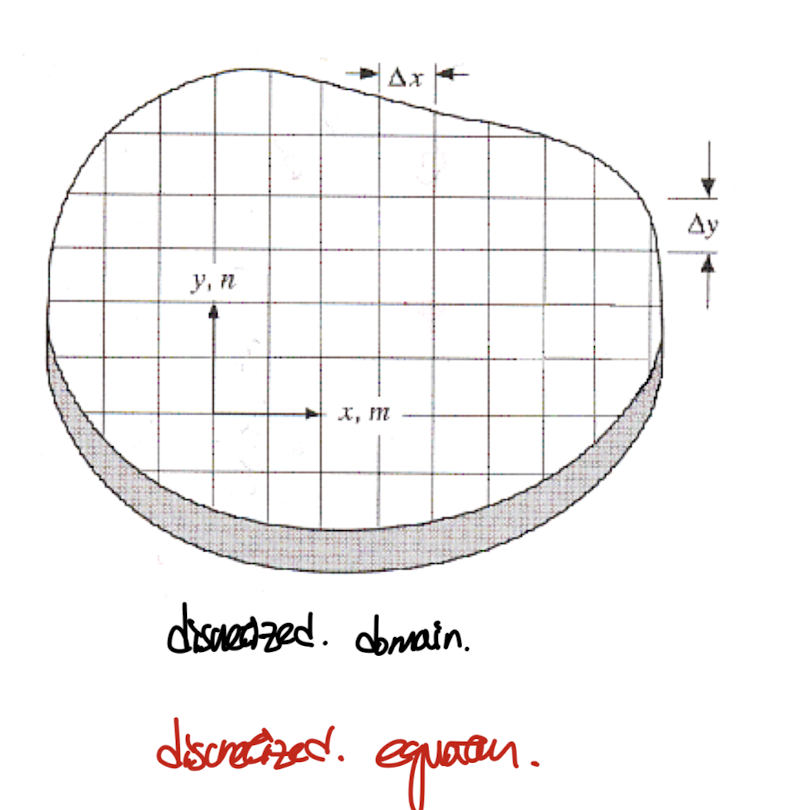
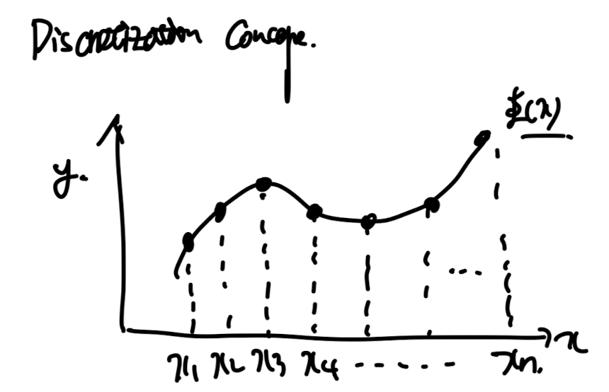
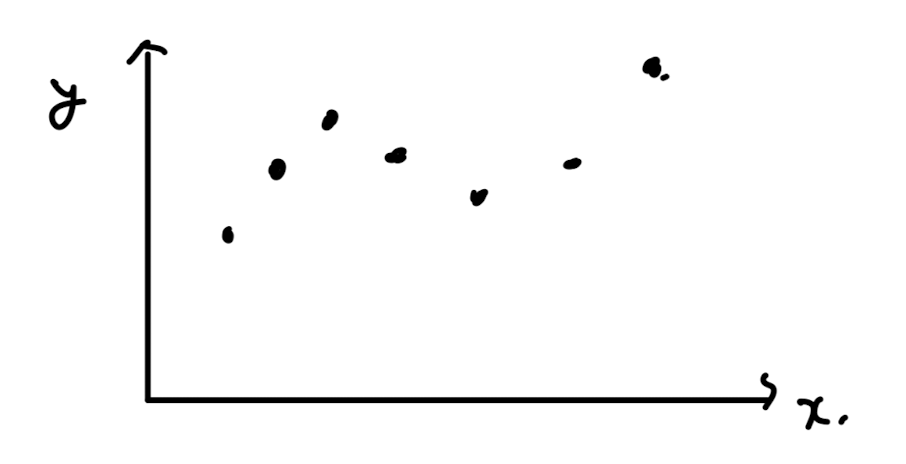
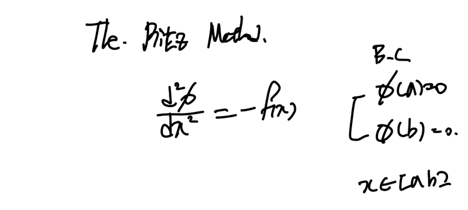

Source: [https://jeffdissel.tistory.com/180](https://jeffdissel.tistory.com/180)

지난시간에 우리가 풀어야할 물리법칙들을
수학식으로 표현하였고, 해의 전파 방향성에 따라서
종류를 구분지었다.
수학식 즉 편미분 방정식을 우리가 직접 손으로 풀수 없는 경우가
태반이기 때문에, 우리는 컴퓨터를 이용해야한다.
컴퓨터가 풀기 위해서는 미분 방정식이 아닌
Algebra eq으로 전환시켜 주어야 한다.
(그 이유는 전환한 후, 차근차근 알 수 있다)
전환하기 위해서 우리가 첫번째로 해야하는 것은,
해가 존재하는 공간을 discretize해야한다.

위 그림처럼, 해가 존재하는 공간을 나눈후,
저 사각형 하나하나를
grid
라고 부르며,
grid끼리 만나는 점을
node
라고 칭한다.
저렇게 구역을 나누는 이유는 결국 우리는 node에서의
해 값만 찾을 것이고, 미분방정식에서 미분향을,
노드에서의 값으로 나타내고자 한다.
이해를 돕기 위해서 1D 로 축소시켜보자.
우리가 최종적으로 구하고 싶은 것은 지금
저 그래프 즉, x1 .... xn까지 해의 공간에서
모든영역에대해서 함수 값을 얻고 싶은 것이다
(Continous solution)

하지만, 모든 값을 다 계산하는 것은 analytically 해를 구하는 방법밖에 없으므로,
우리는 n개의 구역으로 쪼개고(쪼개는 과정을 discreitze라고 부른다)

n개의 구역의 양옆 점,
n+1개의 점에서의 함수값을
구하는 문제로 바꾸어 생각할 것이다.
여기서, 독자는 질문이 들것이다.
우리가 저 구역을 쪼개고, 저 점에서의 함수값을 구했다고 치자.
그래도 우리는 저 점들 사이의 해는 구할 수 없는거잖아??
만약에 저점들 사이의 해를 구하고 싶으면 어떡하지?
여기서 우리는 사이사이의 해의 profile을 적절한 가정을 통해서 도출할 예정이다.
(물론 exact solution이 아닐 가능성이 당연히 크다)

자 이렇게 이산화 과정을 통해서, 영역을 구분한 후에
도대체 어떻게 PDE를 '변형' 시킬까????
바로 4가지 방법이 존재한다

4가지 방법 보면서 차차알겠지만,
결국 이산화 한 후에 미분 term을 어떻게 변환하는지가 다른 4가지 방법인 것.
1. Taylor series formulation

taylor series expansion을 이용하면, 위와 같이 우리가
일차 이차 미분항을 구할 수가 있다.
(Called Finite Difference Method)
가장 단순한 방식이다.
(그렇기에 복잡한 geometry 에 대해서는 오차가 커진다)
2. Variational principal
'variational prinicpal을 책에서는 다음과 같이 설명한다'

갑자기 이상한 functional이란 단어가 등장해
당황스러울 것이다.
(제가 그랬습니다)
우리가 구하고 싶은 해 phi(x,y,z,t)라고 하자.
이때, 이 함수를 다시 input으로 하고 ouput을 진행하는 함수를 인자로 받는
또다른 함수를
Functional
이라고 부른다.
따라서, 우리가 구하고자 하는 해를 가지고 다른 어떠한 함수식에 대입하는 것이다.
그리고 그 함수식은 보통, Energy minimizing이다.

아직 개념이 와닿지 않을 수 있다.
(이해하는데 굉장히 오래걸림)
e.g.) The Ritz Method

위 편미분 방정식과 해 함수를 가지고 밑의 functional을 제작하자.

functional 함수의 의미는 물리적으로 에너지가 최소화도록 phi가 값이 존재하는 것이다.
(보통 에너지 최소화 개념으로 functional식이 세워진다)
여기서, 우리는 해를 approximation solution으로 구상한다.
(이 부분도 처음에는 물음표가 머리에 pop up할 것이다.)
(쉽게 생각해서 어떠한 미리 알고 있는 함수들의 결합으로 최종적으로 전체 domain에 걸친
함수를 만든다고 생각할 수 있다)

즉 알고 있는 기저 함수들의 조합으로 새로운 함수를 만드는 것이다.
여기서 핵심은 '
알고 있는 함수
'이다.
즉 우리는 알고있는 함수를
얼마만큼 곱해서 더하는지 그 계수들을 바꿔가면서
최종함수를 결정할 수 있다.
자 여기서, approximation solution을

functional 함수에 대입한다.

(현재 미지수는 approximation solution을 구성하는
a1 ... an , n개의 계수이다)
따라서, 어떤 계수값일때 functoinal이 최소인지를 우리는 알고 싶기 때문에,
각 계수로 K를 미분해주어 n개의 식을 유도할 수 있다.

n개의 색 + n개의 미지수 -> 연립방정식 -> 해 도출가능.
결론적으로, 모든 계수를 구했으면, 다시말하지만 기저함수는 미리 알고 있었기 때문에
우리가 최종 함수를 알 수 있다.

지금까지가 Ritz method에 대해서 설명하였고,
다음 포스터에서 이어서
남은 2가지 방법에 대해서 알아보자.
3. method of weighted Residual
4. control volume formulation
