Source: [https://jeffdissel.tistory.com/182](https://jeffdissel.tistory.com/182)

우리가 무엇을 하고 있는지 점검해보면,
differnetial equations -> algebraic eq으로 전환시켜주고,
컴퓨터가 연산하는 방식으로 진행한다.
문제는 전환을 어떻게 시키냐 이다.
(전환예시)

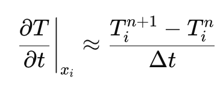

Transient 1D Heat Diffusion equation

diffusion term -> discretization equation

Transient term -> discretization equation
최종 변환된 algebraic Eq.

편미분항을
결국 바꾸는게 전환의 핵심이다.
전환시키는 수학적 method로
1. Taylor Expansion(Finite Difference Method)
2. Varaitional Principle(The Ritz method, FEM)
3. Method of Weight Residual (WMR, FVM)
을 다루었고, 그중에서
FVM,
Method of Weight Residual을
자세하게 살펴보았다.
지난시간에 WMR에 대해서 자세하게 다루었고,
그중에서 Weight가 구간별로 1인 step function인
subdomain method를 가지고 문제를 풀어보자.
(예제로 풀 문제, 1D Steady heat diffusion w/ source term)

다음의 boundary condition과 값들을 가지고,
x에 따른 T(온도)를 구하는게 목표이다.
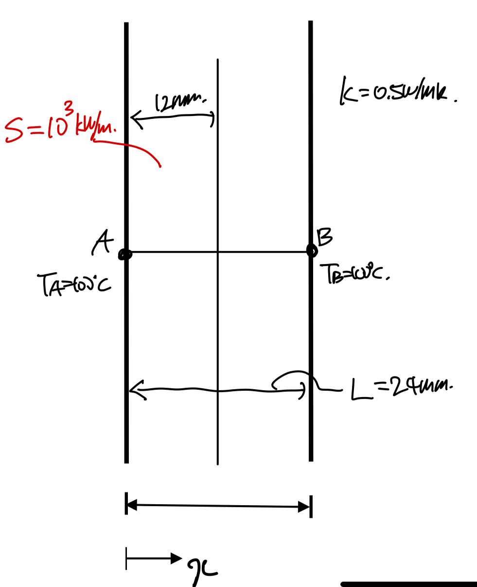
Step1. Discretize the domain

가장 먼저 구간을 이산화 시켜준다.
그리고 각 영역을 control volume이라고 정의한다.
(control volume안에는 한개의 노드가 존재)
(실제로는 수많은 control volume으로 쪼개기 때문에)
임의로 P라는 노드를 기준으로 하는 Control volume과 양옆의 W,E 노드
그리고 control volume surface x = lowercase(w, e)가 존재하는 상황 가정하자.

Step2. Integral the Diffrential Eq
이제 WMR을 사용하여, differnetial eq을 전환시켜주자.
(여기서부터는, 지난포스터를 꼭 보고와야 이해가 된다)
https://jeffdissel.tistory.com/181
Ch3 Discretization method - part2 ( WRM, FVM)
전체적인 흐름을 다시 정리해보자. 우리는 물리법칙을 수학식으로 표현하였고,그 수학식은 손으로는 풀수 없는 편미분 방정식이다. 따라서, 근사해라도 구하기 + 컴퓨터 이용하기를 달성하려고
jeffdissel.tistory.com
자 우리가 지금 분석하는 control volume은 x = w -> x = e라는 것을 기억하자.
그리고 weight function을 아래와 같이
x = (w,e)에서 1
otherwise , 0
가 되도록 정의한다.
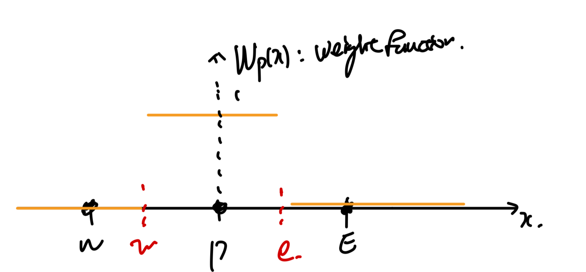
Control volume of Node P 의 Weight function
(weight function은 각 contol volume마다,
달라도 되며, 유저마음대로 정의할 수 있는 함수이다)
(n개의 cv -> n개의 weight function)
자 이제 WMR을 적용해보자.

Method of Weight Residual
여기서 적분구간에 x = (w,e)로 축소된다 왜????
weight function이 저구간 밖은 0 이기 때문에다.

따라서, 위 식을 이제 적분을 제거해주면 2번 식이 도출된다.
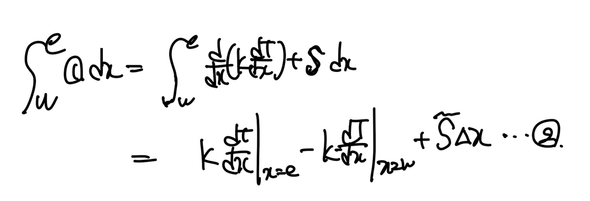
2번식을 보면 diffsuion term은 이중 미분이므로, 적분을 진행하여도, 결국 미분항이 존재한다.
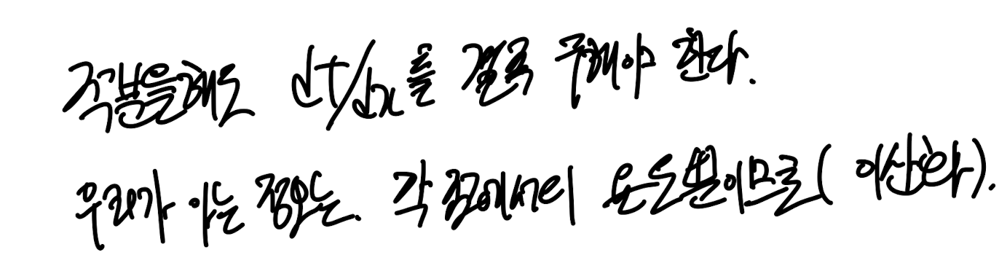
우리의 목표는 differential eq -> algebraic eq이기 때문에,
결국 저 미분항을 제거해야한다.
제거하기 위해서는

(이게 무슨 말인지 바로 밑의 그림을 보면서 이해해보자)
우리는
dT/dx | x=e, dT/dx | x=w
두 값을 결국 Tp, TE, TW 로 나타내는게 목표이다(그게 algebraic eq)
즉 아래 그래프를 보면 TP, TE 값을 가지고, 그 사이의 profile을 가정해야.
x = e 에서 미분값을 TP, TE로 표현가능하다.
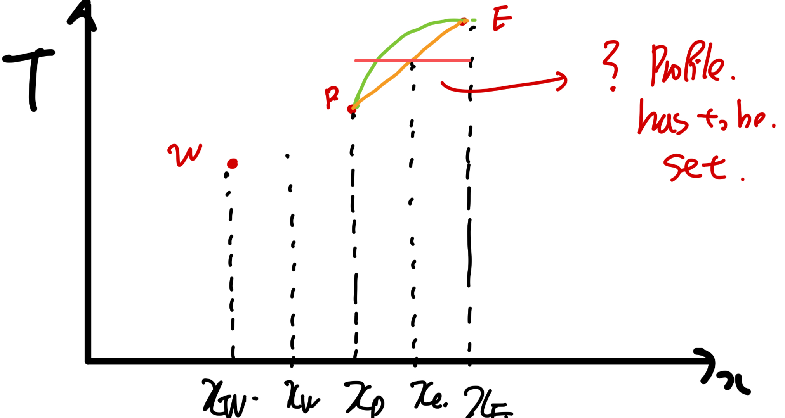
Profile of x = xp - xe 구간.
이러한 profile을 각 control volume별로 가정을 해야하고,
꼭 모든 CV이 같을 필요는 없다.
(중요한것은 실제 연산은 굉장히 작은 CV으로 진행을 한다,
Computer가 이 문제를 푸는 이유이다, 굉장히 많은 CV
-> 굉장히 많은 Eq(cv1개당 1개의 방정식이므로)
-> computer can handle this)
What I wanna say is that
it isn't necessary to build a precise profile
rather simplest functions are sufficient.
굉장히 작은 함수들이 여러개 합쳐지기 때문에,
간단한 함수로 구성해도 된다는 아이디어 이다.
때문에, 가장 간단한 stepwise profile부터 시작해보자.
#step wise profile

아쉽게도 x = e, w에서 미분값을 정의할 수 없다.
따라서 패스
그다음 심플한.
#Linear profile

아주 좋다. 미분가능하다. x = e, w에서
따라서 이 방식으로 미분값을 계산한후, 우리가 풀고자한 2번 방정식에 대입한다.

WMR적용한 우리가 풀고자한 Eq.
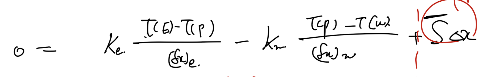
드디어 Finally, eventually
이렇게 Tp, Te, TW, b 로 이루어진 algebraic Eq으로 전환하였다.

위 식은 잘생각해보면
node P를 기준으로하는 Control volume1개에 관한 1개의 식이다.
따라서, 다시 원점으로 우리가 풀고자한 문제로 돌아가보자.

맨처음에 이산화하였던 모든 CV에 대해서 이제 위 식을 적용시켜보자.
ex) P -> 4, E -> 5, W -> 3.

6개의 CV에 대해서 각각 식을 세우면, 우리가 다음의 6개 algebraic eq을 유도할 수 있다.

8개의 미지수로 보이지만,
자세히 보면 TA, TB를 알고 있기 때문에,
6개의 방정식, 6개의 미지수 -> 연립방정식으로
각 온도를 모두 구할 수 있다.
(실제로는 몇만개의 cv -> 몇만개의 방정식)
따라서 컴퓨터가 연산을 진행한다.
여기서 한가지 짚고 넘어가야 할것은,
위 우리가 가정하였던 Profile은 사용자 마음대로 설정한다고 했는데,
어떤 profile이든 상관이 없는가?
즉, T profile의 조건의 대해서 알아보자.

Necessary condition for the solution function profile
piecewise라는게 말그대로, 조각이 나있는 profile이다.
밑의 예시를 보면 1을 기준으로 두 함수로 전체함수가 조각이 나있다.
(편의상 x<1을 1번 조각 나머지를 2번조각이라하자)
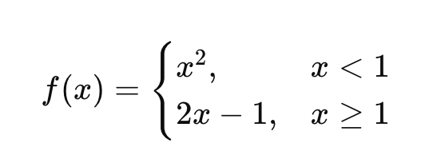
piecewise profile이라는 말은
1번조각, 2번조각 각각 내부영역에서 미분가능, 연속이어야 하지만,
x = 1즉, 두 조각이 만다는 지점에서는 굳이 연속이거나 미분가능이지 않아도
된다는 말이다.
하지만 (위의 예시처럼) d T/dx가 필요한 상황이라면,
우리는 두조각이 만나는 지점에서 연속, 미분가능한 profile을 선택해야한다!
(즉, 상황에 따라서 profile을 적절히 선택해야한다는 것)
또다른 강조할 것은, 서로 다른 profile이 사용되어도 상관이 없다.(서로 다른 CV구간마다)

요약:
1. 가장 간단한 profile부터 시작하자.
2. 방정식을 보았을때, 이 profile로 값을 도출할 수 있는지 확인
3. 불가능하면, 다른 profile선택
______________________________
자 여기까지 우리는 1번의 풀어야 할 pde식을

Method of Weight Residual(subdomain method),
+ Piece wise Linear profile
임의의 유저가 만든 설정을 통해서
다음의 algebraic eq을 유도하였다.

여기서 끝난게 아니다.
우리가 임의로 설정, 가정을 하였기 때문에,
위식이 realistic한지 현실적, 물리적으로 말이 되는지를
점검해야할 필요가 있다.
따라서, Patankar(author of the book)
은
4가지 법칙
을 제시하였다.
for the Algebriac Eq we derived so far.
[4 basic rules]
1. Consistency at control volume faces
자 profile이 cv마다 달라도 되지만, k가 만약에 동일한 domain에 대해서,
저렇게 dT/dx가 다르게 된다면, -> heat flux가 같은 점을 기준으로 왼쪽 오른쪽이
다르다는 것이다. -> unrealistic
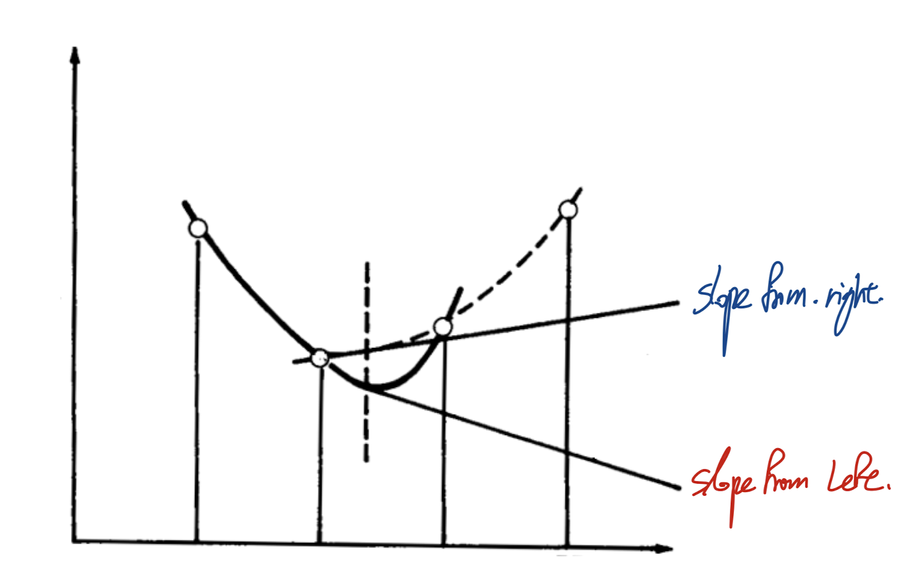
만약에 k가 P,E사이에서 달라진다고 가정하자.
그렇다면 ke는 어떻게 계산해야하는지? 는 다음 쳅터에서 다룬다.
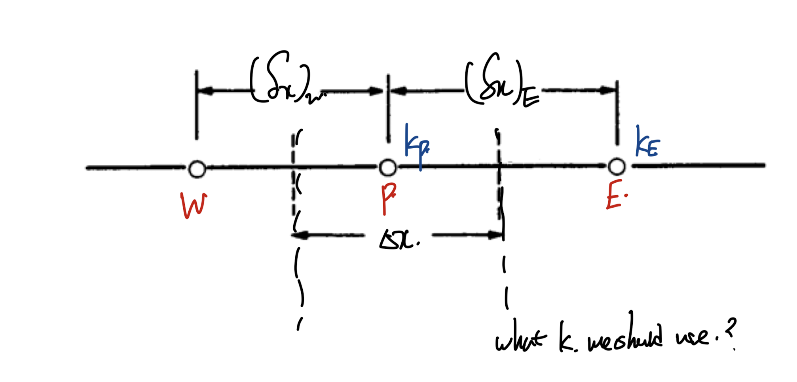
즉 온도 문제에서는 heat flux는 무슨일이 있어도,
한 점에 대해서 왼쪽 오른쪽이 같아야
-> realistic
2. positive coefficients.

자 W,P,E의 해를 구한 상황에서
E의 온도만 올리고 다시 해를 구하려고 한다.
만약에 aE < 0 이라면 (위 algebraic 식에서)
그렇다면 Tp는 이전해보다 감소할 것이다.

이는 physically impossible이다.
점E에서 온도를 올리면 올릴수록 P에서의 온도가 떨어지는게
현실적으로 불가능하다.
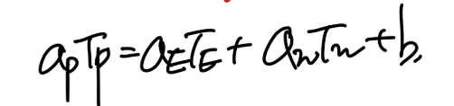
algebraic eq we derived from the differential eq we wanna solve
따라서, aP, aE, aW는 전부 양수이어야 물리적으로 타당하다.
3. negative slope-linearization of source term.

Linearized source term
다음 쳅터에서 바로 다루겠지만,
실제로 source term = S(T) 시간에 따른 함수이다.
(보통 quadrtic, polynomail eq)
이를 우리는 algebraic eq으로 바꿔주기 위해서,
source term linearizeation을 진행하여 위의 form으로 fix해준다.
여기서 책의 저자는 SP가 무조건 0보다 작거나 같아야 한다고 말하고 있다.

3rd rule from the 4 basic rule for the realistic algebraic eq.
먼저 만약에 SP가 음수라면, linearized source term을 대입한 algebraic eq에서

2번째 규칙을 위반할 수 있다. 왜?
TP의 계수가 음수일 여지가 존재하기 때문이다.
4. sum of the neighbor coefficients.

a_nb - neighbor coefficients

우리의 문제로 치면 a_p = a_E + a_W 이어야 한다.
이는 사실 간단하게 증명할 수 있다.

먼저 source term이 존재하지 않는 상황에서, 미분방정식의 특성상 상수를 해에 더해도
미분을 하면 사라지게 된다.

따라서, 이 성질을 Algebraic Eq에서도 볼 수 있어야,
미분방정식을 well 전환시켰다고 할 수 있다.

더하여, 만약 source term 이 없는 상황에서 주변의 온도가 모두 동일하면
당연히 그 해당점도 주변온도와 같아야 realistic한 솔루션이므로,

아주 근 길을 읽으시느라 수고하셨습니다..
굉장히 많고 중요한 내용이 많은 관계로 summary 글을 따로 작성하였습니다~
큰틀을 다시한번 remind한다는 생각으로 고고
