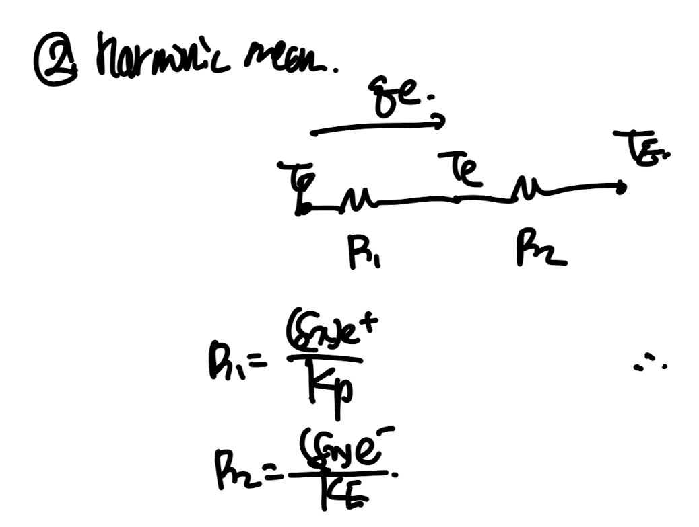
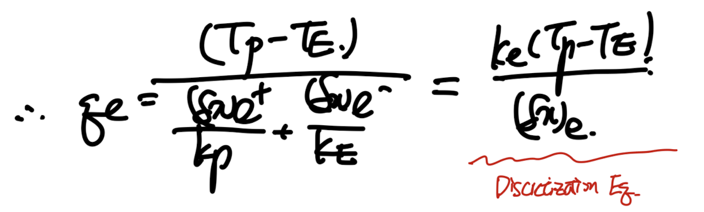
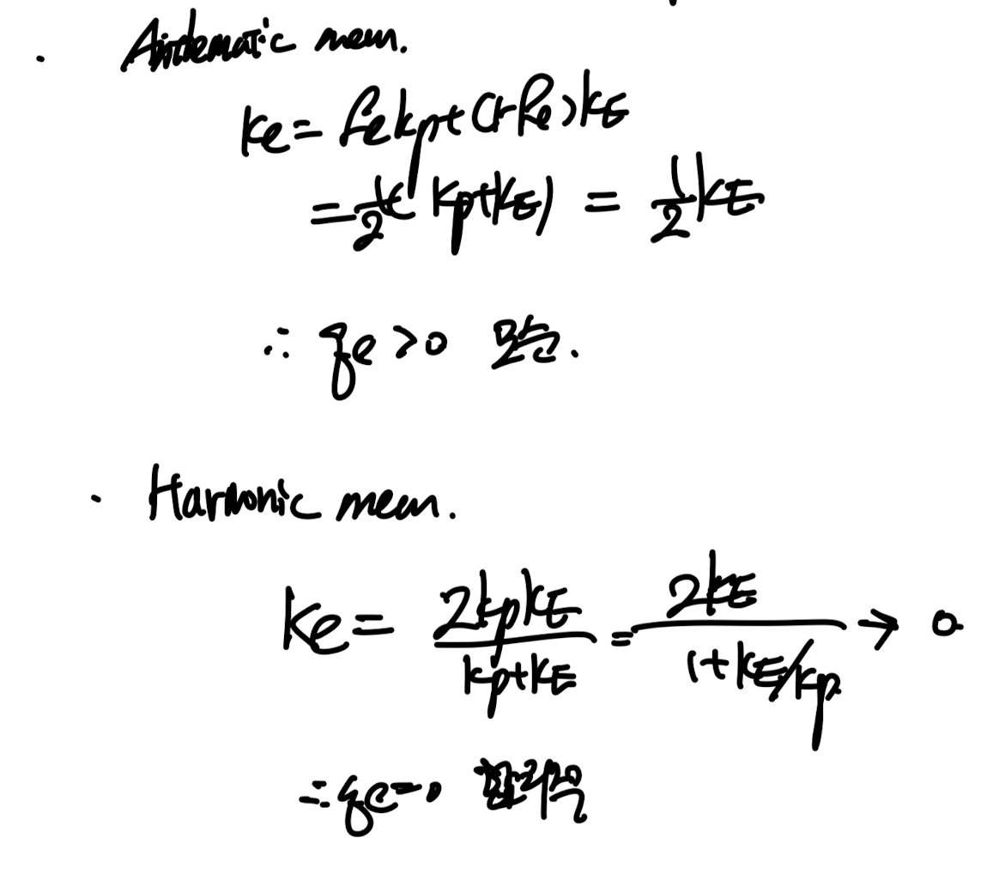
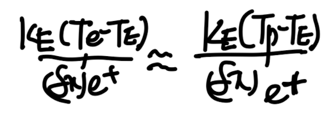

Source: [https://jeffdissel.tistory.com/188](https://jeffdissel.tistory.com/188)

이제 heat conduction 문제를
지금까지 배운 이론들을 가지고 풀어보자.
Steady 1D Heat conduction w/ Source term를 가지고 연습을 진행해보자.

위 식을 ch3에서 배운 Method of Weight Residual방식으로
적분함수로 바꾸면 다음과 같다.

위 문제를 discretization equation으로 바꾸는게 우리의 목표이지만,
바꾸는 과정에서 몇가지 짚고 넘어가야할 부분들을 체크하자.
1. Harmoninc Mean
여기서 control volume으로 domain을 쪼개고 위 식을 각 cv마다 적용하려면,
사이 interface에서 heat conductivity k_e가 요규된다.
하지만 만약에 P,E가 서로다른 material domain이라,
x=e를 기준으로 material이 바꾼다면??

ke = kP? KE?
우리는 ke를 특정 규칙에 따라 정의해주어야 한다.
첫번째 방법
은 그냥 interpolation즉 P,E로의 거리비율을 이용하여,
ke를 정의하고 'Arithmetic Mean'이라고 칭한다.

(가장 간단한 방법)
두번째 방법
은 Harmonic Mean즉 열전달 시간에 배웠던,
Thermal resistance, Current 개념을 사용하여 계산하는 것이다.
물질은 다르더라도 Heat flux(current)는 동일하다는 점을 이용한다.

위 diagram처럼 각 thermal resistance를 구할 수 있고,
이를 Total Thermal resistance dx_e/ k_e로 정의하여 다음과 같이 식을 유도가능하다.

만약에 grid 간격이 일정한 상황(center node on the CV)이라면,
우리는 다음과 같이 ke를 Kp,KE의 함수로 유도가능하다.

we call 'k_e' as harmoninc mean
자 위에서 정의한 두 방식중 어느 방식이 더 물리적으로 타당한지를
한번 살펴보자.
1. 단열 boundary condition의 경우

Insulation at Node 'P' - no heat flux q'p = 0
즉, k_p -> 0 인 경우이다.
각 Arithmatic, Harmonic mean을 살펴보면, Arithmetic인 경우 qe > 0 이라는 모순이 나오게 된다.

결론적으로 Harmonic Mean 이 Insulated BC에서 더 물리적으로 타당하다.
2. Abrupt Material property variation(Kp>>KE)
열전달 시간에 분명히 다루었을 문제이다.
만약에 K값이 급격히 변하면 Temperature gradient(T-x graph 기울기)가 급격하게 바뀐다.
여기서 실제로 KP가 너무 크기때문에 TP ~= Te임을 이용하여,
heat flux를 다음과 같이 e-E영역에서 P-E영역으로 확장시킬 수 있다.

따라서, total Thermal resistance - dx_e+/KE임을 알 수 있고,
이는 우리가 ke를 이용하여 표현한 heat flux와 동일해야하기 때문에,

Fe = 0.5가정을 하면, ke = 2KE
자 이제 맨처음 정의한 Arithematic, harmonc mean식에
Kp >> KE를 적용하면 다음과 같이 ke가 유도된다.

즉 결론적으로,
ke = 2KE 가 Physically meaning(Heat flux is constant)한 것을 위에서 증명하였고,
이 결과는 Harmonic Mean 가정에서의 ke와 동일함을 알 수 있다.
Therefore,
Harmonic Mean is More physically reasonable for the
'Insulated BC' and 'Interface consistency'
compared to the 'Arithematic Mean'
라고 우리는 결론을 지을 수 있다.
