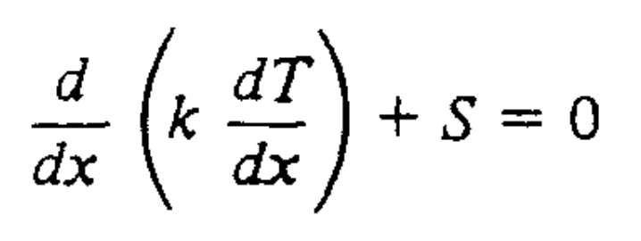
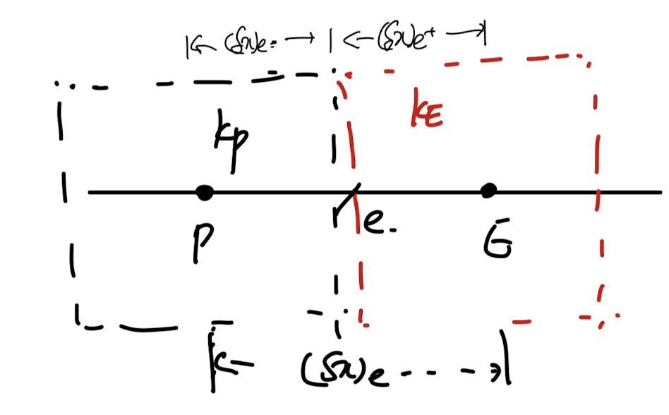
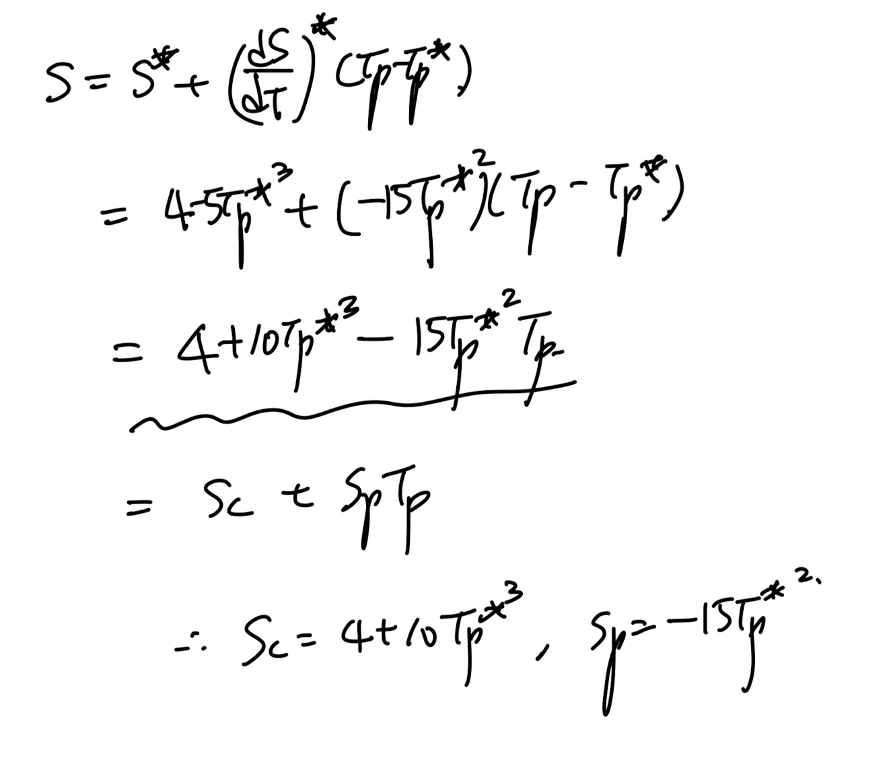

Source: [https://jeffdissel.tistory.com/189](https://jeffdissel.tistory.com/189)

다시 우리가 무엇을 하고 있냐면,
밑의 PDE를 이제
discretized(Algebraic) Eq
으로 전환시켜,
컴퓨터가 풀수 있도록 전환하는 것이다.

Steady 1D heat conduction Eq w/ source Term

discretized(Algebraic) Eq form
#Poped up Question in my mind.
여기서 그렇다면 뒤에 항상 따라 다니던 Source term 저 녀석은 어떤 form일까?
실제 물리적으로 Source term이란?
1. Control Volume안에서 발생하는 Energy per volume
2. 외부에서 Control Volume으로 들어오는 Energy per volume
을 종합적으로 한가지 term으로 표현한것이 - Source.

예를들어, 원자력을 분석한다고 하면 원자반응이 에너지를 만들고,
그 에너지 per volume이 source term일 것이다.
혹은 Radaition을 받았다고 가정하면,
에너지를 cv이 외부로 부터 받는 것이다.
즉,
"중요한 것은 Source term은 대부분 온도에 따른 함수"
이다.
온도는 cv 내부에너지량을 의미하고, 그 에너지량의 크기(온도의 크기)에 따라서
같은 외부라도 들어오는 에너지량이 달라질 것이다.
(즉 온도에 따라서, 내부 에너지발생량, 외부에서 들어오는 에너지량이 달라짐)
-> (Source term 은 온도에 따라 달라짐)

Example of Source term along w/ the Temperature
#위 그래프의 TP*의 의미.
ch4중간에서 다루겠지만, 결국 우리는 iteartion method를 사용한다.
다시말해 각 CV마다 TP값을 계속해서 수정하여 최적의 해를 찾는 것이다.
그렇다면 여러번 TP를 구해야하고, 구하는 식마다 Source term이 필요한 상황.
그리고 현재 iteartion기준 바로 직전해가 TP*이다.
(바로 다음 블로그에서 iteration method에 대해서 다룰 예정이니,
가볍게 넘어가자)
________________________
다시 원점으로,
source term이 T에 관한 함수인 것은 알겠다. 근데
위 그래프를 보면 polynomial or qudaratic
which are
non linear function
인 경우가 대부분이야.
하지만, 우리는 최종적으로 Discretized Eq form으로 만드는게 목표
(저 form이어야하는 이유는 컴퓨터 연산을 하기위해서 였음, ch2)

discretized(Algebraic) Eq form
결국 Non linear Source term -> Linear Source term
(Linearization)
작업을 해주어야 한다는 말이다.
위 설명한 흐름을 정확히 책에서는 다음과 같이 언급한다.
"Our
Nominally Linear Framwork
would allow only
a formally linear dependance"
(Nominally linear framework가 우리가 강제한 algebraic eq을 뜻한다)
결국 만약에 S = 4 - 5T^3 함수 꼴이라고 가정하면,
이를 Sc, Sp로 표현된 직선함수 형태로 바꾸어 주는 작업을 해주어야 한다.

위 함수를 직선화시키는 방법은 다양한 방법이 있을 것이다.
(밑의 그래프)단순히 1,2,3,4 모두 직선이기 때문이다.
(patankar의 책의 흐름은 결국)
최적의 방법 = Most physically and naturally reasonable method.
라는 것을 알 수 있다. 위 관점에서, 1,2,3,4중에서 어느 직선이 최적의 방법인지를 이해해보자.

Example of Source term along w/ the Temperature
결론적으로는 3번이다. gradient가 기울기인 직선,
즉 TP"인 저 점에서 given curve를 굉장히 확대를 하면, 결국 접하는 접선과
비슷한 함수의 형태일 것이다. (Taylor Expansion)
그리고 우리의 관심사는 TP"에서의 source term이기 때문에 우리는 저 함수를 택한다.
접선의 기울기는 고등학교 1학년때 배웠던 것같다. 저점에서의 1st order derivative를 기울기로,
그 점을 지나는 직선을 구하면 SP, SC를 다음과 같이 도출 할 수 있다.

