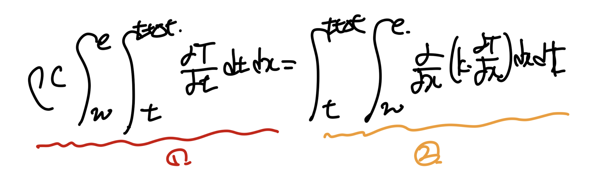
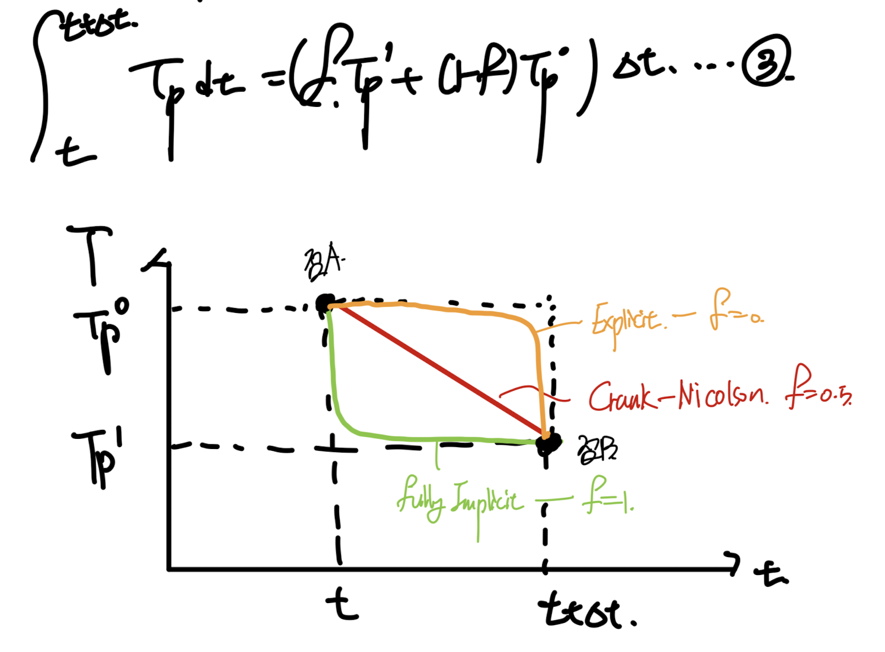
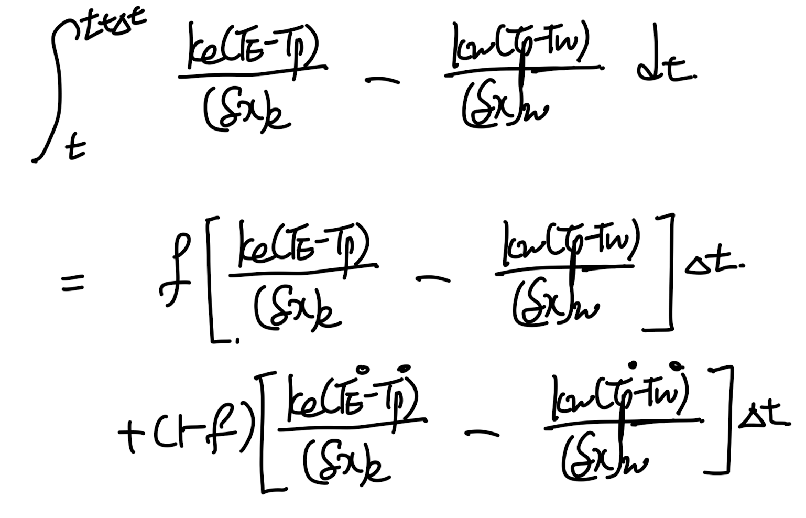
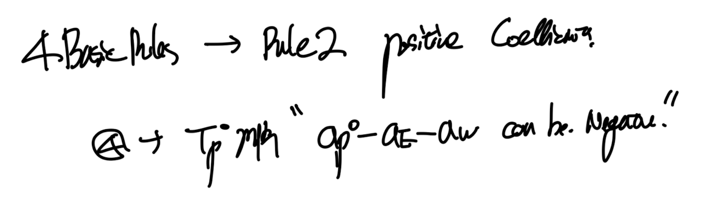
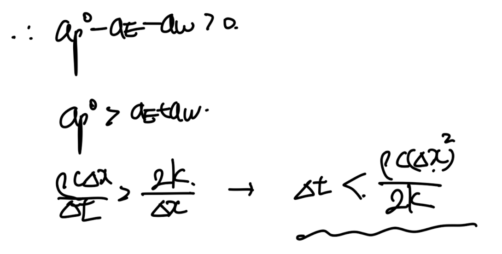
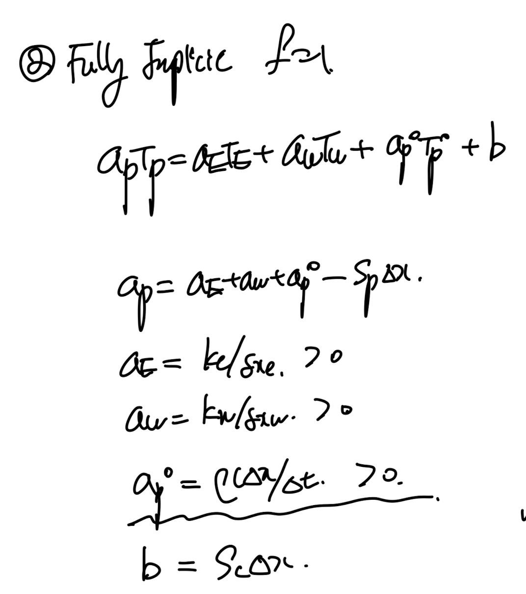

Source: [https://jeffdissel.tistory.com/192](https://jeffdissel.tistory.com/192)

처음으로 돌아가서,
우리는 지금
differential
eq을
algebriac
eq으로 변환하는 방법에 대해서 다루고 있다.
General Differential Eq
은

e,g) Energy Equation(unsteady + convection = diffusion + source )
Unsteady, convection, diffusion, Source
이렇게 4가지 term이 존재함을 ch2에서 살펴 보았다.
그 중에서 우리는 2가지 항,
diffusion term
을 어떻게
미분항을 제거할지에 대해서 살펴보았고,
https://jeffdissel.tistory.com/182
Ch3 Discretization method - part3 (4 Basic rules)
우리가 무엇을 하고 있는지 점검해보면, differnetial equations -> algebraic eq으로 전환시켜주고,컴퓨터가 연산하는 방식으로 진행한다. 문제는 전환을 어떻게 시키냐 이다.(전환예시) 최종 변환된 algebr
jeffdissel.tistory.com
+ Source term
을 linearize하는 방법도 다루었다.
https://jeffdissel.tistory.com/189
Ch4 Heat conduction - part2 (Source term Linearization)
다시 우리가 무엇을 하고 있냐면,밑의 PDE를 이제 discretized(Algebraic) Eq으로 전환시켜,컴퓨터가 풀수 있도록 전환하는 것이다. #Poped up Question in my mind.여기서 그렇다면 뒤에 항상 따라 다니던 Source t
jeffdissel.tistory.com
자 이제 남은 두가지 항들을 차례대로 어떻게 algebriac form으로
다시말해, 미분연산자를 제거할지를 다루어 보자.
이번시간에는 그 중에서
unsteady term
이 key topic
우리의 목적(unsteady term다루는법)을 달성하기 위해,
convection, source term을 제거한 Energy eq을 다음과 같이 살펴보자.

No convection and source term based (1D Unsteady diffusion heat equation)
1. Discretize the domain.
1D 상황이고 우리가 분석할 Tp가 중심노드인 Control volume(CV)
그리고 양 옆에 E,W가 중심노드인 CV로 설정하자.

(그 사이에 존재하는 interface x = w, x = e)
2. Intergal the differential Eq.

ch3에서 우리는 control volume method가 어떤식으로,
integral form을 구성하는지 명확하게 다루었다.
(ch3 blog 꼭 읽고 오셔야 됩니다!)
즉, 우리는 Control volume 각각에대해서 integral eq을 만들고, 연립을 진행한다.
따라서 먼저 P가 중심노드인 CV에 대해서 적분식을 위처럼 세워보자.
For simplicity,
여기서 우리는 미래온도와 현재 온도를 1,0으로 표기하자.

먼저 1번의 시간 적분을 우리는 다음과 같이 전환가능하다.

2번 항 같은 경우는 우리가 x를 ch3에서 배웠던, Linear profile 가정을 통해서
diffusion term을 algebraic form으로 다음과 같이 전환가능하다.

여기서 우리는 위 적분을 진해하기 위해서는,
각 노드점에서 T가 시간에 따라 어떤 profile인지를 정의해야한다.
(그래야 적분을 진행할수 있음 on the (t, t+ Δt) interval)
여기서 ch3에서 우리가 diffustion term을 linear profile로 설정할때,
profile설정 방식이 존재하였다.
'바로, 최대한 simple profile should be selected'
&
'Should be Physically realistic'
가장 간단한 profile은 step wise function, 상수함수이다.

Step wise Profile of the temperature on each control volume.
(diffusion term같은 경우는 위 stepwise로 하면 안되었던 이유를 복습해보면,
적분을 취해도 미분항이 남기는데, x = w,e에서는 위의 경우 정의가 되지 않기 때문이다)
하지만, 지금의 time profile같은 경우는 우리가 stepwise도 가능하다
(그저 상수이기 때문에)
따라서, 우리는 다음과 같이 3가지 profile에 대해서 분석해볼 수 있다.
- Two Step wise profile(orange, green)
- A linear profile(red)

왜 2개의 step wise profile인가? 라는 질문을 한다면
T = T1 즉 미래 시간으로 일정 한 green profile
T = T0 현재 시간으로 일정한 Orange proifle
이렇게 2가지가 존재할 수 있다.
(짚고 넘어가야 할것은, 우리가 T-x에 대해서 profile은 diffustion term으로 Linear profile을
선택하였다. 하지만 여기서는 T-t profile이기 때문에 우리가 다른 Profile을 선택하여도 상관이 없다)
여기서 우리는
Fully Implicit(T1 step wise profile)
Explicit(T0 step wise profile)
Crankc - Nicolson(linear profile)
이렇게 3가지 로 칭한다.
일단 간단한 profile3가지를 살펴보았고, 이제 profile선정 기준 에 의해
physically realistic 한가? 라는 질문을 우리는 해봐야 한다.
(let us recall what we've learned on Ch3)
ch3에서 언급한 Patankar(author of the book, 'Numerical Heat Transfer and Fluid Flow')
는 physically realastic조건을
4가지 규칙
로 정의했었다.
https://jeffdissel.tistory.com/182
Ch3 Discretization method - part3 (4 Basic rules)
우리가 무엇을 하고 있는지 점검해보면, differnetial equations -> algebraic eq으로 전환시켜주고,컴퓨터가 연산하는 방식으로 진행한다. 문제는 전환을 어떻게 시키냐 이다.(전환예시) 최종 변환된 algebr
jeffdissel.tistory.com
3가지 profile을 하나하나 대입하여, 4가지 규칙을 만족하는지 살펴보자.
그전에 우리는 3가지 profile을 3번의 식으로 나타내면,
f = 1 -> Fully implicit, f = 0 -> explicit, f = 1/2 -> Crank - Nicolson

3번 식을 2번 항에 대입해주면,

T1 -> T로 표기하였습니다(t +Δt 에서의 온도) , T0 - t에서의 온도.

이제 1 = 2식에 대입해주면,

우리가 원하는 discretized form으로 도출된다.

#Explicit Method( f = 0, T0 - step wise profile)

다시말해, 우리는
점 P에서의 미래 시간 온도
를 예측하고자 하는데,
필요한 값은
이전시간
의 현재 노드(P)와 주변 노드(E,W) 온도 값이다.
현재의 온도데이터들의 조합으로 미래 온도를 예측하기 때문에,
모든 재료들을 가지고있는 명백한 연산이므로 Explicit 라고 부른다.
자 여기서 우리는 4basic rule중에서 rule num 2 를 obey할 수 있음을 알 수 있다.

따라서, 우리는 time step이 아래와 같이 criteria보다 작아야 물리적으로
만족하다고 정의할 수가 있다.

positive coefficient가 4basic rule에서 어떤 물리적 제약인지를 살펴보면,

현재 온도를 증가시킬수록 미래 온도가 감소하는 Unrealistic 한 결과가 나옴을 알 수 있다.
#Fully Implicit Method( f = 1, T1 - step wise profile)
똑같이, f = 1을 4번 식에 대입해주면, fully implicity algebriac Eq을 도출할 수 있다.

아주 신기하게도, 모든 coeff가 양수이므로, Explicit와 다르게 rule2는 만족한다.
결론적으로 fully implicity가 explicit보다 물리적으로 더 타당함을 우리는 알수 있다.
