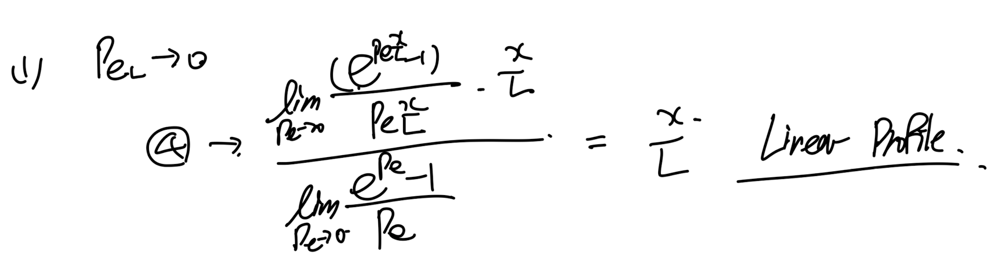
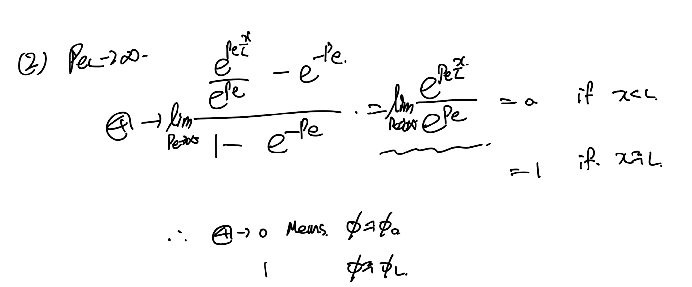

Source: [https://jeffdissel.tistory.com/m/196](https://jeffdissel.tistory.com/m/196)

Ch5 Convection and Diffusion - part2 (exact solution vs upwind scheme)
우리가 part1에서 convection term을 새로운 stepwise funciton.
upwind scheme
을 토대로, algebriac eq을 도출하였다.
어디까지나 우리가 궁극적으로 하고 있는
differential eq -> Algebriac eq은
approximated Solution이다.
upwind shceme이 4basic rule은 잘 만족하지만,
exact solution과 비슷한지도 체크 해보기 위해서,
우리가 지난시간에 discretize -> integral로 진해하였던

1D Steady convection diffusion Eq.
의 exact solution을 analytically 구해보자.
간단하게 적분을 먼저 두번 진행해주자.

여기서, boundary condition을 통해서 계수들을 구해주자.

간단한 Form으로 변환하기 위해서, 다음과 같이 연립해주면

Definition of Pecelt number.
4번 식을 잘 살펴보면 Pecelt number에 따라서 Function profile이 다르게 나타난다.

Pecelt numer -> zero

Peclet number -> + inf.

Peclet number -> - inf
여기서 Pecelet number 에 따라 4번식을 그래프로 표현하면 다음과 같다

자세히 살펴보면,
p = 0 -> central difference shceme
p = -inf, inf 에서가 upwind scheme.
위 그래프의 Exact solution의 물리적 의미를 이해하기 위해
Pecelt number를 살펴보면, 아주신기하게도 F,D의 비율이다.

Pe = Convection Strength / Diffusion conductance = F / D
즉 Pe 가 크다면 -> 대류가 지배적이고,
작다면 -> diffusion 이 지배적이다.
물리적의미를 정확하게 상상하면서 이해해보자.
A -> B로 유체가 흐른다고 가정하자.
우리는 A,B사이에서 유체의 scalar 값이 A,B각각의 값과의 관계식을 알고 싶다.
1. 대류가 굉장히 강하다면,
A->B로 강한 유체의 흐름이 존재하므로,
(A,B) interval은 A의 성질을 대부분 띌 것이다.
즉 대류의 strength 가 강하다 ->
F>>D
-> large Pe
따라서, Pe가 굉장히 큰 경우 그래프를 살펴보면
step wise profile(전부 A의 값을 띔) 이다.
2. 분산이 굉장히 강하다면,
이때, 유체가 A에서 B로 흐른다 하더라도, 대류가 약하므로 유체는 방향성을 거의 갖지 않고,
오히려 분자운동에 의한
확산
이 지배적인 메커니즘이 된다.
따라서
어느 한쪽 (예: A) 의 특성이 일방적으로 전달되기 어렵고
,
A와 B의 상태는
서로를 향해 섞이면서
중간값으로 점진적으로 수렴하게 된다.
이런 물리적 상황에서, A에서 B로의 스칼라 양(예: 온도, 농도 등)은
거리의 함수로 선형적으로 변화
하게 되며,
A와 B를 선형으로 잇는 직선 (linear profile)
형태를 보인다.
즉 결론적으로, Upwind scheme(step wise profile)은 대류가 지배적인 상황에서는 잘 맞지만,
diffusion 이 큰 경우는 central difference scheme(linear profile)에 더 맞다는 것이다.
그러기에, exact solution을 이용한 새로운 scheme이 존재하며, 다음 Part 에서 이를 바로 살펴보자.
