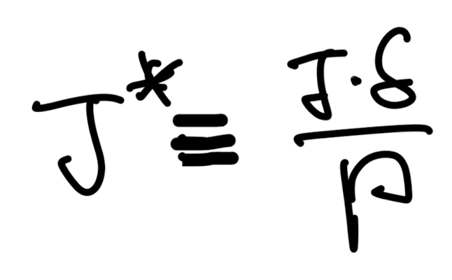
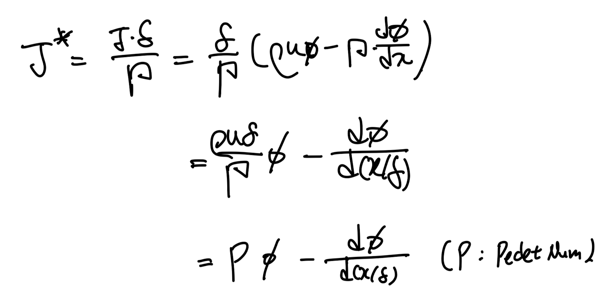
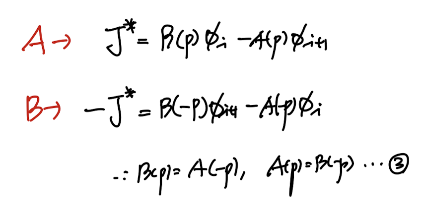
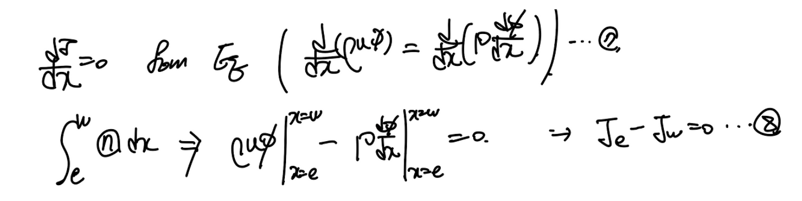
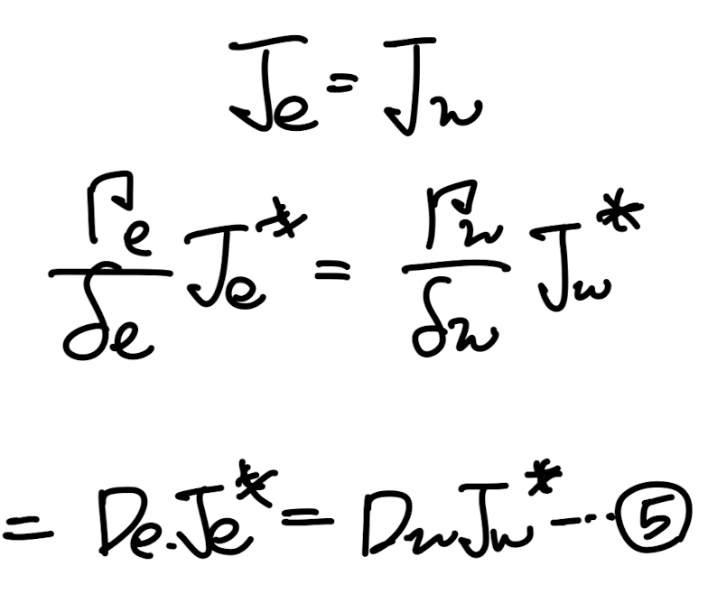
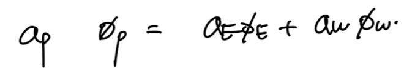
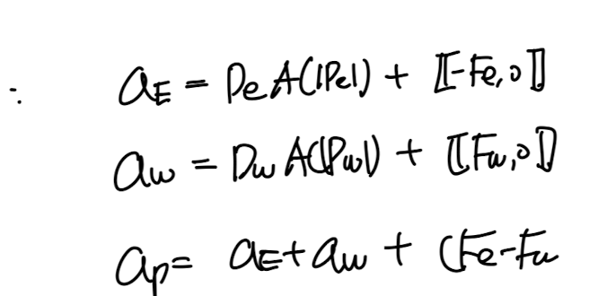

Source: [https://jeffdissel.tistory.com/198](https://jeffdissel.tistory.com/198)

지금까지 배운 (Convection scheme들을 종합적으로 표현해보자.
일반화를 하여, i, i+1가 중심인 두 control volume grid사이의 간격을
delta라고 하자.

이때,
'Dimensionless Total flux J crossing an interface between grid points'
을 다음과 같이 정의하자.

dimensionless total flux J*
자 우리가 기존에 알고 있던 total flux(J)를 위 정의에 대입해주면,
다음과 같이 Pecelt number(P)로 나타낼 수 있다.

여기서, i, i+1 노드로 구성된 각각의 control volume에서
interface를 임의로
x = w
라고 설정하자.

우리가 궁극적으로 하고자 하는 것은,
discretize equation에서 convection term항에
interface scalar 값( Φ_w )
이 존재하고,
이를 grid point 값
Φ_i, Φ_i+1 로 표현하는게 목표이다.
따라서, 우리는 임의의 coefficient alpha, beta를 일단 설정하여,
다음과 같이 표현 가능하다.
(사용하는 scheme에 따라서 alpha, beta가 결정된다)

[나만의 언어로 다시 치환]
다시 표현해보면,
grid point값
( Φ _i, Φ_i+1 )
들로 결국 interface 값(
Φ_w
)이 표현이 되는데,
사용하는 convection shceme에 따라서 표현방식이 달랐다.
이를 일반화하기 위해 alpha, beta를 이용하여 일단 grid point값으로 표현하고,
shceme에 따라 alpha, beta를 다르게 설정해주는 것.
중요한 것은 alpha, beta가 shceme에 따라 달랐고, hybrid, power law and expotential scheme
같은 경우 Pecelt number에 따라 표현식이 달랐다.
따라서, alpha, beta도 Pecelt number에 대한 함수임을 암시할 수 있다.
위의 새로운 표현식을 J*에 대입해주면, 아래 1번식과 같다.

편의상 계수를 A(P), B(P)로 각각 표현하자. 둘다 dimensionless function of Peclet number on the interface.
(다시 강조할 점은, alpha beta모두 Pe의 함수이므로,
주함수 A,B도 pecklet number를 parameter로 하는 함수이다!)
alpha, beta로 A,B를 1번식 과정에서 다음과 A(p), B(p) 다음과 같이 표현하였고, 2식을 도출 할 수 있다.

여기서 재밌는 것은 똑같은 control volume setting에서 모든 P,J가 같다고 했을 때,
단순히 coordinate를 반대로 뒤짚어 보면 다음과 같이 그릴 수 있고,

각각에 대해서 J*을 구하면
A,B끼리의 symmetric 성질
을 찾을 수 있다.
따라서, A,B와의 특별한 관계식 3을 유도할 수있다.

여기서 2,3 성질을 이용해서 |P|를 이용하여 A함수를 나타낼 수 있다.

따라서, 우리는 max function을 이용하여 A(p), B(p)를 다음과 같이 표현가능하다.

자 이제 다시 우리가 풀어야할 differential equation로 돌아가보자.

1D Steady convection diffusion Equation.
여기에 total flux개념을 살펴보면, 6번식을 x로 미분하게 1번식임을 알수 있다.

(7번 - 1번식임, 우리가 풀어야 할 미분방정식을 적분해주면 Je = Jw라는 8번식이 도출된다.

따라서, 8번식에 이제 다시 새롭게 정의한 dimenesionless total flux를 이용하여 표현해주면

자 이제 interface x= e,w, 에서의 J*를 가정한 1번 방정식 Form 으로 표현하면 6번과 같다.

이후에, 6번 식을 5번에 대입해주면 우리가 원하는 algebriac form으로 도출된다.

계수들은 Bw, Aw, Be, Ae. 함수들을 전부 전개해주면 다음과 같다.

정리하면,

즉, scheme 별로 alpha, beta -> A(p) , B(p) 가 바뀌게 되고,
A(|P|)하나의 변화로 4가지 경우의 계수를 고를 수 있게 된다.

