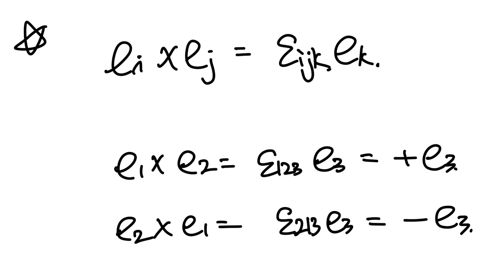
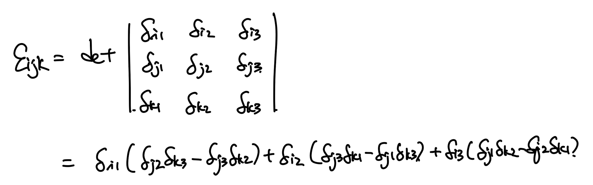
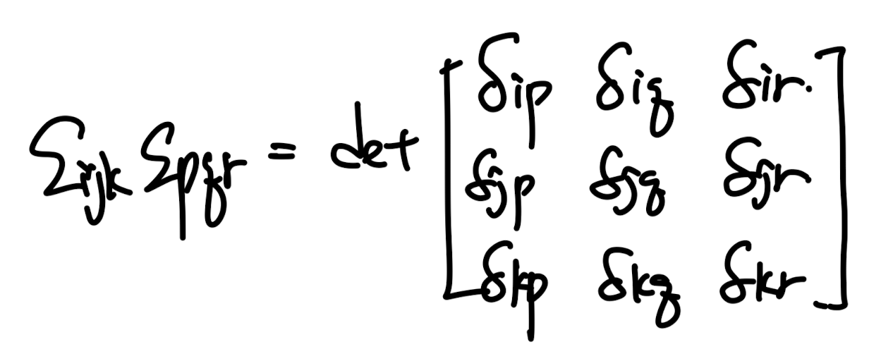
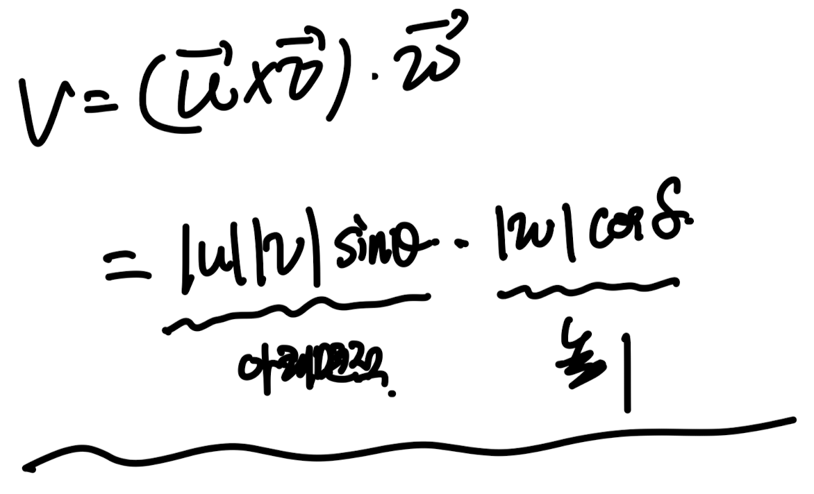
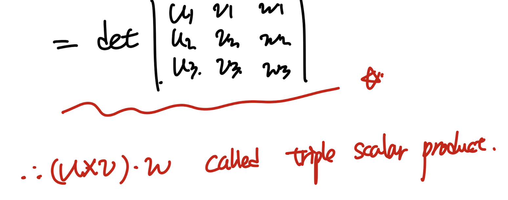
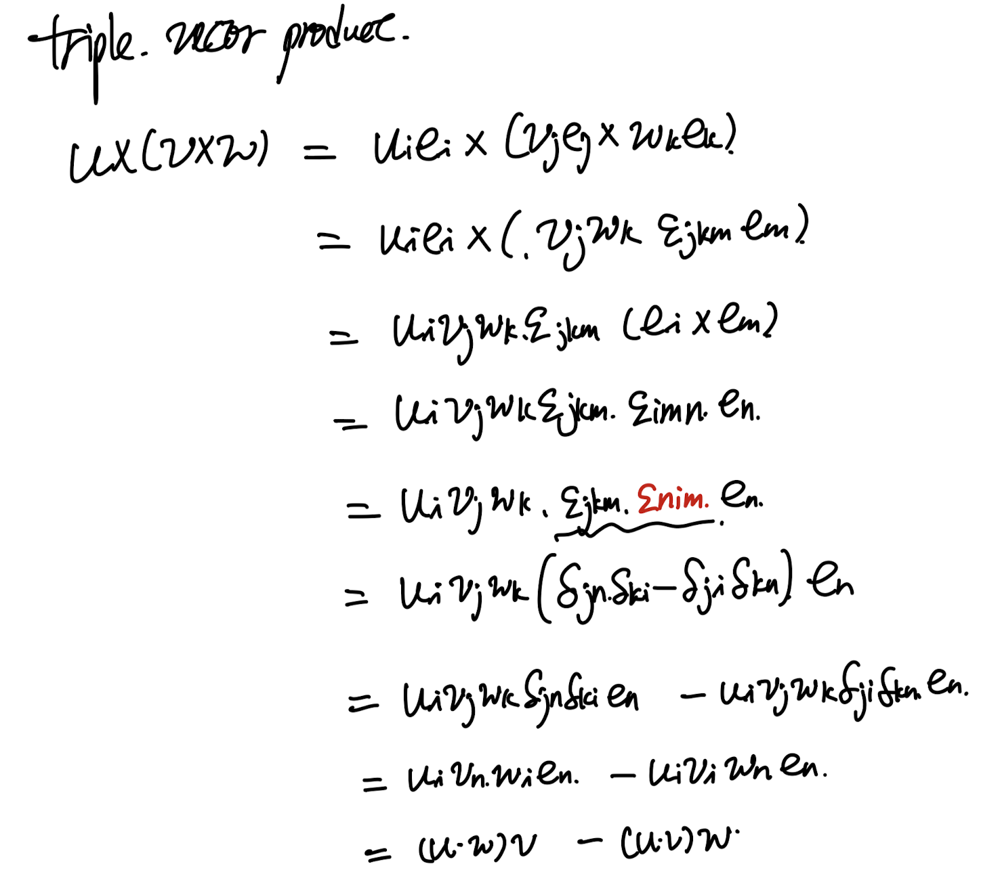
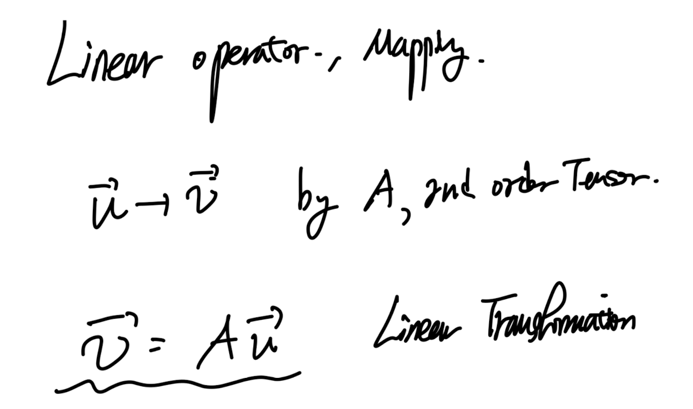
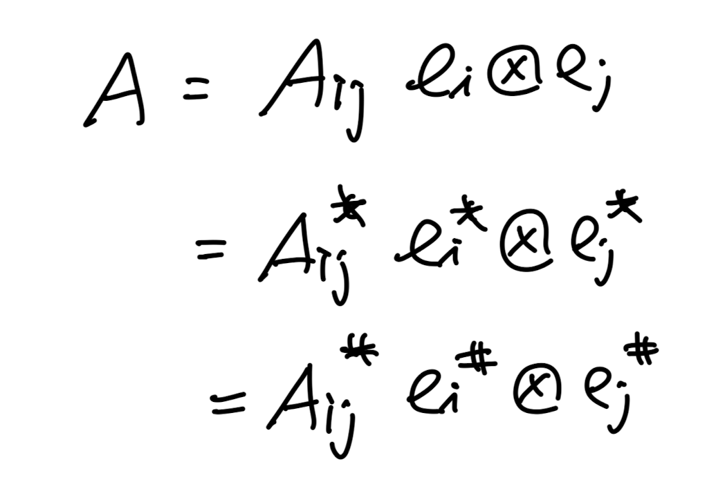
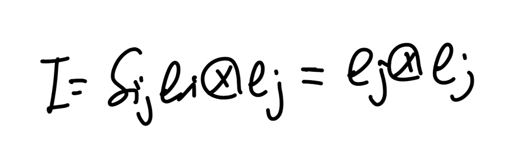

Source: [https://jeffdissel.tistory.com/168](https://jeffdissel.tistory.com/168)

이번 포스터에서 다룰 내용.
1.1 Algebra of Vectors
1.2 Algebra of Tensors
고체역학에서 가장 기본적이고도
가장 중요한 단원이다.
여기서 정확히 정의들을 머리에 넣지 않으면,
뒤에 내용을 아예 이해를 못한다.
그리고 무엇보다.
손으로 쓰기 전까지는 완벽하게
알수 없다는 것을 깨닫는 단원;;;
계속해서 종이에 써야하는 단원이다.
__________________
1.1 Algebra of Vectors
벡터는 고등학교때 배웠던 기억이 난다.
어떠한 크기, 방향을 가지고 있는 element in space.
스칼라는 방향성이 없고 scale만 있는 Element였다.
여기까지가 고등학교 내용이고,
심화과정에서 우리는 index notation을 이용해서
위 벡터를 '표기'한다.
벡터여러개로 이루어져 있는 식은
각기 다양한 방향으로 각 벡터들이 구성되어 있을 것이므로,
그 방향에 대한 표기를 해주어야 한다.
따라서 우리는 방향을 'Index'를 이용해서 표시해준다.
벡터들중에서 가장 기본적인 벡터는 basis vectors이다.
(좌표공간을 이루는 기저벡터)

3개의 벡터가 있다면 우리는 1,2,3이렇게 각 방향별로 subscript로 표시해준다.
여기서 아주 재밌는 것은,
uiei이렇게 같은 index기호가 반복된다면
(i가 2번 쓰임, 반복됨)
i: dummy index 라고 부르고,
summation을 진행해준다.
즉, u1e1 + u2e2 + u3e3 = uiei가 된다.
1,2,3으로만 더하는 이유는
i = 1,2,3 3개 존재하기 때문이다.
(지금 예시에서는 3방향 존재하는 상황)
예시를 살펴보자.

(우항만 보자)
k가 반복됨을 알수 있으므로,
k : dummy index,
반면에 i는 한번만 쓰였다.
이경우 free index라 부르고 summation하지않고,
그대로 놔둔다.
이제,
index notation를 이용하여 아주 자주 쓰이는 기호들을 정의해보자

Kronecker Delta, e1,e2,e3 are basis vectors.
너무 많이 쓰이는 기호이다.
i = j이면 같은 벡터끼리 내적이므로
|e1|이 나오는데, e1은 단위벡터이므로
크기가 1임을 알수 있다.
i와 j가 다르면 수직이므로 0인것은 자명하다
이 기호가 굉장히 많이 쓰이는 이유는 바로 Replacement operator로 작용하기 때문이다.

즉 i =.j가 아니면 전부 0 이기때문에,
강제로 i = j인 항들만 살아남게 된다.
예를들어 두번째 예시에서,
δij ui = uj
즉 i -> j로 교체되었다.
ei * ej = δij
이 식은 꼭 기억하자 너무 많이 나온다.
(밑의 식 쉽게 증명가능)

두번째로 많이 쓰이는 symbol은 permutation이다.
신기하게 ijk즉 3개가 index로 존재하는 3rd order tensor이다.

먼저 i,j,k중 중복되는 index가 존재한다면 거침없이 0 이다.

다음, ijk가 곂치지 않을때
여기서 even, odd가 느낌이 잘 안올 수 있지만,
이렇게 시계방향으로 1,2,3을 작성하고,
ijk순서가 1,2,3의 시계방향과 일치하다면 +1
일치 하지 않으면 -1이다.

그렇다면 우리는 왜 저런 이상한 symbol을 만들었을까?
바로 외적을 간단하게 Index notation으로 표현가능하기 때문이다
(Kroncker delta는 replacement로 유용했음.
이번에는 외적에 유용함)

permutation symbol을 이용해서는 괴상하게 생긴 식들이 굉장히 많다.
침착하게 한개씩 살펴보자.

일단 우항을 잘 보면, ijk가 중복된다면 무조건 0 임을 알수 있따.
예를들어 112라고 하면
δ11만 살아남으니까 우항 첫번재만 살아남는다.
거기 안에서
δ12 δ13 - δ13 δ22 = 0
즉 j,k중 1이 들어가기만 하면 무조건 0 임을 알수 있다.
다시말해 i = 1일때 j,k는 1이 없어야 한다는 것,
i = 2일때 jk는 그렇다면? 2가 없어야 할것이다.
그렇다면 i = 1일때, j=k=2라면?
j=k가 되는 순간에도 괄호안이 0이라는 사실은 자명하다.
외울필요는 없고, 저렇게 permuation이
Kronecker Delta와 determinant식으로 표현이 되구나만
인지하면 된다.
permutation 2번째 식.

일단 전개를 해보면,
(i,j,k) (p,q,r)각각 중복항이 없어야 함을 알수 있다.
즉
δip, δiq, δir중 한개만 0 아닐 것이다.
임의로
δip = 1이라고 하자.

그리고 ijk, pqr이 각각
permutation방향이 같을 때 다를때 로 나뉠수 있다.
둘이 방향이 같다면 +1, 다르다면 -1이라는 것을 알수 있다.
(증명완료)
3번째로는 ijk, pqk즉 k = r인 경우이다.
우리가 위에서 determinant식을 증명하였으므로, r에 k를 넣기만 하면된다.

이번에는 ijk, pjk, i p만 다른 경우랑
ijk ijk아예동일한 경우로 계산해보면 다음과 같다.

이렇게 permutation symbol과
Kroncker Delta와의 다양한 관계식들을 살펴보았다.
외울 필요가 없고 아 그냥 저렇게 관계식으로
쓸수 있구나 정도만 이해하면 될것같다.
가장 중요한 부분은 바로 volume을
벡터연산으로 나타내는 것이다.
밑 사진처럼 기울어진 사면체가 있을때, 각 변을 벡터로 표기하자, u,v,w

부피는 심플하게 두개의 변을 이루는 벡터를 먼저 외적하여 면적을 만들고,
높이는 만들어진 벡터와 남은 벡터를 내적하면 된다.

위 벡터식을
우리가 배운 index notation을 활용하면,
determinant를 이용하여 나타낼수 있다.

증명된 이 식은 너무너무 중요하다.
Triple scalar product of three vector은
해당 벡터들로 이루어진 사면체의 부피를 의미한다.

위식은 트리플 스칼라로 불리는 이유는? 결과값이 스칼라니까
이번에는 결과값이 벡터인 triple vector product를 진행해보자.
index notation을 이용하면 아주 쉽게 inner product로
찢을수 있다.

1.2 Algebra of Tensor.
지금까지는 벡터에 대해서 살펴보았고,
이제 Tensor를 살펴보자.
[Definition of Tensor]
: 다중 인덱스를 가지는 수학적 객체이며,
좌표계가 변할 때 그 성분들이 일정한 법칙에 따라 변하는 것
(지금은 와닿지 않겠지만 tensor에 대해서 쫙 이야기를 듣고
다시 정의를 살펴보자)
tensor의 간단하도 숨어져 있는 의미는 바로 mapping이다.
어떠한 벡터를 다른 벡터로 바꿔주는 역할을 바로 텐서가 한다는 것
(2nd order tensor의 경우)

위 그림을 보면 u 라는 벡터를 v라는 벡터로
방향과 크기 모두 바꾸어 버리는 linear transformation을 진행시키는
Linear operator가 바로 2nd order Tensor의 역할이다.
2nd order tensor는
Tensor product of two vectors
즉, 두개의 벡터를 tensor product라는 과정으로
2차 텐서를 제작할 수 있다.

정의를 기억하면 어떠한 계산도 쉽게 할수가 있다.
u (x) v 도 텐서이므로 결국 어떠한 벡터를 다른 벡터로 mapping하는 역할을 한다
mapping으로 전환된 벡터가 u방향에 크기는 v,w내적과 비례한 벡터로
전환하는 텐서가 바로 u (x) v 의 정의이다.

(사실 이렇게 정의를 보면 감이 잘 안오실 것이다)
(하지만 계속해서 등장하는 개념들이 이 정의가 어떤
의미인지 분명하게 해준다)
그리고 우리가 벡터를
기저벡터들의 linear 합으로 표현했던 것처럼.

(맨 처음에 배운 벡터 표기법)
(아주 중요하다)
텐서도 두 기저백터의 tensor product로 표현가능하다.

여기서 잠깐, tensor 자체의 정의를 다시한번 살펴보면,
: 다중 인덱스를 가지는 수학적 객체이며, 좌표계가 변할 때 그 성분들이 일정한 법칙에 따라 변하는 것
좌표계가 변할때 그 성분들이 일정한 법칙에 다라 변하는 것. 이부분이 hook이다.
즉 위에서는 기저 벡터 ei, ej로 텐서를 표현하였지만,
ei' ej'로 기저벡터가 변하더라도,
Aij는 일정한 법칙에 따라 변하여
A자체는 변하지 않는다는 것이 정말 본질적인 tensor의 '진리' '훅' 이다.
좌표계가 이렇게 3개 존재한다고 가정하자.

그랬을때, 각 좌표계의 기저에 따라서 Aij를 다르게 표기하여,
2nd order tensor A를 표기할 수 있는 것이다
(즉 본질적으로 A는 변하지 않지만, 좌표계에 따라서,
일정한 법칙으로 표기가 바뀌는 것이다)

그렇다면 위 정의를 토대로,
A 2nd order tensor를 가지고
index component A_ij를 다음과 같이 유도해보자.

(index notation을 이용하면 모든 증명이 쉬워진다)
Identity Matrix를 tensor product로 표현하면 다음과 같다.

자, u (x) v 도 텐서이라고 했으니
이 텐서의 index component를 위에서 증명한 방식으로 살펴보면,
신기하게 vjui가 나온다. 즉,,

Matrix Notation으로 살펴본다면 다음과 같다.

결국 tensor product는 두 벡터의 각 index항을 서로 곱해서 텐서로 만든 것이다.
다시 굉장히 많이 쓰이는
2nd order tensor와 벡터의 그냥 곱 굉장히 많이 나온다.
이것을 tensor product의 정의로 계산해보면,

결국 i방향의 벡터가 나온다.
너무나도 많이 나오고 햇갈리고 기억해야할 것은
Au 이렇게 표기하는 경우가 책에서 수두룩하다.
햇갈리지 않게 이것을 Index notation으로 자동변환해주어야 한다.
Aij uj = vi 이렇게
Ai1u1 + Ai2u2 + Ai3u3
i방향의 벡터임을 기억해야한다.
이번에도 굉장히 많이 나오는
tensor 와 tensor의 곱이다.

자, 정리해보면
A: 2nd order tensor
u: vector
Au = v, (new vector)
Aijuj = vi (index notation)
(굉장히 많이나오고 햇갈려서 다시정리함, u= ej인 경우도)

거의 막바리를 향해 가고 있습니다.
굉장히 많이나오는 Transpose, Trace
(trace의 정의는 사실 tensor product에서 시작)

그리고 굉장히 중요하고,낯설고 자주나옴
Contraction

정의 자체는 간단하다 A:B = AijBij즉 scalar 값이다.
강 index i,j끼리 곱해준다음에 더한 값을 의미함.
이것을 tr(ATB) = A:B의 정의라는 것을 잊지말자.
글이, 굉장히 길어진 관계로 part1b에서 이어서 가도록 하겠습니다~
