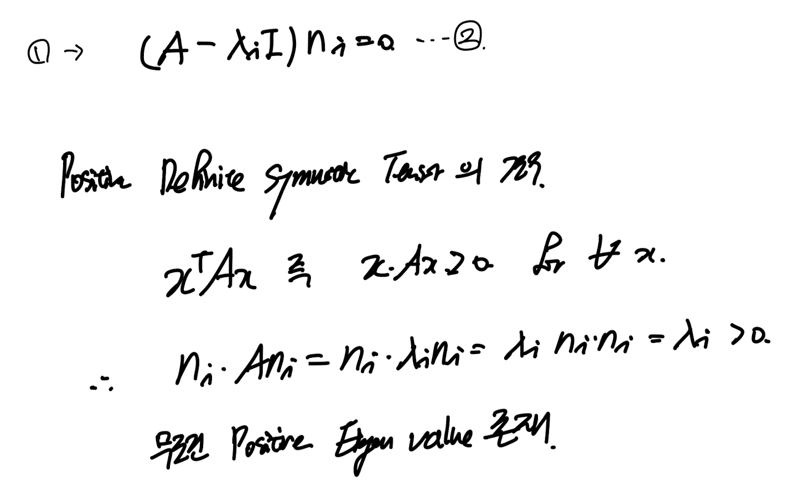
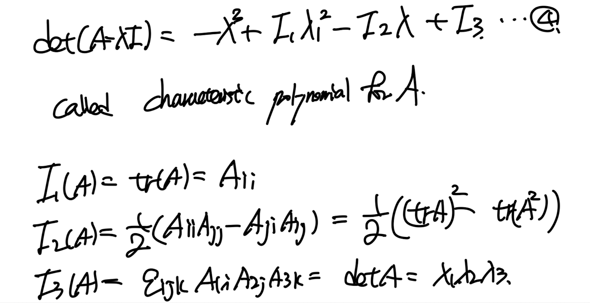
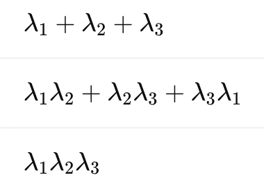
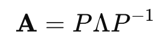
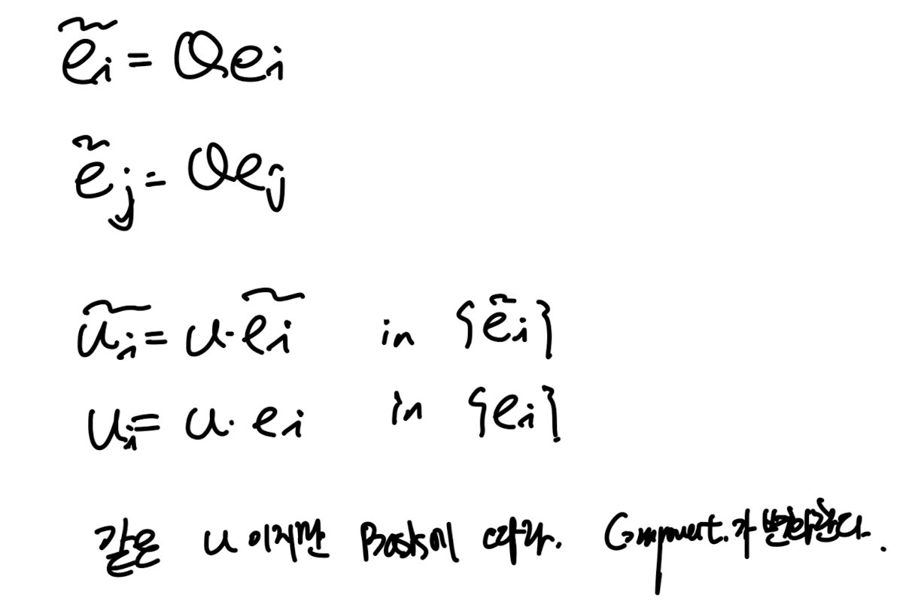
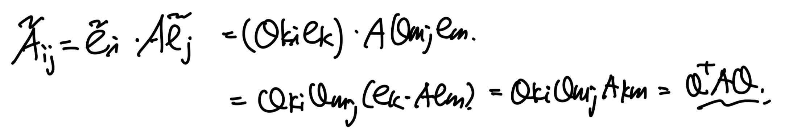
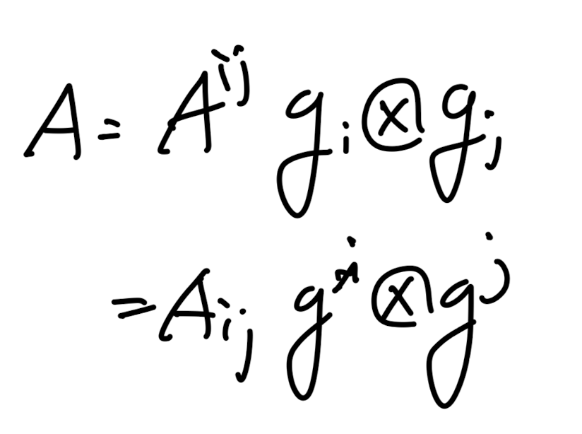

Source: [https://jeffdissel.tistory.com/170](https://jeffdissel.tistory.com/170)

So far,
가장 기본적인 vector와 tenesor를
index notation을 이용하여 다양한 연산, 표현
들을 진행하였다.
이번시간에 다룰 주제들은 다음과 같다.
1.3 High order tensor
1.4 Eige
nvalues, Eigenvectors and Tensors
1.5Transformation Laws
1.6 General bases
_______________
먼저 high order tensor에 대해서 알아보자.
1.3 High order tensor

3rd order tensro symbol
이전시간까지는 2nd order tensor까지 살펴보았고,

2nd order tensor
이런 형태였다.
느낌이 오실것이ㅣ다.
A의 표현식을 구성하는 기저벡터의 갯수가 n개이면
nth order tensor가 되는 것이다.
즉 nth order tensor를 식으로 표현하면 다음과 같다.

표현 방식은 간단하고
단순하게 다른 텐서들과 contraction을 구성하면,
어떻게 되는지 살펴보자.
3rd order tensor와 2차 텐서의 contraction을 하게되면,
아주 중요한 것은 오른쪽 에서부터 갯수를 맞추어서 곱해주는 것이다.

기존에 A:B = AijBij 즉 i,j component끼리 각각 곱하고 다 더해서 scalar를
만들었다.
3rd order tensor : 2nd order tensor같은 경우
2개의 인덱스끼리만 contraction이 가능하므로, 위와 같이 나타내야하며,
결과값은 벡터이다.
가장 대표적인 예시로 permuation tensor(3rd order tensor)
에 대해서 살펴보자.

index component자체가 우리가 이전에 배웠던,
permutation symbol인 3rd order tensor임을 알수 있다.
햇갈리지 말아야 할 것은,
3rd order tensor(위에 물결표시)의 index component가 바로
permutation symbol이라는 것이다.

신기한것은, permutation tensor 와 tenesor product로 제작된 2nd order tensor
를 conrtaction 진행해주면, 결과적으로 tensor product를 구성하는
벡터의 Cross product가 나오게 된다!

high order tensor의 다양한 연산들이 존재하지만,
여기까지만 다루도록 하겠다.
1.4 Eigen values and vectors
eigen value의 정의는 우리가 계속해서 언급햇던 mapping과 연결시키면
직관적으로 이해가 된다.
어떠한 벡터 n이 존재를 하고 그 벡터를 2nd order tensor A로
mapping을 해주자.
n -> An

그렇다면 새로운 벡터가 생성이 될것이다.
하지만 신기하게도 새롭게 생긴 벡터가 기존 n과 같은 방향이고 크기만 다르다면?
An =
λn
(A: 2nd order tensor, n: vector, λ: scalar)
여기서
n을 eigen vector
λ를 eigen value라고 부른다.
여기서 1번식을 n으로 묶어주면 2번식이 도출된다.
(positive definite symmetric tensor는 굉장히 많이 등장하는
개념이기 떄문에 한번 짚고 넘어가자)

여기서 위 식에서 벡터 n이 우리가 구하고 싶은 해이다.
0이 아닌 해를 가지려면
역행렬이 존재하지 않는 Singular matrix이어야 함을 알 수 있다.

linaer algebra.
determinant 식을 전개하여, lambda와 A에 관한 식으로 나타내자.

I1,I2,I3를 lambda로 표현하면,
여기서 핵심인 개념이 나온다
우리가 이전 시간에도 언급했지만 A는 변하지 않고
표현하는 좌표계의 기저에 따라서 Aij component가 바뀐다고 하였다.
그렇지만 본질적으로 A는 변하지 않기 때문에
eigen vector, value는 변하지 않는다.
결국 I1,I2,I3도 좌표계가 바뀌어 Aij가 바뀌더라도,
변하지 않는 불변값이다.
따라서 우리는
first invariant(I1)
2nd Invariant(I2)
3rd Invariant(I3)
라고 부른다.
'불변량'
그렇다면 바뀌지 않는 A를 볼려면 어떻게 해야하나?
가장 흔히 보는 방식이
eigen vector들이 대각성분에 위치한 tensor와
eigen vector들로 이루어진 P, tensor로 구성시킨다.

(Linear algebra 내용.)
1.5 Transformation Laws.
계속해서 언급했던, mapping으로
Q tensor를 이용하여 기저벡터를 mapping하였다고 가정하자.

여기까지는 이전시간에도 다루었던 아주 간단한 방식이다.
이제 위 변환된 기저벡터를 2nd order tensor에 똑같이 적용시켜보자.

A' = QT A Q
이게 의미하는게 무엇일까?
바로 기저벡터를 Q로 mapping하게 되면
2nd order tensor는 위 식처럼 변환한다는 것이다.
index notation을 이용하면 다음과 같다.

1.6 General Bases
여기서 새로운 개념이 등장한다.
기존까지는 Orthogonal 한 기저벡터를 기반으로
벡터와 tensor를 express하였다.
하지만 실제 고체 물질에서 non orthogonal 한 baiss 를 사용하고 싶다면?
-> use general bases

general bases 정의
일단 새로운 개념에 당황스럽겠지만, 이렇게 생각해보자.
기존의 기저벡터 = {e1,e2,e3}
(orthogonal basis, unit length)
새로운 general bases = {g1,g2,g3}
(non orthogonal basis, non unit length)
그냥 기저를 바꾼 것이다. 단지
제약조건이 풀어졌을 뿐이다.
근데 질문이 생길 것이다.
저렇게 규칙이 없으면,
기저와 기저로 표현한 벡터사이의
괸계를 어떻게 나타내지?
u = ui ei 이런식으로 나타내려면
규칙이 있어야 하는거 아닌가?
그렇기에 바로.
contravariant, covariant라는 개념이 나온다.
같은 인덱스에 대해서 contra, covariant 끼리의 내적 = 1
다른 인덱스끼리의 내적 = 0 이어야 한다.

이러한 제약조건을 부여하면,
이제 우리가 어떠한 벡터 , 텐서를 방금 정의한
covariant, contravaraint vector로 나타낼 수가 있다.
여기서 covariant끼리의 내적을 g^(ij)이렇게 합쳐서 쓰고 subscript도 같은 규칙으로 정의하자.

이렇게 정의하면, 정의한 내적곱을 가지고 우리는
각 기저의 scale과 기저끼리의 각도를 나타낼 수 가 있다!
이렇게 정의하면, 우리는 기존의 기저벡터 처럼
하나의 벡터를 general bases g로 나타낼수가 있는 것.

여기서 개념이 한개 나온다.
u = (u_i ) ( g^ i ) 이렇게 gi가 superscript
contravariant일때, 그때의 u component를
contravariant components of u.
vice vers.

그리고, 어떠한 벡터 u와 gj를 내적해주면,
covariant component of u toward j
를 바로 도출 할수 있다.
마치,
u . ei = ui
당연히 tenso도 기저 벡터의 tensor product로 구성이 되기 때문에,
다음과 같이 general bases로 나타낼 수가 있다.

