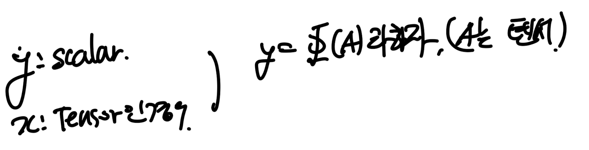
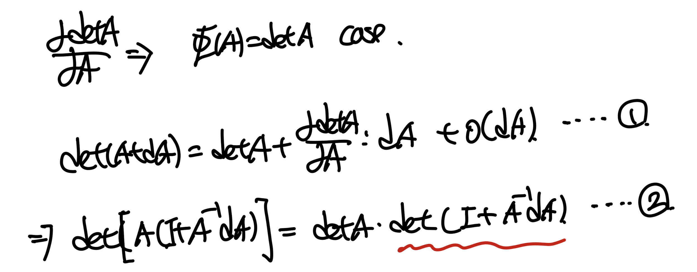
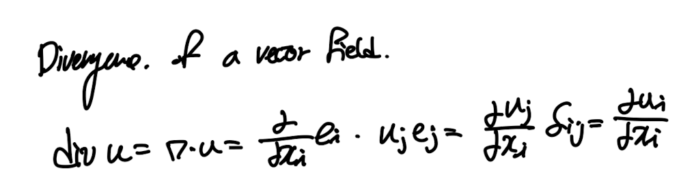
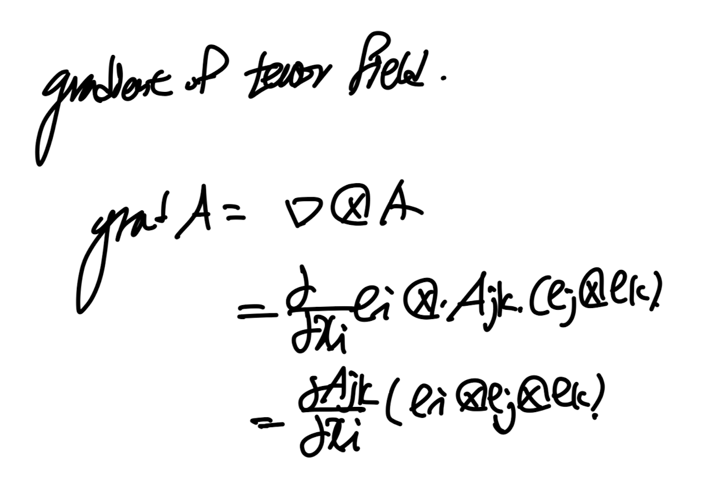

Source: [https://jeffdissel.tistory.com/m/171](https://jeffdissel.tistory.com/m/171)

Ch1 Introduction to Vectors and Tensors - part3
이번시간에는 tensor, 벡터의 미분에 대해서
분석해보자.
먼저 스칼라 함수를 텐서로 미분한경우.
1.7 Gradient of scalar valued function

Gradient of the function을 살펴보기 위해서,
Taylor Expansion을 진행해준다.

(아주 핵심적인 부분이 바로, tensor product를 gradient부분에 해야한다는 사실)
왜냐면 결과 값은 scalar이어야 하기 때문에.
하지만 dphi(A)/dA , dA 둘다 텐서라는 사실.
(항상 디멘션을 체크하면 답이 나온다)

Tr(ATB) = A:B 는 tensor product의 정의였다.
위 식을 이용하여,detA를 A에 대해서 미분한 값을 구해보자.

답은 다음과 같다. detA - scalar

1번식 좌항을 2번식으로 표현할 수 있다.
여기서 빨간색으로 밑줄친 항을 정리해보자.

tricky 하게 lamba = -1, B = A-1dA인 경우로 식을 해석할 수 있다.
이제 3번식을 2번 밑줄친 항에 substitute하자.
딱봐도 detA항이 좌항우항 소거됨을 알 수 있다.
truncate error, o(dA)항도 같이 제거해주자.

여기서 tr(ATB) = A:B를 이용하자.

(증명완료)
1.8 Gradient , divergence and curl
미분항 중에서도 가장 많이 쓰이고 자주나오는 수준이 아니라
맨날 나오는 gradient, divergence curl을
이번에
Index notation
으로 표현해보자.
핵심은 index notation이다.
#Gradient of scalar field.
먼저 gradient of vector field를 살펴보자
(x는 벡터, phi(x) -> scalar)

여기서 스칼라함수를 벡터로 편미분한 항을 우리는
Nabla Operator를 활용하여, 나타내기로 약속하고.

다음과 같이 정의하고,
gradient of phi라고 부른다.

dummy index : i -> summation임을 알기 때문에,
전개하면 다음과 같다.

grad(x)의 기하하적 의미를 이해하기 위해
밑의 그림을 살펴보자.
자 phi(x) = const인 level surface가 존재한다고 하자.
거기서 임의의점 O에서의 위치를 X = (x1,x2,x3)라고 하자.
그랬을때, 우리는 grad(phi) at X 저 위치에서의 gradient를 구할 수 있다.

그리고 같은 평면 안에서 임의의점 A를 잡고,
vector(OA) = dX라고 정의하자.
벡터 dX를 다음과 같이 표현할 수 있고,
grad phi dot dX = d phi

여기서 점A는 level surface위의 임의의점이기 때문에,
grad(phi) dot dX = d phi = 0 임을 쉽게 알 수 있다.

즉 grad(phi)와 dX는 수직이라는 것.
여기서 핵심은 점 A가 임의의점 이기 때문에
평면위의 모든 점에 대해서 OA 는 grad phi와 수직이다.
결국 평면의 수직벡터 n과 grad phi는 평행함을 알 수 있다.
#Divergence of Vector field.

divergence는 flux term이라는 것은 많이 들어서 아실 것이다.
index notation을 하면 다음과 같이 나타낼 수 있고,
결과값은 scalar임을 명심하자.
#Curl of Vector field.

curl(vector u) = vector
임은 자명하다. 그리고 index notation을 이용하면 쉽게 유도가능.
여기서 아주 재밌는 예제문제가 있어서 가져왔다.
바로 curl(grad(phi) ) = 0임을 index notation으로 보이는 것이다!

#Gradient of Vector field

이번에는 결과 값이 tensor가 나오는 것을 알 수 있다.
grad(vector)를 Matrix form으로 만들면 다음과 같다.

#Divergence of Tensor field

여기서 이제서야 알아차린 것은
Au = A_ij u_j인 것은 다들 아실 것이다.
여기서 Au = A dot u 에서 dot이 생략됬다는 점은
아주 중요하다.
#Gradient of Tensor field

result -> 2rd ortehr tensor.
