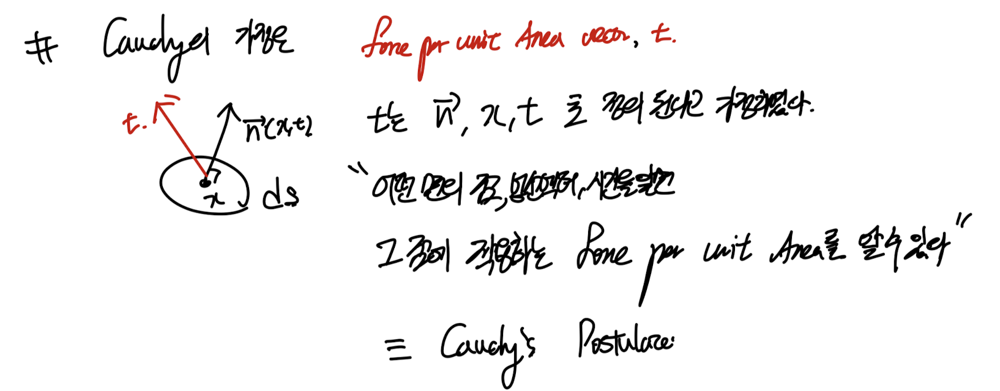
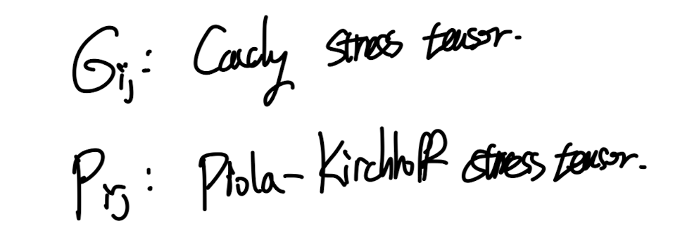
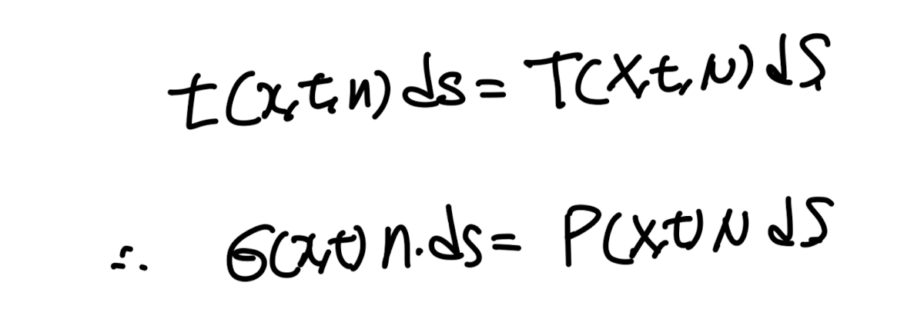
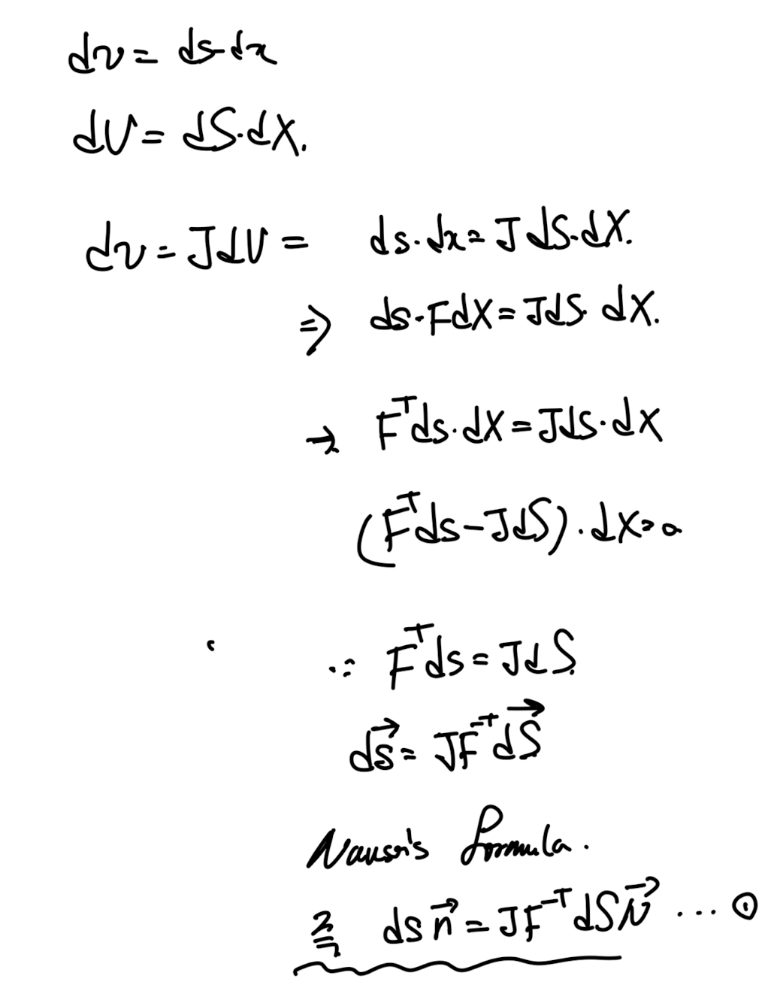
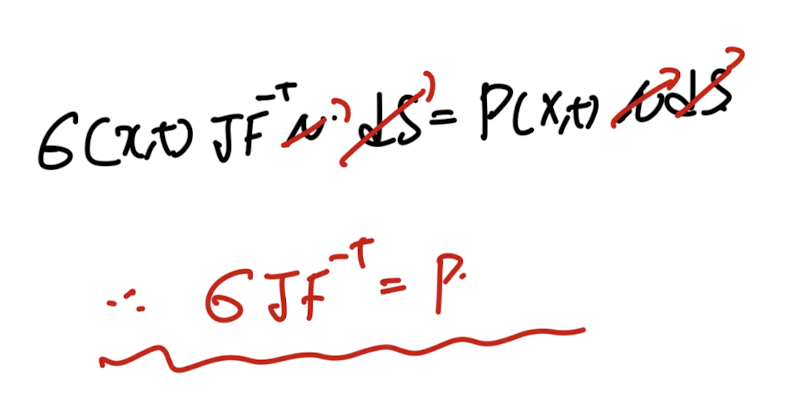

Source: [https://jeffdissel.tistory.com/174](https://jeffdissel.tistory.com/174)

so far,
우리는 deformation motion에 대해서 살펴보았다.
이러한 particle의 움직임과 변형은 서로 다른 Particle 끼리의
interaction을 유도하며, 이는 stress로 이어진다

변형 전후, 이제 3D물체의 surface에 각각 아주 작은 면적 dS, ds를 정의하고,
그에 작용하는 힘을 살펴보자.
두 면적에 같은 힘이 작용하는 상황을 생각해보자.

우리는 작용하는 힘을 가지고,
traction vector즉 단위면적당 힘을 크기로 갖고,
힘벡터와 방향이 같은 traction vector를 다음과 같이 정의할 수 있다.

t, T는 각각 변형후, 변형전 좌표계를 기준.
여기서 Cauchy's Postulate가정이 들어간다.

바로, 우리가 물체의 표면의 어떤 점을 기준으로
그점의 위치벡터, 법선벡터, 시간을 알면 tration vector를 알 수 있다는 가정이다.
다르게 표현하면, 저 3정보만 가지고 충분히 그 점에서 작용하는 force per unit area를
벡터로 표현할 수 있다.

당연해 보이지만, 굉장히 큰 가정이다. 이후에 stress tensor를 정의하는데 시작이 된다.
(위 표현을 다르게 표현하면,
물체의 어떠한 표면의 모든 점은 각각 위치벡터가 당연히 존재하고 시간도 존재하며,
법선벡터도 존재하므로 무조건 traction vector가 존재한다는 것을 알 수 있다)
여기서 이제 Cauchy's Theorem이 등장하게 된다.
위 가정대로라면 법선벡터가 존재하면 그에 대응하는
traction vector가 존재하므로,
법선벡터 -> traction vector로
매핑해주는 tensor를 우리가 정의할 수 있다.

여기서 매핑해주는 tensor를 다음과 같이 칭한다.

위 정의를 그대로 index notation으로 다시 정의해보자.
법선벡터가 ei인 traction vector의 ej성분이 바로 σij

Eulerian Description

Lagrangian Description
말이 조금 어렵지만, Ch1에서 배웠듯이 tensor도 결국 기저벡터들로 구성이되고,
어떠한 기저벡터를 사용하냐에 따라서 다르게 표현되었다.
여기서 기저벡터가 바로 법선벡터 이며.
해당 traction vector의 각 기저 성분이 바로 signam ij라는 것이다.
말로 표현하면 어려우니 실제 수학식으로 써보자.
e1,e2,e3가 기저인 좌표공간에서, e3가 surface인 면을 기준으로
stress tensor, traction vector를 유도해보자.

n = e3인 평면을 기준으로 traction vector. = t( n = e3, x,t)로 표현가능하다.

Cauchy theorem을 그대로 사용하면, 3방향 기저로 표현이 가능하다.

그리고 이를 index notation표현방식으로 전개하면,
결국 같은 표현임을 알 수 있다.
여기서 결국 변형 전 후 각각 좌표계에서 다르게 stress tensor가 표현되지만,
같은 힘을 의미하는 것을 알 수 있다. 따라서 다음식이 유도된다.

df = t ds = TdS, 같은 힘을 변형전에서 표현한 식 = 변형 후에서 표현한 식
위 식을 정리하기 위해서, ch2에서 배웠던, Nanson's Formula를 사용해주자.

위 1번의 Nanson's formula를 이용하여 기존의 식에 대입해주면,

변형 전 후, stress tensor의 관계식이 유도된다.
