Source: [https://jeffdissel.tistory.com/186](https://jeffdissel.tistory.com/186)

지난시간에 유도한,
Isotermal, small deformation
continuum body에서
Free energy imbalance 식을 다음과 같이 유도하였다.
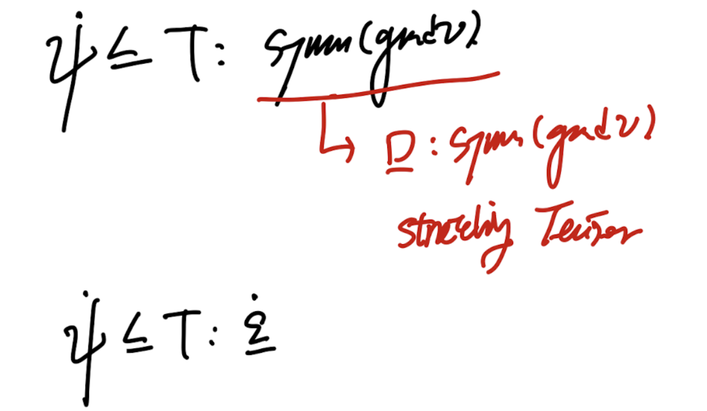
이 식은 고체 탄성이론의 핵심이 되는 아주 중요한 식이다.
지난시간에 Helmoltz Free energy에 대해서
정의만하고 물리적의미는 스킵하였다.
위 식의 의미를 정확히,
Helmoltz Free energy개념을 통해 알아보자.
________________________________
[Helmholtz Free Energy]
(정말 깊이는 아직 저도 이해를 못한것 같습니다)

제가 이해한 바로는 system은 내부에너지를 가지고 있고,
이 내부에너지는 이 시스템이 사용할 수 있는 에너지입니다.
열로 분출할수도 있고, 외부에 일을 할수도 있습니다.
그런데, 이 시스템이 가지고 있는 에너지중 쓸모있는 에너지는 얼마일까?
이 질문을 공학자들은 던졌다.
왜?
증기기관이 외부에 일을 하는데,
heat -> work로 전환을 하려고 하는데
손실되는 에너지가 존재하였기 때문이다.(energy dissipation)
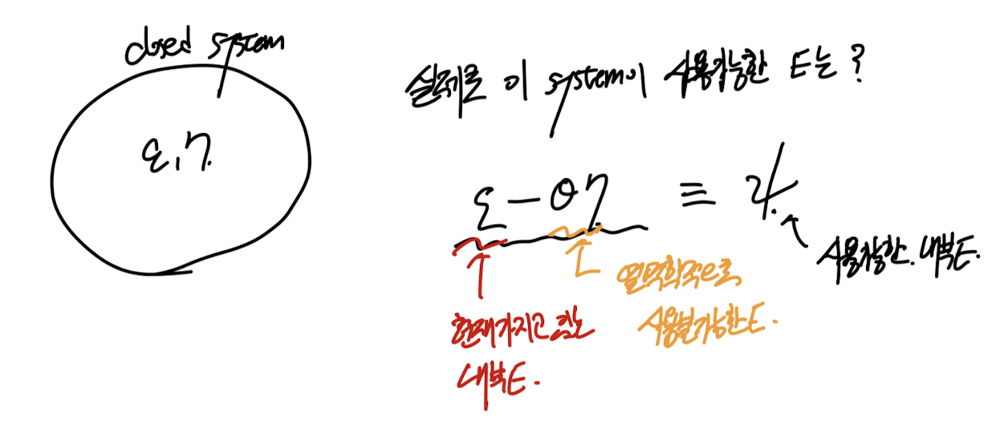
즉 시스템 내부의 에너지를 밖으로 사용한다고 가정하였을때,
사용하는 과정에서 Dissipation(손실)이 무조건 발생한다.
그리고 그 손실이 크면 클수록,
우리는 시스템이 가지고 있는 useful Internal E is small
이라고 한다.
여기서 드는 질문이 있다.
즉, 우리는 시스템이 에너지를 외부로 주거나 받는 즉
Energy transfer이 있어야
위의 쓸모있는 에너지 없는 에너지를 판별할 수 있네?
그렇다면, energy transfer 이전에
how much fraction of internal E is useful?
의 질문을 답하기 위해
우리는 Helmolthz free energy개념을 정의하였다.

다시보면, iternal E에서 Temperature * enetropy 만큼 뺀양이
정말 쓸모있는 에너지라는 것이다.
"즉 절대 온도가 높고,엔트로피가 큰 system의 경우 쓸모없는 에너지가 많다는 것'
자 이제 본론으로 돌아가자
(고체로 돌아가자)
다시 부등식으로 돌아가서,
Cauchy stress tensor를 시그마로 바꾸어주자. (보통 책에서 시그마를 씀)
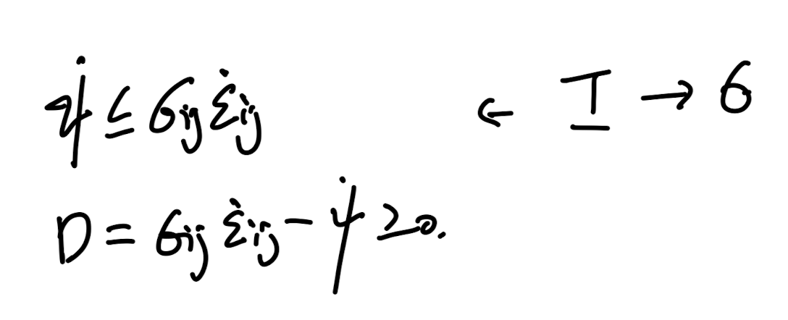
두번째 식 Dissipation은 그냥 저렇게 정의한 것이다.
항상 양수가 되는 어떠한 개념을 정의하고, Dissipation이라고 한것.
여기서 아주 중요한 가정을 시작한다.
바로 Free energy와 stress가 strain의 함수라는 것
이다.

위 가정에 No dissipation이 없는 부등식이 등식이 되는 경우를 살펴보자.-> 1번식 유도.
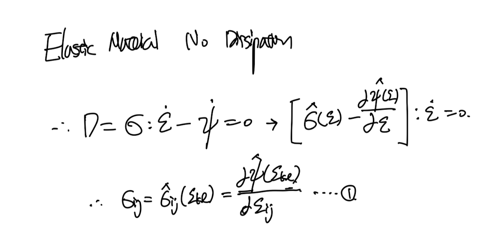
자 지금까지 가정을 통해서 얻은 Free energy와 stress 식 둘다 strain tensor의 함수로 나타내진다.
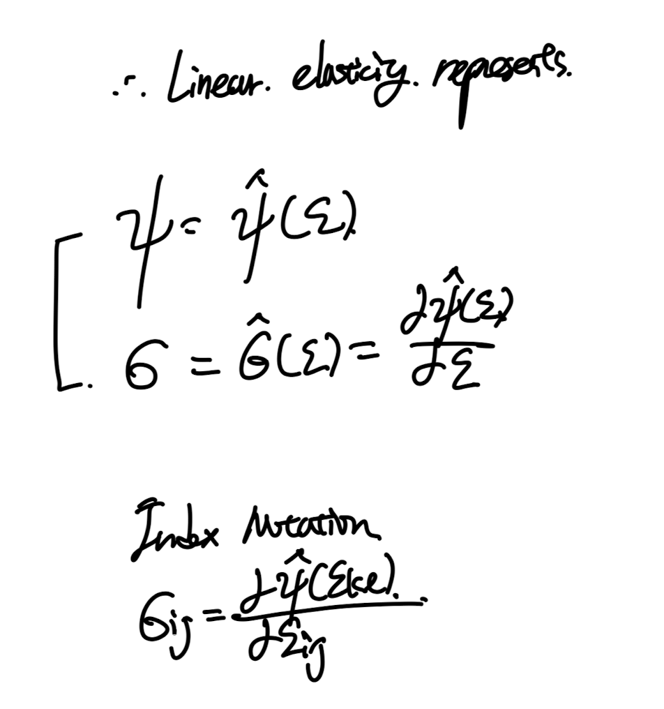
여기서 우리는 small deformation을 살펴보고 있기 때문에 즉,
e = 0 의 주변의 free energy, stress tensor function을 살펴보고있다.

1 Dimensional Helmolthz free energy and strain graph near e = 0(small deformation)
따라서, 우리는 그냥 quadratic form으로 가정을 할 수 있다.
(자세한 유도과정은 밑의 taylor expansion, 지금은 컨셉만 살펴보자.)
감이 안오기 때문에 1D에 바로 적용시켜보자.
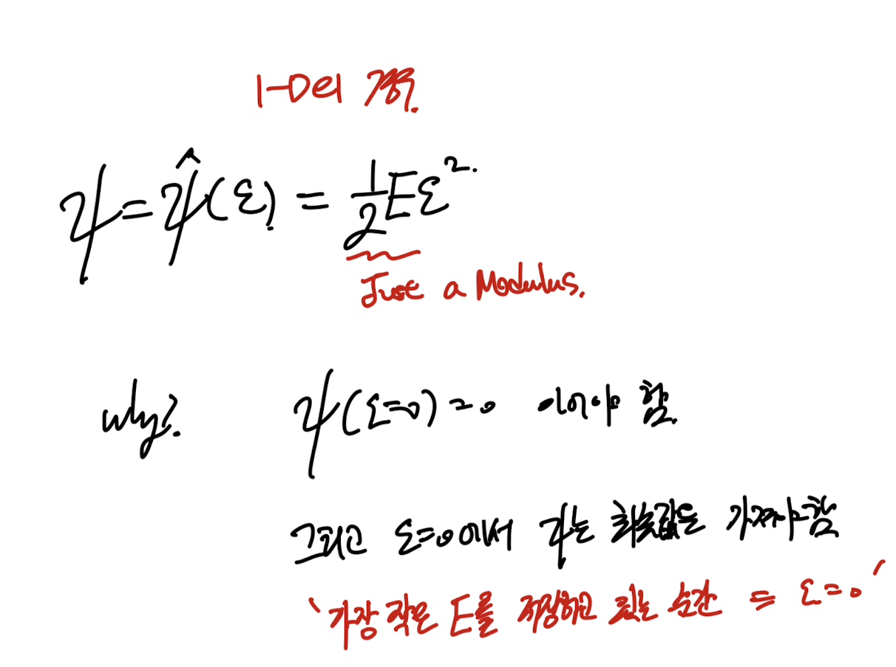
1D의 개념을 확장하기 위해서, 이제 taylor expansion을
helmolthz free enrgy(e) 함수에 e = 0 에 대해서 식을 쓰면 다음과 같다.
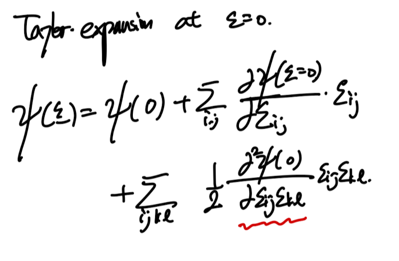
일차 이차항만 전개를 하였고,
나머 고차항들은 0으로 수렴한다(smalld deformation).

stress tensor.
미분의 첫번재항을 잘보면, stress tensor의 정의였고,
두번째는 우리가 이제서야 새롭게 정의하는 항이다.

New defined 4th order tensor.
조심해야 할것은 tensor의 미분항이라는 것이고, e = 0 에서의 값이라는것.
그리고 결과는 보시는 것처럼 4th order tensor이다.(4개의 free index)
위 정의한 tensor를 taylor expansion식에 대입해주면,
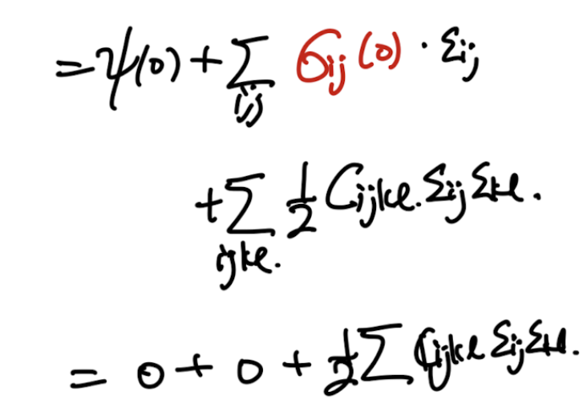
e = 0 에서 stress tensor = 0 (no residual stress)
따라서, 2번 식이 도출된다.
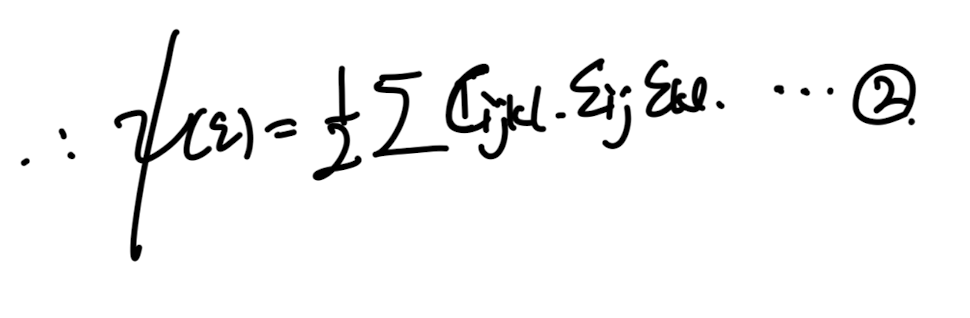
감을 잃을때 쯤이면, 우리의 문제를 1D로 잠깐 전환하면 감이 온다.
1D로 전환하면, Cijkl = E 한개의 component로 축소되고,
이를 Young's modulus E를 넣어주자
(추후에 E는 정의할 예정)

그렇다면, 우리가 어디서 많이본 훅스 law가 나오게된다.
다시 3차원 문제로 돌아가자.

(빠르게 요약하면, 우리는 가정들을 통해서
Free enery -> e에 대한 함수 찾고, -> 이를 통해서
Stress tenor -> e에 대한 함수 찾기
Stress - e의 관계식(consitutive law)을 찾는것이 목표이다.)
자 돌아가서, 방금전에 정의한 Free energy함수를 이제
위의 Taylor Expansion으로 정의한 Free energy를 이제, strain tenosr로 미분하여,
stress tensor의 함수를 찾아보자.
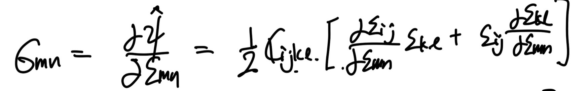
e의 index가 다른 것을 조심하자. mn이 free index이고 ijkl은 dummy index이다.
위
σ
=dψ/de 식이 어디서 나왔지? 기억을 되살리기 위해

no dissipation 가정 -> 1번식 도출.
자 저 strain 미분항을 정리하기 위해 kroncker delta를 사용하자.

이후 정리를 쭉 해주면,

(4차 인덱스가 복잡하니까, (i,j) = A, (k,l) = B로 가정을 잠깐해보면)
CAB = CBA이라는 것을 적용한것을 볼 수 있다.

-e의 대칭성 -> CAB = C_BA 증명완료.
따라서, 최종적으로 3번의 아주 간략하게 생긴 Stress tensor function이 도출된다.
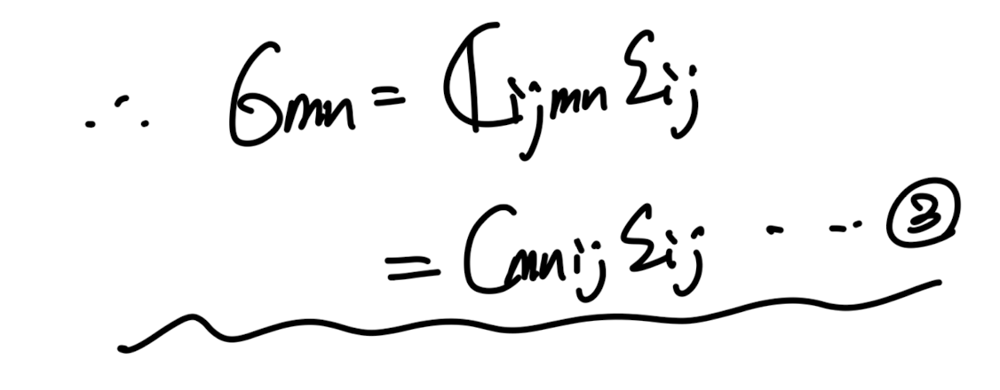
다시 우리는 Taylor expansion을 통해서, ψ = ψ(e)함수를 정의하였고,
그 과정에서 Cijkl을 정의하였다.
이후,
σ
=dψ/de 에 위 함수를 대입하여
σ = σ(e)함수를 도출하였다.

중간체크 가정사항들
(isothermal, small deformation continuum body)
(No dissipation)
위 가정에 해당하는 material을
Elastic material이라고 부른다.
여기서 Cijkl에 대해서 자세하게 살펴보자.
σ 와 e는 symmetric tensor임을 우리는 ch4에서 열심히 증명하였다.
따라서, 우리는 C에 대해서 minor symmetry적용가능.

쉽게 생각하면 i,j = A. m,n = B 라고 했을때
A,B자체에 6개의 경우의수만 존재할 수 있다.

따라서, 총 index -> 36가지
ex) (i,j,m,n)
C(1,2,3,3) = C(2,1,3,3,)는 동일한 값이므로,
index 갯수를 셀때 중복카운트 하지 않는 것.
뿐만아니라, Major symmetry도 존재한다.

C_ijkl = Cklij 즉 i,j 세틀와 kl을 바꾸어도 성립(편미분성질)
여기서 당황하지 않고, 중복되는 경우만 제거해준다.
중복되는 경우는 A와 B가 다른경우이므로,
A와 B가 다른 경우 2로 나누어 주면 된다(절반이 중복될것이므로)

A = (i,j) B = (m,n)
자 여기까지가 Cijkl의 일반적인 성질이다.
일반적으로 21가지의 index component가 존재해야하는 것이다.
다시말해,
Linear elasiticity성질을 띄는 모든 물질들은
각각 고유의 Cijkl 값들이 존재하고, 최대 21개 존재할 수 있는 것이다
여기서, 한발짝 더 나아가서,
reflection rotation즉 대칭성을 띄는 경우
21개에서 구성요소수가 줄어들게 된다.
그리고 어디에 대해서 어떻게 대칭인지, 정의를 다음과 같이한다.

QT e Q는 어디서 많이 보았다. 바로 기저벡터 변환이다.
즉 strain tensor의 기저를 (Qtensor로 변환) 변환시켜,
새로운 strain tensor로 만들어도,
Free energy가 동일하다면?
Q: Orthogonal transformation tensor for an elastifc body
라고 한다.
Q는 Orthogoanl tensor이어야 하고,
rotation, reflection인 경우는 아래의 경우이다.

위 변환을 이제 index notation을 나타내보면,

다소 복잡한 index notation이지만, 최종결과는 생각보다 간단하다.
위 변형식을 가지고, 다양한 Q symmetry transformation이 있는 물질들을 살펴보자.
1. Monoclinc
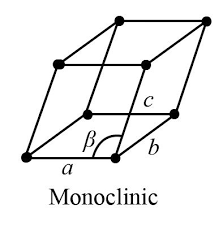
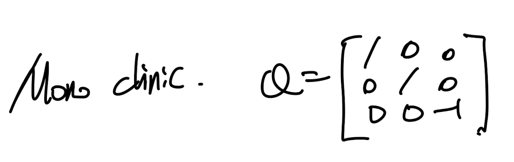

b벡터가 수직인 평면을 기준으로 reflection

det(Q) = -1 -> reflection
먼저, 한방향으로 reflection이 존재하는 물질의 Cijkl에 대해서 살펴보자.

일단 i = p, j = q, k = r, l = s 외의 경우는 전부 0 이다.
다음, i,j,k,l중에서 3의 갯수가 홀수라면??
-1이 홀수번 곱해지므로,
Cijkl = -Cijkl = 0 이 된다.
따라서, 우리는 3이 홀수개인 index 갯수만 21개중에서 제거해주면된다.

고등학교 이후로 경우의 수를 처음해본다 ㅋㅋ
결과적으로 총 index수는 13개로 마무리.

2. Orthotropic

그림을 보면 바로 알겠지만 이제 3방향 모두에 대해서 reflection이 가능한 상황이다.

위 monoclinc에서 구한 방식대로,
이번에는 모든 1,2,3의 각 갯수가 짝수이어야 한다.
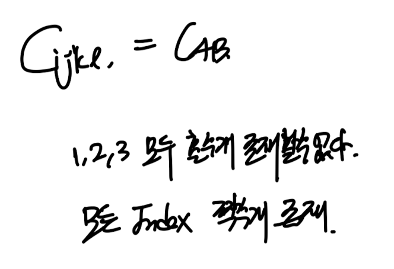
아주 간단하게 9개가 총 나오게 된다.

이를 Matrix로 표현해보면,

3. Transversely Isotropic

위 경우는 이제 3방향 refelction에 한방향 rotation에 대해서도 동일한 물질.
위 그림을 보면 x3을 축으로 회전해도 material의 방향성이 동일함을 알 수 있다.
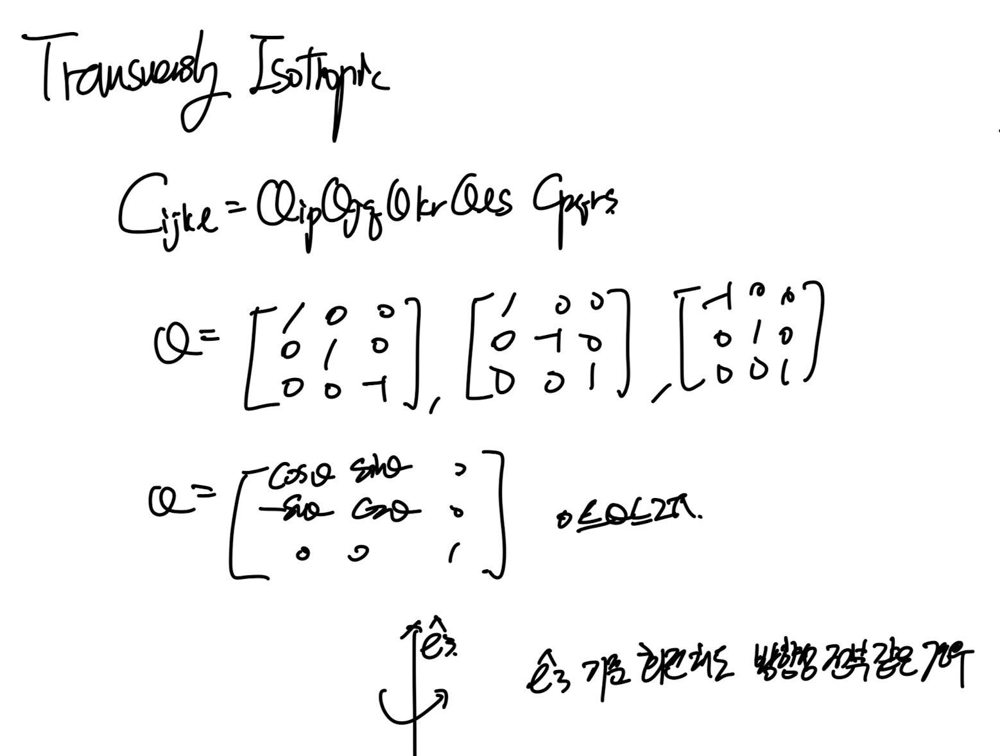
New Q for the rotation
실제로 Cijkl을 전개해보면 삼각함수를 이용해서,
다음의 관계식을 얻을 수 있다.

결론적으로 총 5개의 independent Cijkl componenet값이 존재한다.
3. Cubic
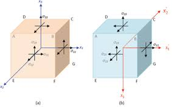
큐빅의 경우, 90도 어느방향으로 회전하든지 일정하게 변환하는 Q가 존재.

reflection transformation tensors
위 reflection tensor에 더해서,

위의경우 전개를 해주면 3개의 component만 존재한다.

마지막 Isotropic Elasticity

즉 어떠한 Orthogonal 한 Q에 의한 Transformation이어도 성질이 일정한,
어느 방향으로 기저벡터를 바꾸어도 성질이 일정한 물질이란 말이다.
이 경우 우리는 이렇게 2개의 component로 갯수를 축소시킬 수 있다.

여기서 한가지 짚고 넘어 갈것은, 기존에 Cijkl - anisotropic elasitc moduli를 사용했지만,
이는 역행렬이 존재하므로 pair한 역행렬을 Compliance tensor로 다음과 같이 정의 할 수 있다.
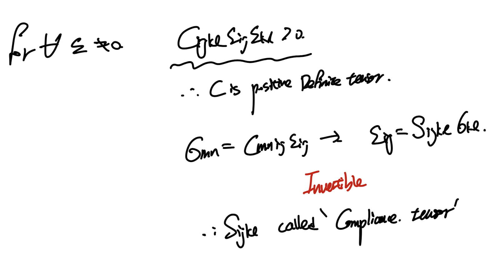
