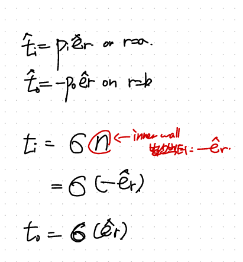
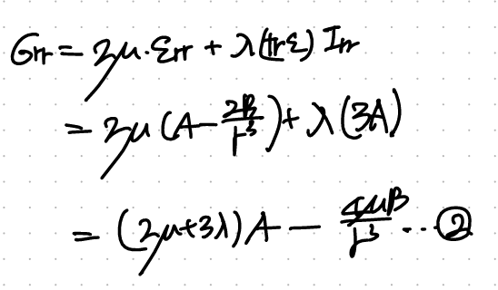

Source: [https://jeffdissel.tistory.com/204](https://jeffdissel.tistory.com/204)

Boundary Value Problem(BVP)
자 이제 BVP실제 문제를 풀어보자.
해결 방식은, 우리가 이전 포스터에서 유도하였던,
식과 문제상황별 Boundary Condition을 가지고
해를 구하는것. (간단하지만 간단하지않다...)

1) Thick wall sphere

가장 대표적인 구이면서, 안에가 비어있다.
그리고 안과 밖으로 압력이 가해지는 상황.
보자마자, BC을 설정하자.
r = a,b를 안쪽 바깥쪽이라고 정의하고,
각각의 traction vector - pressure와 연결시킨다.

이후 Cauchy's Theorem을 활용하여, 이제 r=a,b 에서의
stress tensor를 구할 수 있다.
(주의할점은 rr방향 tensor이라는 점이다.)

bc for the thick sphere.
+ 굉장히 엄청난 가정을 추가해주자.
바로 displacement vector (u) = u(r) e_r
즉, r방향으로만 변형을 한다고 가정하자.
(구의 경우 sphere angle symmetric 가정이 자주나온다!)

여기서 이제, 지배방정식을 사용하기 위해서, sphereical coordinate curl부터 찾아보면,
우리가 가정한 설정에서 0 임을 알 수 있다.

+ No body force(b), such as gravity

(굉장히 심플해지고 있다).
이후 정리하면 div u = 상수가 나오고,
그 상수를 편의상 3A라고 설정하자.

다시 appendix를 펴서, sphereical coordinate divergence를 살펴보면,

2항만 남게 된다.
이후 정리하면 결국 ODE를 푸는 것,
따라서 ur의 일반해를 두개의 계수를 가지고 표현할 수 있다.

자 여기서 우리가 하고싶은 것은, 저 A,B 계수가 무엇인지를 Boundary condition을 가지고
구하는 것이다. 따라서 Cauchy stress(r=a,b)의 값을 이용하기 위해서,
위 ur을 가지고 -> strain -> stress 방식으로 구해보자.
먼저, u를 알면, 자연스럽게 strain tensor를 알 수 있다.

이후, Isotropic Linear elastic Constitutive Law를 활용하면,

2번식에 이제, BC을 적용하자.(r = a,b대입)

연립하여, A,B를 구하자.

(복잡한 척을 하지만, 실제로 복잡하다..)
이후, A,B로 정의된 displacement radial component에 대입해주면,

한편, 우리가 다른 두 방향의 strain tensor도 알고 있기 때문에 stress tensor component도
유도가능하다.

(차근차근 천천히 하면, 생각보다 과정이 단순하다)
요약해보면,
1. Constitutive Law + Equilibrium of motion 식으로 부터 출발.
2. 적절한 boundary conditon 찾기.
3. 가정 설정하기.
No body force(b = 0),
Only radial deformation(u = u_r),
Radiall symmetric ( d /dθ = 0, d /d φ = 0),
4, 다시 1번식을 가정으로 축약.
5. 방금 유도된 u_r ODE풀기,
6. BC적용하여 u_r 일반해 상수 구하기.
7. 필요한거 u_r알면 모두 구할 수 있음(strain tensor, stress, tensor)
다음 포스터에서는 thick wall cylinder로 찾아뵙겠습니다.
