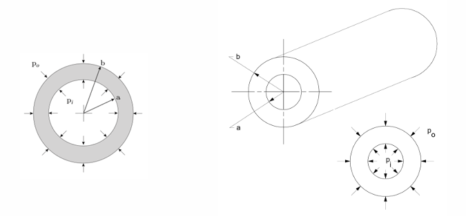
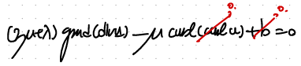
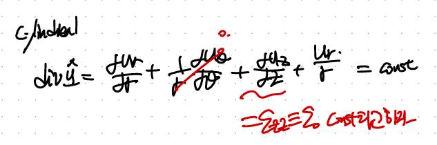
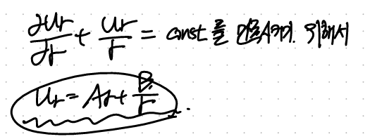

Source: [https://jeffdissel.tistory.com/m/205](https://jeffdissel.tistory.com/m/205)

CH5 Elasticity - part6 (BVP - thick wall cylinder)
이전의 BVP푸는 방식과 동일하게,
Thick wall cylinder문제를 풀어보자.

thick wall cylinder configuration.
아주 강력한 가정을 하고 시작하자.
먼저, ur,uz두 방향으로의 변화만 존재하며,
각각 r,z에 only dependent한 함수라고 가정하자.
이후, curl(u) = 0임을 대입하면 알 수 있다.

curl of vector on the cylindrical coordinate.
가장 먼저 시작하는 Constitutie Law + Equilibrium of Motion을 결합한 강력한 식에
curl u = 0, no body force(b = 0)까지 대입해주면,

grad(div u) = 0 -> div u = const
여기서 du_z/dz = const = epsilion_zero 라고 설정하자.
(이것도 아주 강력한 가정이다)

어김없이 u_r 의 r 에 대한 ODE가 나오게 되고, 일반해를 다음과 같이 표현가능하다.

여기서 두 계수 A,B를 구하기 위해서는 Boundary condition을 사용해야하고,
우리의 boundary condition은 stress tensor이므로,
u_r - > strain -> stress로 표현을 바꾸어 보자.
먼저 cylindrical coordinate strain tensor

(u_r general solution을 대입)

Constitutive Law로 e -> stress구하자.

Remember this is isotropic Linear elastic Constitutive Law for small deformation.
Boundary condition을 적용하기 위해 rr 방향을 다시 쓰면,

대입하면, 두개의 연립방정식이 세우고, A,B를 구할 수 있다.

이후,A,B를 알면 u_r을 유도가능 하다.

이후 stress field를 u_r을 가지고 구할 수 있다.

