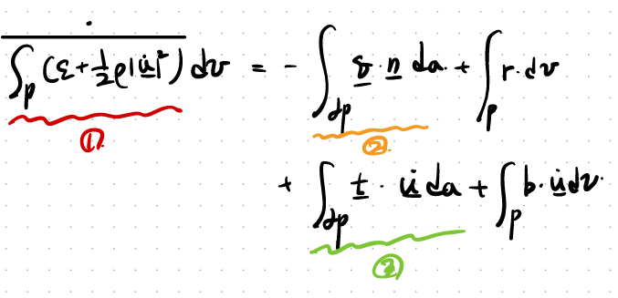
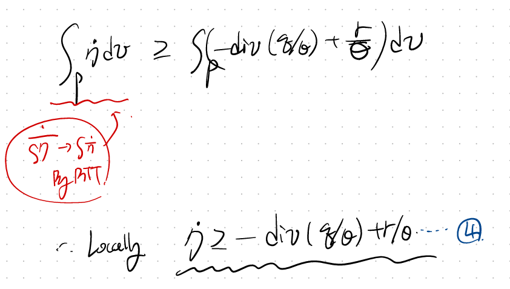
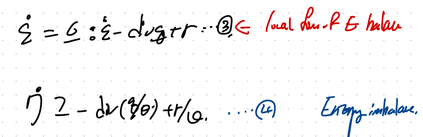
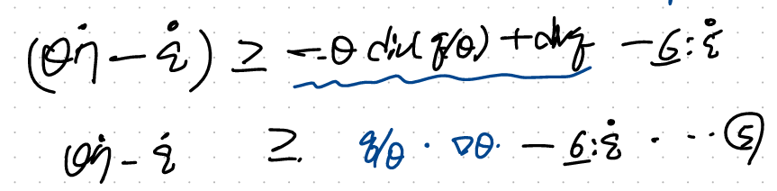

Source: [https://jeffdissel.tistory.com/m/206](https://jeffdissel.tistory.com/m/206)

CH5 Elasticity - part7 (Thermal Elasticity1)
이번시간에는
Elasticity + Thermal effect까지 같이 고려한 해석을 진행해보자.
small deformation상황으로 설정하고
conintum body에서 일부분을 떼어서 분석하자.

여기서 에너지 보존방정식을 해당 body에 대해서 다음과 같이 세울 수 있다.
(chapter 4 에서도 똑같이 다루었다)

여기서, 굉장히 복잡한식을 한개의 integral로 묶어주는 작업을 실시하자.
가장 중요한 divergene Theorem, Reynolds Transport Theorem 두가지가 이 과정에서 사용된다.
자세한 증명은 따로 정리해둔 링크로 보시면 됩니다~

먼저 1번항을 바꾸어 주자 (Reynolds Transport Theroem이 사용됩니다)

2,3번항도 똑같이 바꾸어주자 (Divergence theorem 이용)

자 이제 바꾸어준 1,2,3항을 기존 energy 보존방정식에 대입해주면,

귀신같이 중간에 Cauch'ys Equation of Motion 식이 나온다.
(Cauchy's Eq of Motion link)
따라서, 우리는 Locally 방정식 4를 유도할 수 있다.

자세히 보시면 d grad(u) / dt - > Strain rate tensor로 전환된 것을 볼 수 있다.
굉장한 디테일이 숨어있다.

이번에는 열역학 제 2법칙 엔트로피 증가법칙을 continum body P 에 적용하자.

사소해보이지만 굉장히 중요한, time derivative를 적분 안으로 RTT를 활용하여 넣어주자.
(RTT - Reynolds Transport Theroem입니다)
따라서 최종 Local inequalitiy 4번식을 얻게 된다.

다시 정리하면 우리는 이 두식을 얻기 위해 열심히 달려왔다....

4식에 절대 온도(theat)를 곱한후, 3번식을 빼면,

여기서 Helmoltz Free Energy의 개념을 물리학자들이 정의하였다.
바로 Internal Energy에서 entropy가 차지하는 에너지를 뺀 에너지이다.
(열역학 쳅터에서 다룬 내용! 우리가 body P한테,
'너가 가지고 있는 에너지 진짜 사용할 수 있는 에너지 즉,
reversible한 에너지가 얼마냐? 라는질문의 답이 바로,
Helmoltz free Energy)

여기서, 이제 5번식에 위 energy 정의와 heat flux를 같이 대입해주자.

6번식을 strain rate tensor, Temperature rate로 각각 묶으면

우리가 다음의 관계식을 얻을 수 있다.
자 여기서 자세히 보면, Elasticity 를 다룰때, 우리가 1번식을 가지고
모든 개념을 정의하였다.

