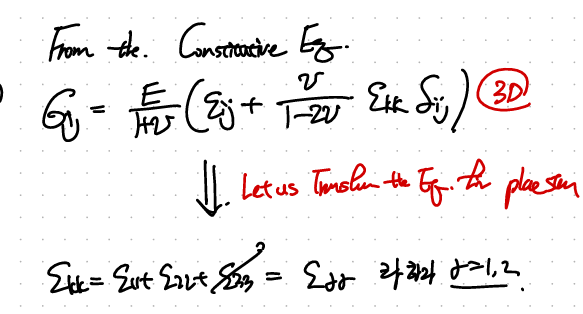
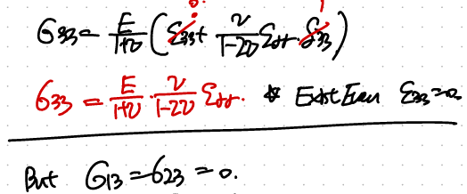
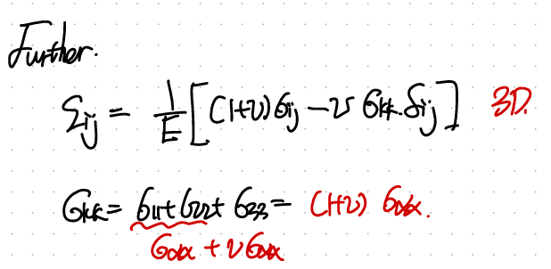
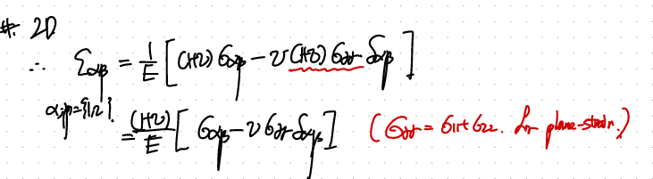
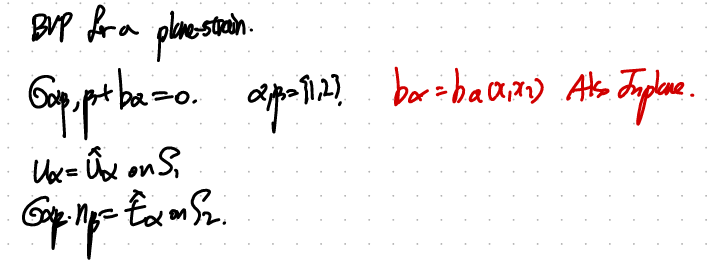
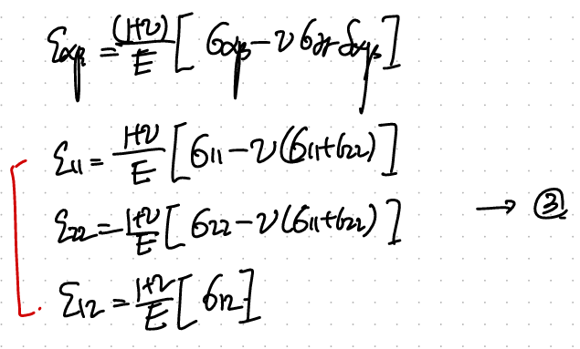

Source: [https://jeffdissel.tistory.com/207](https://jeffdissel.tistory.com/207)

지금부터는 Boundary condition중 굉장히 많이 나오는
Plain stress, strain
두가지를 살펴보고, 이번에는 plain strain 을 먼저 살펴볼 것이다.
고체역학의 가장 큰 장점은 직관적이고, 현실적이다.
x3방향으로 무한히 긴 원기둥
을 가정해보자.
it is impoosible to analyze all over the cylinde!!!!!!
Therefore, 우리는 3방향으로는 strain이 없다라고 가정하고, 접근하자.

따라서, plane(x1,x2)와 펴행한 단면을 다음과 같이 자른 후 그 단면만 분석할 것이다.

u3 = 0 즉 x3방향의
displacement = 0으로 설정한다.
뿐만아니라 굉장히 중요한 것은,
다른 모든 property들은 x3방향과 무관한다.
x3방향으로는 homogeneous하다고 생각하면 된다.
이에, 우리는 strain tensor를 다음과 같이 1,2 방향으로만 해석한다.
(33방향은 전부 0 이므로 해석할 필요가 없다)

새롭게 index가 2d로 바뀌었으므로, 이에 맞추어 stress도 3D -> 2D 로 바꾸어 주자.
Beginning from the Isotropic Linear elastic Constitutive Law.
(stress tensor first)

먼저 i = j = 3인 stress component를 살펴보면,

즉, e_33 = 0이지만, 3방향으로 변화량은 없지만 stress는 존재한다!!!!.
이제, stress tensor를 2D index로 바꾸어 주자(메

2 D index alpha, beta.
여기서 beta = alpha를 대입하면,
(
σ_α α = σ_11 + σ_22 ) 를 구할 수 있다.

우리가 3번방향의 stress를 구했던 식을 가져와서 비교해보면,
여기서
e_rr, e_α
α
는 dummy indcies이므로 둘다 e_11 + e_22를 의미한다, 즉 동일하다.

따라서, 2번식과 1번식을 e에 대해서 연립을 해주면,

굉장히 특이한 식이 발견된다.
즉, 11,22 stress component의 합에 poisson ratio를 곱하면,
33방향의 stress component가 나온다!.
자 이제, constituvie law strain tensor버전으로 접근해보자.
여기서 주의할점은 sigma_kk = sigma_11, 22,33 3개의 합인데,
우리는 33을 indexing을 제외한 2D indexing으로 전환하고 싶다.
따라서, sigma_33을 11,22로 표현한 위 식을 대입하자.

따라서, 다음과 같이 정리할 수 있다.

결론적으로,
plain
stress의 상황에서 2D index constitutive Law는 다음과 같다.

Boundary value problem(BVP)
자 이제 위 constitutive Law식을 Equilibrium of motion식에 대입해주자.

Plain strain의 경우 우리가 2D compatability Eq을 적용할 수 있다.

위 식에 우리가 구한 plain strain form을 대입해주자.

대입해주면, 4번식이 유도된다.

한편, Equilibrium 식에서 우리가 다음과 alpha = 1,2를 대입한 두가지 식을 유도하고,
미분을 진행해주면 5번식이 유도된다.

마지막으로, Compatability Equation에서 유도된 4번식과
위의 Equilibrium of Motion 에서 유도한 5번식을 연립하면,

최종적으로, 마지막 식이 유도된다!!
