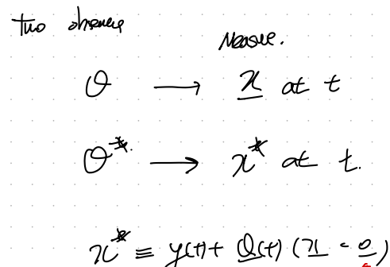
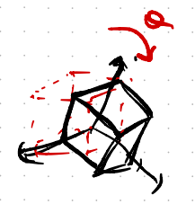
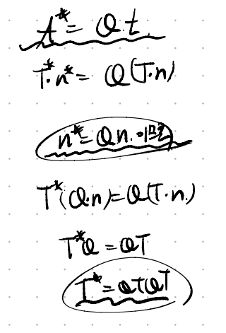
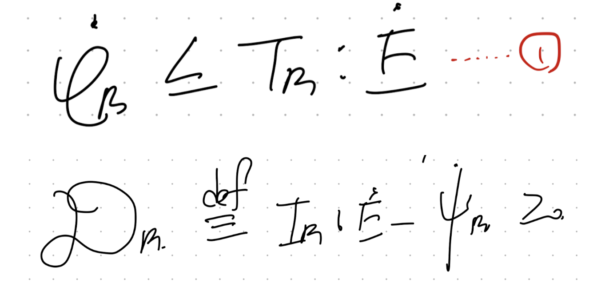
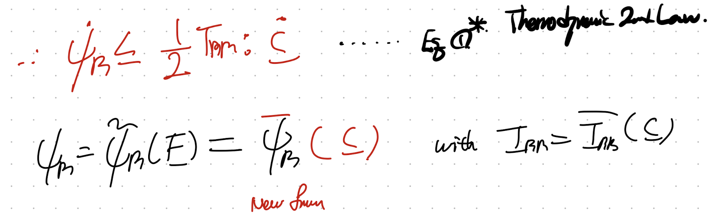

Source: [https://jeffdissel.tistory.com/213](https://jeffdissel.tistory.com/213)

우리가 무엇을 하고있는가??????
Finite deformation 에서
Strain density E, stress tensor 와
strain tensor의
수학적 관계식을 찾는중!
지난시간에 첫번째 재료를 다루었고, 이번에는 두번째 재료를 다루자.
- Kinematics + Referential Momentum Balance Eq
-Frame Indifference in mechanics
-Balance Law
-Material Symmetry
2. Frame indifference
아래 그림을 보게 되면 같은 물체여도 관찰자가 다르다면,
frame이 다르기 때문에,
Referential Frame은 같아도(물체는 고정이니까)
Spatial frame이 관찰자마다 다를 것이다.

쉽게 생각해 deformation이 서로 다르게 A,B는 보일 것이다.
각각 관찰자가 측정한 spatial coordiante x, x*이라고 하자. (x is not equal to x*)
+
그렇다면 두 관찰자의 frame의 위치를 두 텐서로 표현할 수 있다.
Rotation tensor : Q(t)
translation tensor : y(t)

쉽게 생각하면, for instance,
A한테는 빨간색으로 보이는 물체가 B한테는 검정색으로 보일 것이다.
두 물체의 위치를 동일하게 만들려면 (B물체를 A로 옮겨보면 회전하고, 이동시켜야 한다)
이때 회전하고 이동시키는 정도를 Q(t) , y(t)로 표현한 것.

예시를 들기 위해서 물체를 이동시켰지만,
사실은 물체는 가만히 있는 상황이다.
결국 관찰자가 Q(t), y(t)만큼 움직이는 상황이다!!!!.
여기서 x, x*을 Motion함수를 활용하여, X: referential 위치벡터로 전환할 수 있다.

이를 활용하여 우리는 두 관찰자의 서로 다른 deformation gradient tensor의 관계식을 알 수 있다.

정말 놀라운 사실은 righht Cauchy tensor를 보면 관찰자가 변해도 똑같다는 사실!!!!!

F = RU 에서 R:rotational tensor, U:right stretch tensor 또한 다음과 같이 표현가능하다.

또한 Traction vector도 관찰자에 따라 Q만큼 회전한 것을 이용하여,

Cauchy stress tensor의 관계식도 유도가능하다.
따라서, 정리해보면,
T,R,V는 Frame indifference
즉 frame에 따른 관계식을 (Q,y)를 이용하여, 우리가 위에서 처럼 세울 수 있는 tensor들
C,V는 frame에 따라서 불변하는 Frame invariant!!!! 가장 중요

and None of them.
자 여기서 우리가 왜 frame indifferent, invariant개념을 확인했는지,
그 이유가 이제 등장한다.
바로 Thermodynamics 1, 2nd law를 가지고 유도하였던, 아래의 1번식
Helmolthz Free Energy inequality식
과 관련이 있다.
(밑 식을 다음 포스트에서 세밀하게 유도해보도록 하겠습니다)

분명히 우리가 Linear elastic시간에 balance law중 마지막으로 다루었다!!
여기서 우리가 linear elastic인 경우는 helmotlz free energy 를 strain에 관한 함수로 정의하였다.
하지만 이제는 strain tensor는 frame invariant하지 않기 때문에
(무슨말인지 뒤에서 설명) 변수로 사용 불가능하다.
그렇다면 어떤 함수로 나타내야 할까???
뭐에 대한 함수 즉 변수가 무엇인 함수로 나타내야하나???
이게 우리가 가진 의문점이다.
잘 생각해보자 만약에 F에 관한 함수로 나타내면, 관찰자가 회전하게 되는 순간
밑처럼 함수자체가 아예 바뀌어야 성립한다.
(다소 복잡하지만 물체의 순수한 helmoltz free energy는 동일하지만,
변수가 (F -> F* = QF)로 바뀌게 되면 함수 form자체가 바뀌어야 한다.)

하지만, 매번 관찰자가 바뀔때마다 다른 함수 모양을 사용하는 것은
당연히 '일반화'하였다고 말할 수 없다.
결국 우리는 frame invaraint한 변수로 helmoltz Free energ를 표현해야한다.

따라서, 우리는 위 사진처럼 C에 관한 함수로 helmotlz Free energy를 표현해야한다.
helmotlz Free energy를 C에 관한 함수라고 가정을 하고,
1번식의 뒷(stress-strain power)항을 C에 관함 함수로 바꾸어 보자.

이 변환을 위해서 우리는 2nd Piola Stress를 다음과 같이 정의하자.
(
from 1st Piola stress(T_R))

Definition of 2nd Piola Referential Stress
위 정의를 이용하여 부등식 뒷부분을 다음과 같이 바꾸어주자
(tensor product property)

T_RR은 symmetric임을 이용하면, 다음과 같이 rate of C로 표현 가능하다.

#Prove 2nd Piola stress is a symmetric tensor.

최종적으로, 우리는 다음가 같이 Thermodynmaics 2nd law를 C에 관한 함수로 그리고
according to above transformation, we can modify stress-strain power as a tensor product of
2nd Piola stress(T_RR) and rate of C tensor.

여기서 한발짝 더 나아가서, 만약에 elastic인 경우,
즉 no dissipation 인 경우.
부등식에서 3번 등식으로 전환되며,

4번식으로 2nd Piola stress를 표현가능하다.

Definition of 2nd and 1st Piola stress를 이용하면,

1st piola stress and Cauchy stress를 모두 strain density E(helmoltz free E)의 함수로 나타낼 수 있다.

