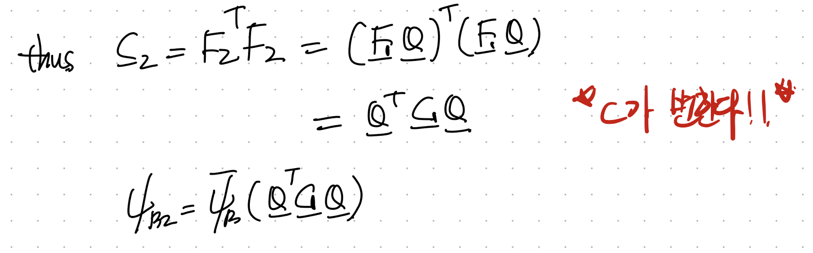
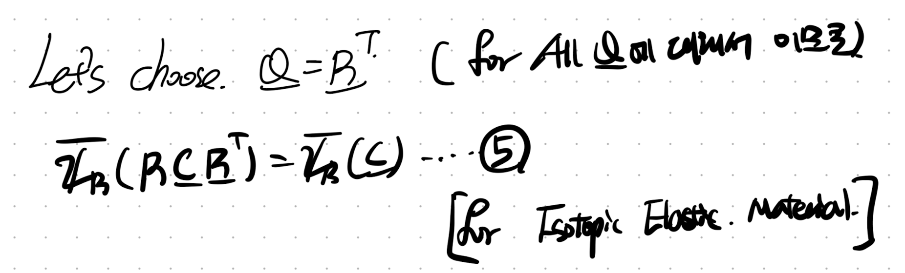
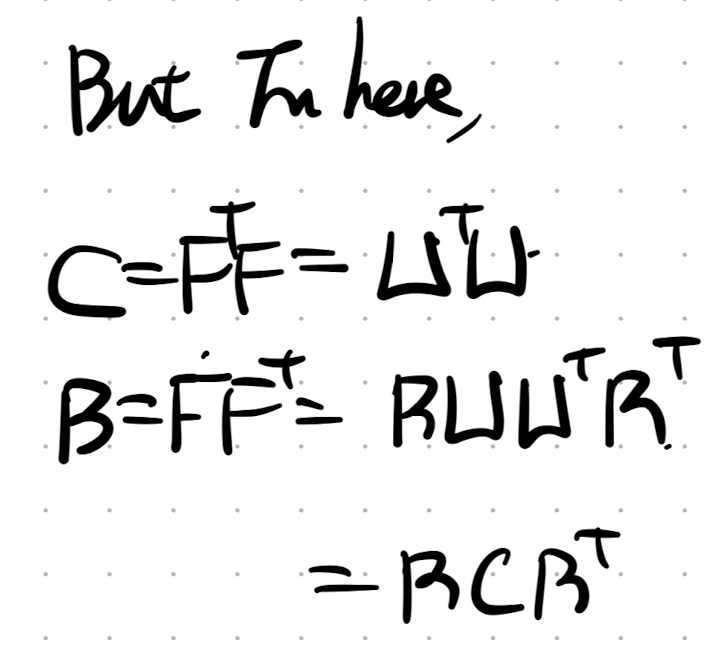
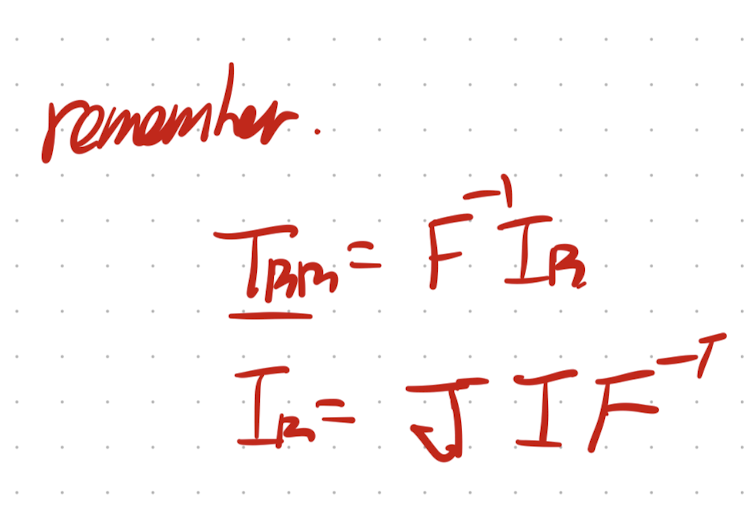
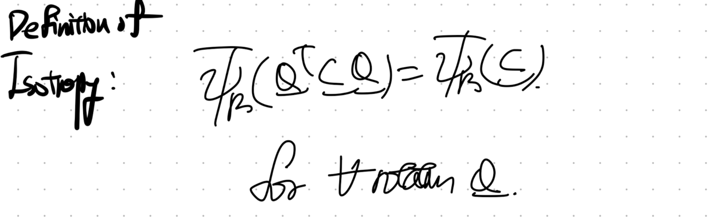
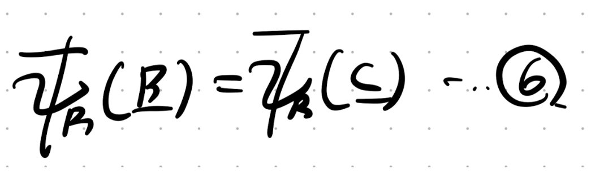
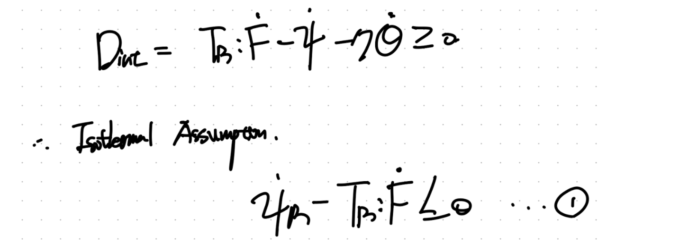
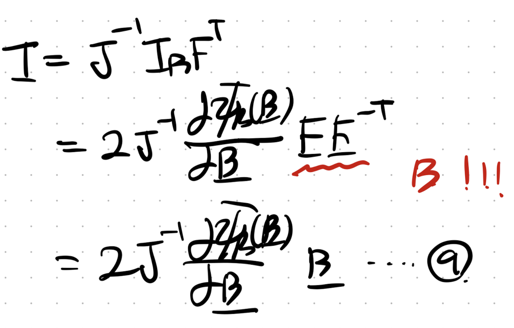

Source: [https://jeffdissel.tistory.com/214](https://jeffdissel.tistory.com/214)

[이번시간 다룰 내용]
- Kinematics + Referential Momentum Balance Eq
-Frame Indifference in mechanics
-Balance Law
-Material Symmetry
1. Balance Law.
지난시간에 우리가 1번 thermoydynamics 1st 2nd law로 유도된 식1부터

hyperelasitc인 경우 4번식으로 즉
C(frame invariant)
한 변수로
표현 가능하다는 것을 배웠다.

여기서 이번 포스터에서는 짧게, 밑의 linear elastic에서 증명하였던,
Spatial rate of Helmoltz free enegry,
Spatial stres-strain power가 어떻게 1번식으로 바뀌는 지를 살펴보자.

먼저 그 전에 가장 중요한 trace같은 경우 trace내부에서 순서가 바뀌어도 같은 결과를 내는
성질을 꼭 기억하자.

여기서 strain rate 을 tensor (L)로 표현하자(같은 표현임,기호만 다름)
그리고 tensor product of Cauchy stress and L로 표현하자.
L = velocity gradient tensor
D = symmetric part of Velocity gradient tensor

그리고 다음 밑의 과정을 통해서 stress tensor operation을 진행하면 L로 나타낼 수 있다.

결론적으로 우리는 Referential Configuration으로 Stress-strain power을 다음과 같이 나타낼 수 있다.

2.Material Symmetry
지난시간에 우리는 frame indifferent, frame invariant
즉 관찰자가 변함에 따라서 같은 물체를 바라보았을때, 변형정도가 어떻게 다르고,
어떤 규칙으로 표현되며, 그중에 불변량은 무엇인지를 확인하였다.
이번에 관찰자가 아닌 material자체의 회전을 살펴보자.
(굉장히 햇갈린다.... 그림으로 표현해보자)
a. Frame rotation
기존에 살펴보았던
Frame rotation
은 관찰자가 움직였다.
가장 핵심은 관찰자가 발견한 deformed configuration이 서로 다른것.
즉 referential location(X)는 동일하고, Spatial location(x)가 다른 것이다.

b. Material Rotation
material rotation은 반대로 X 즉 물체 자체의 위치가 회전하는 것이다.
따라서 같은 관찰자가 바라보았을때, 물체의 회전 전과 후로 X가 변화한다.

따라서, 그에 따라서 Deformation gradient tensor(F) -> F*으로 변화한다.
자 여기서 물체가 Q(rotation tensor)만큼 회전하였다고 가정하자.
회전후
Deformation gradient tensor(F2 = FQ)
라고 정의하자.

재밌는 사실은 frame invariant 였던
C - Right Cauchy-green deformation tensor
도 변하는 것을 알 수 있다.

여기서 우리의 linear elastic에서 정의한 isotropic 개념이 또 등장한다.
우리는 만약에 물체를 회전하여도 strain density Energy가 변화하지 않는다면,
그 물체는 Isotropy material 이라고 정의한다. (너무너무너무중요하다)

수학은 어떠한 문장을 문자로 표현하는 것이다.
위 문장을 문자로 표현하면 아래와 같다.
Q만틈 회전하여도 strain density E(aka. Helmoltz Free E)가 동일하다면,
Isotropy material

여기서 Isotropy material이라면,
어떠한 Q
에 대해서든 위 규칙이 성립하므로,

굉장히 재밌는 사실은 RCR^T가 사실은 B tensor
B: Left Cauchy Green deformation tensor.

따라서, 최종적으로 위 5번식이 아래 6번식 즉 간단히 B로 나타낼 수 있음을 알수 있다!!!.

자 정리해보면 Isotropy material assumption을 진행하면,
strain density Energy 표현을 C -> B tensor로 전환이 가능하다.
이에 상응하여, Elastic 가정으로 유도한 4번식 + 6번식으로
Isotropy Elastic material 의 식을 C -> B 로 표현해보자.

정리해보면,

여기서, 6번식은 tensor product와 symmetry 성질을 이용하여,
Rate of Strain density E를 다음과 같이 표현 가능하다.

자 이제 다시 3번식 7번식을 통해서, 아래 8번 식으로 1st Piola stress를 B tensor로 표현가능하다.

1st, 2nd Piola stress and Cauchy stress의 관계는 우리가 했던 정의들을 살펴보면 된다.

따라서, Cauchy stress tensor는 다음과 같이 나타낼 수 있다.

굉장히 간단하지만 중요한 B tensor 성질.

#summary
Isotropy assumption
을 통해서,

Strain density Eenergy를 B에 관한 함수로 표현하고,

Rate of Strain density Energy
또한 B에 관한 함수로 나타내었다.

Elastic 인 경우, Dissipation = 0 이므로 1번
(thermodynamics 1st and 2nd law inequality 식)
에서 등식으로 변환된다.

따라서, 1과 7번 식을 통해서
1st Piola stress tensor
를 B에 관한 함수로 나타낼 수 있다.

마지막으로 우리는 Cauchy stress tensor - 1st Piola stress tensor의 관계식을 알기 때문에
다음과 같이 Cauchy stress tensor도 표현가능하다.

