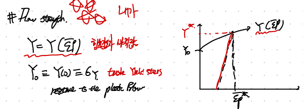
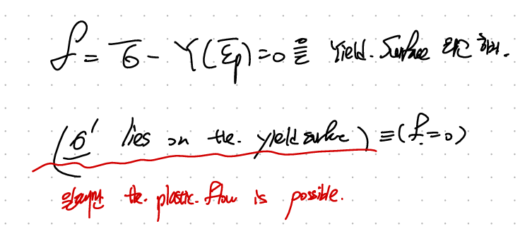
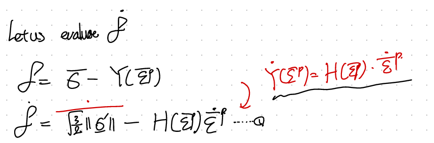
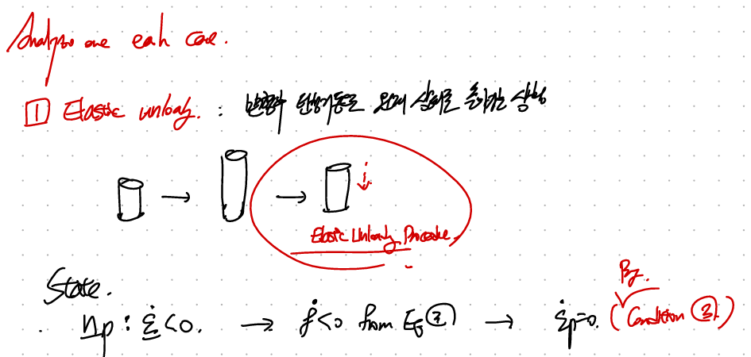
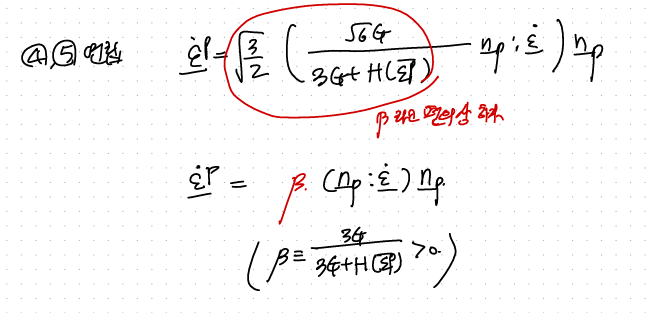
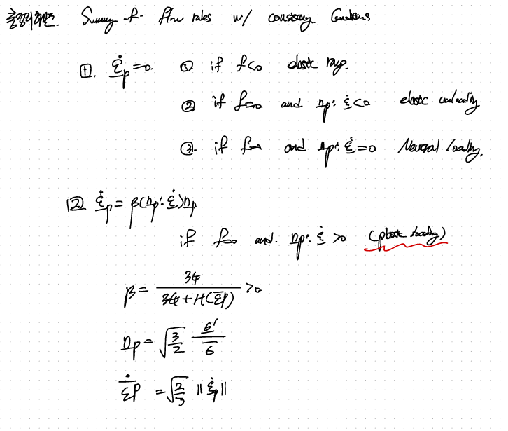
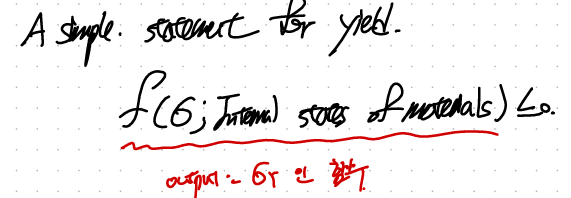

Source: [https://jeffdissel.tistory.com/m/210](https://jeffdissel.tistory.com/m/210)

CH6 Plasticity- part2 - Flow strength
Last time we dived into the
Coaxiality
of the Plastic flow direction.
굉장히 모호한 개념이었다.
(강의와 교재를 몇번 반복해서 보니 이해가 되었다)
결국 핵심은
Deviatoric stress가 plasitc flow의 원동력
이고,
그 방향이 곧 plastic deformation strain rate의 방향
이었다.
그 방향을 우리는 np라는 단위 방향 텐서를 정의하였고,
scalar 값들도 stress, strain 각각 정의하였다.
(지난시간 꼭 읽고와주세요...부탁드립니다!~~~)
https://jeffdissel.tistory.com/209
CH6 Plasticity- part1 - about plastic direction
Plasticity 가정들.[Isotropic Elastic - Plasticity of engineerign Materials] 1. When dislocation move, the crystal deforms plastically2. Poly crystalline materials are regarded to be isotropic elasitc - plaasstic3. Assmed to be Incompressible plastic def
jeffdissel.tistory.com
이제,
plastic deformation에서 빠질수 없는
학부때 배운
Yield Strength
를 자세하게 살펴보자.
학부 고체역학 시간대 결국 소성변형(plastic deformation)은
strength < current stress
라고 배웠다.
아래 x축이 plastic strain
인 그래프를 살펴보자.
Yield strength는 y절편의 값 Y(0) 일 것이다.(소성변형 없음)

x 축 - Plastic Strain, Y 축 - Tensile Yield stress ( Yield Strength)
위 그래프의 핵심은 소성변형이 시작되면, yield strength가 변한다는 것!!!.
즉, plastic deformation을 하면서 변하는 yield strength의 gradient를
다음과 같이 Hardening rate를 통해서 나타낼 수 있다.
Y가 커지면, strain hardening
Y가 작아지면, strain softening

위 변하는 Yield strength함수 Y(ep) 를 가지고 Mises 학자는 다음의 식을 정의하였다.

즉, Mises stress - Y(ep) = f = 0이라는 공간평면을 정의하고,
현재 상태가 그 평면 위에 있다면 -> plastic flow is possible
이라고 정의하였다.
(why may????)
다른말로 표현하면,
평면위에 있지 않으면 무조건 reversible elastic
이라는 것.
(여기서 평면위에 있다는 것은 von mises stress = Y(ep) 인 상황)
여기서 한발 더 나아가 평면위에 만약에 없다면 Elastic한 상황이고,
그때는 당연히 Yield Strength > Mises stress 일것이다.
when f = Mises Stress - Y < 0
Therefore, 자동으로 f < = 0 이라는 Boundness가 성립된다.
(f = 0 -> plastic, f <0 elastic, f > 0 elastic으로 불가능.)

Plus Mises introduced 더 자세하게 4가지 Consistency conditions for Plastic flow

1번은 방금 이야기한 내용,
2번은 당연하다. f = 0이고 기울기가 양수라면,
증가해야하지만 f는 양수가 존재할 수 없으므로, 기울기 = 0 or 음수.
3번은 elastic일때, f<0 이거 특이하게도 f = 0 인경우도 가능하다.
단 f = 0 평면위에서 바로 벗어나는 경우만(f dot < 0)
4 번은 plastic flow가 일어나는 경우고, 평면위 즉 f = 0 위에 잇는 경우이며, 기울기도 0 이어서,
계속해서 그 평면위에 머물고 있는 상황이다.
(break time w/ Mises, research field가 어마무시하다..)

상상을 이렇게 해보자.
어떤 공간에서, 나의 물질은 그 물질의 deviatoric stress tensor에 따라서,
물질의 공간적 위치가 결정된다(1대일대응이라고하자)
그 동일한 공간에 mises할아버지가 만든 f=0 이라는 평면이 존재한다.
여기서, 나의 물질 deviatoric stress tensor로부터 plot한 물질의 위치가
f = 0 평면 위에있고, df/dt = 0이라면 -> 나의 물질은 plastic flow 이고,
아니라면, elastic.
(이 되도록 Mises 할아버지가 평면 f =0 을 설정해놓았다!!!!!!)
자세히 4가지 규칙을 보게되면, f 뿐만아니라
df/dt를 같이 보고 물질의 상태를 판단해야하므로 계산해주자~

한편,
d ||sigma|| /dt
를 위해서,

바로 적용해주면, np가 사이에 보인다!.

여기서, stress tensor와 strain tensor의 관계식을 우리는 구하여 대입할 수 있다!!! from where???
Elastic constitutive Law.!!

2번식에 대입할 재료1
+ 미리 준비해놓아야 할 식.

2번식에 사용될 재료2
자 이제 두 재료를 2번식에 대입해주자.

따라서, 최종적으로 밑의 3번식이 유도된다.

자 이제, 위 4가지 조건을 만족하는 실제 물리상황을 따져보자.

(탄성영역에서, 원래상태로 되돌아가는 상황!)
3번 condition에 해당하는 것을 알 수 있다.

plastic deformation이 일어나지 않는다!!!!

당연히 4번 conditino으로 f = 0 df/dt = 0이 나온다.
이 경우 3번 방정식의 df/dt = 0 을 이용하면,

4,5식을 연립하여 주면,

Plastic deformation에서 다음식을 유도할 수 있다.
최종 요약을 하자면!!
Plastic deformation이 일어나는 경우와 일어나지 않는 경우로 다음과 같이 나눌 수 있다.

#Appendix.
처음에 이해하기 어려웠던, Mise의 surface의 의미.
나의 언어로 마지막으로 표현해보자.
그니까 어떤 f라는 함수가 있고, 이 함수에는 plastic에 관련된,
Stress Tensor, Material information이 input

이 함수는 안에서 계산을 하여,
Yield Strength를 계산
한다.
이후에, 이 계산된 yield strength를 가지고
f 최종값이 음수 or 0 인지에 따라 + df/dt가 음수 or 0 인지도 종합적으로 고려하여,
이 물질이 plastic flow인지 elastic region인지 판단한다.
결국 Yield Strength 최종판단을 위한 수단에 불과했다....
최종목적은 이 물질이 어느 상태에 있는지가 관심이 있어서
f function은 그렇게 디자인 되었다.

여기서, 한가지 더 중요한 포인트는 input으로 넣은 stress tensor를
두가지로 나누어보자. mean pressure and deviatoric stress tensor
이렇게 나누었더니???? 실험적으로 p_bar는 f에 independent하다는 것을
Mises는 실험으로 확인하였다.

따라서 , 최종적으로 f함수에는 Deviatoric stress만 들어간다!!!
(material info도 당연히 필요 너무 당연한 default)
