Source: [https://jeffdissel.tistory.com/m/211](https://jeffdissel.tistory.com/m/211)

CH6 Plasticity- part3 - Plastic Think wall BVP
지난시간에 열심해 배운 Plasticity 이론을
이제 직접 Boundary value problem에 적용해보자!
다음과 같이 속이 빈 구가 있다고 가정하자.
그리고 안쪽 면에서만 압력이 작용한다.

Only inner pressure exists
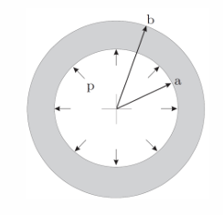
Cutted Section view of the sphere.
Assumptions
1. radially symmetric
2. Isotropic Elastic-Plastic Material
3. No hardening, perfectly plastic material
with constant Yield Strength(Y)
4. Only radial deformation
Elastic 영역이 경우, 우리가 radial displacement, stress tensor 모두 유도하였다.
https://jeffdissel.tistory.com/204
CH5 Elasticity - part5 (BVP - thick wall sphere)
Boundary Value Problem(BVP) 자 이제 BVP실제 문제를 풀어보자. 해결 방식은, 우리가 이전 포스터에서 유도하였던,식과 문제상황별 Boundary Condition을 가지고해를 구하는것. (간단하지만 간단하지않다...) 1
jeffdissel.tistory.com
자세한 유도과정은 위 링크를 통해 알 수 있으며,
결과를 그대로 가져와서 사용하겠습니다^^
elastic식에서 pi = p, p0 = 0 만 대입해주면,

Von Mises stress를 구해보면,
귀신같이, 두 stress 값의 차이로 계산되고,

# Von mises stress definition
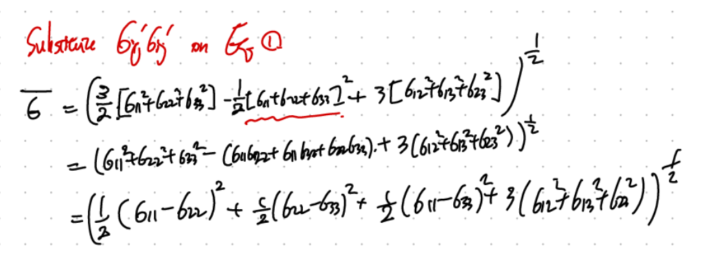
다시 본론으로 돌아와서.
결국 von-mises stress가 Yield strength를 초과할때 -> Plastic flow가 시작된다.

여기서, Py를 Y를 직면하게 하는 압력이라고 설정하자.
우리 현재 geometry상황에서, 당연히 먼저 yield를 직면하는 r 은 a일 것이다.

따라서, 우리는 r = a, von mises stress = Y 일때의 압력 , Py를 다음과 같이 유도가능하다.

다시 정리해보면, 지금
elastic영역에서의 반지름별로 u_r 그리고 그때의 pi = pY 를 알고 있으므로, 대입해주면

py를 ur 대입해주자.
즉 pi = pY 일때, Elastic영역에서의 displacement는 다음과 같다.

정말 재밌는 사실은, 지금 구 안에서 elastic plastic영역 두개의 영역이 공존한다.(pi에 따라서)
방금 전까지 우리는 언제 elastic이 끝나는지? 그때의 py를 구했고, 이번에는
전체영역을 두개로 나누어서 분석해보자.
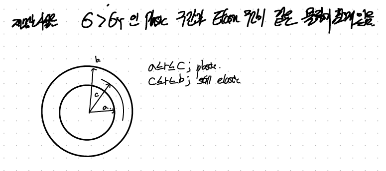
당연히 안쪽으로 갈수록 von mises stress가 크지만, 전체영역의 Y는 동일하므로,
안쪽이 Plastic이고 바깥쪽이 elastic일 것이다.
1. Elastic Region ( c =< r =< b)
https://jeffdissel.tistory.com/204
CH5 Elasticity - part5 (BVP - thick wall sphere)
Boundary Value Problem(BVP) 자 이제 BVP실제 문제를 풀어보자. 해결 방식은, 우리가 이전 포스터에서 유도하였던,식과 문제상황별 Boundary Condition을 가지고해를 구하는것. (간단하지만 간단하지않다...) 1
jeffdissel.tistory.com
해당 영역에서 bc을 적용하기전 과정은 동일하므로
A,B 계수가 그대로 있는 u_r 그리고 stress tensor를
지난시간(위 링크) 에서 유도한 식들은 다음과 같다.

여기서 BC을 잘 설정해야한다.
plastic region과 만나는 면(r = c)은 yield가 딱 시작하는 순간일 것이다.
+ 가장 바깥쪽 면 (r = b) 는 stress free.
BC1 -> Von mises stress( r = c) = Y
BC2 -> radial stress ( r = b ) = 0

따라서, 위와 같이 2개의 BC으로 A,B를 계산할 수 있다.
(lame상수와 E,v는 자유롭게 바꿀 수 있으므로)
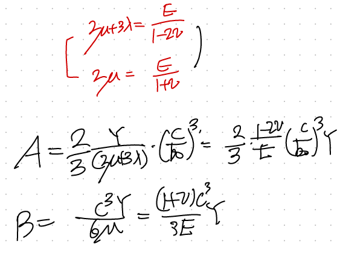
따라서, 최종적으로 u_r 그리고 stress tensor component는 다음과 같다.

2. Plastic Region ( a =< r =< c)
이 영역에서 지배 방정식은 2가지이다.
1. f = 0 -> Von mises stress = Yield Strength (on the Mises plane)
2. div T = 0 (Equilibrium of Motion)
두 식을 표현 후, 정리하면 sigma_rr을 다음과 같이 구할 수 있다.
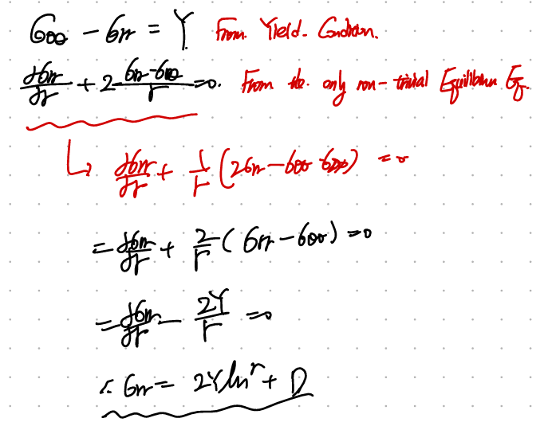
D를 구하는 방법은 BC
BC으로, r=c에서 Elastic region과 plastic region의 Stress tenesor should be continuous

D를 구했으니, 이제 rr방향의 stress tensor component를 알 수 있다.

뿐만아니라, yield conditon을 사용하면 -> circumferential도 구할 수 있다.

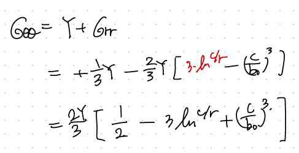

자 지금 plastic regino의 stress field를 r에따라서 계산하였다.
그렇다면 displacement는???
simga - strain 의 관계인 constitutive law가 linear elastic처럼 존재하지 않는다.
따라서,
incompressible 가정을 통해서, 간접적으로 얻자.
(맨처음에 가정을 잘보면, 우리의 plastic flow는 incompressible이라고 가정하였다.)
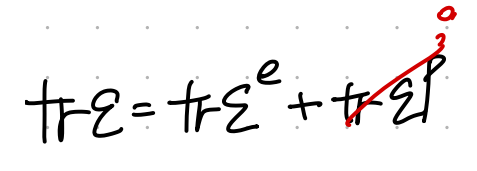
따라서, trace of total strain tensor = trace of elastic strain임을 알 수 있다.
그렇기 때문에, 여기서 우리는 elastic strain의 constitutive Law를 사용하자.

여기서 우리는 total strain을 total displacement vector를 가지고, 다음과 같이 구하자.

이제 (a) = (b) = tr(e) 식을 가지고 ur을 구하자.
여기서 굉장히 중요한 사실은 바로,
elasitc strain이 plastic strain과 다르지만,
elastic strain,plastic strain두 strain에 관여하는 stress는
동일하다!!!!!
(plastic이론에서 굉장히 중요한 사실이다!!)
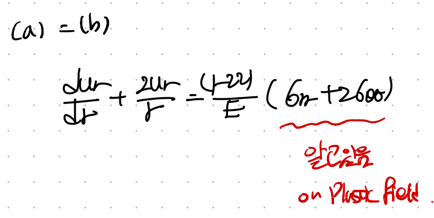
따라서, 여기서 사용되는
stress tensor(which was written from the linear elastic constitutive Law)
는 우리가 위에서 구한 plastic stress tensor와 동일하다!!!
아까전에 위에서 구한 plastic region stress tensor를 다시 작성해보자.
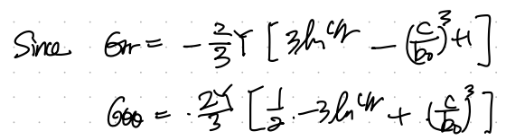
그리고 이제 이거를 위 displacement 식에 대입해주면 다음과 같이
r에 대한 ODE를 구할 수 있다.
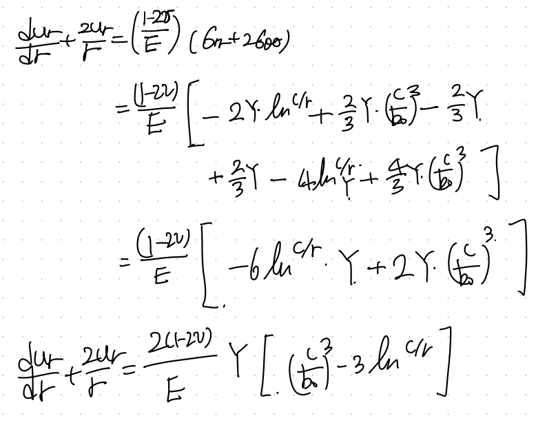
열심히 ODE를 풀어주자.

풀다보면 적분과정에서 하나의 Constant(D)가 나온다.

ODE의 상수들은 무조건 Boundary condition에서 얻을 수 있다.
여기서 우리가 사용할 Boundary condition은

Elastic region과 plastic region이 만나는 지점(r=c)에서,
Plastic displacement와 elastic displacement가 동일해야한다.
맨처음에 언급한, thick wall displacement (Elastic)는 다음과 같다.

여기서, r = c를 대입하주자.
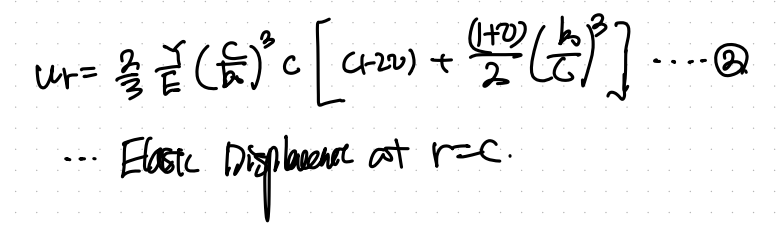
그리고 plastic region의 r = c에서의 displacement는 다음과 같다(D포함)

위 두식을 같다라고 하고, D를 구하면

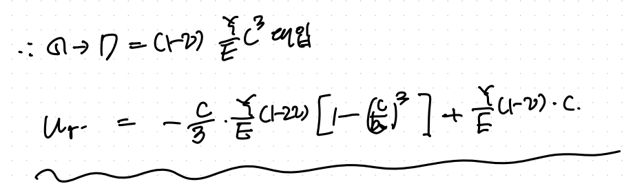

즉, 우리는 Plastic region에서 constitutive Law가 없으므로,
incompressible가정을 통해서 간접적을 구하였다.
여기서 핵심은 stress tensor가 elastic, plastic strain에 동일한 stress tensor가
관여한다는 사실이다!

