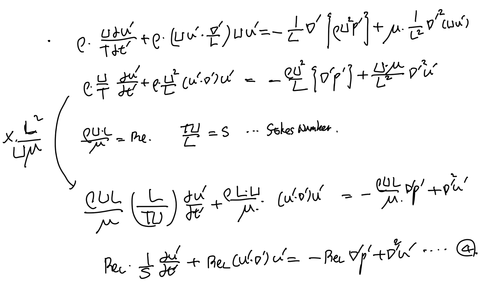
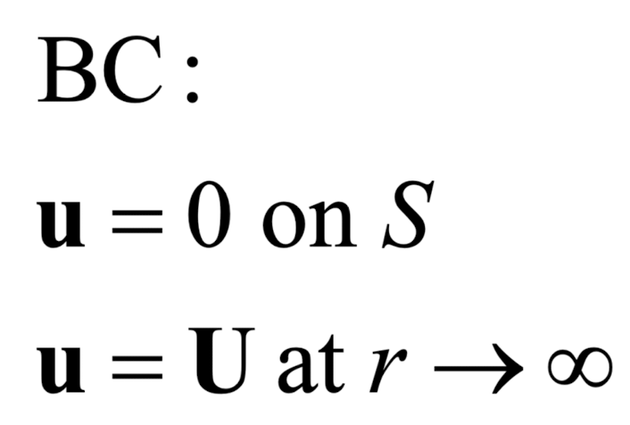
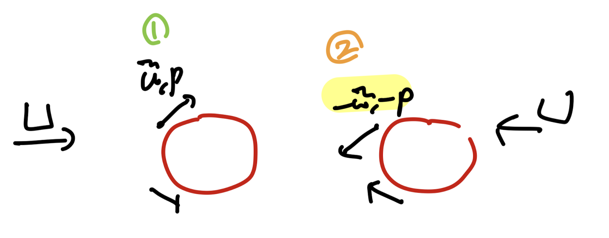
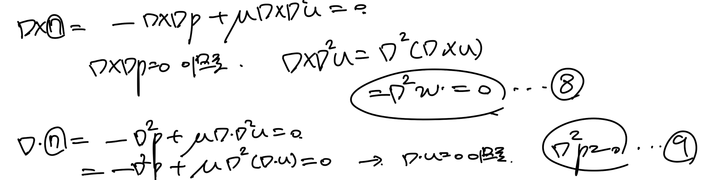

Source: [https://jeffdissel.tistory.com/132](https://jeffdissel.tistory.com/132)

ch4에서는
Laminar flow,
흐름이 uniform한 유체의
흐름에 대해서 다루어 보았다.
이번에는
Reynolds number <<1
인 상황에서
유체의 흐름이 어떤 특징을
가지는 지를 살펴보자.
'Reynolds 수가 작다'
라는 말은
밑의 예시를 통해서
쉽게 이해하실 수 있다.

Reynods number = Inertia force / Viscous force
Re<<1 :
즉 유체의 움직임의 관성보다
점성효과가 더 훨씬 크다는 말이다.
위의
실린더를 가로질러 흐르는 유동에서
우측의 Stokes flow의 경우
점성효과가 굉장히 커
(고체 표면과의 shear stress 가 크다)
flow separation이 일어나지 않는다.
# flow separation
고체면과 유체 사이에 shear stress =0 이 되어,
유체가 더이상 고체표면에 붙어있지 않고,
떨어져 나가는 지점.
(자세한 것은 ch6 boundary layer에서)
우리는 이 Stokes flow를
analytically
분석하기 위해서,
우리의 대국민 방정식
-연속방정식
-모멘텀보존방정식

non-dimensionalize해주자.

먼저 연속방저식은 똑같은 형태로 변환되며,

두개의 대국민 무차원수,
Reynolds number: Re
Stokes number: S
로 모멘텀 방정식을 무차원 방정식으로 정리해주자.

여기서 우리는,
Low Reynolds number인
Stokes flow에 대해서 분석하고 싶으므로,
Re를 0 으로 수렴시키면 방정식3,4는 다음과 같다.

신기하게도 3번, 4번_x방향, y방향, z방향
이렇게 총 4가지의 방정식이 있고,
variable : u_x, u_y, u_z
총 3개이다.
즉, 위 풀이는 잘못됬다는 것을 암시한다.
위 과정
중 무엇이 잘못되었을까?
바로, Pressure non dimensionalize
과정에서 실수가 있었다.

위 식에서 P는 유체의 압력,
ρU^2는 dynamic pressure을 뜻한다.
#Dynmaic pressure
즉, 유체의 관성에 의한 유체의 움직임
을 압력으로 표현한 것이다.
하지만, 맨처음의 예시를 통해서,
Stoke's flow에서 관성은 무시되고,
점성이 유체의 흐름에 지배적인 역할을
한다는 것을 확인하였다.
따라서, 우리는 압력을 다음과 같이
점성을 이용하여 non-dimensionalize 해주어야 한다.

이제, 다시 Naviers stokes 식을 정리해주자.

이후, Stokes flow를 분석하는게 목적이므로,
Re -> 0으로 수렴시키면,
다음 식이 도출된다.

특이한 점은, 시간 term이 소거되었으므로,
stokes flow자체가
1. time independent
2. Linear equation
->
(u',p')이 만약 5번 식의 해라면,
(-u', -p')도 해라는 점
이 2가지 사실이 위로부터 알 수 있는
가장 큰 특징이다.
#Linear dependent -> Kinematic Reversibility
solution의 reversibility를 예시를 통해서 쉽게 이해해보자.
아래의 2D flow에서 유체가 오른쪽으로 흐른다고 가정하자.

위 흐름의 Boundary condition
이때, 1번 그림의 위치에서 해가 u,p라면,
-u,-p도 같은 위치에서 해라는 것을 Linear 성질을 이용해서
쉽게 알 수 있다.

중요한것은, boundary condition도 *-1을 해주어야 하므로,
유체가 왼쪽으로 흐르는 경우의 해가 -u,-p인 것이.
따라서, 1번의 모든 흐름이 거울로 mirroring 한
흐름이 2번 흐름이라는 것이다.
속도 압력이 전부 대칭적이다???
속도 -> shear stress -> cauchy stress -> Body force
즉, 물체에 작용하는 힘도 대칭적이다.
(A 대칭, B)

한편,
무차원 방정식으로 바뀐 결과를 보고,
우리는 결론적으로 압력과 점성항만이
stokes flow의 흐름에 영향을 준다는 것을 확인하였으므로,
다시 원래 방정식(Navier's stokes Eq)에서 두항만 남겨주자.

이후, 7번식을 gradient와 외적,내적을 통해서
8,9번식을 유도할 수 있다.

8,9번 식을 다음 블로그글에서,
sphere주변을 흐르는
Stokes flow 분석을 위해서 사용해보자.
