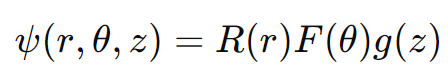
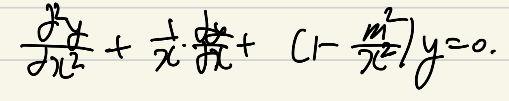
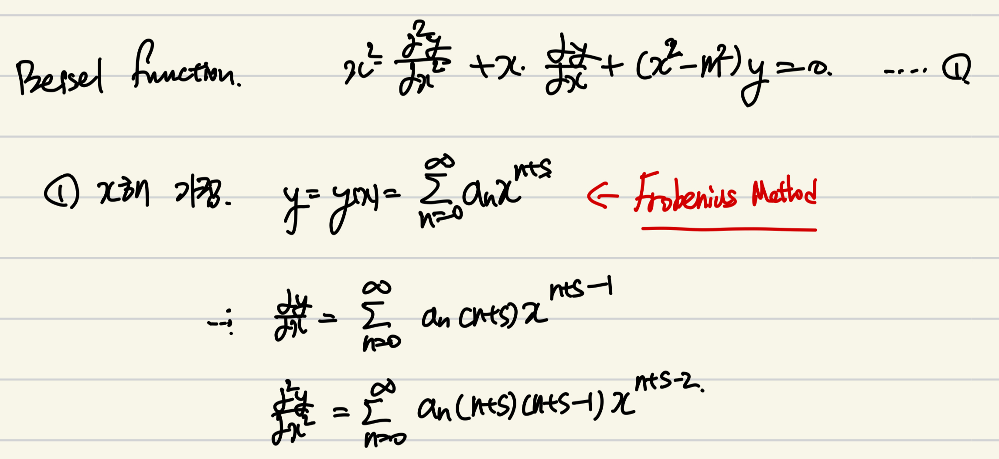
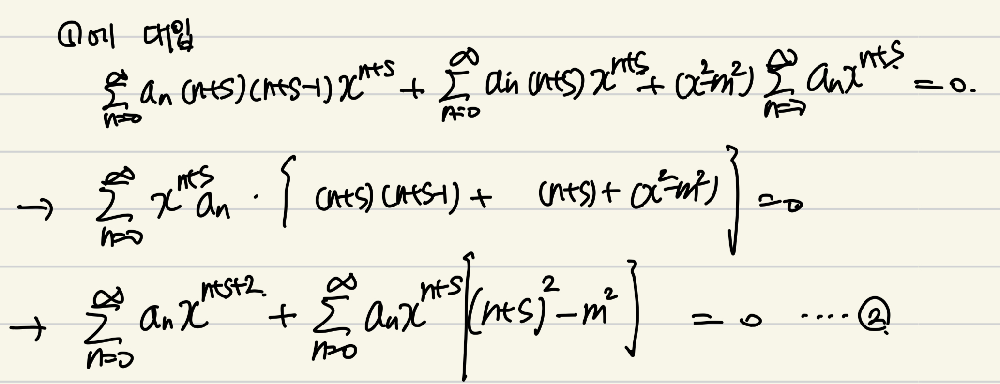
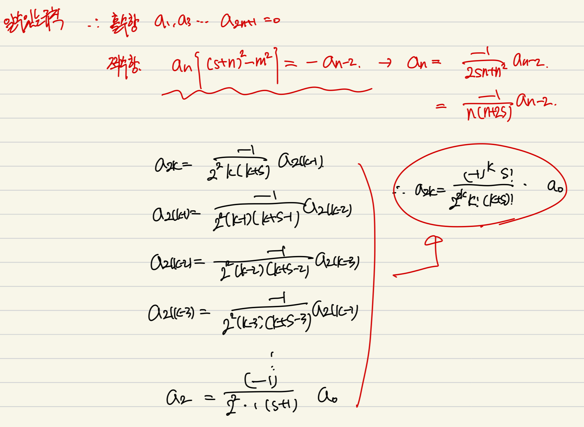

Source: [https://jeffdissel.tistory.com/101](https://jeffdissel.tistory.com/101)

심장박동의
Pulsatile Flow
의 유동해석
(주기적으로 움직이는 심박에 의한)
(혈액 속도장 계산)
과정속에서,
뜬금없이
Bessel function
이 등장해버렸다.

(베셀 함수의 1종 해)
이 친구는 학부시절,
열전달 (전도) 시간에 잠깐 등장했었지만,
교수님께서, 이런 함수 기억나지??
공학수학때 배웠었짢아 하고 넘어갔던 기억이 있다.
(물론 공학수학에서, 이런게 있다 이랬던 것 같다.)
이번 블로그 글로
정복해보자.
--------- --------- --------- --------- ---------
먼저,
Bessel's Equation은

(second-order linear ordinary differential equation)
처럼 생겼다.
문제는, 저렇게 생긴 함수가 실제 공학문제에서 많이 등장하는 것이다.
ex1)
공학수학 책에서 살짝 언급했던 case는 바로
2D circular Membrane of Drumhead
둥근 드럼의 파동의 움직임을 나타내는 방정식.

ex2)
헬름 볼츠 방정식
(파동방정식)

ψ: scalar or vector function
k: wave number
(
r
,
θ
,
z
) coordinate에서
laplace 연산자를 풀어주면.

이후에, 공학수학에서
ODE풀던 방식 그대로
Separation variable 방식을 사용한다.

넣고 전개를 진행하면, radial component에서 bessel eq이 등장한다.
결론적으로, bessel equation이 생각보다 많이 등장하는 것을 확인하였고,
이제 solution을 구해보자.
----------------------------------------------------------
베셀 함수 같은 경우, 양변을 x^2로 나눠주면,
x = 0 에서 발산하는 방정식임을 확인 할 수 있다.

발산하는 구간이 없는 경우, 우리는 ODE 공학수학 시간에,
테일러 급수를 사용하여,

해를 구하였다. 하지만, 이를 대입해도
분모의 x를 제거하지 못하여 발산함을 알 수 있다.
이를 해결하는 방법이 바로
프로비니우스의 해법
이다.
밑에처럼, 테일러 급수 해의 형태에
x^s를 추가로 곱해주는 형태의 해.
(임의의 실수 s)
이제, 가정한 해로 미분을 진행한 후 대입해주자.

이제 대입.

이제, 가정한 해를 기존 bessel equation에 대입해주면,
2번 식이 유도된다.

이후에 가장 낮은 차수인 x^s의 계수를 추출해주고,
항등식이므로 계수 = 0 식을 세우면,
일반해로
s = +m or -m 이 도출된다.
이후, m이 정수라고 가정하고 들어가보자.
(정수 아닐때도 추후에 살펴보자)

계속해서, x^s, x^(s+1),.. 들의 계수 = 0 식을 세워보면,
규칙이 보이기 시작한다.

a홀수항 = 0 , 짝수항은 규칙적으로 곱해지는 것.
따라서, 모든 a들을 기존 가정했던 해에 대입해주자.
(a 홀수항 사라지고, 짝수항은 특정규칙)

여기서, s = +m, -m (정수)인 경우를 먼저 살펴보면.

여기서 드디어, Bessel function이 derived 된다.
여기서, 감마함수의 성질을 이용하여.

(n 이 자연수일때)
다음과 같이 나타낼 수 있다.

자 여기서 우리는 ODE의 두 해를 구했고,
이들의 합으로 일반해를 구하면 된다.
(일반적인 ODE의 해)
하지만, 그전에
두해가
Linearly independent or dependent
인지 확인해야한다
m 이 정수일때 J-m(x) 를 살펴보자.

여기서 핵심은 감마함수는
x 가 음의정수, 0 일때 발산한다는 것.
따라서,

뒷항 만 남게 되고, 치환을 한 후에
펙토리알 부분을 쪼개주자.

쪼갠 팩토리알 부분을 감마함수에 넣으면,
마법같이 Jm(x)가 등장하게 된다.
결론적으로 m이 정수일때는
Jm(x), J-m(x) 두 해가 서로 linearly dependent하다는 것.
따라서,
y = a Jm(x) + b J-m(x)
(a,b는 상수)
이렇게 베셀함수의 일반해를 나타낼 수 없다.
여기서, 해결책으로
제2종 bessel 함수
가 등장하게 된다.
다음과 같이, Jm(x) 와 J-m(x)의 선형조합으로 나타내어
bessel 방정식의 해가 된다는 것은 자명하다.

결론적으로, 다음과 같이 정의하면
Jm(x) 와 Ym(x)는
선형독립으로
(사실 선형독립이 되도록 정의한거임)
y = C1 Jm(x) + C2 Ym(x)
형태로 베셀 방정식의 일반해를 나타낼 수 있다.
너무 길어진 관계로 다음 포스터에서
1. Jm(x), Ym(x) 가 선형독립
2. m 이 정수가 아닐때, 베젤 함수의 해
두가지에 대해서 다뤄보겠습니다.
