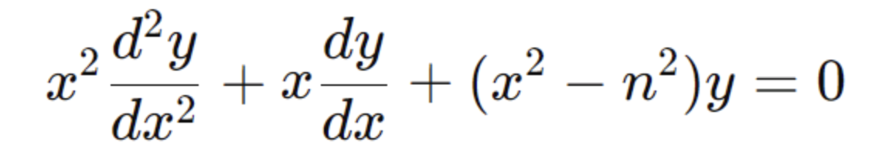
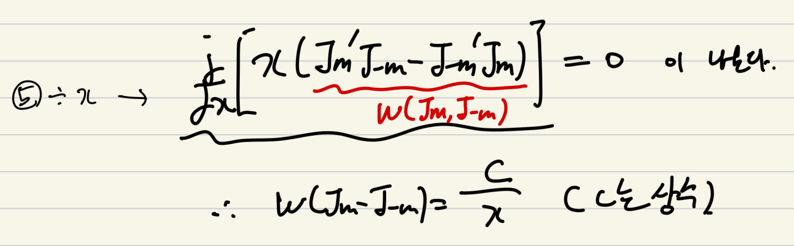
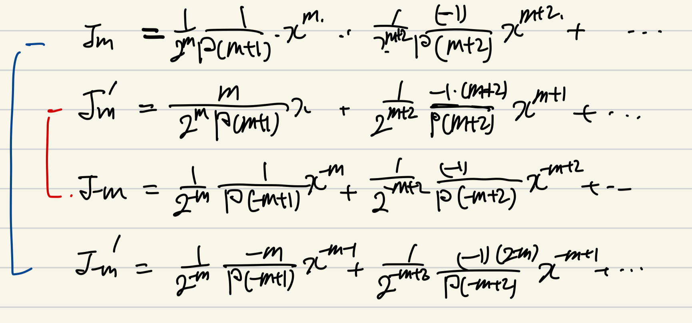
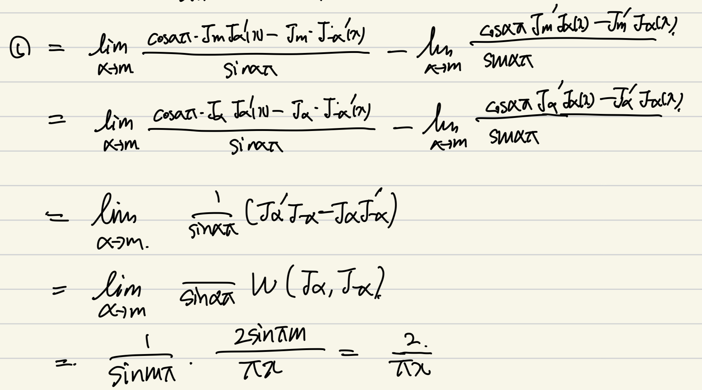

Source: [https://jeffdissel.tistory.com/102](https://jeffdissel.tistory.com/102)

[이전 포스터 요약]
지금 현재 우리는
베셀방정식의 해를 구하는 중이다.

프로비니우스 해법으로
Jm(x) , J-m(x) 두가지가 해가 나왔지만,

m = 정수일때

즉 linearly dependent라는 관계로
증명되었다. (Jm, J-m 으로 일반해 derive못함)
따라서,
새로운 해 Ym(x) 를 정의하였고,
이를 제 2종 베젤함수라고 부른다.

자 여기서, 2가지만 이번시간에 알아보고 가자.
1. m이 정수가 아닐때는?
2. Ym(x), Jm(x) 는 선형독립인가?
----------------------------------------------
1. m이 정수가 아닐때
먼저, 결론적으로 말씀 드리면,
Jm(x) 와 J-m(x)가
선형 종속이 아니게 된다.
따라서,

(c1,c2는 상수)
위형태가 베셀 방정식의 일반해가 된다.
이제, linearly independent임을 증명해보자.
증명방법은
Wronskian이 모든 x에 대해서 0 이 아님을 보이면 된다.

자 여기서,

위 베젤 함수에 방정식의 해
Jm(x), J-m(x) 를 대입하여 밑 1,2식을 도출하자.

위 연산과정을 거친 후,
정리하면 최종적으로 Wronskian이 도출됨을 알 수 있다.

핵심은, Wronskian을 아직 정확히 구하지는 못했지만,
C/x 형태임을 확인하였다.
이제 지난시간에 구한,
제 1종 베젤함수의 실제 식을 미분하여,
Wronskian식을 계산해보자.

시그마 항의 n=0, n=1 항만 전개해주면,
계속해서, 차수가 2만큼 증가함을 확인 할 수 있다.

이제 Wronskian식에 대입하기 위해 곱해주는데,
핵심은 x의 차수가 -1이외의 것들은 0 이 됨을 우리는 알고있다.
즉, n=0의 항들의 곱만이 x차수가 -1이고 이외는
차수가 높아짐을 알 수 있다.
따라서, n=0항들만 곱해주어 Wronskian을 구해주자.

(감마함수 성질1,2)
여기에 감마함수의 첫번째 성질을 이용하면,
다음의 Wronskian식이 감마함수로와 x^-1의 곱으로 나타난다.

여기서 감마함수의 2번째 성질로 사인함수로 감마함수를 바꿔주면
결론적으로 우리가 원하는 Wronskian의 식이 나오게 된다.
위 식을 보면 알 수 있듯이,
m = 정수일때, Wronskian = 0
m = 정수 아닐때, Wronskian != 0
따라서, m:정수일때
Jm(x), J-m(x) 는 선형종속(Wronskian = 0)
아닐때는, 선형독립임(Wronskian != 0)
을 확인하였다.
----------------------------------------------
2. Ym(x), Jm(x) 선형독립 증명
따라서, 지난시간에
m이 정수일때 Ym(x)
제2종 베젤함수를 정의하여,

베젤방정식의 일반해가 다음과 같다고 하였다.

(C1,C2는 상수)
여기서 제2종 베젤함수는 베젤 방정식을 통해 유도된 해가 아니라,
식을 통해 유도된
Jm(x), J-m(x)
로 구성된 해이다.
(말이 좀 복잡하긴하네요)
즉, 식을 통해 유도된 Jm(x), J-m(x)
로 일반해를 정의하려고 했지만,
m이 정수일대, 선형종속이므로 정의하지 못하여
Jm(x), J-m(x) 의 조합
+ Jm(x) 와 선형독립
이 되도록
새로운 해를 정의한 것이다.
그렇다면, 새롭게 정의한 Ym(x)이
Jm(x)과 선형독립임을 확인해보자.
확인방법은, 지난시간에 했던 것과 동일하게
Jm(x), Ym(x) 의 Wronskian이 0이 아님을 증명하면 된다.

먼저, 제2종 베젤함수를 미분시켜주고,
론스키안 식(1번) 에 대입해준다.

대입해주게 되면,
과정에서
Ja(x), J-a(x)의 Wronskian이 나온다.
(
아까 위에서 derived)
따라서, 최종적으로 2/(pi*x) 가
도출되고,
0이 아님이 증명되었다.
--------------------------------
