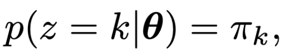
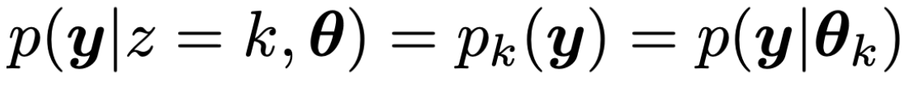
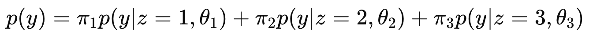
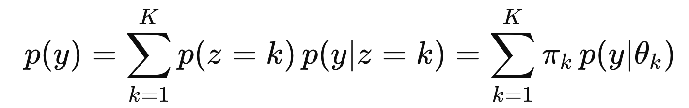
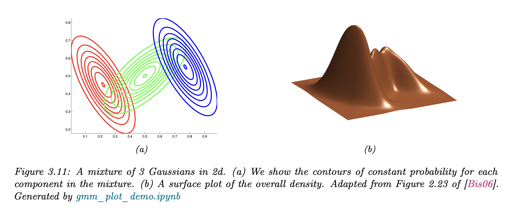
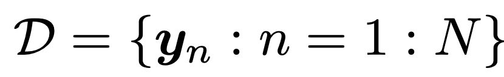
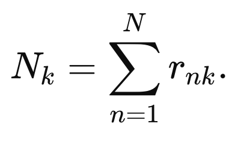
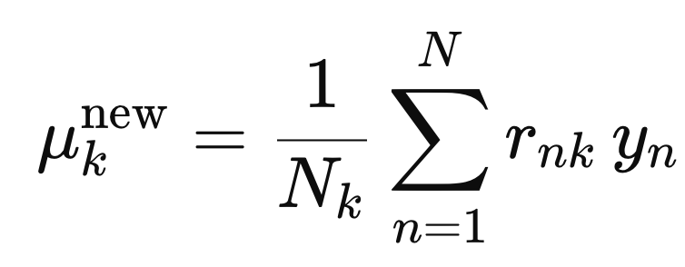

Source: [https://jeffdissel.tistory.com/m/234](https://jeffdissel.tistory.com/m/234)

Ch3 Probability - Multi model - GMM
우리의 목표는 주어진 데이터를 가지고,
데이터의 분포를 설명하는 하나의 모델을 만드는 것.
(그래야 주어지지 않은 데이터의 값을 예측할 수 있다.)
그 모델을 우리는 지금까지 어떤 하나의 모델로 해석해야 할까?
라는 질문을 가지고 접근했다.
However,
실제 데이터들은 사실상 분포 하나로는 모델링이 불가능한 경우가 대부분이다.
그렇다면, 데이터를 여러 sub model의 집합이라고 생각해보면?

즉, subgroup들은 특정분포를 따르고,
그 subgroup들의 합으로 전체 data set을 구성한다면???
위 아이디어를 수학적으로 표현하면 다음과 같다.

여기서
pi(가중치)
또한 우리는 확률로 계산을 할 것이고,
이를 위해 Latent Variable z 를 정의한다. (뒤에서 자세하게 설명)

즉, parameter
θ에 대해서 z = k 일 확률을 pi_k 로 정의한다.

0<가중치 = pi_k <1이므로 확률 = 가중치로 해석하기 적절.
그리고 여기서 conditional Likelihood는 다음과 같이 정의 가능하다.

예를들어, 총 3개의 subgroup 확률분포가 있고,
각각의 가중치를 pi1,pi2,pi3이라고 하자.

subgroup과 가중치를 연결하는 index -> latent variable
여기서 한발짝 나아가서 가중치는 z에 대한 확률이었다.

다시 표현하면 다음과 같다.

위 Multimodel중에서 가장 많이 사용하는 모델이
subgroup의 확률분포가 Gaussian Distribution이라는 가정을 한,
Gaussian Mixture model

(가우시안 분포는 가장 쉽고 모델링하기 좋다, 평균과 분산만 있으면 모델링이 끝나기 때문)
아래 그림을 보면, 3개의 Subgroup들 각각 Gaussisan distribution임을 알 수 있고,
(b)의 전체 확률은 3개의 확률을 적절히 더하여 구성된다.(적절히 means multiplied w/ weight function)

여기서, (주어진 데이터를 가지고) 우리가 구해야하는 것은
가중치와, 각 Gaussian 분포의 평균과 분산
을 구해야한다.
어떻게 구하는지 과정을 살펴보자.
n개의 데이터가 있다고 가정하고,
각 데이터의 Dimension은 (D x 1) vector라고 하자.

e.g.) D개의 센서로 n번 각각 관찰.
총 데이터셋은 D 집합으로 다음과 같이 표현한다.(위의 DIMENSION D와 다르다!!)

(쉽게 표현하면 아래와 같은 전체데이터셋 집합이라고 생각하면 된다)

다시 말하지만, y 각각은 (D개의 정보가 담겨있음)
Goal: Find the θ corresponds to the max Likelihood
우리의 최종목표는 내가 가지고있는 데이터 D와 가장 잘맞는
θ
를 찾는 것)

그리고
GMM에서 Theata는 가중치와 각 가우시안 분포의 평균과 분산임을
다시. 강조!.

최적의 theat를 찾는 알고리즘은 여러가지가 있지만,
"EM 알고리즘이 가장 널리 알려진 방법이지만, 실제로는 확률적 경사하강법(SGD)이나 변분추론(VI), MCMC 샘플링, 모멘트 방법 등 다양한 대안 알고리즘도 존재한다. 다만 구현 난이도와 계산 효율성 때문에 실무에서는 대부분 EM이나
그 변형(Online EM, Stochastic EM)을 사용한다"
(다른 방법들은 추후 블로그에서 다룰예정)
대표적인 EM 알고리즘을 살펴보자.
0.
θ ( π k ​ , μ k ​ , Σ k ​ ) initalize
1.
θ -> responsibility on each latent variable 계산.
2. responsibility 를 weight로 사용하여, θ( π k ​ , μ k ​ , Σ k ​) update
3. 데이터에 대해서 가장 likelihood 가 높은 θ가 나오면 stop.
(otherwise go to step 1)

여기서 1,2,3 과정을 지금부터 자세하게 살펴보자.
1. Find the Latent variable (z) associated to the data yn
GMM의 가장 중요하고 핵심인
Latent Variable
즉 우리는 yn -> output 사이에 latent varibale zn을 넣는다.
(그 이유를 생각하면서 살펴보자)

zn is a called as "label" from 1 to K
우리는 각 데이터와
θ
에 대해서, zn = 1,2 ....K 일때의 Conditional 확률을 각각 구한다.
그리고 그 조건부확률을
Responsibility
라고 정의한다.

data : yn에 대해, zn = k에 대해 -> reponsiblity = rnk
(일단 왜 이런 꼴인지는 넘어가자, 블로그 마지막 부록에서 다루도록 하겠습니다..이해해주세요)
어렵다. 이해하기 굉장히 난해하다.
그럴때는 예시로 이해해보자.
[Example]
학생 30명이 반에 있고
우리는 학생의 수학점수를 데이터 yn이라고 하자.
(e.g.) y1: 학생1의 수학점수
여기서 우리는 학생 10명의 수학성적만 알고 있다고 가정하자.
그랬을때, 나머지 20명의 점수 도 알고 싶다.
(즉, 수학성적이 어떻게 분포하는 지를 알고 싶다)
굉장히 난해하고, 복잡하고 하나의 Gaussian distribution으로는 해석이 불가능하므로
우리는
(K = 3)명의 수학선생 님
이 존재한다고 가정한다.
여기서 Latent Variable = {선생님1, 선생님2, 선생님3}
Label(k) = 선생님 번호
(즉, 3개의 Gaussian Distribution의 적절한 합으로 학생의 점수가 분포한다고 가정하는 것이다!!!!!!!!!)
따라서
,
yn이 주어졌을때
각 수학선생님의 contribution을 우리는 구하여,
최종 yn을 예측하는 모델을 만들 계획.
여기서,
하나의 학생(데이터)에 대해서
latent variable(선생님)의 기여도가 responsibility라는 것이다.
가지고 있는 데이터를 활용하여 (학생1의 데이터는 암)
학생1에 대해서 선생님1,2,3의 기여도를 구한결과.
(0.1, 0.8, 0.1)
즉,
r11 = p(z1 = 1|y1, θ ) = 0.1
r12 = p(z1 = 2|y1, θ ) = 0.8
r13 = p(z1 = 3|y1, θ ) = 0.8
(다시 그림과 연결해보면)

ㅍ
위 사진처럼 초록, 빨강, 파랑 선생님이 있고,
3명의 선생님 = 3개의 작은 Gaussian distribution이고,
각각 z1,z2,z3으로 라벨링을 하여,
1번 Gaussian Distribution의 기여도 = 0.1
2번 Gaussian Distribution의 기여도 = 0.8
3번 Gaussian Distribution의 기여도 = 0.1
인 것
2. update the θ ( π k ​ , μ k ​ , Σ k ​)
우리는 위과정으로,
가지고 있는 10명의 학생마다 기여도를 모두. 구했다고 가정하자.
학생1 = (0.1, 0.8, 0.1)
학생2 =. (0.2, 0.7, 0.1)
...
학생10 =. (r10,1 r10,2 , r10,3)
여기서 각 선생님마다 전체 학생의 기여도를 각각 구해준다.

N1 = 선생님1의 전체. 기여도 =.( 0.1 +. 0.2 +. .. r10,1)
N2 = 선생님2의 전체. 기여도 =.( 0.8 +. 0.7 +. .. r10,2)
N3 = 선생님3의 전체. 기여도 =.( 0.1 +. 0.1 +. .. r10,3)

N = N1 + N2 + N3
즉, 평균적으로 선생님의 기여도가 얼마인지를 구하고,
이는 그 선생님의 평균기여도 pi로 새롭게 업데이트해준다.
3개의 가우시안 분포의 적절한 조합으로 하나의 가우시안 분포를 만드는게 우리의 목표이고,
그 적절한 조합이랑 가중치를 적절히 곱해주는 것.
그 가중치는 가지고 있는 데이터에서 나온 평균 기여도(
responsibility
)로 구한다.

이제 각. 가우시안 분포의 평균은 다음의 식으로 업데이트 해준다.

즉 각 학생마다 기여도와 점수를 곱해준 값을 전부 더하고,
그 가우시안 분포의 총 기여도로 나누어 준다.
이제 마지막으로 각 가우시안 분포마다 분산을 다음과 같이 계산하여 업데이트 해주자.

즉 각 학생(데이터)가 평균으로부터 떨어진 정도 (분산)을 구하고 기여도를 곱해준 값을 모두 더하고,
전체 기여도로 나누어 주는 것.
(굉장히 논리적이고 합리적이다)
3. check MLE θ

이제 업데이트한 가중치가 가장 likelihood가 데이터에 대해서 높은지를 확인한다.
(추후에 자세하게 설명 예정)
즉, 지금의
θ가 최선인가???를 확인하고,
최선이 아니라면 다시 1번 과정으로 돌아간다.
===== ===== ===== ===== ===== ===== ===== ===== ===== ===== ===== ===== ===== ===== =====

data : yn에 대해, zn = k에 대해 -> reponsiblity = rnk
일단 responsibility의 정의는 주어진 해당 데이터와, 현재의 가중치에 대해서
zn = k 일 확률이다.

definition of Responsibility
Bayes rule을 이용하면,

여기서 분모는 모든 latent variable의 z = 1 -> K의 p(y|theat)의 합으로 표현가능하다.

따라서 정리하면,

data : yn에 대해, zn = k에 대해 -> reponsiblity = rnk
