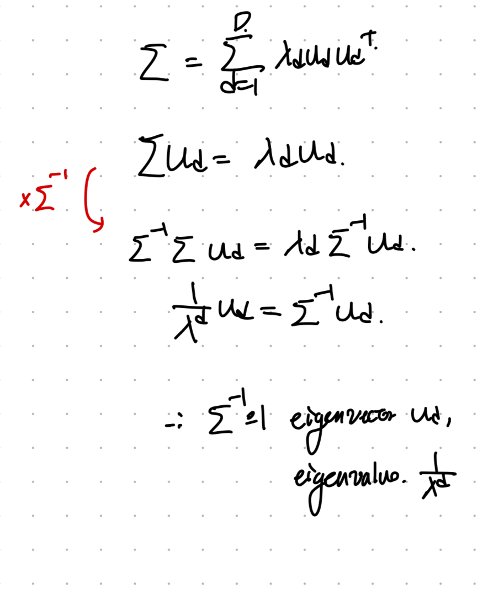
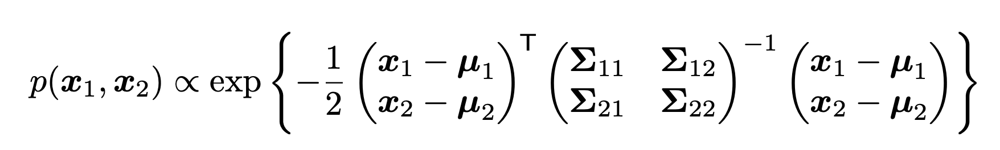
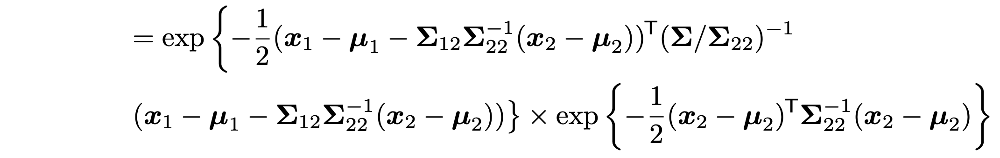

Source: [https://jeffdissel.tistory.com/231](https://jeffdissel.tistory.com/231)

바로 본론으로 들어가자.
어떤 서로다른 변수들의 분포를 나타내는 기본적인 도구가 바로
Covariance(공분산)
이다.

Definition of Covariance.
이제 변수가 벡터의 형태라면, 다음과 같이
Covariance Matrix, sigma
를 정의한다.

즉, 쉽게 생각해서 Covariance는 행렬인데,
i, j 번째 요소들의 공분산
을 각각 저장해놓은 행렬이다.
i, j 요소를 같이 측정했을때, 측정값으로 pair (i, j )가 나올 수 있는 확률이 (mean of i, mean of j ) 가 가장 높을 것이다.
분포를 나타내면 다음과 같다.

여기서 위 그래프의 퍼짐 정도를 우리는 cov(i,j)
covariance of i, j 라고 부른다는 것.
한편, covariance의 정의를 그대로 이용하면, 다음 식이 나온다.
(추후에 쓰임)

여기서, 이제 우리는 normalize 작업으로 X,Y의 원래의 공분산으로 나누어 주면,
우리는
correlation Matrix
를 얻을 수 있다.

즉, 원래 X,Y의 분포를 기준으로 공통분포는 얼마나 퍼졌는지를 나타내는 것이다.
(standard normal distribution과 동일하다, 비교하기쉬워짐)
Correlation을 직관적으로 이해하기 위해서, 아래그림을 살펴보자.
Corr(x,y) 어떤 두 변수의 값을 plot하고, 상관관계를 구한 그림.

딱봐도 직선이면 1, 직선이 아니면 0. 그 사이는 0 ~ 1 로 표현된다.
다르게 말하면,

X,Y가 직선관계인지 아닌지를 나타내는 도구라는 것.
이제 똑같이 corr( vector x)를 살펴보자.
위에서 우리가 정의한대로 행렬을 구성하면 다음과 같다.

이를 수학적으로 표현하면 다음과 같다.
(수학은 단순하게 표현하는 도구일 뿐)

Kxx는 사실 우리가 이미 정의한 Matrix인 Covariance Matrix이다.
공분산으로 구성된 Matrix(Kij = Cov(i,j))

Auto - Covariance Matrix. same as sigma
diagonal term과 역행렬을 나타내면 다음과 같다.

따라서, Correlation Matrix는 다음과 같음을 증명가능하다.

여기서 주의할 점은 X,Y가 선형관계 -> large Correlation(X,Y)
근데 그렇다고 X가 Y의 원인 혹은 Y가 X의 원인 인 것은 아니다.

가장 대표적인 예시로 Violent crime과 Ice cream sale을
월별로 나타내면 아래와 같다.

Corrleation이 1에 굉장히 가까울 것이다.
(선형관계이므로, in other words, 아이스크림 세일이 증가하면, 범죄도 증가/ 감소하면 같이 감소)
하지만 우리는 두개의 변수 사이에 아무런 원인관계가 없다는 것을 알고,
날씨가 원인이라는 사실을 알고 있다.
#Simpson's Paradox

(확률하면 무조건 등장하는 역설임.)
예시로 바로 위 역설을 이해해보자.
대학 입시에서 “여자 지원자보다
남자 지원자의 합격률이 더 높다
”는 전체 통계가 나왔다고 가정하자.
그런데 모든학과의 평균으로 살펴보니 사실 여자 지원자의 합격이 더 높게 나왔다.
그 이유는, 저 통계는 알고보니 경쟁력이 높은 학과를 기준으로 측정한것.
그리고 보통 경쟁력이 높은 학과는 (의대, 공대 등 남자 지원율자체가 앞도적으로 높은 곳)
즉 하고싶은 말은 조사하는 Pool이 어디이냐에 따라서 공분산이 아예 달라진다는 것이다.
공분산을 경제학과 pool안에서 측정하냐, 기계공학에서 측정하냐, 의학과에서 측정하냐 에따라서
여자와 남자의 합격률 분포는 아예 다를 것이다.

Pool z 를 기준으로 측정한 X,Y의 공분산.
=====================================================================
지금까지 다변수의 분포를 정의하기 위한 도구들을 배웠고,
이제 실제로 어떤 분포를 띄는지 함수로 표현해보자.
가장 기본적인 분포가 Gaussian Distribution (normal ditribution)이다

X,Y의 Guassian Normal ditribution
즉, X,Y각각 정규분포를 따르며 Probability density Function을 나타내면 다음과 같다.

u: mean vector, sigma : Covariance Matrix, D: dimension

#Mahalnobis Distance
Gaussian PDF에 log를 취해주자.

여기서 가운데 term을 우리는 Mahalnobis distance라고 정의하자.

갑자기 왜 이거를 무슨의미가 있길래 정의했을까?
의미를 찾기 위해서 먼저 Sigma: Covariance Matrix를 Eigen Value Decomposition을 해주자.
(D x D Matrix - square, symmetric, Semi positinve Definite Matrix이므로 EVD가능)

재밌는 사실은

따라서, Inverse of Covariance Matrix를 다음과 같이 표현가능하다.

이제 우리가 위에서 정의한
Mahalnobis Distance에 대입

U =. u^T이 row vector인
즉 y -> z 벡터로 전환하게 되면, zd^2 Euclidean Distance를 의미하게 된다.
z = U^T (y - u)
y -> z is mapping도대체 어떻게 변환이 되었는지를 보면,
평균만큼 평행이동하고, U를 앞에다 곱한 것은, 벡터를 회전시킨 것이다.
(정확히 표현하면, U의 열벡터를 표준기저로 하는 좌표공간으로 mapping한 것)
(mapping의 자세한 의미는 아래 블로그 글에 담겨 있습니다. tensor의 mapping)
https://jeffdissel.tistory.com/230
5. Singular Value decomposition(SVD) - part2
정말 중요하고 또 중요한 내용이라 part2에서 더 깊숙히 들어가 이해해보자. Eigen value decompositon(EVD)Singular Value decomposition(SVD)이 두가지는 정말 거의 모든 영역에서 쓰인다. 머신러닝의 회귀모델,
jeffdissel.tistory.com
이후에, eigen value로 나누어 주는 것이 elongation까지 진행.
2D를 예시로 들면, Mahalnobis distance는 다음과 같다.

정말 재미있는 사실은 위 distance가 정해지면, Probability 도 정해진다는 사실이다.(일대일 대응임)

따라서, 위 타원위에 있는 (z1,z2) 점은 모두 같은 확률을 가진다.
#Marginals of MVN
우리가 두개의 변수에 대한 MVN을 다음과 같이 가지고 있다고 가정하자.
지금까지 배운 mean vector, covariance Matrix는 다음과 같다.
여기서 Λ를 inverse of Covariance Matrix이며 다음과 같이 정의하자.

Λ =. Σ −1
(Σ is a symmetric positive semi definite matrix,
which has full rank leading to be a non singular Matrix that has inverse Matrix)
그리고 Marginals of x는 다음과 같이 정의된다.

쉽게 말해서, y 변수를 고려하지 않고, 순수한 x의 분포를 보는것.
재미있는 사실은, MVN(
Multivariance Normal distribution)의 핵심은
변수 각각 개별도 normal distribution을 따른 다는 점이었다.

Σ11 : variance of y1
#Conditionals of MVN
MVN의 두번째 특징은 y2가 특정값이라고 가정했을때, 조건부 확률도 정규분포를 따른다.

그 정규분포의 평균과 분산을 계산해서 구해보자.
#Schur Complement

(계산하기 위한 도구, 선형대수학에서 정의)
정의대로, MVN을 먼저 다음과 같이 expotential function으로 나타낼 수 있다.

이후에 Covariance Matrix를 shur complement를 활용하여, 다음과 같이 쪼개주자.

쪼개준 이유는 조건부 확률을 만들어 내기 위해서다.

쪼갠 식을 정리하면 위와 같으며, 뒤에 term은 normal distribution of variable x2임을 알 수 있다.
여기서 bayes rule을 활용하면 우리는 조건부확률의 pdf를 구할 수 있는 것.

따라서, 정규분포의 평균과 분산은 다음과 같다.

