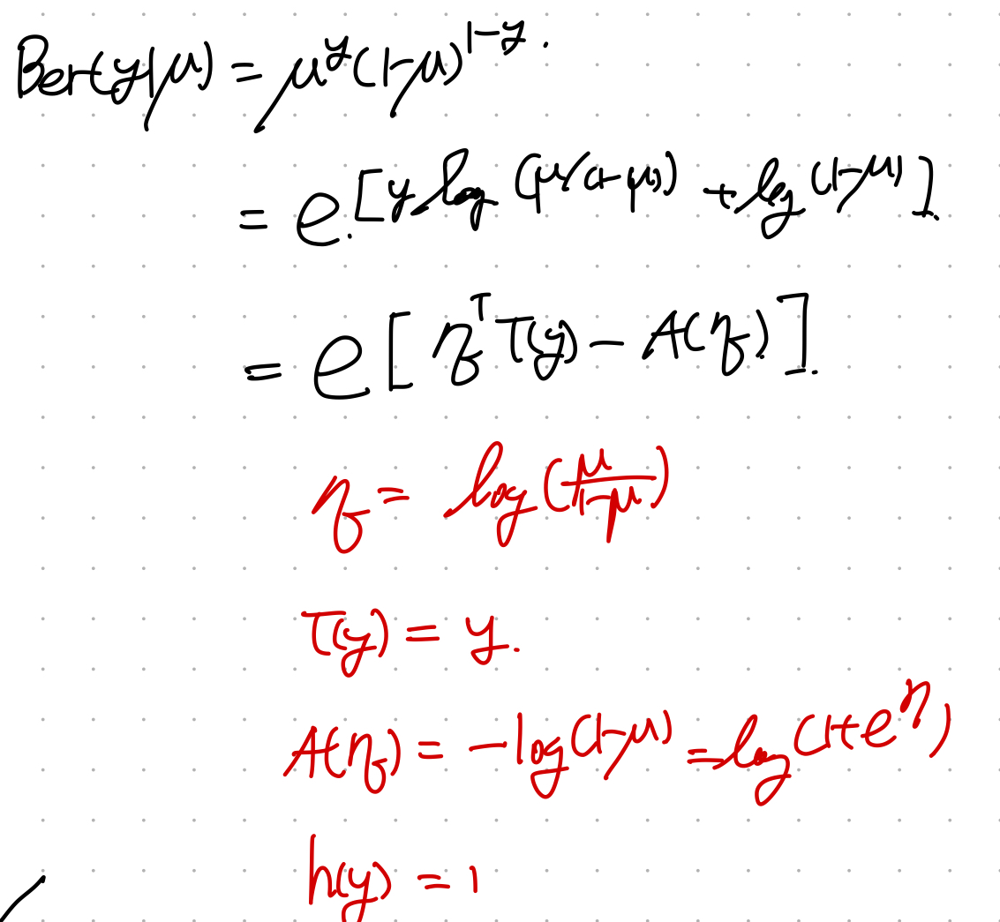
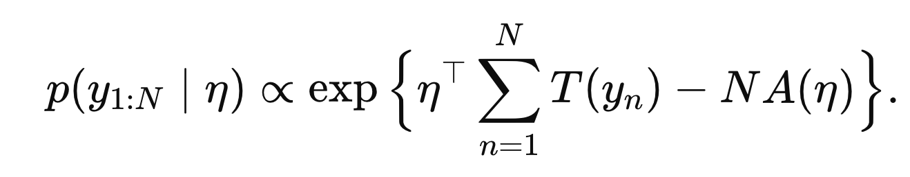
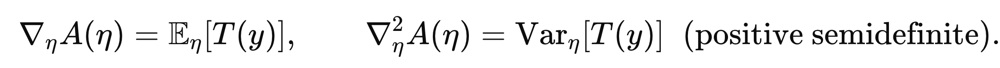
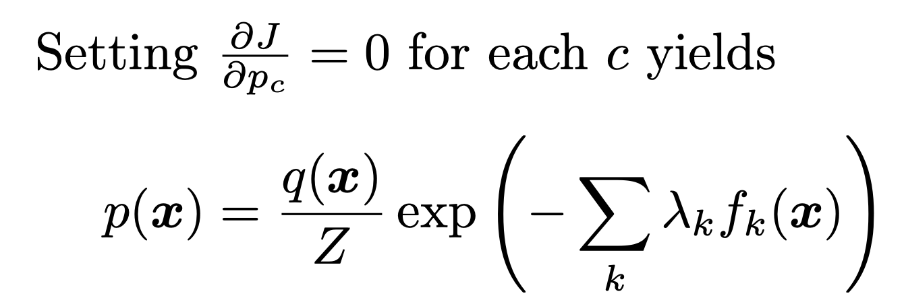

Source: [https://jeffdissel.tistory.com/233](https://jeffdissel.tistory.com/233)

이번 시간에는 굉장히 중요한
Exponential Family
에서 다루어 보자.
원리는 간단하다. 다양한 posterial pdf form 이 존재하고,
이를 일반화한 하나의 식으로 표현한 것.

(각 Term의 의미는 추후에 보자)
예를들어 Distribution case 1 은
T(y) = y, η = 2, A(η) = log η, ...
이런식으로 , case마다 정확히 함수가 어떤 지를 정의할 수 있다.
======================================================
마치 우리가 Computational Numberical Fluid Dynamics 시간에 배웠듯이,
General transport equaiton form이 존재하고, 각 term에 어떤 상수 함수값이 들어가냐에 따라서
different kinds of Eq으로 재 탄생하였다.

이렇게 일반화하는 데는 다 이유가 있었다.
분석하는 방법을 통일 할 수 있고,
서로 달라 보였던 현상들도 같은 물리적의미로 해석이 가능하였다.
=====================================================
이제 다시 확률이론으로 넘아가자.
pdf가 밑의 term으로 나타낼 수 있다면
p(y| η )는 exponential family안에 있다고 정의한다.

각 distribution의 종류별로 함수의 형태는 아래 표와 같다.

예시로 살펴봐야 이해가 간다.
#Bernoulli distribution

위 pdf의 특징을 살펴보면서, 왜 저렇게 정의했는지를 살펴보자.
먼저 N개의 데이터 관측을 했다고 했을대, 우리는 N개 전체에 대한 pdf는
sum of T(yn)으로 나타낼 수 있다(exp의 성질 이용)

우리는 A(η)의 gradient Laplacia으로 T(y)의 평균과 분산을 구할 수 있다.

#Maximum entropy derviation of exponential Family.
자 여기서 우리는 왜 exponential family form에 한번 집중해보자.
어떤 데이터를 설명하는 확률분포 p(x)를 우리는 구하고싶은 상황에서,

우리는 위의 기댓값 Fk만 알고 있다고 가정하자.
제한된 정보를 가지고 최대한 맞는 p(x)를 찾기 위해서는 Lagrangian Multiplier를 사용한다.
제약조건은 총 3가지.

첫번째 항부터 살펴보면, KL Divergence

q(x) is a prior.
우리가 구하고자하는 p(x)는 posterior 인데, 여기서
prior과 얼마나 차이
가 나는지.
그 정도를 나타내는 함수이다.
두번째 항은 당연히 모든 x에 대한 확률의 합은 1이어야하는
확률의 기본적인 조건.

this must be 1.
마지막 항은 우리가 가지고있었던 유일한 정보인, 기댓값 정보의 적분을
Trapezoidal rule을 활용하여 sigma로 표현한 것.

자 이제 위 entropy J를 최소화하는 P를 찾기 위해 미분해주자 그때 x = c라하자.

여기서 Z를 구하기 위해서
'확률의 합 = 1' 식
을 사용하자.

자 이제 위에서 구한 p(x)식에 Z를 대입하면,

우리가 풀고있던, exponential family pdf form 이 등장한다.
즉, 주어진 제약조건안에서 가장 entropy를 최대화하는 방향으로
함수의 Form을 지정한 것이다.
