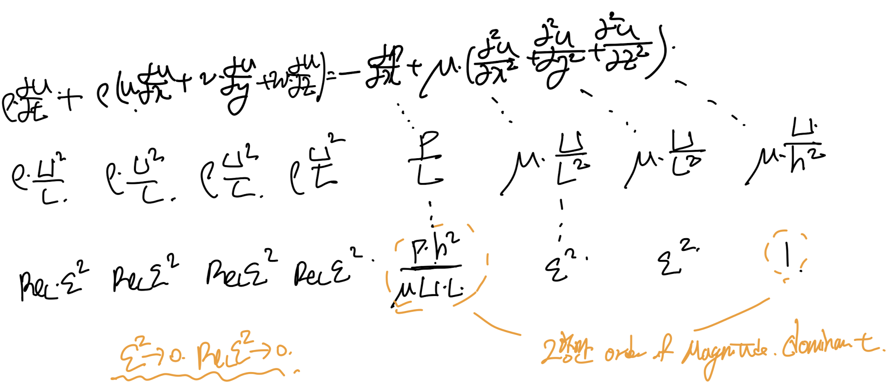
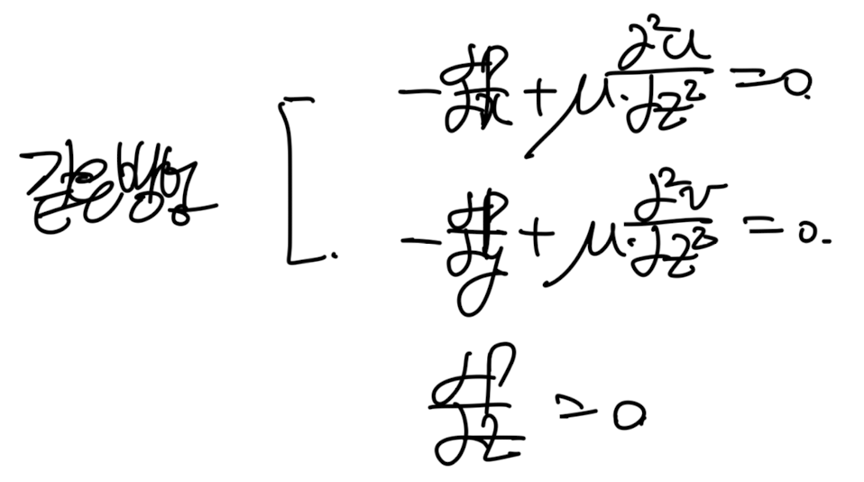
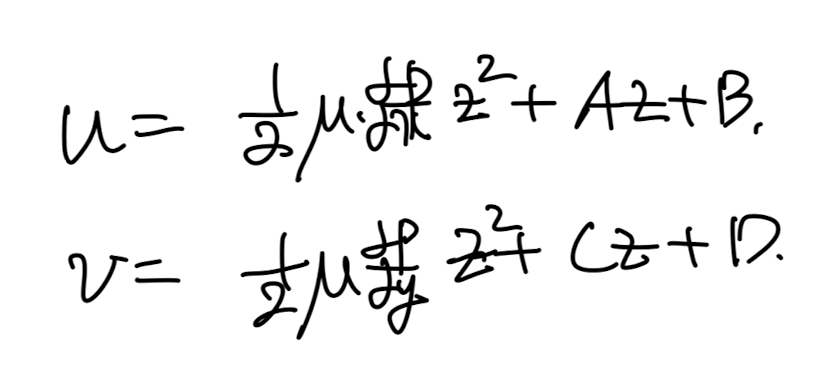

Source: [https://jeffdissel.tistory.com/131](https://jeffdissel.tistory.com/131)

이번시간에는,
아주 얇은 판사이의
유체는
Viscous 가 있음에도 불구하고,
Potential flow의 성질을 띔을 증명할 것이다.
Potential flow는
inviscid, irrotational incompressible flow
의 성질을 띄는 유체의 흐름이다.

이전의 lubrication의
approximation solution 방법인
Order of Magnitude방법을 사용해보자.
즉, 상대적인 항들의 크기를 비교하여
작은 항들을 무시하는 방법이다.
먼저 연속방정식에서 각항들의 상대적인 크기를
따져보자.
(여기서, x,y의 scale = L로 u,v = U로 통일하였다)
(이는 z방향의 속도와 길이에 비해 상대적으로 둘다 크기 때문에,
두 수를 같다고 편의상 정의하였다.)

따라서, w의 Order of Magnitude
는 다음과 같이 표현된다.

이후 x방향 모멘텀 방정식의 각 항들의
상대적인 크기를 따져보면,
결국 압력과 점성항 1개 제외하고는,
모두 굉장히 작음을 알 수 있다.

정확히 동일한 방법으로
모멘텀방정식의 y,z 항에도 적용해보면
결론적으로 다음 3가지 식을 얻게 된다.

첫번째, 두번째 식을 적분해주면
쉽게 속도식이 나오게 되고,

boundary condition으로 각 계수들이 유도된다.

최종정으로 속도는 다음과 같다.

이를 연속방정식에 대입해주자.

여기서 양변을 z=h, z=0 구간적분을 진행해주면,
w(z=h) = w(z=0) = 0 이므로 식 = 0 이 된다.

최종적으로 다음 식이 유도된다.

한편,
여기서 우리는 속도장을 알기 때문에,
Stream function을 구할 수 있다.

직전에 구한 속도장.
potential function 정의대로, 함수(
φ)
를 구해보자.

두식을 각각 적분해주면,

두식을 공통적으로 F= Q =0 일 때도, 만족한다.
우리의 목적은 위 식을 만족하는
아무 스칼라 함수,
φ
만 찾으면 되므로
(F,Q는 임의로 지정 가능)

최종 Stream function
여기서 potential function의 laplace를 구해보면,
귀신같이 압력, laplace term이 나오고
이는 아까전에 0임을 증명했었다.

결론적으로,
우리는 u,v 의 식을 통해서
u,v의 potential function φ가 존재함을 보였고,
그 함수, φ가 Laplace( φ) =0 을 만족함을 통해서,
속도장, u,v,는 potential flow임을 증명하였다.
따라서, 아주 얇은 판 사이의 유체는 점성이 존재하여도,
flow separation이 존재하지 않는.
Inviscid, incompressible, irroational flow
= potential flow의
성질을 띈다.
